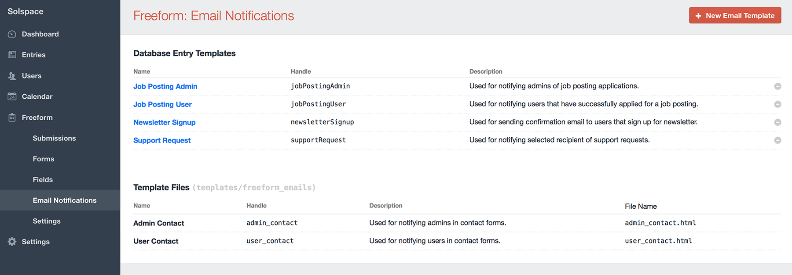
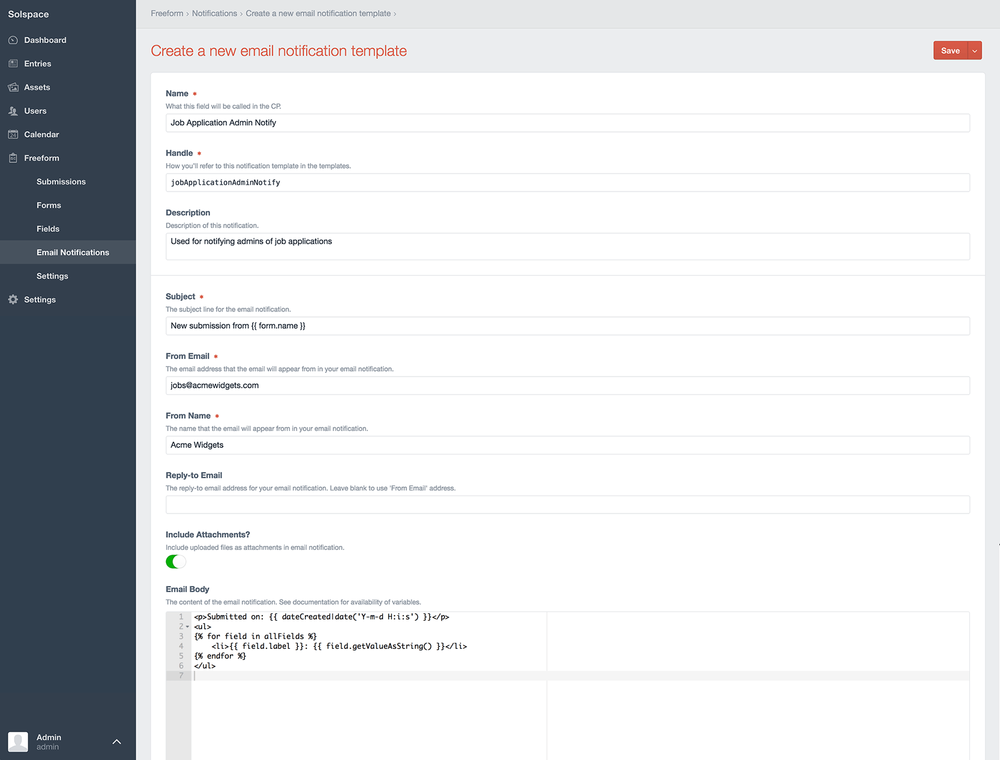

::: version /craft/freeform/v5/forms/email-notifications/
Freeform
:::

<div id="pr-heading">
    
    <span class="pr-name">Freeform</span>
    <span class="pr-category">for Craft</span>
    <div class="pr-v-wrapper">
        <div class="pr-v">
            <span class="pr-v-v">1.x</span>
            <span class="pr-v-type pr-retired">Retired</span>
            <span class="pr-v-arrow arrow down"></span>
        </div>
        <ul class="pr-v-list">
            <li><a href="/craft/freeform/v5/">5.x<span class="pr-v-type pr-latest">✓ Latest</span></a></li>
            <li><a href="/craft/freeform/v4/">4.x</a></li>
            <li><a href="/craft/freeform/v3/">3.x<span class="pr-v-type pr-retired">Retired</span></a></li>
            <li><a href="/craft/freeform/v2/">2.x<span class="pr-v-type pr-retired">Retired</span></a></li>
            <li><a href="/craft/freeform/v1/">1.x<span class="pr-v-type pr-retired">Retired</span></a></li>
        </ul>
    </div>
    <div class="pr-buy">
        <a href="https://plugins.craftcms.com/freeform" class="button button-blue"><span class="external-url">Plugin Store</span></a>
    </div>
</div>

<span class="page-section"></span>

# Email Notifications

Freeform allows you to send email notifications upon submittal of a form. They are global and can be reused for multiple forms, saving you time when you are managing many forms.


[[toc]]


## Assigning Notifications to Fields/Forms

Email notifications can be sent to email address(es) specified for admins (in the **Notify** section of Composer (right column)) as well as email addresses specified/selected in the [Email](fields-field-types.md#fields-email) and [Dynamic Recipients](fields-field-types.md#fields-dynamic-recipients) field types. To assign an email notification template to these fields, click on the field in Composer, and then in the Property Editor (right column), select a notification template you want used to generate an email notification for the entered/selected email address. Email notifications can even be done [dynamically at template level](../template-functions/freeform.form.md#param-dynamicnotification).

## Overview of Email Notification Template Options



Email notification templates can be managed 2 different ways:

1. As *[database entries](#managing-email-templates-within-craft-cp-database)* within the Craft control panel in the **Email Notifications** page in Freeform (**Freeform > Email Notifications**).
2. As *[HTML template files](#managing-email-templates-as-html-files)* within the Craft Templates directory.

In addition to this, email notification templates can be created directly at form level within Composer. Email templates created this way are subject to the [Default Email Notification Creation Method](../setup/settings.md#default-email-method) preference in Freeform settings. Email notification templates that are created within Composer will contain basic default content and should be checked and updated once finished building your form.


## Managing Email Templates within Craft CP (Database)



Database templates are managed within the Craft control panel in the **Email Notifications** page in Freeform (**Freeform > Email Notifications**). Email Notification templates contain the following options:

::: v-pre

* **Name** <a href="#name" id="name" class="docs-anchor">#</a>
	* A common name for the notification template to identify it easier.
* **Handle** <a href="#handle" id="handle" class="docs-anchor">#</a>
	* The unique identifier for the notification template, used when in your regular templates when specifying a notification template.
* **Description** <a href="#description" id="description" class="docs-anchor">#</a>
	* A description for the notification template to help identify what it's used for, etc.
* **Subject** <a href="#subject" id="subject" class="docs-anchor">#</a>
	* The subject line for the email notification.
		* Can include any Freeform field variables (`{{ fieldName }}`) as well as `{{ form.name }}`.
* **From Email** <a href="#from-email" id="from-email" class="docs-anchor">#</a>
	* The email address the email notification will appear from.
		* Can include any Freeform field variable (`{{ fieldName }}`).
			* **NOTE:** Using dynamic approach with a variable could have your emails marked as spam.
* **From Name** <a href="#from-name" id="from-name" class="docs-anchor">#</a>
	* The email address the email notification will appear from.
		* Can include any Freeform field variables (`{{ fieldName }}`).
			* Ex: `{{ firstName }} {{ lastName }}`
			* **NOTE:** Using dynamic approach with variables could have your emails marked as spam.
* **Reply-to Email** <a href="#replyto-email" id="replyto-email" class="docs-anchor">#</a>
	* The email address the email notification will has set for Reply-to.
		* Can include any Freeform field variable (`{{ fieldName }}`).
			* **NOTE:** Using dynamic approach with a variable could have your emails marked as spam.
		* Leave blank to use the **From Email** address.
* **Include Attachments** <a href="#include-attachments" id="include-attachments" class="docs-anchor">#</a>
	* Include uploaded files as attachments in email notification.
* **Email Body** <a href="#email-body" id="email-body" class="docs-anchor">#</a>
	* The HTML body of the email notification to be sent.
		* Can include any Freeform field variable (`{{ fieldName }}`) as well as `{{ form.name }}`, `{{ form.id }}`, `{{ form.handle }}` and `{{ dateCreated }}`.
			* Available field options:
				* `{{ fieldName.label }}` - displays the label (name) of the field.
				* `{{ fieldName.valueAsString }}` - displays the option label(s) submitted.
					* Example: `Apples`
					* Array of data example: `Apples, Oranges`
				* `{{ fieldName.getValueAsString(false) }}` - displays the option value(s) submitted.
					* Example: `apples`
					* Array of data example: `apples, oranges`
					* Avoid using `{{ fieldName.value }}`, as it may not be a string and could trigger an error.
				* `{{ fieldName.instructions }}` - displays the instructions for the field.
				* `{{ fieldName.handle }}` - displays the handle of the field.
				* `{{ fieldName.placeholder }}` - displays the placeholder of the field.
		* Can also use `allFields` variable to automate parsing of fields. <a href="#all-fields" id="all-fields" class="docs-anchor">#</a>
			* Available options:
				* `{{ field.label }}` - displays the label (name) of the field.
				* `{{ field.valueAsString }}` - displays the option label(s) submitted.
					* Example: `Apples`
					* Array of data example: `Apples, Oranges`
				* `{{ field.getValueAsString(false) }}` - displays the option value(s) submitted.
					* Example: `apples`
					* Array of data example: `apples, oranges`
					* Avoid using `{{ field.value }}`, as it may not be a string and could trigger an error.
				* `{{ field.instructions }}` - displays the instructions for the field.
				* `{{ field.handle }}` - displays the handle of the field.
				* `{{ field.placeholder }}` - displays the placeholder of the field.
			* To parse only fields with data, use ``
			* Excludes File Upload fields. To render these manually, [see example here](#including-file-upload-data).
			* Excludes Mailing List selection. To render manually, [see example here](#including-mailing-list-selection-data).
		* Can iterate over submission values from the [Submission object](../template-objects/submission.md) (as long as you're [storing submitted data](forms-composer.md#submission-store-data))

:::

## Managing Email Templates as HTML Files

HTML template files have the same options as [Database templates](#managing-email-templates-within-craft-cp-database), but since all of the content is stored within a template (and nothing in the database), these template files will have a heading comment block of code with configuration options.

To clarify, your template code would look no different than how it does for Database template method, except you'd have a comment block at the top of the template with config options like this:

``` twig
{# subject: New submission from {{ form.name }} #}
{# fromEmail: {{ craft.systemSettings.email.emailAddress }} #}
{# fromName: {{ craft.systemSettings.email.senderName }} #}
{# replyToEmail: {{ craft.systemSettings.email.emailAddress }} #}
{# includeAttachments: true #}
{# description: A description of what this template does. #}
```

That is the default set of config data, but you can of course adjust it to whatever you like.


## Examples

Below is a basic automated example for database method:

``` twig
<p>The following submission came in on{{ dateCreated|date('l, F j, Y \\a\\t g:ia') }}.</p>
<p>Here are the details:</p>
<ul>

  <li>{{ field.label }}: {{ field.valueAsString }}</li>

</ul>
```

And here is the same example but for HTML file method:

``` twig
{# subject: New submission from {{ form.name }} #}
{# fromEmail: {{ craft.systemSettings.email.emailAddress }} #}
{# fromName: {{ craft.systemSettings.email.senderName }} #}
{# replyToEmail: {{ craft.systemSettings.email.emailAddress }} #}
{# includeAttachments: true #}
{# description: A description of what this template does. #}

<p>The following submission came in on{{ dateCreated|date('l, F j, Y \\a\\t g:ia') }}.</p>
<p>Here are the details:</p>
<ul>

  <li>{{ field.label }}: {{ field.valueAsString }}</li>

</ul>
```

---

Below is a manually built example for database method:

``` twig
<p>The following submission came in on {{ dateCreated|date('l, F j, Y \\a\\t g:ia') }}.</p>
<p>Here are the details:</p>
<ul>
  <li>Name: {{ firstName }} {{ lastName }}
  <li>Email: {{ email }}
  <li>Home Phone: {{ homePhone }}
  <li>Cell Phone: {{ cellPhone }}
  <li>
    Services interested in:
    <ul>
    
      <li>{{ value }}</li>
    
    </ul>
  </li>
  <li>
    Message:<br />
    {{ message }}
  </li>
</ul>
```

---

You can also have your notification email template code iterate over submission values from the [Submission object](../template-objects/submission.md) (as long as you're [storing submitted data](forms-composer.md#submission-store-data)) like this:

``` twig

  <h4>{{ submission.id }}: {{ submission.title }}</h4>
  <ul>
  
    <li>{{ field.label }}: {{ attribute(submission, field.handle) }}</li>
  
  </ul>

```

---

### Including File Upload Data
File Upload field data is excluded from [automated rendering](#all-fields) in `allFields` variable. You can of course include files as attachments, but if you wish to include an uploaded image rendered into the notification, or just show a URL link to the file uploaded, you can do that by retrieving the Asset ID from the [Submission object](../template-objects/submission.md), and then using the [Assets](https://craftcms.com/docs/assets) function:

``` twig
<p>The following submission came in on{{ dateCreated|date('l, F j, Y \\a\\t g:ia') }}.</p>
<p>Here are the details:</p>
<ul>

  <li>{{ field.label }}: {{ field.valueAsString }}</li>

</ul>


<p>
  Here's the uploaded file URL:
  {{ craft.assets.id(assetId).first().url }}
</p>
```

---

### Including Mailing List Selection Data
Mailing List checkbox selections are excluded from [automated rendering](#all-fields) in `allFields` variable. Since they are special fields and not part of the regular fields, this data isn't available in the control panel or Submission object, etc. However, you can access the user's selection via the Form object (and specify the hash available in the Handle area of the Property Editor for the Mailing List field inside Composer). The example below will render as `1` if the user checked the checkbox:

``` twig
{{ form.get("BmLxw1ONn").value }}
```

This could be used as a conditional like this:

``` twig

  Opted into mailing list.

  Did NOT Opt into mailing list.

```
