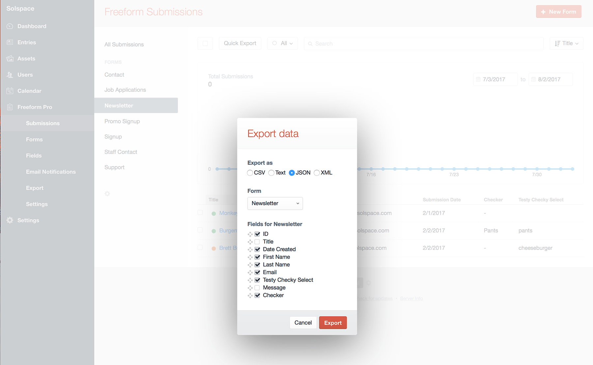
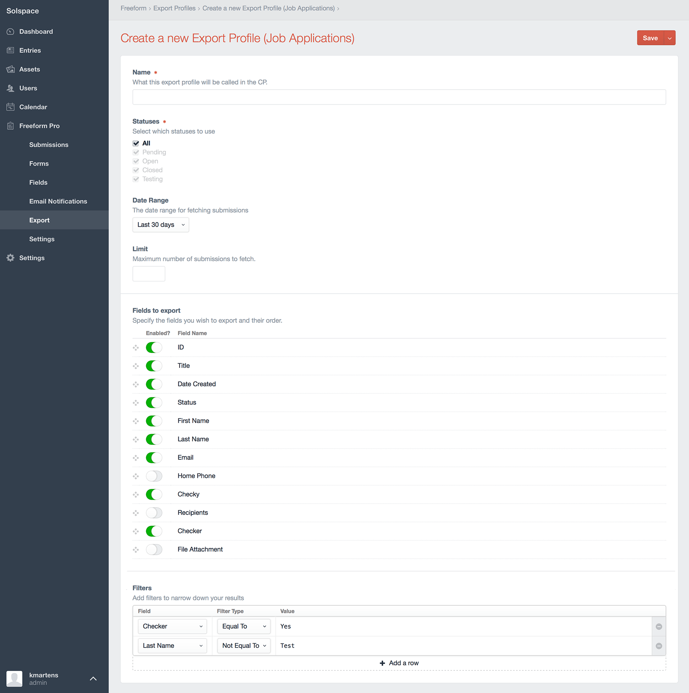
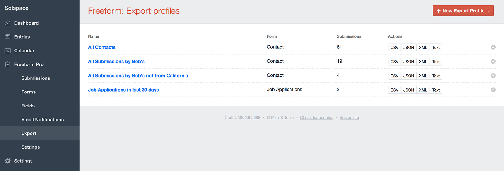
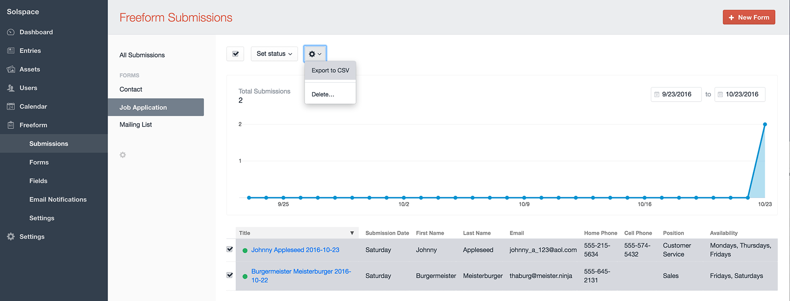

::: version /craft/freeform/v5/submissions/exporting/
Freeform
:::

    
    Freeform
    for Craft
    

        

            1.x
            Retired
            
        

        <ul class="pr-v-list">
            <li><a href="/craft/freeform/v5/">5.x✓ Latest</a></li>
            <li><a href="/craft/freeform/v4/">4.x</a></li>
            <li><a href="/craft/freeform/v3/">3.xRetired</a></li>
            <li><a href="/craft/freeform/v2/">2.xRetired</a></li>
            <li><a href="/craft/freeform/v1/">1.xRetired</a></li>
        </ul>
    

    

        <a href="https://plugins.craftcms.com/freeform" class="button button-blue">Plugin Store</a>
    

# Exporting

Freeform includes 3 options for exporting (2 of which are Pro only):

[[toc]]

## Quick Export <Badge type="pro" text="Pro" />

Freeform Pro's Quick Export feature displays inside the Submissions page of the Freeform control panel. Clicking the *Quick Export* button at the top of the page allows you to export all submissions for a given form, in your choice of **CSV**, **Text**, **JSON** or **XML**. You can then exclude whichever fields you don't want exported.

## Export Profiles <Badge type="pro" text="Pro" />

Freeform Pro's Export Profiles feature allows admins to create more complex pre-defined export profiles that can be run by any user with proper permissions at any time. Options for export profiles are as follows:

* **Name**
	* Create an intuitive name of the profile that is easy for your clients / administrators to figure out.
* **Statuses**
	* Select which statuses, if any, to filter the results by.
* **Date Range**
	* Select a date range, if any, you want the results limited by. Current options are:
		* None
		* Today
		* Yesterday
		* Last 7 days
		* Last 30 days
		* Last 365 days
* **Limit**
	* Maximum number of submissions the export should generate.
* **Fields to Export**
	* Select the fields you'd like to be included and rearrange their order.
* **Filters**
	* Add filters to narrow down your results.
	* Select a field name and check if it's **Equal to** / **Not equal to** / **Like** a value specified.
	* Specify as many filters as you wish.

Once export profile(s) exist, users with proper permissions can export submissions in their choice of **CSV**, **Text**, **JSON** or **XML**.

## Lite CSV Export

The Lite version of Freeform includes CSV exporting functionality.

To export some or all of your Freeform submissions:

* Select a Form name from the left sub navigation menu
	* You currently cannot export while in **All Submissions** view)
* Select the submissions you wish to export (or click select all checkbox at top).
* In the settings cog icon button at the top, click it and select **Export to CSV**.

For more advanced and flexible exporting options, consider upgrading to Freeform Pro!

