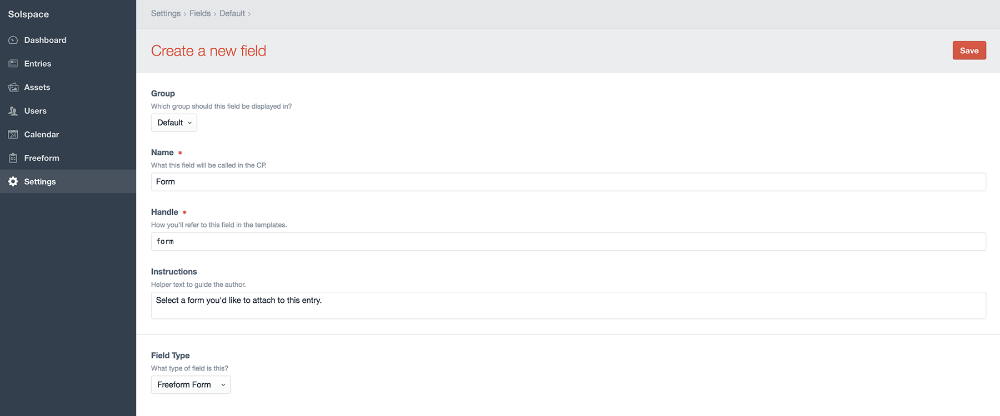
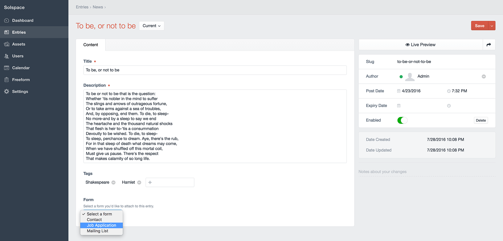

::: version /craft/freeform/v5/submissions/fieldtype/
Freeform
:::

<div id="pr-heading">
    
    <span class="pr-name">Freeform</span>
    <span class="pr-category">for Craft</span>
    <div class="pr-v-wrapper">
        <div class="pr-v">
            <span class="pr-v-v">1.x</span>
            <span class="pr-v-type pr-retired">Retired</span>
            <span class="pr-v-arrow arrow down"></span>
        </div>
        <ul class="pr-v-list">
            <li><a href="/craft/freeform/v5/">5.x<span class="pr-v-type pr-latest">✓ Latest</span></a></li>
            <li><a href="/craft/freeform/v4/">4.x</a></li>
            <li><a href="/craft/freeform/v3/">3.x<span class="pr-v-type pr-retired">Retired</span></a></li>
            <li><a href="/craft/freeform/v2/">2.x<span class="pr-v-type pr-retired">Retired</span></a></li>
            <li><a href="/craft/freeform/v1/">1.x<span class="pr-v-type pr-retired">Retired</span></a></li>
        </ul>
    </div>
    <div class="pr-buy">
        <a href="https://plugins.craftcms.com/freeform" class="button button-blue"><span class="external-url">Plugin Store</span></a>
    </div>
</div>

<span class="page-section"></span>

# Element Field Types

Freeform includes 2 field types:

* *Freeform Forms* - allows you to assign/relate forms to other element types such as Entries.
* *Freeform Submissions* - allows you to assign/relate form submissions to other element types such as Entries.

Here's an overview on how to use these field types:


[[toc]]


## Creating a Freeform field
Creating a Freeform Form field is done just like any other fieldtype, here's an overview of the process:

1. Go to the **Settings** area in Craft control panel. Click on **Fields**.
2. Click the **New field** button in the top right corner.
3. Name the field as you wish. For example: *Related Form* with a handle of *relatedForm*.
4. For the **Field Type** option, select *Freeform Form* or *Freeform Submissions* from the list.
6. **Selection Label** is the text that will appear on the button which opens the Freeform Form selection pop-up dialog.
7. Click the **Save** button in the top right corner to save the new field.

Your Freeform Form/Submissions field is now available to be assigned to other sections.




## How the Fieldtypes work
The Freeform *Form* (or *Submissions*) fieldtype lets the user assign any Freeform form (or form submissions) to any element: a section entry, categories, assets, etc.




## Template Properties

The *Submissions* field type can access anything in the [Submission object](../template-objects/submission.md). For the *Form* field type, the following are template properties are available:

* `name` <a href="#param-name" id="param-name" class="docs-anchor">#</a>
	* Outputs the name of the form
* `handle` <a href="#param-handle" id="param-handle" class="docs-anchor">#</a>
	* Outputs the handle of the form
* `id` <a href="#param-id" id="param-id" class="docs-anchor">#</a>
	* Outputs the unique ID of the form
* `description` <a href="#param-description" id="param-description" class="docs-anchor">#</a>
	* Outputs the description of the form
* `render()` <a href="#param-render" id="param-render" class="docs-anchor">#</a>
	* Outputs the full form, rendering it with the [Formatting Template](formatting-templates.md) specified in Composer for the form.


## Usage in Templates
An example of template code you would use to display a Freeform form (with field handle of *myFreeformfieldname*) that is attached to a Craft Entry would look something like this:

``` twig

    <div class="entry">
        <h2><a href="{{ entry.url }}">{{ entry.title }}</a></h2>
        {{ entry.summary }}
        
            <h3>{{ entry.myFreeformfieldname.name }}</h3>
            {{ entry.myFreeformfieldname.render() }}
        
    </div>

```

---

If you'd like to automatically pass content from another element (such as a Craft Entry) into Freeform field(s), you'd have to use the [overrideValues](../template-objects/form.md#prop-custattr-overridevalues) property inside your formatting template.

For example, if you want to pass a title of an entry to a Freeform field, and the entry slug was in the second segment of your URL, you should set that in your formatting template. Also be sure to include a hidden Freeform field in your form (in this case called `entryTitle`). Your formatting template code might look something like this:

``` twig


{{ form.renderTag({
    overrideValues: { entryTitle: entry.title }
}) }}
```

---

Below is example code for displaying form submissions that have been attached to a blog entry (from a field called **formSubmissions**).

``` twig



    <h2>{{ blog.title }}</h2>
    <ul>
    
        <li>{{ submission.title }}</li>
    
    </ul>

```
