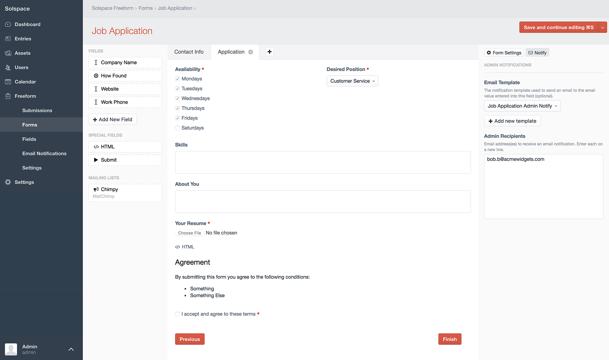
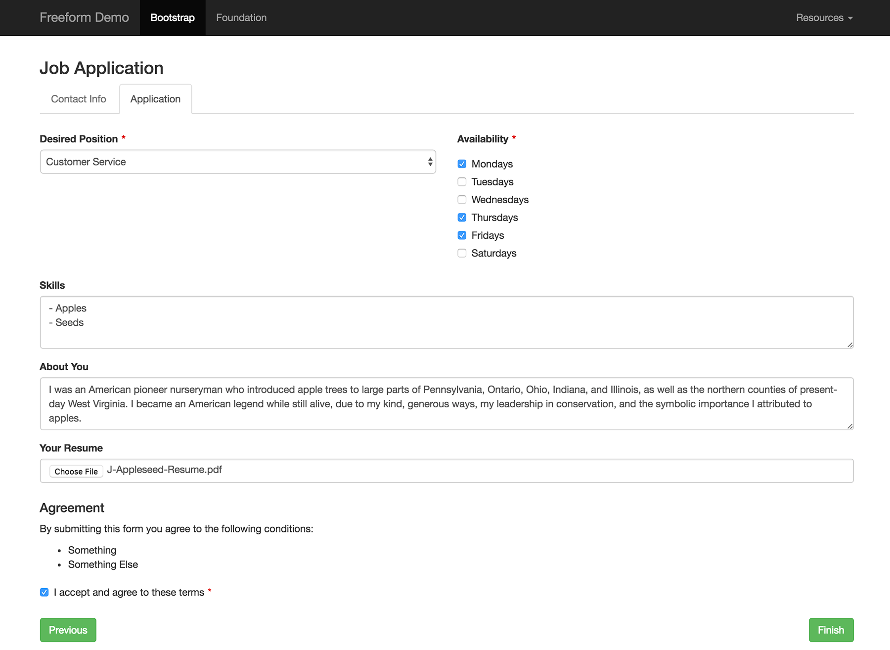

::: version /craft/freeform/v5/forms/builder/#multi-page-forms
Freeform
:::

    
    Freeform
    for Craft
    

        

            1.x
            Retired
            
        

        <ul class="pr-v-list">
            <li><a href="/craft/freeform/v5/">5.x✓ Latest</a></li>
            <li><a href="/craft/freeform/v4/">4.x</a></li>
            <li><a href="/craft/freeform/v3/">3.xRetired</a></li>
            <li><a href="/craft/freeform/v2/">2.xRetired</a></li>
            <li><a href="/craft/freeform/v1/">1.xRetired</a></li>
        </ul>
    

    

        <a href="https://plugins.craftcms.com/freeform" class="button button-blue">Plugin Store</a>
    

# Multi-Page Forms

Freeform allows for true *multi-page* forms (a POST submit per page). Here's some important information to know about them:

* Each page is submitted through POST
	* There is no unique URI segment per page at this time.
	* Users cannot jump ahead to different pages, only forward and backward 1 page.
* Sessions for incomplete submissions are stored for 3hrs, and then are removed after that.
* Users can go backward in forms (if enabled).
	* Any data entered into the current page that has NOT yet been submitted "forward" will not be saved when clicking **Previous** submit button. As in, clicking the Previous button will not save any changes you made to that form page.
* If an earlier page contains file upload field(s), files will actually be uploaded before the form is officially submitted.
	* If the form is never completed, the submission clearing (described above) will remove the file after 3hrs.
