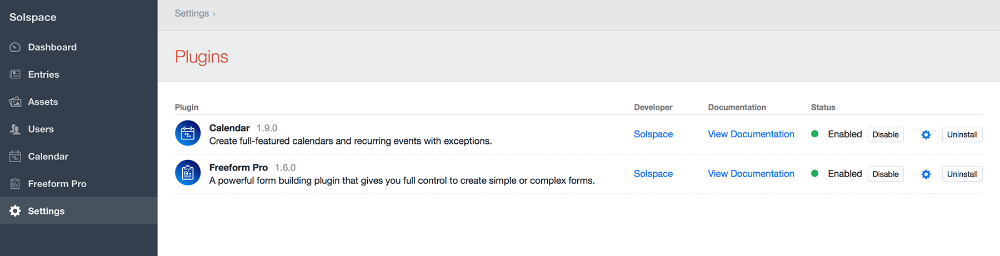
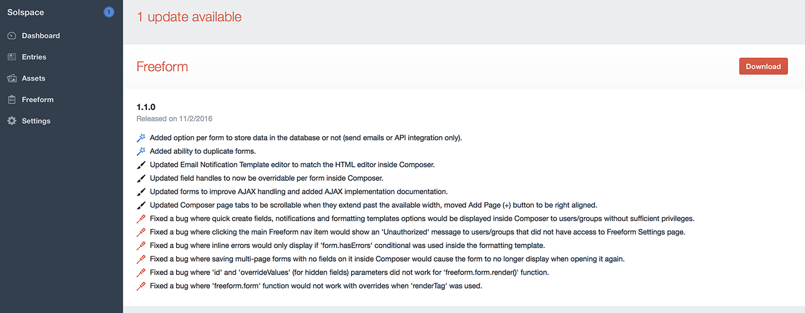
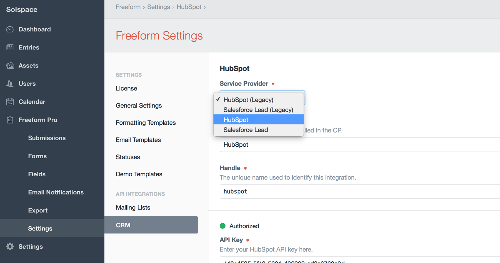
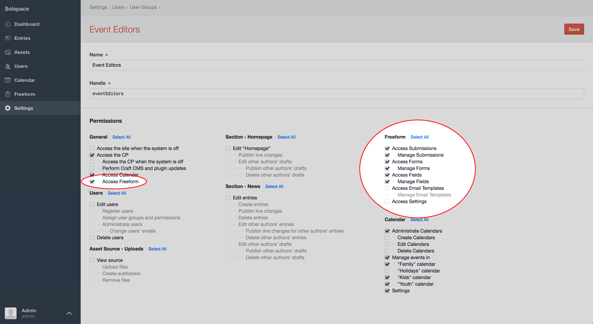

::: version /craft/freeform/v5/setup/installing-updating/
Freeform
:::

    
    Freeform
    for Craft
    

        

            1.x
            Retired
            
        

        <ul class="pr-v-list">
            <li><a href="/craft/freeform/v5/">5.x✓ Latest</a></li>
            <li><a href="/craft/freeform/v4/">4.x</a></li>
            <li><a href="/craft/freeform/v3/">3.xRetired</a></li>
            <li><a href="/craft/freeform/v2/">2.xRetired</a></li>
            <li><a href="/craft/freeform/v1/">1.xRetired</a></li>
        </ul>
    

    

        <a href="https://plugins.craftcms.com/freeform" class="button button-blue">Plugin Store</a>
    

# Installing & Updating

[[toc]]

## Requirements
Solspace Freeform mostly meets the same requirements as listed on the [Craft Requirements](https://docs.craftcms.com/v2/requirements.html) page.

* **Craft 2.6.2780 or later**
* PHP 5.4.0 or later
	* **IMPORTANT:** No support for PHP 5.3.x
* MySQL 5.1.0 or later
* Windows and OS X browsers:
	* Chrome 21 or later
	* Firefox 28 or later
	* Safari 9.0 or later
	* Internet Explorer 11 or later
	* Microsoft Edge

## Installing Instructions
1. Unzip the download package and copy the *freeform* folder to your Craft sites **/craft/plugins/** directory.
2. Go to the **Settings > Plugins** page and click **Install** for the *Freeform* plugin.

## Updating Instructions
*Solspace Freeform* uses the **Craft Update Service**, which means that every time there's an update available, it'll show up in the **Updates** area of the Craft control panel. You can then review the changelog there, or [view it here](changelog.md).

::: tip
If you're upgrading from Freeform **Lite** to Freeform **Pro**, you can follow these same instructions below. If updating to the same version number, there will be no **update** process as it is not required (though one may be triggered if the version number is greater and includes a migration, e.g. Lite 1.7.2 to Pro 1.8.0).
:::

To download the update, simply click the download button (you'll be taken to your account area on the Solspace site) and download the updated package for *Solspace Freeform*. Then follow the steps below:

1. Within your Craft sites **/craft/plugins/** directory, delete the *freeform* folder.
2. Unzip the download package and copy the new *freeform* folder to your Craft sites **/craft/plugins/** directory.
3. Visit the Craft control panel and let the upgrade routine run.

### Transitioning to Freeform Pro from Freeform 1.5.x (and older) WITH ADDONS
All users that have purchased **addons** for Freeform (such as API integrations, widgets pack) have their "Basic" licenses automatically upgraded to **Freeform Pro** licenses. If you're transitioning from Freeform 1.5.x and older WITH ADDONS installed (such as API integrations, widgets pack) to Freeform Pro (which includes these addons), please follow these special instructions:

1. Download a copy of *Freeform Pro* from your [Solspace account area](https://solspace.com/account).
2. Within your Craft sites **/craft/plugins/** directory, delete the *freeform* folder.
3. Unzip the download package and copy the new *freeform* folder to your Craft sites **/craft/plugins/** directory.
4. Visit the Craft control panel and let the upgrade routine run (if applicable).
5. For any **API integrations** you have configured, go into each and switch from the Legacy version to the Pro version (e.g. switch **HubSpot (Legacy)** to **HubSpot**) and save.
6. If you have the **Widgets bundle**, unfortunately you will need to recreate all widgets as there is no way to switch them similar to how it's done with API integrations. When recreating them use the widgets that have *Freeform Pro* in the name (e.g. use **Freeform Pro Recent** instead of **Freeform Recent**). Delete all old legacy widget usage.
7. Once all transitions are made, you may uninstall all Freeform "addons" (integrations, widget bundle).

::: tip
Freeform Pro will continue to work with legacy addon plugin versions set up as well, but we strongly encourage you to make the transition.
:::

## Quick Setup
Follow the steps below to quickly get Solspace Freeform setup in minutes.

### Settings
To customize and configure Solspace Freeform settings, visit the [Settings](settings.md) page (**Freeform > Settings**).

### Permissions
Solspace Freeform ties into regular Craft User Group Permissions. Simply visit the permissions page for the applicable user group(s) (**Settings > Users > User Groups**) to grant/edit/remove permissions to Solspace Freeform.

* **General**
	* *Access Freeform* - required for users to access Solspace Freeform at all.
* **Freeform**
	* *Access Submissions* - access to the Submissions list page.
		* *Manage All Submissions* - can view, edit or delete any submission, regardless of per form selection below.
		* *For "MY FORM NAME"* - can view, edit or delete submissions for this form.
	* *Access Forms* - access to the Forms list page.
		* *Manage Forms* - can create, edit or delete forms.
	* *Access Fields* - access to the Fields list page.
		* *Manage Fields* - can create, edit or delete fields.
	* *Access Email Templates* - access to the Email Templates list page.
		* *Manage Email Templates* - can create, edit or delete email notification templates.
	* *Access Export Profiles* - access to the Export Profiles list page and running of exports.
		* *Manage Export Profiles* - can create, edit or delete export profiles.
	* *Access Settings* - can access and update settings area for Freeform.

### Demo Templates
Install the [Demo Templates](demo-templates.md) (**Freeform > Settings > Demo Templates**) to get Freeform up and running on the front end with just a couple clicks!
