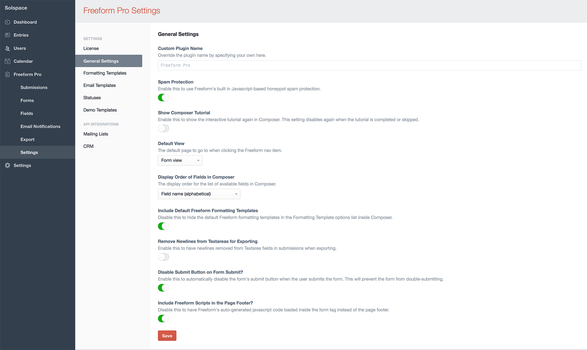
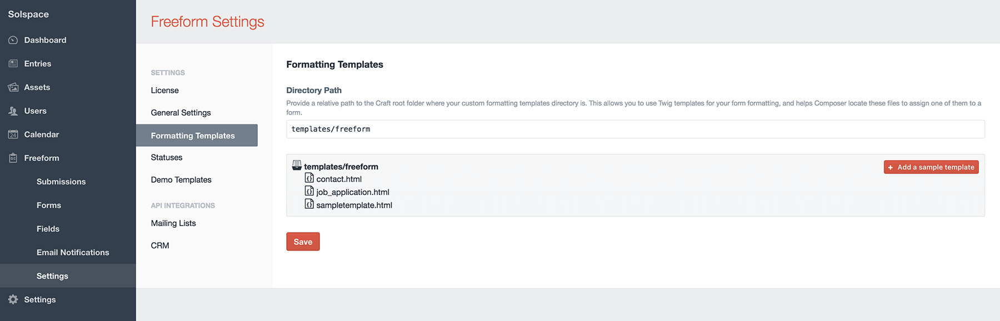
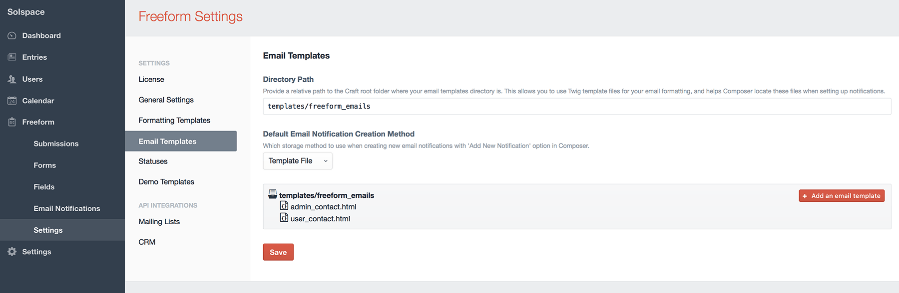
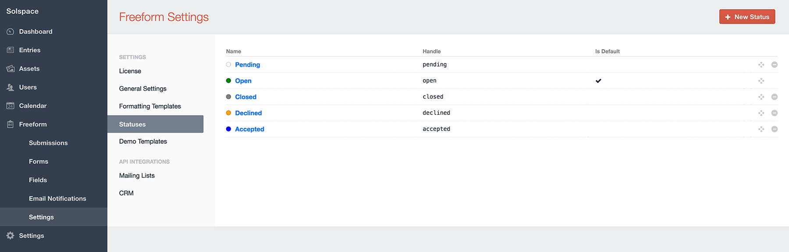
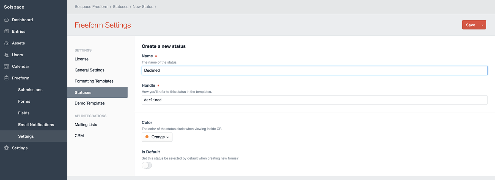
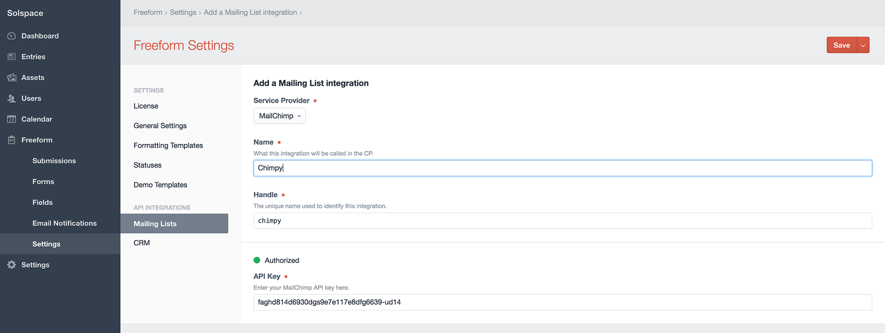

::: version /craft/freeform/v5/configuration/settings/
Freeform
:::

    
    Freeform
    for Craft
    

        

            1.x
            Retired
            
        

        <ul class="pr-v-list">
            <li><a href="/craft/freeform/v5/">5.x✓ Latest</a></li>
            <li><a href="/craft/freeform/v4/">4.x</a></li>
            <li><a href="/craft/freeform/v3/">3.xRetired</a></li>
            <li><a href="/craft/freeform/v2/">2.xRetired</a></li>
            <li><a href="/craft/freeform/v1/">1.xRetired</a></li>
        </ul>
    

    

        <a href="https://plugins.craftcms.com/freeform" class="button button-blue">Plugin Store</a>
    

# Settings

*Solspace Freeform* includes several settings that allow you to customize your form management experience. To adjust your settings, click the **Settings** menu item while in the *Solspace Freeform* plugin, or go to **Settings > Plugins > Freeform** and click the settings cog icon.

[[toc]]

## License
* **License key** <a href="#license-key" id="license-key" class="docs-anchor">#</a>
	* This isn't a required field, but it allows you to keep track of your licenses easier. Simply enter the Freeform license key you received here.

## General Settings
* **Custom Plugin Name** <a href="#custom-name" id="custom-name" class="docs-anchor">#</a>
	* Override the plugin name by specifying your own here.
* **Spam Protection** <a href="#spam-protection" id="spam-protection" class="docs-anchor">#</a>
	* Freeform includes its own Javascript-based honeypot spam protection. This is enabled by default, but can be disabled here.
	* For more information, visit the [Spam Protection documentation](../overview/spam-protection.md).
* **Show Composer Tutorial** <a href="#composer-tutorial" id="composer-tutorial" class="docs-anchor">#</a>
	* Enable this to show the interactive tutorial again in Composer. This setting disables again when the tutorial is completed or skipped.
* **Default view** <a href="#default-view" id="default-view" class="docs-anchor">#</a>
	* This setting allows you to specify which Freeform page should be loaded by default when clicking the Freeform navigation link.
* **Display Order of Fields in Composer** <a href="#composer-display-order" id="composer-display-order" class="docs-anchor">#</a>
	* The display order for the list of available fields in Composer:
		* **Field type, Field name (alphabetical)**
		* **Field name (alphabetical)**
* **Include Default Freeform Formatting Templates** <a href="#include-default-templates" id="include-default-templates" class="docs-anchor">#</a>
	* Disable this to hide the default Freeform formatting templates in the Formatting Template options list inside Composer.
* **Remove Newlines from Textareas for Exporting** <a href="#remove-newlines-exporting" id="remove-newlines-exporting" class="docs-anchor">#</a>
	* Enable this to have newlines removed from Textarea fields in submissions when exporting.
* **Disable Submit Button on Form Submit?** <a href="#disable-submit" id="disable-submit" class="docs-anchor">#</a>
	* Enable this to automatically disable the form's submit button when the user submits the form. This will prevent the form from double-submitting.
* **Include Freeform Scripts in the Page Footer?** <a href="#scripts-footer" id="scripts-footer" class="docs-anchor">#</a>
	* Disable this to have Freeform's auto-generated javascript code loaded inside the form tag instead of the page footer.
	* Freeform will automatically insert javascript in the footer of the page for features such as [Spam Protection](../overview/spam-protection.md), Submit disable on click, and other special fieldtypes. If you prefer to have this load inside the `<form></form>` tags, you can disable this setting.

## Formatting Templates
* **Directory Path** <a href="#formatting-directory-path" id="formatting-directory-path" class="docs-anchor">#</a>
	* When using custom formatting templates for your forms, you'll need to specify where your Twig-based templates are stored.
	* Provide a relative path to craft root to your custom form templates directory.
		* Ex: **templates/freeform**
	* To add a starter example template, click the "Add a sample template" button, and then edit the template after.

## Email Templates
* This area is for users that wish to use Twig-based HTML template files for email notifications. See [Email Notifications](../overview/email-notifications.md) documentation for more information about implementation.
* **Directory Path** <a href="#email-directory-path" id="email-directory-path" class="docs-anchor">#</a>
	* Provide a relative path to craft root to your custom form templates directory.
		* Ex: **templates/freeform_emails**
	* To add a starter example template, click the "Add a sample template" button, and then edit the template after.
* **Default Email Notification Creation Method** <a href="#default-email-method" id="default-email-method" class="docs-anchor">#</a>
	* Select which storage method to use when creating new email notifications with **Add New Notification** option in Composer.
		* **Database Entry** - Use CP-based database template editor.
		* **Template File** - Use Twig-based HTML template files.

## Statuses
* This area allows you to manage and create new statuses for your forms.
	* You can set the default status to be set for all forms here.

## Demo Templates
* Allows you to install the [Demo Templates](demo-templates.md) to get Freeform up and running on the front end with just a couple clicks!

## Spam Settings
* **Spam Protection** <a href="#spam-protection" id="spam-protection" class="docs-anchor">#</a>
	* Freeform includes its own Javascript-based honeypot spam protection. This is enabled by default, but can be disabled here.
	* For more information, visit the [Spam Protection documentation](../overview/spam-protection.md).
* **Spam protection simulates a successful submission?** <a href="#spam-protection-behavior" id="spam-protection-behavior" class="docs-anchor">#</a>
	* Enable this to change the spam protection behavior to simulate a successful submission instead of just reloading the form.

## reCAPTCHA
* **Enable reCAPTCHA** <a href="#spam-protection" id="spam-protection" class="docs-anchor">#</a>
	* Enable this setting and fill in the reCAPTCHA *Site Key* and *Secret Key* to enable reCAPTCHA for Freeform. Then, to add reCAPTCHA to your forms, open up and edit each form and drag over the **reCAPTCHA** special field anywhere you like into your form layout.

## Mailing Lists
* The Mailing Lists area allows you to manage your mailing list API integrations, only available to **Freeform Pro** customers.
* Mailing list integrations are set up here and are globally available to all forms, but are configured per form inside the Composer interface.
* To get access these integrations, purchase (or purchase an upgrade to) [Freeform Pro](https://solspace.com/craft/freeform/pro).
* To connect to a mailing list API, click the **New Mailing List Integration** at the top right.
	* View the [Mailing List API Integration](../api-integrations/mailing-list/README.md) documentation for more information about setting up and configuring.

## CRM
* The CRM area allows you to manage your CRM (Customer Relationship Management) API integrations, only available to **Freeform Pro** customers.
* CRM integrations are set up here and are globally available to all forms, but are configured per form inside the Composer interface.
* To get access these integrations, purchase (or purchase an upgrade to) [Freeform Pro](https://solspace.com/craft/freeform/pro).
* To connect to a CRM API, click the **New CRM Integration** at the top right.
	* View the [CRM API Integration](../api-integrations/crm/README.md) documentation for more information about setting up and configuring.
