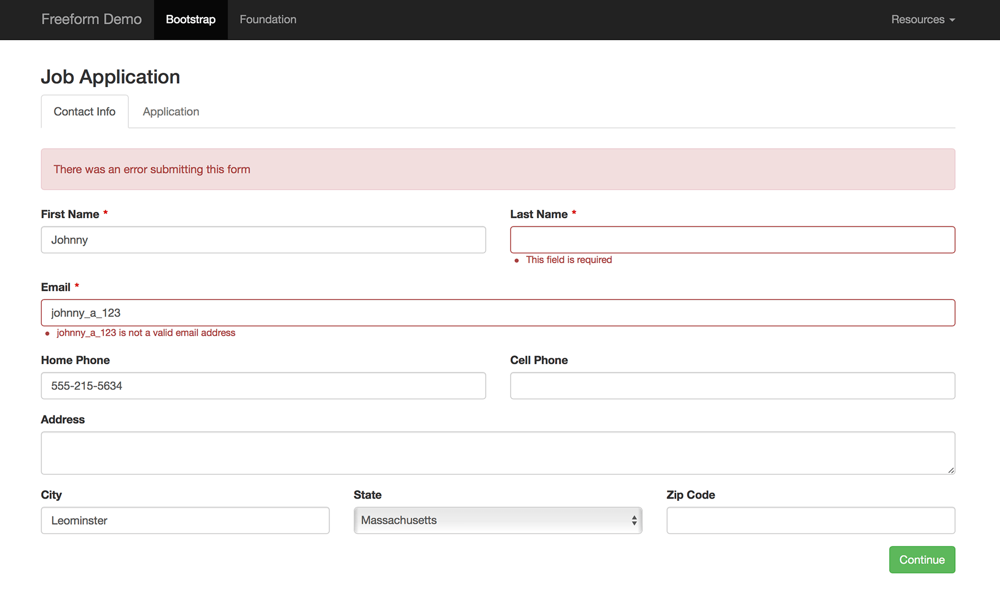

::: version /craft/freeform/v5/templates/queries/form/
Freeform
:::

<div id="pr-heading">
    
    <span class="pr-name">Freeform</span>
    <span class="pr-category">for Craft</span>
    <div class="pr-v-wrapper">
        <div class="pr-v">
            <span class="pr-v-v">1.x</span>
            <span class="pr-v-type pr-retired">Retired</span>
            <span class="pr-v-arrow arrow down"></span>
        </div>
        <ul class="pr-v-list">
            <li><a href="/craft/freeform/v5/">5.x<span class="pr-v-type pr-latest">✓ Latest</span></a></li>
            <li><a href="/craft/freeform/v4/">4.x</a></li>
            <li><a href="/craft/freeform/v3/">3.x<span class="pr-v-type pr-retired">Retired</span></a></li>
            <li><a href="/craft/freeform/v2/">2.x<span class="pr-v-type pr-retired">Retired</span></a></li>
            <li><a href="/craft/freeform/v1/">1.x<span class="pr-v-type pr-retired">Retired</span></a></li>
        </ul>
    </div>
    <div class="pr-buy">
        <a href="https://plugins.craftcms.com/freeform" class="button button-blue"><span class="external-url">Plugin Store</span></a>
    </div>
</div>

<span class="page-section"></span>

# freeform.form function

The *freeform.form* template function returns a [Form object](../template-objects/form.md) containing its metadata and fields objects. From there you can either render the form using the pre-selected formatting template by calling `form.render()` or take control over it by iterating over its fields and using `form.renderTag` and `form.renderClosingTag` methods.

::: tip
Freeform will automatically insert javascript in the footer of the page for features such as [Spam Protection](../overview/spam-protection.md), Submit disable on click, and other special fieldtypes. If you prefer to have this load inside the `<form></form>` tags, you can disable the [Include Freeform Scripts in the Page Footer](../setup/settings.md#scripts-footer) setting.
:::



## Parameters

The *freeform.form* template function is always constructed the same way. The first assumed parameter should contain the form ID or handle, and the second parameter (optional) should contain an object of overrides (typically used for applying a class globally to specific types of inputs, etc).

::: v-pre

So following this format: `{{ craft.freeform.form("FORMHANDLE", {OVERRIDES}) }}`, your code might look something like this:

:::

``` twig
{{ craft.freeform.form("composerForm", {
    labelClass: "form-label",
    inputClass: "form-control",
    instructionsBelowField: true,
    overrideValues: {
        hiddenFieldHandle: entry.id,
    }
}).render() }}
```

* First parameter: `formID` or `formHandle` <a href="#param-first-param" id="param-first-param" class="docs-anchor">#</a>
* Second parameter (optional) is an object of the following overriding options:
	* `inputClass` <a href="#param-inputclass" id="param-inputclass" class="docs-anchor">#</a>
		* Overrides the class name of all input elements.
	* `submitClass` <a href="#param-submitclass" id="param-submitclass" class="docs-anchor">#</a>
		* Overrides the class name of all submit elements.
	* `rowClass` <a href="#param-rowclass" id="param-rowclass" class="docs-anchor">#</a>
		* Overrides the class name of all row `<div>` elements.
	* `columnClass` <a href="#param-columnclass" id="param-columnclass" class="docs-anchor">#</a>
		* Overrides the class name of all field column `<div>` elements.
	* `labelClass` <a href="#param-labelclass" id="param-labelclass" class="docs-anchor">#</a>
		* Overrides the class name of all `<label>` elements.
	* `errorClass` <a href="#param-errorclass" id="param-errorclass" class="docs-anchor">#</a>
		* Overrides the class name of all error `<ul>` elements.
	* `instructionsClass` <a href="#param-instructionsclass" id="param-instructionsclass" class="docs-anchor">#</a>
		* Overrides the class name of all instruction `<div>` elements.
	* `instructionsBelowField` <a href="#param-instructionsbelowfield" id="param-instructionsbelowfield" class="docs-anchor">#</a>
	 	* A `boolean` value, if set to `true` - will render field instructions below the `<input>` element.
	* `class` <a href="#param-class" id="param-class" class="docs-anchor">#</a>
		* Overrides the `<form>` class name.
	* `id` <a href="#param-id" id="param-id" class="docs-anchor">#</a>
		* Overrides the `<form>` ID attribute.
	* `returnUrl` <a href="#param-returnurl" id="param-returnurl" class="docs-anchor">#</a>
		* Overrides the return URL for the form.
        ::: v-pre
        * You can override the return URL manually with a hidden field or checkbox, etc named `formReturnUrl`, allowing for a more dynamic return URL dependent on the user's choice or action, as long as you hash the value as of Freeform 1.9.4+ (e.g. `<input type="checkbox" name="formReturnUrl" value="{{ 'whatever/my-url'|hash }}" />`).
		:::
	* `method` <a href="#param-method" id="param-method" class="docs-anchor">#</a>
		* Overrides the `<form>` method attribute. `POST` by default.
	* `name` <a href="#param-name" id="param-name" class="docs-anchor">#</a>
		* Overrides the `<form>` name attribute. `POST` by default.
	* `action` <a href="#param-action" id="param-action" class="docs-anchor">#</a>
		* Overrides the `<form>` action attribute.
	* `overrideValues` <a href="#param-overridevalues" id="param-overridevalues" class="docs-anchor">#</a>
		* Allows overriding the default values for any field:
			* Specify the field `handle` as key, and provide the custom value override as its value.
			* E.g. `{overrideValues: {firstName: currentUser.name}}`.
			* If a [Field](../template-objects/field.md) uses an `overrideValue` attribute, it will take precedence over the value specified in this attribute.
	* `formAttributes` <a href="#param-formattributes" id="param-formattributes" class="docs-anchor">#</a>
		* An object of attributes which will be added to the form.
		* Ex: `formAttributes: { "novalidate": true, "data-form-id": "test" }`
	* `inputAttributes` <a href="#param-inputattributes" id="param-inputattributes" class="docs-anchor">#</a>
		* An object of attributes which will be added to all input fields.
		* Ex: `inputAttributes: { "readonly": true, "data-field-id": "test" }`
	* `useRequiredAttribute: true` <a href="#param-userequiredattribute" id="param-userequiredattribute" class="docs-anchor">#</a>
		* Adds `required` attribute to input fields that have been set to be required in Composer.
	* `dynamicNotification: { recipients: ["admin@example.com", "support@example.com"], template: "test.html" }` <a href="#param-dynamicnotification" id="param-dynamicnotification" class="docs-anchor">#</a>
		* Allows using a dynamic template level notification for a more fine-grained control.
		* Hard code values or pass a value from another element such as an Entry.
		* For Database entry based templates, specify the handle for `template`.
		* For Twig file based templates, specify the full file name including **.html** for `template`.
		* **NOTE:** this feature uses Session data. It will likely not work properly if the page is cached with something like Varnish, etc.


## Usage in Templates

Render the form using its formatting template:

``` twig
{{ craft.freeform.form("composerForm").render() }}
```

---

Render the form using its formatting template, but overriding some classes:

``` twig
{{ craft.freeform.form("composerForm", {
    labelClass: "form-label",
    inputClass: "form-control",
    instructionsBelowField: true,
    submitClass: "btn btn-success",
    overrideValues: {
        hiddenFieldHandle: entry.id,
    }
}).render() }}
```

---

Get the form object and manually iterate through fields:

``` twig


{{ form.renderTag }}


    <div class="freeform-form-has-errors">
        {{ "There was an error submitting this form"|t }}
    </div>



    <div class="{{ form.customAttributes.rowClass }}">
        
            
            
                
            

            <div class="{{ columnClass }}">
                {{ field.render({
                    class: field.type != "submit" ? "freeform-input" : "",
                    labelClass: "sample-label" ~ (field.required ? " required" : ""),
                    errorClass: "sample-errors",
                    instructionsClass: "sample-instructions",
                }) }}
            </div>
        
    </div>



{{ form.renderClosingTag }}
```

---

Form formatting can also be extremely manual, if that is something you prefer. Here's an example of different levels of manual you can use:

``` twig


{{ form.renderTag({returnUrl: "contact/success"}) }}

    
        <div class="freeform-form-has-errors">
            {{ "There was an error submitting this form"|t }}
        </div>
    

    
    
    
    

    <label>{{ firstName.label }}</label>
    <input name="{{ firstName.handle }}" value="{{ firstName.value }}" />
    {{ firstName.renderErrors() }}

    <label>{{ lastName.label }}</label>
    <input name="{{ lastName.handle }}" value="{{ lastName.value }}" />
    {{ lastName.renderErrors() }}

    {{ company.renderLabel() }}
    {{ company.renderInput() }}
    {{ company.renderErrors() }}

    <label>Email Address</label>
    <input name="email" />
    {{ form.get("email").renderErrors() }}

    <label>Phone</label>
    <input name="phone" />
    
        This field is required!
    

    <label>Recipient</label>
    <select name="{{ recipients.handle }}" type="dynamic_recipients">
    
        <option value="{{ loop.index0 }}">{{ recipients.label }}</option>
    
    </select>

    <button type="submit">Submit</button>

{{ form.renderClosingTag }}
```
