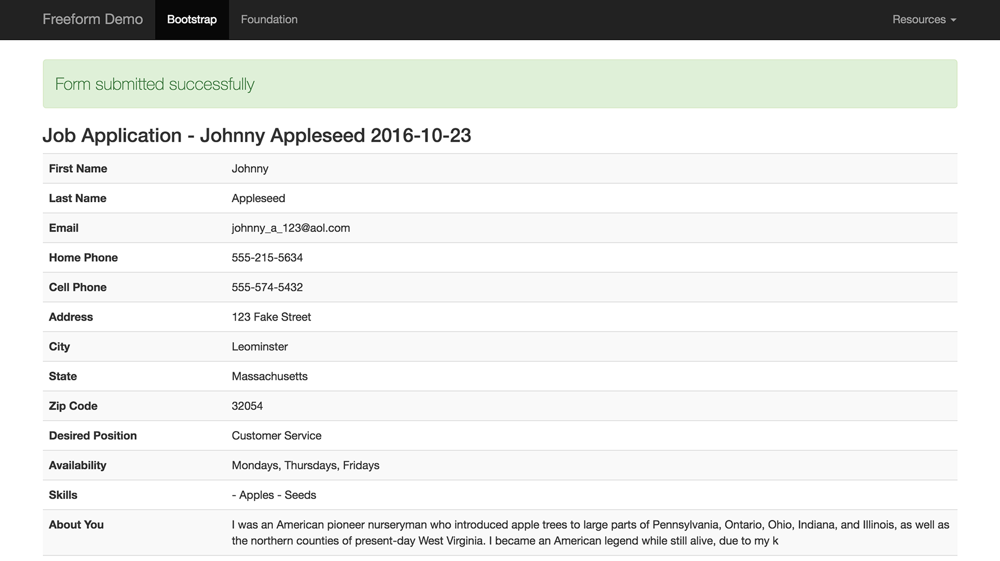

::: version /craft/freeform/v5/templates/queries/submissions/
Freeform
:::

<div id="pr-heading">
    
    <span class="pr-name">Freeform</span>
    <span class="pr-category">for Craft</span>
    <div class="pr-v-wrapper">
        <div class="pr-v">
            <span class="pr-v-v">1.x</span>
            <span class="pr-v-type pr-retired">Retired</span>
            <span class="pr-v-arrow arrow down"></span>
        </div>
        <ul class="pr-v-list">
            <li><a href="/craft/freeform/v5/">5.x<span class="pr-v-type pr-latest">✓ Latest</span></a></li>
            <li><a href="/craft/freeform/v4/">4.x</a></li>
            <li><a href="/craft/freeform/v3/">3.x<span class="pr-v-type pr-retired">Retired</span></a></li>
            <li><a href="/craft/freeform/v2/">2.x<span class="pr-v-type pr-retired">Retired</span></a></li>
            <li><a href="/craft/freeform/v1/">1.x<span class="pr-v-type pr-retired">Retired</span></a></li>
        </ul>
    </div>
    <div class="pr-buy">
        <a href="https://plugins.craftcms.com/freeform" class="button button-blue"><span class="external-url">Plugin Store</span></a>
    </div>
</div>

<span class="page-section"></span>

# freeform.submissions function

The *freeform.submissions* template function fetches a list of submissions based on some or no criteria.



## Parameters

::: v-pre

* `form` <a href="#param-form" id="param-form" class="docs-anchor">#</a>
	* Handle of the form, e.g. `"composerForm"`, or an array of handles: `["composerForm", "clientSurvey"]`.
	* Use `"not composerForm"` to select all submissions EXCEPT the ones for **Composer Form** form.
* `formId` <a href="#param-formid" id="param-formid" class="docs-anchor">#</a>
	* An ID of the form, or array of ID's, e.g. `[1, 2, 3]`.
	* If you want to select all form submissions EXCEPT the form with an ID of **1**, use `"not 1"`.
* `limit` <a href="#param-limit" id="param-limit" class="docs-anchor">#</a>
	* Supply an `int` to limit the amount of submissions returned.
* `order` <a href="#param-order" id="param-order" class="docs-anchor">#</a>
	* Use any field handle to order by that value and include the `ASC` or `DESC` parameter in the string, e.g. `order: "firstName ASC"`.
* `status` <a href="#param-status" id="param-status" class="docs-anchor">#</a>
	* Specify status to fetch submissions with a certain status.
	* `status: "open"` if you have a status with a handle `open`.

:::

## Usage in Templates

Display a simple list of submissions:

``` twig



    <div>
        {{ submission.title }} - {{ submission.firstName }}
    </div>

```

---

Print out all submissions and check if fields exist for the submitted form, before printing them out:

``` twig



    <div>
        <div>{{ submission.title }} - {{ submission.form.name }}</div>

        
            {{ submission.firstName.label }}: {{ submission.firstName }}<br>
        

        
            {{ submission.lastName.label }}: {{ submission.lastName }}<br>
        
    </div>

```

---

To paginate submissions, use Craft's [Pagination](https://craftcms.com/docs/templating/paginate). Here's an example:

``` twig



    <div>
        <div>{{ submission.title }} - {{ submission.form.name }}</div>
    </div>



    <a href="{{ pageInfo.prevUrl }}">Previous Page</a>


    <a href="{{ pageInfo.nextUrl }}">Next Page</a>

```

---

To display a single submission (see [Submission object](../template-objects/submission.md) for more info):

``` twig




    

    <h3>{{ form.name }} - {{ submission.title }}</h3>

    <table class="table table-striped">
        
            <tr>
                <th style="width: 20%;">{{ field.label ? field.label : "no-label" }}</th>
                <td>
                    
                    
                        <ul>
                            
                                <li>{{ value }}</li>
                            
                        </ul>
                    
                        {{ fieldValue }}
                    
                </td>
            </tr>
        
    </table>



    <div class="alert alert-danger">
        <p class="lead">
            Sorry, no submission was found.
        </p>
    </div>


```

---

The following is an example that shows how to render uploaded [Assets](https://craftcms.com/docs/assets) in your form submissions:

``` twig



<h3>Submissions for {{ form.name }}</h3>


    <div>There are no submissions</div>

    <table class="table">
        <thead>
            <tr>
                <th>#</th>
                <th>Title</th>
                
                    <th>{{ field.label }}</th>
                
            </tr>
        </thead>
        <tbody>
        
            <tr>
                <td>{{ submission.id }}</td>
                <td>
                    <a href="{{ siteUrl }}freeform_demo/bootstrap/{{ form.handle }}/submissions/{{ submission.id }}">
                        {{ submission.title }}
                    </a>
                </td>
                
                    <td>
                        
                            
                            
                            
                                
                                    
                                
                                    <a href="{{ asset.url }}">{{ asset.filename }}</a>
                                
                            
                        
                            {{ attribute(submission, field.handle) }}
                        
                    </td>
                
            </tr>
        
        </tbody>
    </table>

```
