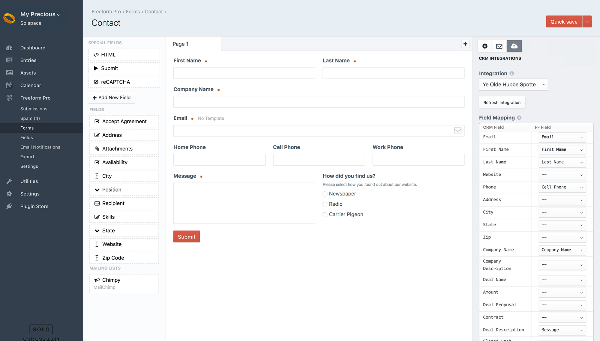

::: version /craft/freeform/v5/integrations/
Freeform
:::

    
    Freeform
    for Craft
    

        

            2.x
            Retired
            
        

        <ul class="pr-v-list">
            <li><a href="/craft/freeform/v5/">5.x✓ Latest</a></li>
            <li><a href="/craft/freeform/v4/">4.x</a></li>
            <li><a href="/craft/freeform/v3/">3.xRetired</a></li>
            <li><a href="/craft/freeform/v2/">2.xRetired</a></li>
            <li><a href="/craft/freeform/v1/">1.xRetired</a></li>
        </ul>
    

    

        <a href="https://plugins.craftcms.com/freeform" class="button button-blue">Plugin Store</a>
    

# CRM API Integrations <Badge type="pro" text="Pro" />

Freeform Pro supports some popular CRM (Customer Relationship Management) API integrations. Inside the [Settings](../../setup/settings.md#api-integrations) area of Freeform, there is a CRM API Integration Manager, which allows you to manage your CRM API integrations. If you currently have Freeform Lite, you can purchase an upgrade to Freeform Pro.

The following CRM integrations are currently available for **Freeform Pro** only (click each one for individual setup instructions):

* [Salesforce Lead](salesforce-lead.md)
* [Salesforce Opportunity](salesforce-opportunity.md)
* [HubSpot](hubspot.md)
* [ActiveCampaign](activecampaign.md)
* [Pipedrive](pipedrive.md)
* [Insightly](insightly.md)
* [SharpSpring](sharpspring.md)

Some important things to know about CRM integrations are:

* CRM integrations are globally available to all forms, but are configured per form inside the Composer interface.
* Most - if not all - integrations attempt to map all available fields and custom fields, but some may have limitations if the API is too complex or doesn't allow it.
* If a CRM integration has been configured, you will see a **CRM** button at the top of the **Property Editor** (right column) in Composer. To configure the CRM for a form, click that button and then select an integration name from the options. You may then map out your Freeform fields to your CRM's fields.

Every integration is a little bit different, so we have detailed instructions for setting up each integration on their own page.
