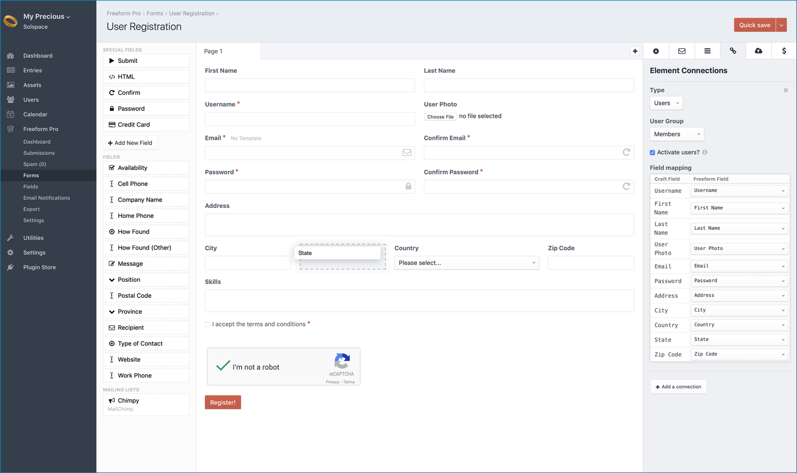
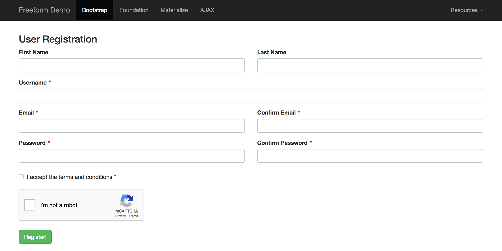

::: version /craft/freeform/v5/guides/user-registration-forms/
Freeform
:::

    
    Freeform
    for Craft
    

        

            2.x
            Retired
            
        

        <ul class="pr-v-list">
            <li><a href="/craft/freeform/v5/">5.x✓ Latest</a></li>
            <li><a href="/craft/freeform/v4/">4.x</a></li>
            <li><a href="/craft/freeform/v3/">3.xRetired</a></li>
            <li><a href="/craft/freeform/v2/">2.xRetired</a></li>
            <li><a href="/craft/freeform/v1/">1.xRetired</a></li>
        </ul>
    

    

        <a href="https://plugins.craftcms.com/freeform" class="button button-blue">Plugin Store</a>
    

# Creating User Registration Forms
Freeform allows you to easily create and manage beautiful [User](https://docs.craftcms.com/v3/users.html#public-registration) registration forms in only minutes! Using the [Element Connections](../overview/element-connections.md#craft-users) feature, you can enhance your forms with 1-click to enable AJAX, set [conditional field logic](../overview/conditional-rules.md) to show and hide fields, confirm emails and passwords, add reCAPTCHA and send custom email notifications! Pair with [Freeform Payments](../api-integrations/payments/README.md) and you can even accept one time or recurring subscription payments for membership! _Leave the heavy lifting to Freeform!_

[[toc]]

::: videolink https://craftquest.io/courses/managing-forms-with-solspace-freeform/5246
Watch the **Creating a User Registration Form** Course tutorial on CraftQuest!
:::

::: tip
This feature requires a **Craft Pro** license in order to work, as Users are a Craft Pro feature.
:::

## Prepare the Form

1. To start, create a new form in Freeform. We'll call it `User Registration`.
2. Use existing Freeform fields and create a new ones as you see fit. Drag and drop them into place in the center Layout column of Composer. A common registration form might have the following (but not limited to):
	* _First Name_
	* _Last Name_
	* _Username_
	* _Email Address_
	* _Confirm Email Address_
		* Use the [Confirm](../overview/fields-field-types.md#fields-confirm) special field to set this up.
	* _Password_
		* Use the [Password](../overview/fields-field-types.md#fields-password) special field for this. It will NOT save any password data in the Freeform database tables.
	* _Confirm Password_
		* Use the [Confirm](../overview/fields-field-types.md#fields-confirm) special field to set this up.
	* _Photo_
		* Use a Freeform [File Upload](../overview/fields-field-types.md#fields-file-upload) fieldtype to set this to map to the User Photo.
	* A _checkbox_ to agree to terms and conditions
	* _Submit_ button

## Set up the Connection

1. Click on the chain icon button in the Property Editor column at the top right.
2. For the **Type** dropdown, select *Users*.
3. For the **User Group** dropdown, select the user group you'd like to map to.
	* Only user groups that have NO admin permissions will show up as options here.
4. If you'd like new users created from Freeform submissions to not yet be activated (and receive the Craft User Activation email) when submitted, check the **Activate users?** checkbox.
	* If you wish to have users automatically logged in upon success, please be sure to use the `'autoLoginAfterAccountActivation' => true,` config item in your Craft config file, and check the **Activate users?** checkbox. <Badge type="feature" text="2.5.0+" />
5. Map compatible Craft fields to Freeform fields in the **Field mapping** table.
	* There are some obvious limitations with field mapping, as Freeform does not have anything like a Matrix or Table field, etc. Most traditional fields that are similar to each other should be able to correctly map to each other however. We'll likely have an official list of mapping abilities in the near future.

Once that's all finished, you'll have something that looks like the screenshots below. Check out your form in the Freeform demo templates and see if everything works correctly.

## Important Notes

* Freeform submissions can map to sections with autogenerated titles. Just make sure to set the fields you're using to map to Craft fields that populate the title field to be required on Freeform's end, otherwise the submission likely won't generate the Craft Entry if data for the title is missing.
* Freeform attempts to route User-based errors to the mapped fields. In some cases you might see more than 1 error for a Freeform field because of this. The fields that are mapped to essential fields like **username**, **email** and **password** will mention that "Email cannot be blank", etc.
* While multipage forms do appear to map correctly to **users**, you may see some slightly unusual behavior. For example, if you have your **Password** field placed in the second page, when submitting from the first page to the second page, the second page will highlight the field mapped to the **Password** field highlighted with an error. The whole process still works, but there's that visual issue.
* If the submission is blocked or flagged as spam, there's currently no way to retroactively map submission data to Users. The best option for avoiding this would be using [reCAPTCHA <Badge type="pro" text="Pro" />](../overview/fields-field-types.md#fields-recaptcha).
