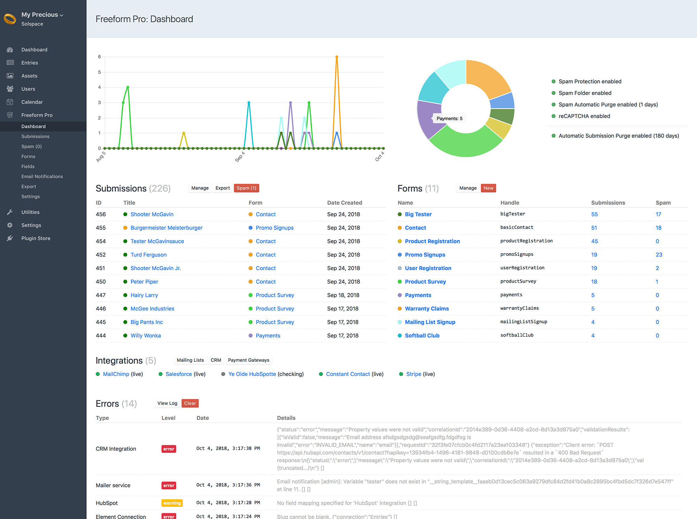

::: version /craft/freeform/v5/forms/
Freeform
:::

    
    Freeform
    for Craft
    

        

            2.x
            Retired
            
        

        <ul class="pr-v-list">
            <li><a href="/craft/freeform/v5/">5.x✓ Latest</a></li>
            <li><a href="/craft/freeform/v4/">4.x</a></li>
            <li><a href="/craft/freeform/v3/">3.xRetired</a></li>
            <li><a href="/craft/freeform/v2/">2.xRetired</a></li>
            <li><a href="/craft/freeform/v1/">1.xRetired</a></li>
        </ul>
    

    

        <a href="https://plugins.craftcms.com/freeform" class="button button-blue">Plugin Store</a>
    

# Freeform Dashboard <Badge type="feature" text="2.4.0+" />

Freeform contains its own dashboard page that gives you convenient insights and an overview of your forms, submissions, settings and logged errors. The data displayed here will respect all [Permissions](../setup/permissions.md) set for users / user groups.

* **Submissions**
	* A list of the 10 most recent submissions will be displayed, along with a chart above it that shows submissions across all forms for the last 60 days.
	* Quick links that will take you to Submissions page, [Export Profiles](./exporting.md#export-profiles-pro) <Badge type="pro" text="Pro" /> page and the [Spam Folder](./spam-protection.md#spam-folder).
* **Forms**
	* A list of the 10 most popular forms will be display, along with a donut chart above it that shows the total number of submissions for each form.
	* Quick links that will take you to Manage Forms page, Create Form page, Submissions lists and [Spam Folder](./spam-protection.md#spam-folder) page.
	* Overview of current Submission and Spam Protection-related settings:
		* [Spam Protection](./spam-protection.md#javascript-honeypot)
		* [Spam Folder](./spam-protection.md#spam-folder)
		* [Spam Automatic Purge (X days)](../setup/settings.md#general)
		* [reCAPTCHA](./spam-protection.md#recaptcha-pro) <Badge type="pro" text="Pro" />
		* [Automatic Submission Purge (X days)](../setup/settings.md#general)
* **Integrations**
	* A list of all API integrations connected for Freeform. This will run a check to confirm the status of each integration.
	* Quick links that will take you to [Mailing Lists](../api-integrations/mailing-list/README.md), [CRM](../api-integrations/crm/README.md) and [Payment Gateway](../api-integrations/payments/README.md) pages.
* **Errors**
	* Conveniently let's you know if something is wrong by displaying a list of the most recent 5 errors that Freeform logged, if available.
	* Quick links that will take you to [Error Log](../setup/settings.md#error-log) page and also clear the Freeform error log.
