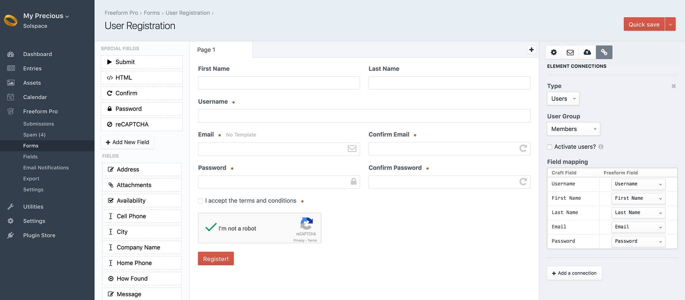

::: version /craft/freeform/v5/integrations/elements/
Freeform
:::

    
    Freeform
    for Craft
    

        

            2.x
            Retired
            
        

        <ul class="pr-v-list">
            <li><a href="/craft/freeform/v5/">5.x✓ Latest</a></li>
            <li><a href="/craft/freeform/v4/">4.x</a></li>
            <li><a href="/craft/freeform/v3/">3.xRetired</a></li>
            <li><a href="/craft/freeform/v2/">2.xRetired</a></li>
            <li><a href="/craft/freeform/v1/">1.xRetired</a></li>
        </ul>
    

    

        <a href="https://plugins.craftcms.com/freeform" class="button button-blue">Plugin Store</a>
    

# Element Connections <Badge type="feature" text="2.2.0+" />

::: videolink https://craftquest.io/courses/managing-forms-with-solspace-freeform/5244
Watch the **Using Element Connections** Course tutorial on CraftQuest!
:::

Freeform allows you to connect and map Freeform submission data to other Craft Elements:

* [Craft Entries](#craft-entries)
* [Craft Users](#craft-users)
* More coming soon...
* [Field Mapping Guidelines](#field-mapping-guidelines)

## Craft Entries
If you'd like to map Freeform submission data to [Craft Entries](https://docs.craftcms.com/v3/sections-and-entries.html#entries), while in Composer for an existing form, do the following:

1. Click on the chain icon button in the Property Editor column at the top right.
2. For the **Type** dropdown, select *Entries*.
3. For the **Section** dropdown, select the section you'd like to map to.
4. For the **Entry Type** dropdown, select the section entry type you'd like to map to.
5. If you'd like new entries created from Freeform submissions to be disabled when submitted, check the **Disable entries?** checkbox.
6. Map compatible Craft fields to Freeform fields in the **Field mapping** table.
	* See [Field Mapping Guidelines](#field-mapping-guidelines) for more info.

### Important Notes

* Freeform submissions can map to sections with autogenerated titles. Just make sure to set the fields you're using to map to Craft fields that populate the title field to be required on Freeform's end, otherwise the submission likely won't generate the Craft Entry if data for the title is missing.
* Freeform attempts to route Entry-based errors to the mapped fields. In some cases you might see more than 1 error for a Freeform field because of this. The field that is mapped to the Entry Title field will mention that "a title is required", etc. Entry Slug errors are suppressed for Freeform errors as not to confuse users.
* While multipage forms do appear to map correctly to **entries**, you may see some slightly unusual behavior. For example, if you have your **Title** field placed in the second page, when submitting from the first page to the second page, the second page will highlight the field mapped to the **Title** field highlighted with an error. The whole process still works, but there's that visual issue.
* If the submission is blocked or flagged as spam, there's currently no way to retroactively map submission data to Entries. The best option for avoiding this would be using [reCAPTCHA <Badge type="pro" text="Pro" />](./fields-field-types.md#fields-recaptcha).

## Craft Users

::: tip
This feature requires a **Craft Pro** license in order to work, as Users are a Craft Pro feature.
:::

If you'd like to map Freeform submission data to [Craft User](https://docs.craftcms.com/v3/users.html), essentially creating a [User Registration form](../guides/user-registration-forms.md), while in Composer for an existing form, do the following:

::: videolink https://craftquest.io/courses/managing-forms-with-solspace-freeform/5246
Watch the **Creating a User Registration Form** Course tutorial on CraftQuest!
:::

1. Click on the chain icon button in the Property Editor column at the top right.
2. For the **Type** dropdown, select *Users*.
3. For the **User Group** dropdown, select the user group you'd like to map to.
	* Only user groups that have NO admin permissions will show up as options here.
4. If you'd like new users created from Freeform submissions to not yet be activated (and receive the Craft User Activation email) when submitted, check the **Activate users?** checkbox.
5. Map compatible Craft fields to Freeform fields in the **Field mapping** table.
	* See [Field Mapping Guidelines](#field-mapping-guidelines) for more info.
	* You will need to use the special [Password](./fields-field-types.md#fields-password) field for mapping passwords to User passwords. The Freeform **Password** field will NOT save any password data in the Freeform database tables.

Check out our [User Registration form](../guides/user-registration-forms.md) guide for a specialized look at creating User registration forms.

### Important Notes

* Freeform submissions can map to sections with autogenerated titles. Just make sure to set the fields you're using to map to Craft fields that populate the title field to be required on Freeform's end, otherwise the submission likely won't generate the Craft Entry if data for the title is missing.
* Freeform attempts to route User-based errors to the mapped fields. In some cases you might see more than 1 error for a Freeform field because of this. The fields that are mapped to essential fields like **username**, **email** and **password** will mention that "Email cannot be blank", etc.
* While multipage forms do appear to map correctly to **users**, you may see some slightly unusual behavior. For example, if you have your **Password** field placed in the second page, when submitting from the first page to the second page, the second page will highlight the field mapped to the **Password** field highlighted with an error. The whole process still works, but there's that visual issue.
* If the submission is blocked or flagged as spam, there's currently no way to retroactively map submission data to Users. The best option for avoiding this would be using [reCAPTCHA <Badge type="pro" text="Pro" />](./fields-field-types.md#fields-recaptcha).

## Field Mapping Guidelines
There are some obvious limitations with field mapping, as Freeform does not have anything like a Matrix or Table field, etc. Most traditional fields that are similar to each other should be able to correctly map to each other however. This list is a work in progress, and we'll continue to update it as we make improvements:

* **Freeform Checkbox** fields can be mapped to Craft's Checkbox field (with just 1 option) as well as the Lightswitch field. Just make sure the value and casing in Freeform matches.
* **Craft Date/Time** fields should be mapped to with the following format: `Y-m-d H:i:s` (aka `YYYY-MM-DD HH:MM:SS` or just `YYYY-MM-DD` for Freeform Date & Time fields using Date only).
* **Craft Relation** fields currently only seem to accept data from Freeform fields like Checkbox groups, when feeding ID(s).
* **Freeform File Upload** fields can be mapped to regular Craft **Assets** fields, as well as the *Users* Photo field. <Badge type="feature" text="2.2.2+" />
