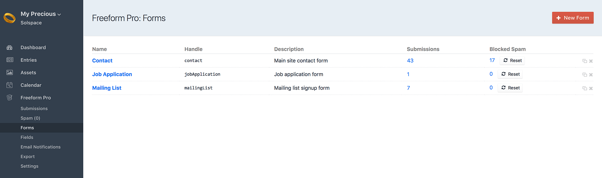
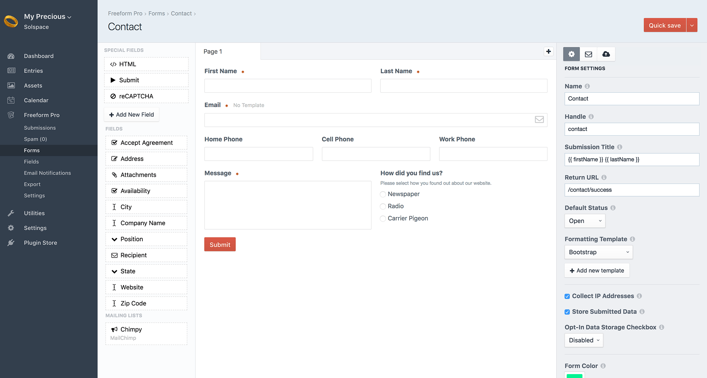
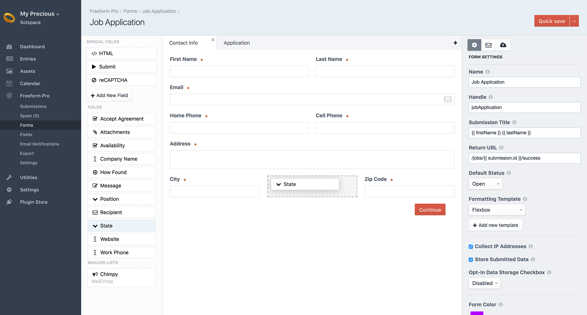
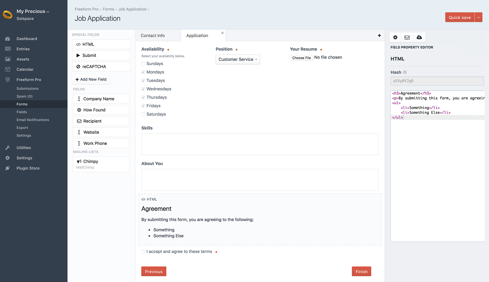
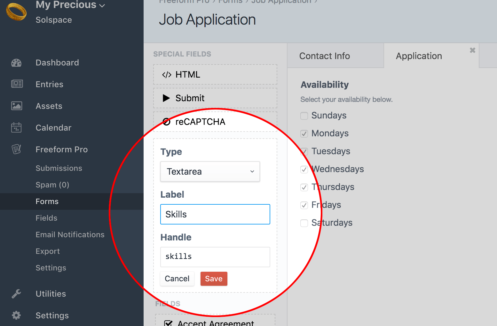
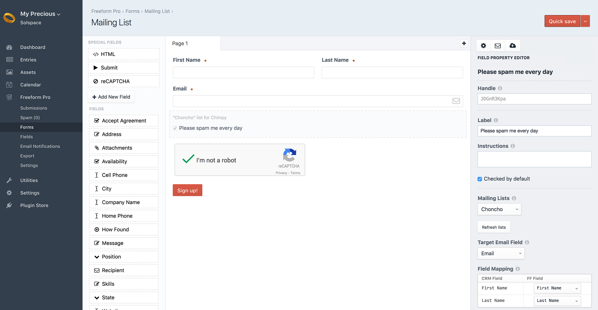

::: version /craft/freeform/v5/forms/builder/
Freeform
:::

    
    Freeform
    for Craft
    

        

            2.x
            Retired
            
        

        <ul class="pr-v-list">
            <li><a href="/craft/freeform/v5/">5.x✓ Latest</a></li>
            <li><a href="/craft/freeform/v4/">4.x</a></li>
            <li><a href="/craft/freeform/v3/">3.xRetired</a></li>
            <li><a href="/craft/freeform/v2/">2.xRetired</a></li>
            <li><a href="/craft/freeform/v1/">1.xRetired</a></li>
        </ul>
    

    

        <a href="https://plugins.craftcms.com/freeform" class="button button-blue">Plugin Store</a>
    

# Forms & Composer

What makes Freeform very different from other form plugins is that it includes a very intuitive, very interactive and very flexible interface for building forms. We call this, **Composer**.

To create your first form, visit the Forms area of the Freeform control panel (**Freeform > Forms**), and then click the **New Form** button at the top right corner of the page.

The below documentation assumes that you have reviewed the [Fields & Field Types documentation](./fields-field-types.md). If you have not already done so, start over there first.

[[toc]]

::: videolink https://craftquest.io/courses/managing-forms-with-solspace-freeform/5204
Watch the **Building a Simple Form with Freeform** Course tutorial on CraftQuest!
:::

# Composer

Freeform Composer is an all-in-one interface that lets you take control of almost every aspect of your forms. Everything is at your fingertips. Before we get started, here's a few notes about Composer:

* Composer is divided into 3 columns:
	* **Fields** (left column) contains all of the available fields you can add to your form.
	* **Layout** (center column) is where you actively see an interactive live preview of what your form will look like.
	* **Property Editor** (right column) is where all your configuration will happen. Clicking on any field, page tab or settings icon inside Composer layout area will load its configuration options here.
* Freeform Composer applies changes to fields instantly (no need to click save before you move on to adjust the next thing). We've also made the **Quick Save** (save and continue editing) button and **⌘S** option conveniently accessible for you.
* Fields, special fields and mailing lists are all drag and drop. Drag them on to add them. Drag them around to move them.
* Freeform Composer tries to handle as much work for you as possible. It will auto-split rows into columns to fit your fields beside each other, if you wish (to a maximum of 4 columns).
* As mentioned in the [Fields & Field Types documentation](./fields-field-types.md), fields are global and available to all forms, but they can also be overwritten per form. This allows you to save time reusing existing fields when making other forms, but also gives you flexibility to make adjustments to them when needed.

More information about Composer features:

* [Form Settings](#form-settings)
* [Admin Email Notifications](#admin-notifications)
* [Fields (left column)](#fields)
	* [HTML](#form-html)
	* [Submit](#form-submit)
	* [reCAPTCHA](#form-recaptcha)
	* [Mailing Lists](#form-mailing-list)
* [Layout (center column)](#layout)
* [Property Editor (right column)](#property-editor)
* [Conditional Rules](#conditional-rules)
* [Element Connections](#element-connections)
* [Mailing List API Integrations](#form-mailing-list)
* [CRM API Integrations](#crm-integrations)

## Form Settings

When you first create a form, the Property Editor (right column) will display overall setting for your form. You can get back here to adjust these details at any time by clicking the **Form Settings** (cog icon) tab at the top right of the **Property Editor** (right column) area.

::: v-pre
* **Name** <a href="#form-name" id="form-name" class="docs-anchor">#</a>
	* A name for your form to identify it easier.
* **Handle** <a href="#form-handle" id="form-handle" class="docs-anchor">#</a>
	* The unique identifier for the form used in your regular templates calling the form.
* **Submission Title** <a href="#submission-title" id="submission-title" class="docs-anchor">#</a>
	* The variable(s) you place here will establish the title of each form submission to be displayed in the Submissions list.
		* Can include any Freeform field variables (`{{ fieldName }}`) as well as `{{ form.name }}`, `{{ form.id }}`, `{{ form.handle }}` and `{{ dateCreated }}`.
* **Return URL** <a href="#form-return-url" id="form-return-url" class="docs-anchor">#</a>
	* The URL that the form will redirect to after successful submit.
	* May contain:
		* `{{ form.handle }}` - handle of form.
		* `{{ submission.token }}` - "secure" token created for the submission.
		* `{{ submission.id }}` - newly created unique submission ID in the URL. This would allow you to use the [freeform.submissions](../template-functions/freeform.submissions.md) template function to display some or all of the users' submission on the success page.
* **Default Status** <a href="#form-status" id="form-status" class="docs-anchor">#</a>
	* The default status to be used when users submit the form, unless overwritten at template level.
	* See [Statuses documentation](../setup/settings.md#statuses) for managing statuses.
* **Formatting Template** <a href="#formatting-template" id="formatting-template" class="docs-anchor">#</a>
	* Optional, if using the [render() method](../template-functions/freeform.form.md#render), this essentially allows you to "attach" a formatting template to a form so that you don't need to include formatting inside the template(s) you place the form inside.
	* Select from an existing sample or custom template, or create a new one.
		* If creating a new one, a new template file will automatically be created for you in your [Form Template Directory](../setup/settings.md#form-template-directory) containing sample template code that you can adjust later.
		* Users/groups need to have permissions access for **Settings** to create new formatting templates.
* **Enable AJAX** <Badge type="feature" text="2.5.0+" /> <a href="#enable-ajax" id="enable-ajax" class="docs-anchor">#</a>
	* To enable Freeform's built-in automated AJAX submit support, simply check this checkbox and Freeform will then handle the rest (as long as you're using a standard formatting template - very custom formatting templates may not work properly).
* **Collect IP Addresses** <a href="#submission-collect-ip" id="submission-collect-ip" class="docs-anchor">#</a>
	* This setting allows you to specify whether or not the form should collect IP addresses from submitters.
		* It's important to note that this likely isn't a complete solution for [GDPR Compliance](../setup/gdpr-compliance.md) if that is why you are using this feature. Please read our official [Guide to GDPR Compliance with Freeform](../setup/gdpr-compliance.md) for more information.
* **Store Submitted Data** <a href="#submission-store-data" id="submission-store-data" class="docs-anchor">#</a>
	* This setting allows you to specify whether the submission data for this form should be stored in the database or not.
		* Typical use-cases for not storing submission data on your site would be if you just wanted the [email notification](./email-notifications.md) and/or wanted the data submitted over to a [Mailing List](../api-integrations/mailing-list/README.md) or [CRM](../api-integrations/crm/README.md) API.
		* It's important to note that this likely isn't a complete solution for [GDPR Compliance](../setup/gdpr-compliance.md) if that is why you are using this feature. Please read our official [Guide to GDPR Compliance with Freeform](../setup/gdpr-compliance.md) for more information.
* **Opt-In Data Storage Checkbox** <a href="#submission-data-storage-opt-in" id="submission-data-storage-opt-in" class="docs-anchor">#</a>
	* This setting allows the submitter to choose whether or not they want their submission data stored on your site. In the select dropdown, select a **Checkbox** fieldtype you want to be the designated opt-in field, or choose **Disabled** to not use this feature.
		* This setting will still send off API data and email notifications.
		* It's important to note that this likely isn't a complete solution for [GDPR Compliance](../setup/gdpr-compliance.md) if that is why you are using this feature. Please read our official [Guide to GDPR Compliance with Freeform](../setup/gdpr-compliance.md) for more information.
* **Form tag Attributes** <Badge type="feature" text="2.5.0+" /> <a href="#form-attributes" id="form-attributes" class="docs-anchor">#</a>
	* Add any `<form>` tag attributes for the form here, e.g. `novalidate`, `data-my-attribute` and `autocomplete="on"`.
* **Form Color** <a href="#form-color" id="form-color" class="docs-anchor">#</a>
	* Used for features like charts in Freeform dashboard widgets.
* **Description** <a href="#form-description" id="form-description" class="docs-anchor">#</a>
	* A description for the form to store notes or help identify what it's used for, etc.
:::

## Admin Email Notifications

Freeform allows you to send an email to admins (or other predefined email addresses) 2 different ways:

* With the [Dynamic Recipients](./fields-field-types.md#fields-dynamic-recipients) field type, allowing the user to select from a few different predefined options to direct their email notification to.
* As a hard coded option set for the form.

To use the latter approach, click the **Admin Notifications** (envelope icon) tab in the Property Editor (right column) to set up admin email notifications. Select the email notification template (or quickly create a new one - users/groups need to have permissions access for **Email Notifications** to create new notification templates), and then enter the admin email address(es), each on a new line, you wish to receive an email notification upon users successfully submitting the form.

For more email notification options, please see the [Types of Email Notifications](./email-notifications.md#types-of-email-notifications) documentation page.

## Fields (left column)

The left column displays a list of fields available for use. New fields can be created in the main field creation area (**Freeform > Fields > New Field**) as well as directly within the *Composer* interface by clicking the **Add New Field** button. Fields created here are available globally as well (they do not just exist for that form).

To use any fields, simply click on them or drag the field over to the **Layout** area (center column). See [Special Fields](./fields-field-types.md#special-fields) documentation for more information about each special field and how they work:

* [Submit](./fields-field-types.md#fields-submit)
* [HTML](./fields-field-types.md#fields-html)
* [Confirm](./fields-field-types.md#fields-confirm)
* [Password](./fields-field-types.md#fields-password)
* [reCAPTCHA <Badge type="pro" text="Pro" />](./fields-field-types.md#fields-recaptcha)

If you have configured a [Mailing Lists integration](../setup/settings.md#mailing-lists), you'll see a list for Mailing List integrations. There will be 1 displayed per connection, but you can include the mailing list sign up field as many times as you wish, as long as each uses a different list for that integration.

* **Mailing Lists** <a href="#form-mailing-list" id="form-mailing-list" class="docs-anchor">#</a>
	* Can only be displayed as a single checkbox.
		* Label is customizable.
		* Checkbox can be checked by default.
	* Specify the mailing list to be used for the mailing list integration.
	* Form must include an [Email](./fields-field-types.md#fields-email) field type, which must then be assigned to the **Target Email Field** setting.
	* **Field Mapping** setting allows you to map Freeform fields to available mailing list integration fields.

## Layout (center column)

The center column is where all the magic happens. It's where you can actively see an interactive live preview of what your form will look like. You can click or drag any of the fields from the **Fields** (left column) into the Layout area to add them. Drag them around to move them. Freeform will auto-split rows into columns to fit your fields beside each other, if you wish (to a maximum of 4 columns).

Clicking anywhere on any field will open up the **Property Editor** (right column) where you can adjust and configure settings for your field such as label, options, making field required, editing HTML, mapping fields, etc. Changes will apply instantly (not necessary to click save before you do something else).

To remove a field from the layout, simply click the delete (minus) icon that shows up on top right when you hover over a field.

Freeform also allows for true *multi-page* forms (a POST submit per page). To add more pages to your form, simply click the plus (**+**) button at the top of the Layout area next to the page tabs. To edit the name of the page, change the value in the **Property Editor** (right column). To remove a page, make sure you're on the page you'd like to remove, and then click the delete (minus) icon on the page tab. There is a limit of 100 pages for each form.

If you wish to rearrange pages, simply drag and drop the tabs. If you need to move a field from one page to another, drag and drop the field onto the page tab you'd like it to be moved to. It will then appear at the top of that page, and you can finish placing it where it should be on that page.

[Click here for more information about multi-page forms.](./multi-page-forms.md)

## Property Editor (right column)

The Property Editor controls every aspect of your form. Clicking on any field, page tab or form settings tab inside Composer layout area will load its configuration options here.

For all fields, there is a **Reset** button at the top right of the Property Editor if you wish to have your field options and labels, etc be reset/updated to what is set for the "default" field in **Freeform** -> **Fields** area.

## Conditional Rules

Freeform Pro edition includes [Conditional Rules](./conditional-rules.md) logic that can be added to forms. This feature allows you to effortlessly set fields to **show or hide** based on the contents/selection of other fields, and even **skip pages** based on the contents/selection of fields on a previous page.

To use this feature, click on the **Conditional Rules** (lines icon) tab in the Property Editor column at the top right and follow the options. You can read more about the [Conditional Rules feature](./conditional-rules.md) here.

## Element Connections

Freeform allows you to connect and map Freeform submission data to other Craft Elements such as [Craft Entries](https://docs.craftcms.com/v3/sections-and-entries.html#entries) and [Craft Users](https://docs.craftcms.com/v3/users.html), with more coming soon!

It essentially allows you to easily create complex user registration forms or accept guest submitted content that maps to Craft entries for further management by site admins for publishing... or whatever else you can dream up!

To use this feature, click on the **Element Connections** (chain icon) tab in the Property Editor column at the top right and follow the options. You can read more about the [Element Connections feature](./element-connections.md) here.

::: videolink https://craftquest.io/courses/managing-forms-with-solspace-freeform/5244
Watch the **Using Element Connections** Course tutorial on CraftQuest!
:::

## CRM API Integrations

If you have installed and configured any [CRM API integrations](../setup/settings.md#crm) (Customer Relationship Management), you will see a **CRM** (cloud icon) tab at the top of the **Property Editor** area (right column). To configure this, click that button, and then select an integration name from the options. You may then map out your Freeform fields to your CRM's fields.

