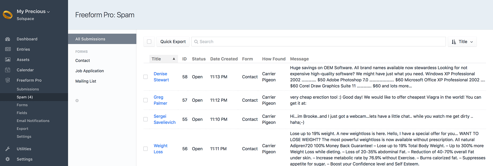
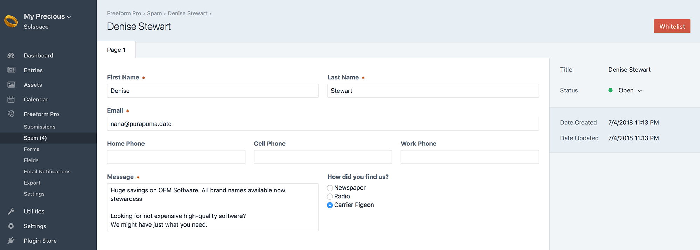

::: version /craft/freeform/v5/forms/spam-protection/
Freeform
:::

<div id="pr-heading">
    
    <span class="pr-name">Freeform</span>
    <span class="pr-category">for Craft</span>
    <div class="pr-v-wrapper">
        <div class="pr-v">
            <span class="pr-v-v">2.x</span>
            <span class="pr-v-type pr-retired">Retired</span>
            <span class="pr-v-arrow arrow down"></span>
        </div>
        <ul class="pr-v-list">
            <li><a href="/craft/freeform/v5/">5.x<span class="pr-v-type pr-latest">✓ Latest</span></a></li>
            <li><a href="/craft/freeform/v4/">4.x</a></li>
            <li><a href="/craft/freeform/v3/">3.x<span class="pr-v-type pr-retired">Retired</span></a></li>
            <li><a href="/craft/freeform/v2/">2.x<span class="pr-v-type pr-retired">Retired</span></a></li>
            <li><a href="/craft/freeform/v1/">1.x<span class="pr-v-type pr-retired">Retired</span></a></li>
        </ul>
    </div>
    <div class="pr-buy">
        <a href="https://plugins.craftcms.com/freeform" class="button button-blue"><span class="external-url">Plugin Store</span></a>
    </div>
</div>

<span class="page-section"></span>

# Spam Protection

Freeform includes a variety of robust spam control features to make managing forms easier.


[[toc]]


## Javascript Honeypot

Freeform includes its own Javascript-based honeypot spam protection. This is enabled by default, but can be disabled in the [Freeform Settings](../setup/settings.md#spam-settings). If enabled, you can specify the behavior Freeform takes when a spammy submission is detected with the [Spam Protection Behavior](../setup/settings.md#spam-behavior) setting:

* **Simulate successful submission** (recommended)
  * If you have the [Spam Folder](#spam-folder) feature enabled, spammy submissions will go through to the Spam Folder in the Freeform control panel.
  * An error is not displayed so as not to give away the spam controls.
* **Display error messages** (not recommended)
  * Useful for troubleshooting if you're experiencing some issues with submissions being flagged as spam.
* **Reload form**
  * This is a less user-friendly approach to legitimate users that are having their submissions flagged as spam for some reason, but at least shows a sign that there's something wrong - which would be more practical if not using the [Spam Folder](#spam-folder) feature.
  * Spammy submissions do not go through at all in this case, but it will increment the Spam Counter in the *Forms* page in the Freeform control panel.

### Important Information about how the Freeform Honeypot field works

* Each time a form is loaded, it stores a unique honeypot per session, which has a timestamp, unique name and unique hash value.
  * Both name and hash must match to successfully submit the form or advance to the next page.
  * A user is allowed 100 honeypot values per user session (highly unnecessary but in case your site has a form in a common place like a footer, etc it'll help prevent unwanted blocking of legitimate users).
  * Honeypots are stored in the session for 3 hours, and then are removed.
    * Because this uses the session, this limit is also dependent on the server configuration for [session.gc_maxlifetime()](http://php.net/manual/en/session.configuration.php#ini.session.gc-maxlifetime) in `php.ini`. Typically the default might be `1440` seconds (24 minutes), but it's possible the default has been altered to something else.
* When the form opens, the value is wrong by default, and then javascript swaps in the correct value.
  * If the submission fails the honeypot test, it will then match the behavior of the [Spam Protection Behavior](../setup/settings.md#spam-behavior) setting.
* The honeypot is not a hidden field, but is positioned absolutely with height `0` and width `0`, so the field is not visible.
* This spam protection method requires javascript be enabled for the user's browser, otherwise it will fail.
  * Freeform will automatically insert javascript in the footer of the page. If you prefer to have this load inside the `<form></form>` tags (for purposes of caching, etc), you can control this with the [Freeform Javascript Insertion Location](../setup/settings.md#scripts-location) setting.

The Honeypot can also be manually rendered as follows:

``` twig
  
  
{{ honeypot.name }}  
{{ honeypot.hash }}
```


## Spam Folder

When the [Use Spam Folder](../setup/settings.md#spam-folder) setting is enabled, all submissions caught by the [Javascript Honeypot](#javascript-honeypot) or [blocked email addresses, keywords and IP addresses](#spam-blocking) will be flagged as spam and stored in the database, but available to manage in a separate menu inside Freeform.

* Email notifications and API integrations will all be suppressed, but queued.
* When viewing the *Spam Folder* in the Freeform control panel, you have the ability to delete or approve/allow each submission.
  * Allowing spammy submissions will retroactively fire off email notifications and any API integration data as well.
* The Spam Folder can be set to have older spammy submissions automatically purged after a period of time. To enable this, enable the [Automatically Purge Spam Submissions](../setup/settings.md#auto-purge-spam) setting and specify the number of days after submission date it should purge them.

::: warning
Enabling this and saving this settings page will begin the purging of submissions flagged as spam, and cannot be undone.
:::





## Spam Blocking

Freeform gives you the ability to block multiple [email addresses](../setup/settings.md#block-email), [keywords](../setup/settings.md#block-keywords) and [IP addresses](../setup/settings.md#block-ip). Separate multiples on new lines, and use `*` for wildcard (except on IP addresses).

* If the submission fails, it will then match the behavior of the [Spam Protection Behavior](../setup/settings.md#spam-behavior) setting.
* If you have the [Spam Folder](#spam-folder) feature enabled, spammy submissions will go through to the Spam Folder in the Freeform control panel.
* You have the option to display errors for fields using a blocked email address or keyword, but we recommend only using this for troubleshooting purposes.


## Throttling

If your site is being attacked by spammers or you're concerned about it, you can enable the [Form Submission Throttling](../setup/settings.md#throttling) setting. This will globally (affecting all users) prevent spam or attacks by limiting the number of times all forms can be submitted within a given timeframe.


## reCAPTCHA <Badge type="pro" text="Pro" />

If you wish to use *reCAPTCHA* for your forms, enable the [reCAPTCHA](../setup/settings.md#recaptcha) setting and fill in the reCAPTCHA *Site Key* and *Secret Key*. To add reCAPTCHA to your forms, open up and edit each form and drag over the **reCAPTCHA** special field anywhere you like into your form layout.

*reCAPTCHA* fields will render automatically like the rest of your fields in your form, but if you're building a form manually, you'd call it like this (using the Hash value for *reCAPTCHA* field in Property Editor of Composer):

``` twig



{{ recaptcha.renderInput }}
```

If you're loading an entire form via AJAX, you'll need to load the reCAPTCHA JS yourself, since it's considered insecure otherwise and the browser blocks it. You should add this script tag anywhere on your page, preferably the footer:

``` html
<script type="text/javascript" src="https://www.google.com/recaptcha/api.js?render=explicit"></script>
```
