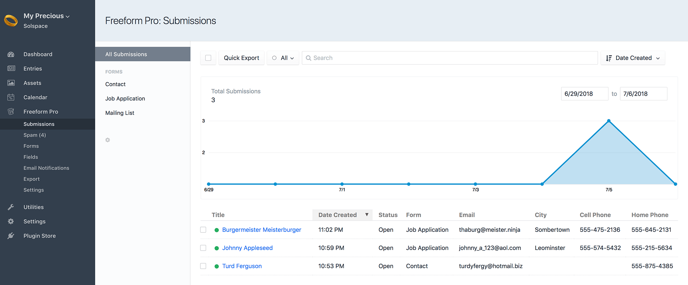
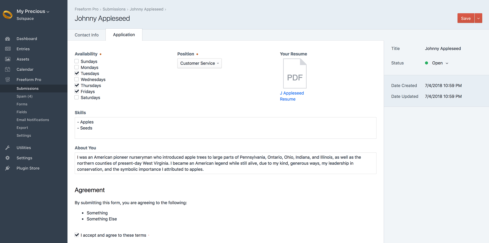

::: version /craft/freeform/v5/submissions/overview/
Freeform
:::

    
    Freeform
    for Craft
    

        

            2.x
            Retired
            
        

        <ul class="pr-v-list">
            <li><a href="/craft/freeform/v5/">5.x✓ Latest</a></li>
            <li><a href="/craft/freeform/v4/">4.x</a></li>
            <li><a href="/craft/freeform/v3/">3.xRetired</a></li>
            <li><a href="/craft/freeform/v2/">2.xRetired</a></li>
            <li><a href="/craft/freeform/v1/">1.xRetired</a></li>
        </ul>
    

    

        <a href="https://plugins.craftcms.com/freeform" class="button button-blue">Plugin Store</a>
    

# Submissions

Similar to Craft Entries, every time a user submits a form, we refer to those as submissions. Currently, submissions can be viewed and edited in the control panel, and displayed on the front end in templates as a list and individually.

[[toc]]

## In the Control Panel

The list of submissions in the control panel appears very similar to how regular Craft Entries are displayed. You can filter the view by form (or show across all forms), search into submissions, adjust which field columns are shown, and click into any of the submissions to edit them.

Additionally, Freeform includes a chart that gives you a quick visual of how many form submissions your site is receiving.

## Exporting Submissions

Freeform includes 3 options for exporting (2 of which are Pro only). Please refer to the [Exporting](./exporting.md) documentation for more information.

## In Front End Templates

One common use-case might be displaying the contents of the form submission to the user that submitted it right after they have successfully submitted the form, allowing them to review what they submitted. Of course, be aware that there are security implications here if the submissions contain sensitive content.

If the information is not sensitive, and meant to be public - like comments, you can also display submissions in a paginated (or not) list.

For more information about this, please visit the [freeform.submissions](../template-functions/freeform.submissions.md) template function documentation.
