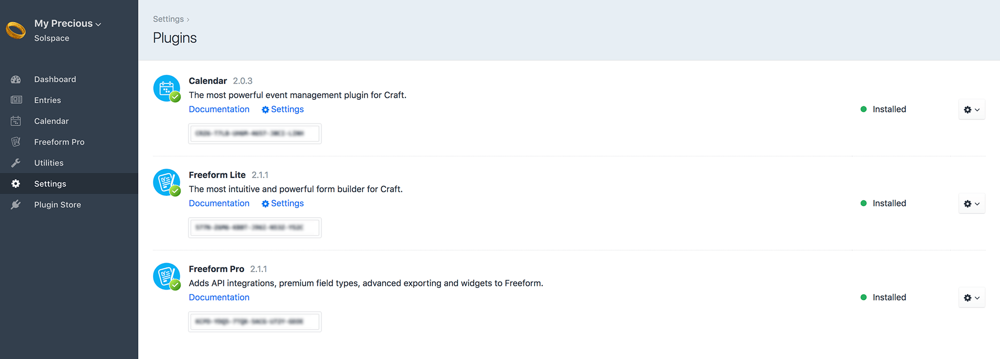
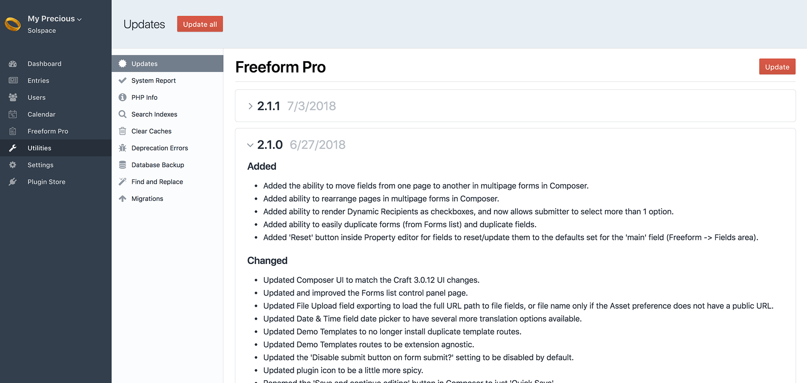
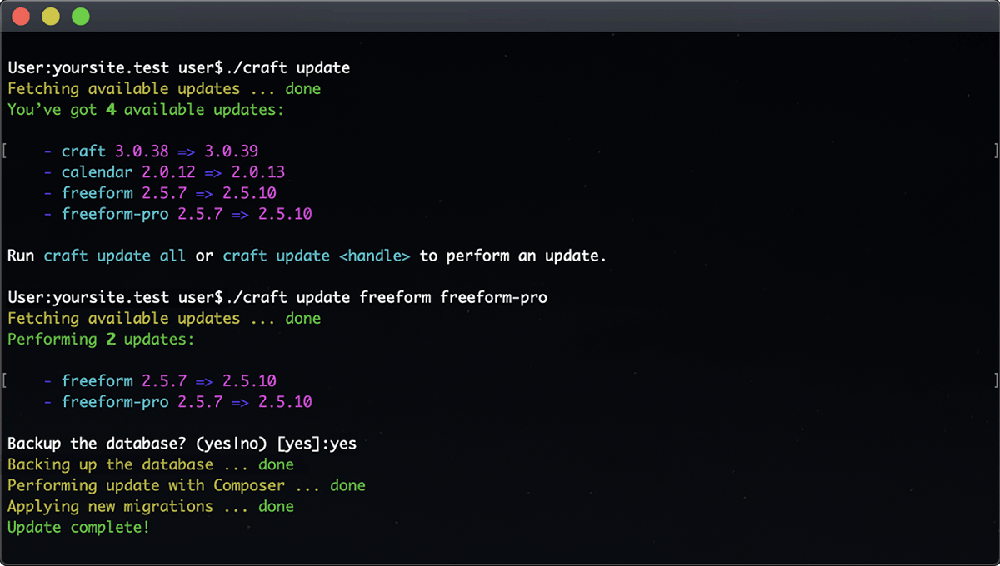
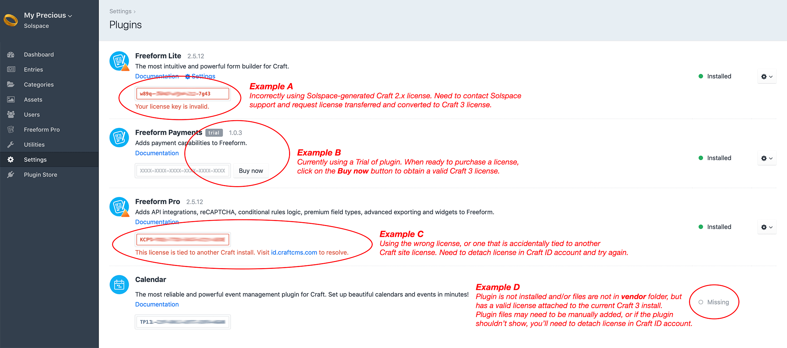

::: version /craft/freeform/v5/setup/installing-updating/
Freeform
:::

<div id="pr-heading">
    
    <span class="pr-name">Freeform</span>
    <span class="pr-category">for Craft</span>
    <div class="pr-v-wrapper">
        <div class="pr-v">
            <span class="pr-v-v">2.x</span>
            <span class="pr-v-type pr-retired">Retired</span>
            <span class="pr-v-arrow arrow down"></span>
        </div>
        <ul class="pr-v-list">
            <li><a href="/craft/freeform/v5/">5.x<span class="pr-v-type pr-latest">✓ Latest</span></a></li>
            <li><a href="/craft/freeform/v4/">4.x</a></li>
            <li><a href="/craft/freeform/v3/">3.x<span class="pr-v-type pr-retired">Retired</span></a></li>
            <li><a href="/craft/freeform/v2/">2.x<span class="pr-v-type pr-retired">Retired</span></a></li>
            <li><a href="/craft/freeform/v1/">1.x<span class="pr-v-type pr-retired">Retired</span></a></li>
        </ul>
    </div>
    <div class="pr-buy">
        <a href="https://plugins.craftcms.com/freeform" class="button button-blue"><span class="external-url">Plugin Store</span></a>
    </div>
</div>

<span class="page-section"></span>

# Installing & Updating

<div class="menu-grid">
    <a href="#requirements" class="menu-box">
        
        <div class="menu-grid-text">
            <h3>Requirements</h3>
            <p>Review the requirements for your site to run Freeform.</p>
        </div>
    </a>
    <a href="#installation" class="menu-box">
        
        <div class="menu-grid-text">
            <h3>Installation</h3>
            <p>Instructions for installing a new copy of Freeform.</p>
        </div>
    </a>
    <a href="#updating" class="menu-box">
        
        <div class="menu-grid-text">
            <h3>Updating</h3>
            <p>Instructions for updating from 2.x to newer versions of Freeform 2.x.</p>
        </div>
    </a>
    <a href="#purchasing" class="menu-box">
        
        <div class="menu-grid-text">
            <h3>Purchasing</h3>
            <p>Trialing, purchasing and troubleshooting license issues.</p>
        </div>
    </a>
    <a href="#troubleshooting" class="menu-box">
        
        <div class="menu-grid-text">
            <h3>Troubleshooting</h3>
            <p>Common problems encountered when purchasing / upgrading.</p>
        </div>
    </a>
</div>


[[toc]]


## Requirements
Solspace Freeform mostly meets the same requirements as listed on the [Craft Requirements](https://docs.craftcms.com/v3/requirements.html) page.

* **Craft 3.0.0 or later**
* PHP 7.0+
* MySQL 5.5+ (with InnoDB) or PostgreSQL 9.5+
* [BC Math](http://php.net/manual/en/book.bc.php) or [GMP](http://php.net/manual/en/book.gmp.php) PHP extensions (usually included in most server environments)
* Windows and OS X browsers:
	* Chrome 29 or later
	* Firefox 28 or later
	* Safari 9.0 or later
	* Internet Explorer 11 or later
	* Microsoft Edge

::: videolink https://craftquest.io/courses/managing-forms-with-solspace-freeform/5203
Watch the **Installing and Configuring Freeform** Course tutorial on CraftQuest!
:::

## Installation

### Install from the Control Panel

1. Go to the **Plugin Store** area inside your Craft control panel and search for *Freeform*.
2. Choose *Freeform Lite* and/or *Freeform Pro* (*Pro* requires *Lite* to be installed) by clicking on them.
3. Click on the **Try** button to install a [trial copy](#trialing) of Freeform.
4. Try things out and if Freeform is right for your site, [purchase a copy](#purchasing) of it through the Plugin Store when you're ready!
5. See [quick setup guide](#quick-setup) below.



### Installing from the Terminal
Freeform can also be installed manually through Composer:

1. Open your terminal and go to your Craft project: `cd /path/to/project`
2. Then tell Composer to require the plugin: `composer require solspace/craft3-freeform`
	* If you'd like **Freeform Pro**, also run: `composer require solspace/craft3-freeform-pro`
	* If you'd like **Freeform Payments**, also run: `composer require solspace/craft3-freeform-payments`
3. In the Craft control panel, go to *Settings → Plugins* and click the **Install** button for Freeform Lite (and Freeform Pro if you're using Pro edition).
4. Try things out and if Freeform is right for your site, [purchase a copy](#purchasing) of it through the Plugin Store when you're ready!
5. See [quick setup guide](#quick-setup) below.


## Quick Setup
Follow the steps below to quickly get Solspace Freeform setup in minutes.

1. Customize and configure Solspace Freeform settings by visiting the [Settings](./settings.md) page (**Freeform > Settings**).
2. Freeform ties into regular Craft User Group Permissions. Simply visit the Craft permissions page for the applicable user group(s) (**Settings > Users > User Groups**) to grant/edit/remove permissions to Freeform. See [Permissions](./permissions.md) documentation for more information.
3. Install the [Demo Templates](./demo-templates.md) (**Freeform > Settings > Demo Templates**) to get Freeform up and running on the front end with just a couple clicks!


## Updating
Updating is easy. Freeform uses the **Craft Updates Service**, which means that every time there's an update available, it'll show up in the *Updates* area (**Utilities** -> **Updates**) of the Craft control panel. You can then review the changelog there, or [view it here](./changelog.md).

### Updating from the Control Panel

1. Go to the Craft Updates area inside the control panel (**Utilities** -> **Updates**) and review the changelog for Freeform.
2. Simply click the **Update** button and Craft will do the rest.



::: warning
Due to a previous limitation in the Craft Plugin Store where it didn't yet allow for "toggling" of editions of plugins, Freeform 2.x will show two **Freeform Pro** plugins to update if you have the **Pro** edition of Freeform installed. Make sure both get updated.
:::

### Updating from the Terminal (recommended)
Craft 3.0.38+ / 3.1.4+ introduced an [*update* command](https://docs.craftcms.com/v3/updating.html#updating-from-the-terminal)...

1. Open your terminal and go to your Craft project: `cd /path/to/project`
2. To see available updates, run this command: `./craft update`
3. Follow the prompts, or run `./craft update freeform`
    - If you have *Freeform Pro*, be sure to update both at the same time by running `./craft update freeform freeform-pro`
    - To update to a specific version of Freeform, run `./craft update freeform:2.5.10`



### Updating with Composer from the Terminal
You can also update Freeform more manually if you like, using Composer (`composer update`). This may also be helpful in certain scenarios where you need to workaround an issue while updating.

1. Open your Craft site's main `composer.json` file and adjust the version number for the applicable plugin(s) ([see guide below](#understanding-versions-and-composer-update)).
2. Open your terminal and go to your Craft project: `cd /path/to/project`
3. To run any available updates for your site, run `composer update`
4. Proceed to Craft control panel and click the **Finish Updates** button if it shows.

#### Understanding versions and `composer update`
- For example, under the `"require"` area, change `"solspace/craft3-freeform": "2.3.0",` to `"solspace/craft3-freeform": "2.5.10",`.
- You can also use `~` and `^` to somewhat automate your updating process.
    - `1.0.0` - means exactly & only this version
    - `~1.0.0` - means this version & any _patch_ release (up to `1.0.99̅`)
    - `^1.0.0` - means this version & any _minor_ release (up to `1.99̅.99̅`)
        - Specifying `"solspace/craft3-freeform": "^2.0.0",` for example, would always get you the latest version of Freeform **2.x** (e.g. `2.5.11`), but never a next _major_ version of Freeform like **3.x**.

Your final `composer.json` file might have something like this:

```json{5-6}
"require": {
  "php": ">=7.0.0",
  "craftcms/cms": "^3.1.0",
  "vlucas/phpdotenv": "v2.4.0",
  "solspace/craft3-freeform": "^2.5.0",
  "solspace/craft3-freeform-pro": "^2.5.0",
  "solspace/craft3-freeform-payments": "~1.0.0",
  "solspace/craft3-calendar": "^2.0.0",
},
```

## Trialing & Purchasing

### Trialing
The great thing about Craft 3 is that it allows you to trial third party plugins to see if they're right for your needs. We recommend **trying** any commercial plugin first before buying it. You trial any plugin or Craft CMS itself by running your site from any domain [that Craft does not consider to be a public domain](https://craftcms.com/guides/how-craft-license-enforcement-works). Common examples of domains that would work include:
  - localhost
  - 127.0.0.1
  - mysite.test
  - testing.mysite.com
  - mysite.yolo
  - mysite.com:1234
  - mysite.test

Go to **Plugin Store** area of your Craft 3 control panel and browse for any plugins you may need. Take note of how many installs each plugin has and when they were last updated to give you insight into how popular and maintained they are. When you've found the plugin you like, you can either click the **Try** button in the Plugin Store, or follow the [Installing Instructions](#installing-instructions) above.

Users then have the option of purchasing a valid license for plugins either directly through the Craft 3 Control Panel, or via the [Craft Plugin Store website](https://plugins.craftcms.com).

### Purchasing
If this is your first time purchasing a third party plugin, here's an overview of the purchasing process of plugins:

1. Go to the Plugins section of your Craft 3 control panel (**Craft CP** -> **Settings** -> **Plugins**).
2. For the plugin(s) that need purchasing, click on the **Buy now** button to add it to your cart.
3. Proceed to purchasing the plugin directly inside your Craft 3 control panel. You can optionally pre-purchase renewal years as well if you think you're going to need updates and product support beyond the first year. You can also purchase renewals later on after expiry if you wish.
4. Once purchased, you'll receive a product license key(s) for the plugin(s). These product keys can also be accessed and managed later on in your [Craft ID account](https://id.craftcms.com) by visiting the **Plugins** area.
5. Paste your Craft 3 plugin license key (24 digits long, e.g. `X1X1-X1X1-X1X1-X1X1-X1X1-X1X1`) in the License field for the plugin (under **Craft CP** -> **Settings** -> **Plugins**). As soon as it's pasted, Craft will attempt to validate it (do not click anything else such as the *Buy now* button).
6. That's it! If you see any errors, please see [Troubleshooting documentation](#troubleshooting) below...

### Troubleshooting
Third party plugin licenses are managed and validated entirely by Craft. Some issues may require that you contact the Craft Team directly if issues persist. The following troubleshooting tips account for most common issues we've seen our customers report to us:

- ['This license is tied to another Craft install'](#this-license-is-tied-to-another-craft-install-example-c)
- ['Your license key is invalid'](#your-license-key-is-invalid-example-a)
- ['This license isn’t allowed to run version X.X.X.'](#this-license-isn’t-allowed-to-run-version-x-x-x)
- [Plugin shows it's 'Missing'](#plugin-shows-it-s-missing-example-d)



#### 'This license is tied to another Craft install' (Example C)
If you receive the error `This license is tied to another Craft install. Visit id.craftcms.com to resolve.`, it is indicating that the license is tied to another install of Craft CMS. This is likely because either you purchased this under a different domain or subdomain, or something glitched in the process of purchasing the license. Regardless of what happened here, this can likely be resolved by:

1. Visit your [Craft ID account](https://id.craftcms.com/).
2. Under **Licenses** -> **Plugins**, look for the *Freeform Lite* (or affected plugin) license in the list and confirm it's tied to the correct Craft CMS license. If not, click into the license (e.g. `CRZ6`) and click on the *Detach from this Craft license* button. This will release it from being attached to the wrong or orphaned Craft CMS license and allow you to enter it into the Craft install you're using.

If you are moving an existing site to a new non-public domain from a different local hostname, you will need to clear your data caches from the **Clear Caches** tool on the **Settings** page before Craft will realize that the hostname has changed.

#### 'Your license key is invalid' (Example A)
If you receive the error `Your license key is invalid.`, it is indicating that the license you've entered is not valid. It could be that you copy/pasted the license key wrong, or more likely it's that you're attempting to use an old Solspace-generated license of Freeform 1.x for Craft 2.x. These licenses are NOT the same. If you have an old Freeform 1.x for Craft 2.x license on a site you'd like to upgrade to Craft 3, or you accidentally purchased your Freeform 2.x license for Craft 3.x on the Solspace website, you'll need to contact us to request that we transfer your license over to the Craft Plugin Store, where a new and valid Craft 3 license will be generated.

For any Craft 2 licenses you'd like to transfer over to Craft 3, please [contact us](../support.md) and let us know the following info:

- Your Solspace.com account email address
- Plugin name & Solspace license key (listed together if you have more than 1 to transfer)
- Your [Craft ID account](https://id.craftcms.com/) email address

If upgrading from Craft 2 to Craft 3, it's worth reading our "[Everything you need to know about Solspace plugins & Craft 3](https://solspace.com/blog/everything-you-need-to-know-about-solspace-plugins-craft-3)" article.

#### 'This license isn’t allowed to run version X.X.X.'
If you receive the error `This license isn’t allowed to run version X.X.X.`, it is indicating that you're using a version of the plugin that your license isn't eligible for, which in almost all cases would be a plugin license that expired/finished the 1-year term since the initial purchase. According to Craft's policy (out of Solspace's control), once the plugin license has expired, the current version you have installed is the maximum version you can have. The rationale behind this (according to Craft) is that if, for example, you were using Freeform 2.3.1 at the time of expiry, but 2.5.4 was available to you just before the license expiry date, if that 2.5.4 version was available to you indefinitely, one might update to that version months or years later and experience issues while upgrading, which could generate issues and support requests to the developer beyond that initial 1 year term. This is a fair statement and concern on Craft's part, in our opinion. Craft does send out 30 day notices reminding customers of plugin licenses nearing expiry, so it would be wise to consider squeezing in your final update(s) earlier in that 30 day window if you do not wish to renew your license for future updates beyond the initial 1 year term.

>When a license expires, you can keep using the version that’s currently installed, however you won’t be able to update it to newer versions until you’ve renewed the license.

As for **_how_ this happened** in the first place, Craft's [CP updater](#updating-from-the-control-panel) and their recommended built-in [*update* command](#updating-from-the-terminal-recommended) feature will make sure that you never update to a plugin version you don't have access to. However, if you used [Composer](updating-with-composer-from-the-terminal) to update, it bypasses all of Craft's license validation and you can get yourself into the situation where you now have a version that your license shouldn't have access to, which then generates the error inside the Craft CP. The only way to resolve this would be reverting back to the previous version (which is not always recommended, as it's possible plugin update migration(s) could have taken place, and reverting could break your install), or renew your license. Please feel free to reach out to us for further clarification and assistance if you're in a bind with this, and we'll do the best we can to help.

#### Plugin shows it's 'Missing' (Example D)
If you have a plugin that shows as *Missing*, this is because you don't have the plugin installed and/or the plugin files are not in the Craft **vendor** folder, BUT you have a valid purchased Craft 3 license for the plugin tied to that Craft install. Depending on your scenario, you likely either have the issue of wanting the plugin to be available, or not wanting it to show up there.

If you purchased the plugin and are expecting it to show up for install, what likely happened is that Craft or your server environment glitched and didn't correctly add the plugin dependency (files) to your Craft site's **vendor** folder (but knows that you have a valid purchase of it). If this is the case, you'll need to follow the [Installation Instructions](#installing-instructions) documentation above to install the plugin.

If the above is not the case for you, and you don't want this license showing up in your Craft site, this can likely be resolved by:

1. Visit your [Craft ID account](https://id.craftcms.com/).
2. Under **Licenses** -> **Plugins**, look for the *Freeform Pro* (or affected plugin) license in the list and confirm it's tied to the correct Craft CMS license. If not, click into the license (e.g. `CRZ6`) and click on the *Detach from this Craft license* button. This will release it from being attached to the wrong or orphaned Craft CMS license, and later use it on the correct/different Craft install.
