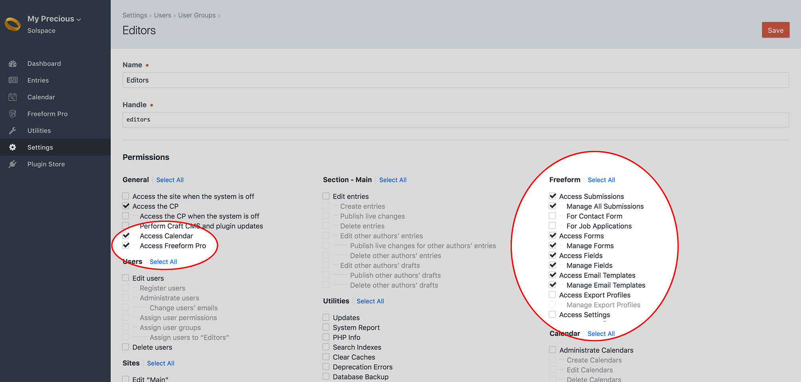

::: version /craft/freeform/v5/configuration/permissions/
Freeform
:::

    
    Freeform
    for Craft
    

        

            2.x
            Retired
            
        

        <ul class="pr-v-list">
            <li><a href="/craft/freeform/v5/">5.x✓ Latest</a></li>
            <li><a href="/craft/freeform/v4/">4.x</a></li>
            <li><a href="/craft/freeform/v3/">3.xRetired</a></li>
            <li><a href="/craft/freeform/v2/">2.xRetired</a></li>
            <li><a href="/craft/freeform/v1/">1.xRetired</a></li>
        </ul>
    

    

        <a href="https://plugins.craftcms.com/freeform" class="button button-blue">Plugin Store</a>
    

# Permissions

Solspace Freeform ties into regular Craft User Group Permissions. Simply visit the permissions page for the applicable user group(s) (**Settings > Users > User Groups**) to grant/edit/remove permissions to Solspace Freeform.

* **General**
	* *Access Freeform* - required for users to access Solspace Freeform at all.
* **Freeform**
	* *Access Dashboard* - access to the Freeform Dashboard page.
	* *Access Submissions* - access to the Submissions list page.
		* *Manage All Submissions* - can view, edit or delete any submission, regardless of per form selection below.
		* *For "MY FORM NAME"* - can view, edit or delete submissions for this form.
	* *Access Forms* - access to the Forms list page.
		* *Manage Forms* - can create, edit or delete forms.
	* *Access Fields* - access to the Fields list page.
		* *Manage Fields* - can create, edit or delete fields.
	* *Access Email Templates* - access to the Email Templates list page.
		* *Manage Email Templates* - can create, edit or delete email notification templates.
	* *Access Export Profiles* - access to the Export Profiles list page and running of exports.
		* *Manage Export Profiles* - can create, edit or delete export profiles.
	* *Access Settings* - can access and update settings area for Freeform as well as access [Error Log](./settings.md#error-log) page.
