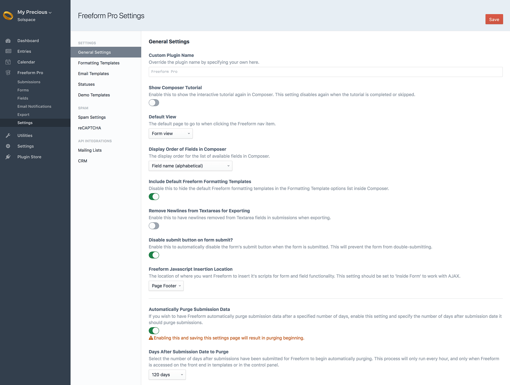
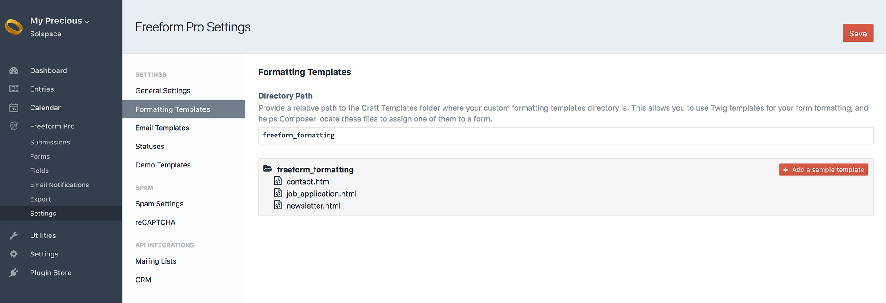
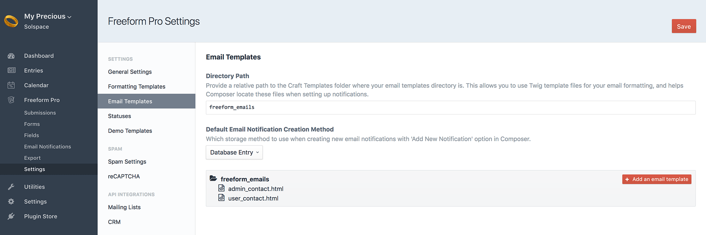
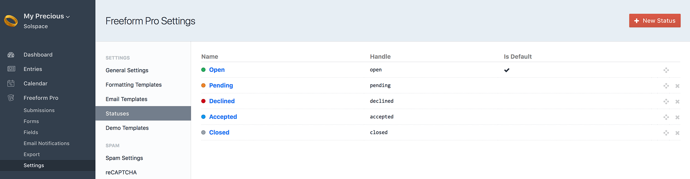
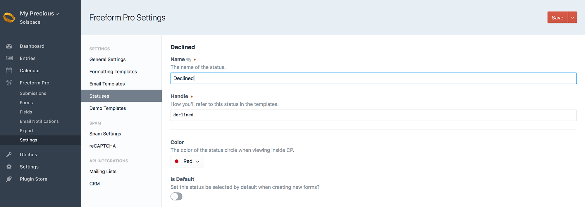
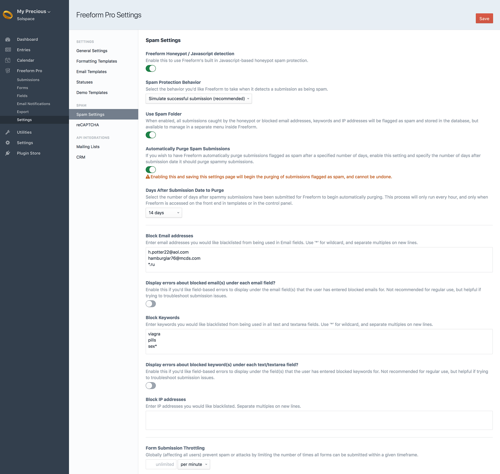
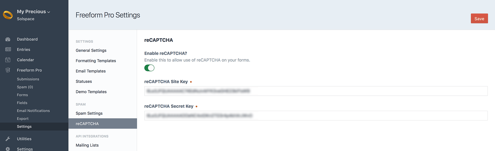
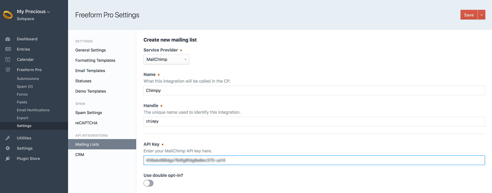
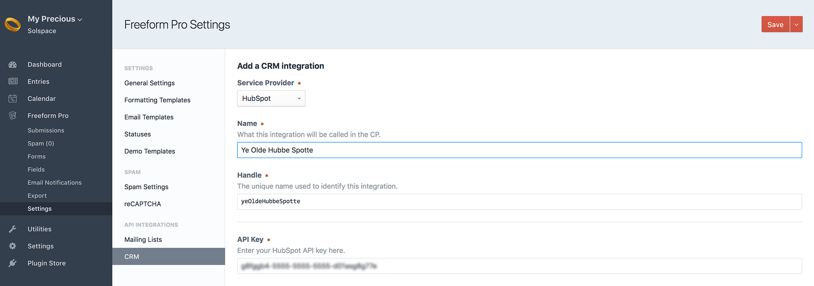
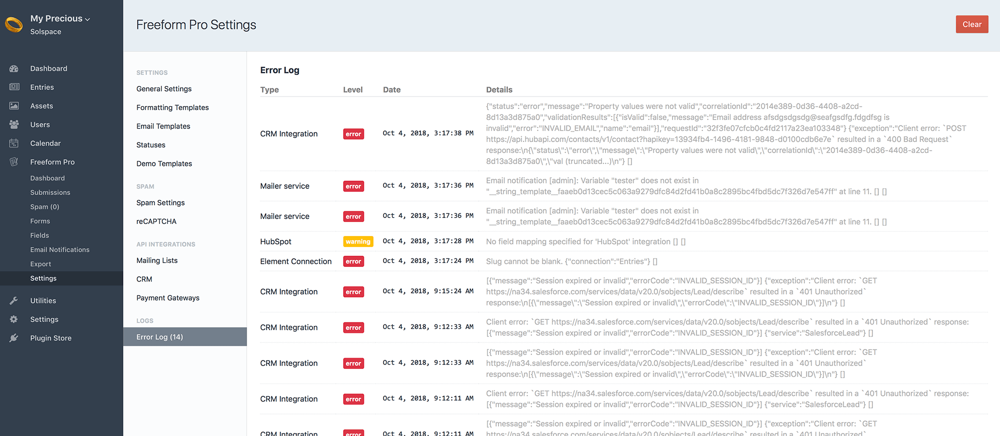

::: version /craft/freeform/v5/configuration/settings/
Freeform
:::

    
    Freeform
    for Craft
    

        

            2.x
            Retired
            
        

        <ul class="pr-v-list">
            <li><a href="/craft/freeform/v5/">5.x✓ Latest</a></li>
            <li><a href="/craft/freeform/v4/">4.x</a></li>
            <li><a href="/craft/freeform/v3/">3.xRetired</a></li>
            <li><a href="/craft/freeform/v2/">2.xRetired</a></li>
            <li><a href="/craft/freeform/v1/">1.xRetired</a></li>
        </ul>
    

    

        <a href="https://plugins.craftcms.com/freeform" class="button button-blue">Plugin Store</a>
    

# Plugin Settings

*Solspace Freeform* includes several settings that allow you to customize your form management experience. To adjust your settings, click the **Settings** menu item while in the Freeform plugin, or go to **Settings > Plugins > Freeform** and click the settings link.

::: videolink https://craftquest.io/courses/managing-forms-with-solspace-freeform/5203
Watch the **Installing and Configuring Freeform** Course tutorial on CraftQuest!
:::

If you wish to override these settings with a config file, please see the [Config Overrides](./config-overrides.md) documentation.

The settings allow you to adjust:

[[toc]]

## General Settings

* **Custom Plugin Name** <a href="#custom-name" id="custom-name" class="docs-anchor">#</a>
	* Override the plugin name by specifying your own here.
* **Show Composer Tutorial** <a href="#composer-tutorial" id="composer-tutorial" class="docs-anchor">#</a>
	* Enable this to show the interactive tutorial again in Composer. This setting disables again when the tutorial is completed or skipped.
* **Default view** <a href="#default-view" id="default-view" class="docs-anchor">#</a>
	* This setting allows you to specify which Freeform page should be loaded by default when clicking the Freeform navigation link.
	* Options are:
		* Dashboard (default)
		* Forms
		* Submissions
* **Display Order of Fields in Composer** <a href="#composer-display-order" id="composer-display-order" class="docs-anchor">#</a>
	* The display order for the list of available fields in Composer:
		* **Field type, Field name (alphabetical)**
		* **Field name (alphabetical)**
* **Render HTML inside Composer & Submissions view?** <Badge type="feature" text="2.5.0+" /> <a href="#composer-render-html" id="composer-render-html" class="docs-anchor">#</a>
	* Live rendering HTML in HTML blocks, field labels and option labels inside the Composer interface can sometimes conflict with Freeform's display of the form preview inside the control panel. In cases like these, you'll need to disable this setting to prevent HTML from rendering automatically.
* **Include Default Freeform Formatting Templates** <a href="#include-default-templates" id="include-default-templates" class="docs-anchor">#</a>
	* Disable this to hide the default Freeform formatting templates in the Formatting Template options list inside Composer.
* **Remove Newlines from Textareas for Exporting** <a href="#remove-newlines-exporting" id="remove-newlines-exporting" class="docs-anchor">#</a>
	* Enable this to have newlines removed from Textarea fields in submissions when exporting.
* **Disable Submit Button on Form Submit?** <a href="#disable-submit" id="disable-submit" class="docs-anchor">#</a>
	* Enable this to automatically disable the form's submit button when the user submits the form. This will prevent the form from double-submitting.
* **Automatically Scroll to Form on Errors and Multipage forms?** <a href="#auto-scroll" id="auto-scroll" class="docs-anchor">#</a>
  * Enable this to have Freeform use JS to automatically scroll the page down to the form upon submit when there are errors or the form is continuing to the next page in multipage forms.
* **Freeform Javascript Insertion Location** <a href="#scripts-location" id="scripts-location" class="docs-anchor">#</a>
	* The location of where you want Freeform to insert it's scripts for form and field functionality (such as spam protection and advanced field types). This setting should be set to **Inside Form** to work with AJAX.
		* **Page Footer**
		* **Inside Form**
* **Automatically Purge Submission Data** <Badge type="feature" text="2.0.1+" /> <a href="#auto-purge-data" id="auto-purge-data" class="docs-anchor">#</a>
	* If you wish to have Freeform automatically purge submission data after a specified number of days, enable this setting and specify the number of days after submission date it should purge submissions.
		* **WARNING:** Enabling this and saving this settings page will result in purging beginning.
		* **Days After Submission Date to Purge**
			* Select the number of days after submissions have been submitted for Freeform to begin automatically purging. This process will only run every hour, and only when Freeform is accessed on the front end in templates or in the control panel.

## Formatting Templates

* **Directory Path** <a href="#formatting-directory-path" id="formatting-directory-path" class="docs-anchor">#</a>
	* When using custom formatting templates for your forms, you'll need to specify where your Twig-based templates are stored.
	* Provide a relative path to craft root to your custom form templates directory.
		* E.g. **templates/freeform**
	* To add a starter example template, click the "Add a sample template" button, and then edit the template after.

## Email Templates

* This area is for users that wish to use Twig-based HTML template files for email notifications. See [Email Notifications](../overview/email-notifications.md) documentation for more information about implementation.
* **Directory Path** <a href="#email-directory-path" id="email-directory-path" class="docs-anchor">#</a>
	* Provide a relative path to craft root to your custom form templates directory.
		* E.g. **templates/freeform_emails**
	* To add a starter example template, click the "Add a sample template" button, and then edit the template after.
* **Default Email Notification Creation Method** <a href="#default-email-method" id="default-email-method" class="docs-anchor">#</a>
	* Select which storage method to use when creating new email notifications with **Add New Notification** option in Composer.
		* **Database Entry** - Use CP-based database template editor.
		* **Template File** - Use Twig-based HTML template files.

## Statuses

* This area allows you to manage and create new statuses for your forms.
	* You can set the default status to be set for all forms here.

## Demo Templates

* Allows you to install the [Demo Templates](./demo-templates.md) to get Freeform up and running on the front end with just a couple clicks!

## Spam Settings

* **Freeform Honeypot / Javascript detection** <a href="#honeypot" id="honeypot" class="docs-anchor">#</a>
	* Freeform includes its own Javascript-based honeypot spam protection. This is enabled by default, but can be disabled here.
	* For more information, visit the [Spam Protection documentation](../overview/spam-protection.md).
* **Spam Protection Behavior** <a href="#spam-behavior" id="spam-behavior" class="docs-anchor">#</a>
	* Select the behavior you'd like Freeform to take when it detects a submission as being spam:
		* **Simulate successful submission** (recommended)
		* **Display error messages** (not recommended)
		* **Reload form**
* **Use Spam Folder** <a href="#spam-folder" id="spam-folder" class="docs-anchor">#</a>
	* When enabled, all submissions caught by the honeypot or blocked email addresses, keywords and IP addresses will be flagged as spam and stored in the database, but available to manage in a separate menu inside Freeform.
	* **Automatically Purge Spam Submissions** <Badge type="feature" text="2.0.1+" /> <a href="#auto-purge-spam" id="auto-purge-spam" class="docs-anchor">#</a>
		* If you wish to have Freeform automatically purge submissions flagged as spam after a specified number of days, enable this setting and specify the number of days after submission date it should purge spammy submissions.
			* **WARNING:** Enabling this and saving this settings page will begin the purging of submissions flagged as spam, and cannot be undone.
			* **Days After Submission Date to Purge**
				* Select the number of days after spammy submissions have been submitted for Freeform to begin automatically purging. This process will only run every hour, and only when Freeform is accessed on the front end in templates or in the control panel.
* **Block Email addresses** <a href="#block-email" id="block-email" class="docs-anchor">#</a>
	* Enter email addresses you would like blocked from being used in Email fields. Use `*` for wildcard, and separate multiples on new lines.
	* **Display errors about blocked email(s) under each email field?**
		* Enable this if you'd like field-based errors to display under the email field(s) that the user has entered blocked emails for. Not recommended for regular use, but helpful if trying to troubleshoot submission issues.
* **Block Keywords** <a href="#block-keywords" id="block-keywords" class="docs-anchor">#</a>
	* Enter keywords you would like blocked from being used in all text and textarea fields. Use `*` for wildcard, and separate multiples on new lines.
	* **Display errors about blocked keyword(s) under each text/textarea field?**
		* Enable this if you'd like field-based errors to display under the field(s) that the user has entered blocked keywords for. Not recommended for regular use, but helpful if trying to troubleshoot submission issues.
* **Block IP addresses** <a href="#block-ip" id="block-ip" class="docs-anchor">#</a>
	* Enter IP addresses you would like blocked. Separate multiples on new lines.
* **Form Submission Throttling** <a href="#throttling" id="throttling" class="docs-anchor">#</a>
	* Globally (affecting all users) prevent spam or attacks by limiting the number of times all forms can be submitted within a given timeframe.

## reCAPTCHA

* **Enable reCAPTCHA** <Badge type="pro" text="Pro" /> <a href="#enable-recaptcha" id="enable-recaptcha" class="docs-anchor">#</a>
	* Enable this setting and fill in the reCAPTCHA *Site Key* and *Secret Key* to enable reCAPTCHA for Freeform. Then, to add reCAPTCHA to your forms, open up and edit each form and drag over the **reCAPTCHA** special field anywhere you like into your form layout.
	* Visit [Google reCAPTCHA site](https://www.google.com/recaptcha) to register your site and get your *Site Key* and *Secret Key*.

## API Integrations

* *Mailing Lists* <Badge type="pro" text="Pro" /> <a href="#mailing-lists" id="mailing-lists" class="docs-anchor">#</a>
	* The Mailing Lists area allows you to manage your mailing list API integrations.
	* Mailing list integrations are set up here and are globally available to all forms, but are configured per form inside the Composer interface.
	* Included with *Lite* edition is access to connecting to the [Craft Campaign](https://craftcampaign.com) plugin.
	* To connect to a mailing list API, click the **New Mailing List Integration** at the top right.
		* View the [Mailing List API Integration](../api-integrations/mailing-list/README.md) documentation for more information about setting up and configuring.

* *CRM* <Badge type="pro" text="Pro" /> <a href="#crm" id="crm" class="docs-anchor">#</a>
	* The CRM area allows you to manage your CRM (Customer Relationship Management) API integrations.
	* CRM integrations are set up here and are globally available to all forms, but are configured per form inside the Composer interface.
	* To connect to a CRM API, click the **New CRM Integration** at the top right.
		* View the [CRM API Integration](../api-integrations/crm/README.md) documentation for more information about setting up and configuring.

## Error Log

In as many cases as possible, Freeform attempts to write errors and issues to its own error log. The file is physically located in the same place as the Craft logs (`/storage/logs/freeform.log`), but can be conveniently viewed inside the *Error Log* page inside Freeform Settings area (**Freeform** -> **Settings** -> **Error Log**). If there are no logged errors, the Error Log page will not show any errors, and you will likely not see the Freeform error log file.

