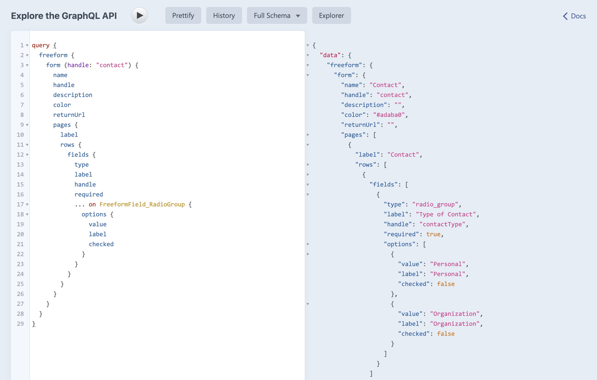

<meta property="og:image" content="https://docs.solspace.com/extras/social/craft/freeform/freeform.png" />

::: version /craft/freeform/v5/headless/graphql/
Freeform
:::

<div id="pr-heading">
    
    <span class="pr-name">Freeform</span>
    <span class="pr-category">for Craft</span>
    <div class="pr-v-wrapper">
        <div class="pr-v">
            <span class="pr-v-v">3.x</span>
            <span class="pr-v-type pr-retired">Retired</span>
            <span class="pr-v-arrow arrow down"></span>
        </div>
        <ul class="pr-v-list">
            <li><a href="/craft/freeform/v5/">5.x<span class="pr-v-type pr-latest">✓ Latest</span></a></li>
            <li><a href="/craft/freeform/v4/">4.x</a></li>
            <li><a href="/craft/freeform/v3/">3.x<span class="pr-v-type pr-retired">Retired</span></a></li>
            <li><a href="/craft/freeform/v2/">2.x<span class="pr-v-type pr-retired">Retired</span></a></li>
            <li><a href="/craft/freeform/v1/">1.x<span class="pr-v-type pr-retired">Retired</span></a></li>
        </ul>
    </div>
    <div class="pr-buy">
        <a href="https://plugins.craftcms.com/freeform" class="button button-blue"><span class="external-url">Plugin Store</span></a>
    </div>
</div>

<span class="page-section">Developer</span>

# GraphQL <Badge type="feature" text="3.10+" />

Freeform supports querying form layouts via GraphQL. This guide assumes you have some GraphQL experience. To learn more about GraphQL and Craft, please check out the [Fetch content with GraphQL](https://craftcms.com/docs/getting-started-tutorial/build/graphql.html) guide.




[[toc]]


<div class="content-block">

## Querying Freeform data

Freeform has a root `freeform` query, which contains all the possible queries nested inside it to avoid conflicts with other plugins.

</div>
<div class="content-block">

## Querying multiple Forms

To query all or some forms, you have to use the `forms` query:

```graphql{3}
query {
  freeform {
    forms {
      name
      handle
      pages {
        label
        rows {
          fields {
            id
            type
            label
            handle
            required
          }
        }
      }
    }
  }
}
```

Example response data:

```json
{
  "data": {
    "freeform": {
      "forms": [
        {
          "name": "My Form",
          "handle": "myForm",
          "pages": [
            {
              "label": "First Page",
              "rows": [
                {
                  "fields": [
                    {
                      "type": "text",
                      "label": "First Name",
                      "handle": "firstName",
                      "required": false
                    },
                    {
                      "type": "text",
                      "label": "Last Name",
                      "handle": "lastName",
                      "required": true
                    }
                  ]
                },
                {
                  "fields": [
                    {
                      "type": "submit",
                      "label": "Submit",
                      "handle": null,
                      "required": false
                    }
                  ]
                }
              ]
            }
          ]
        }
      ]
    }
  }
}
```

</div>
<div class="content-block">

## Querying a single Form

You can query a single form directly by using the `form` query:

```graphql{3}
query {
  freeform {
    form (handle: "my-form") {
      name
      handle
      pages {
        # ...
      }
    }
  }
}
```

Example response data:

```json
{
  "data": {
    "freeform": {
      "form": {
        "name": "My Form",
        "handle": "myForm",
        "pages": [
          {
            "label": "First Page",
            "rows": [
              {
                "fields": [
                  {
                    "type": "text",
                    "label": "First name",
                    "handle": "firstName",
                    "required": false
                  }
                ]
              }
            ]
          }
        ]
      }
    }
  }
}
```

</div>
<div class="content-block">

## Querying a form field on a Craft Entry

You can query an Entry form field by using the form field name in the query:
Assuming the form field's handle is `myFormFieldHandle` and the section is called `Blog`

```graphql{5-15}
query {
  entries {
    id
    title
    ...on blog_blog_Entry {
      myFormFieldHandle {
        id
        name
        fields {
          handle
          label
          type
        }
      }
    }
  }
}
```

Example response data:

```json
{
  "data": {
    "entries": [
      {
        "id": "226",
        "title": "Some Entry title",
        "myFormFieldHandle": {
          "id": 1,
          "name": "Simple Form",
          "fields": [
            {
              "handle": "firstName",
              "label": "First Name",
              "type": "text"
            },
            {
              "handle": null,
              "label": "Submit",
              "type": "submit"
            }
          ]
        }
      },
    ]
  }
}
```

</div>
<div class="content-block">

## Form Query Arguments

The following arguments are available when querying single or multiple forms:

| Argument  | Type       | Description                                          |
| --------- | ---------- | ---------------------------------------------------- |
| `id`      | `[int]`    | Narrow the queried forms by one or more form ID's    |
| `uid`     | `[string]` | Narrow the queried forms by one or more form UID's   |
| `handle`  | `[string]` | Narrow the queried forms by one or more form handles |
| `limit`   | `int`      | Limit the amount of returned form results            |
| `offset`  | `int`      | Offset the returned form results                     |
| `orderBy` | `string`   | Order the forms by a specific property               |
| `sort`    | `string`   | Sort by `asc` or `desc` order                        |

```graphql
query {
  freeform {
    # This is just an example
    # For `id`, `uid` and `handle` - you can either pass a single value 
    # or an array of values for each argument
    form (id: 1, handle: "test", limit: 1, offset: 2, orderBy: "name", sort: "desc") {
      id
    }
  }
}
```

</div>
<div class="content-block">

## Field Query Arguments

You can query fields by the following arguments:

| Argument | Type       | Description                                              |
| -------- | ---------- | -------------------------------------------------------- |
| `id`     | `[int]`    | Narrow the queried fields by one or more field's ID's    |
| `hash`   | `[string]` | Narrow the queried fields by one or more field's UID's   |
| `handle` | `[string]` | Narrow the queried fields by one or more field's handles |

```graphql
query {
  freeform {
    forms {
      # This is just an example
      # You can either pass a single value or an array of values for each argument
      fields (id: [1, 2, 3], handle: ["firstName", "lastName"], hash: "some-hash") {
        id
        handle
        hash
      }
    }
  }
}
```

</div>
<div class="content-block">

## Form Interface

These are the fields available for the `FormInterface`:

| Field                    | Type                                          | Description                                                                                                                                                   |
| ------------------------ | --------------------------------------------- | ------------------------------------------------------------------------------------------------------------------------------------------------------------- |
| `id`                     | `int`                                         | ID                                                                                                                                                            |
| `uid`                    | `string`                                      | UID                                                                                                                                                           |
| `name`                   | `string`                                      | Name                                                                                                                                                          |
| `handle`                 | `string`                                      | Handle                                                                                                                                                        |
| `hash`                   | `string`                                      | The form's hash needed to submit forms                                                                                                                        |
| `color`                  | `string`                                      | Color                                                                                                                                                         |
| `description`            | `string`                                      | Description                                                                                                                                                   |
| `returnUrl`              | `string`                                      | The specified return URL                                                                                                                                      |
| `storeData`              | `boolean`                                     | Are submissions being stored for this form                                                                                                                    |
| `submissionTitleFormat`  | `string`                                      | Title format used for new submission titles                                                                                                                   |
| `extraPostUrl`           | `string`                                      | An URL that will get a POST call with the submitted data                                                                                                      |
| `extraPostTriggerPhrase` | `string`                                      | A keyword or phrase Freeform should check for in the output of the POST URL to know if and when there’s an error to log, e.g. ‘error’ or ‘an error occurred’. |
| `ipCollectingEnabled`    | `boolean`                                     | Are the IP addresses being stored                                                                                                                             |
| `ajaxEnabled`            | `boolean`                                     | Is the ajax enabled for this form                                                                                                                             |
| `showSpinner`            | `boolean`                                     | Should the submit button show a spinner when submitting                                                                                                       |
| `showLoadingText`        | `boolean`                                     | Should the submit button change the button label while submitting                                                                                             |
| `loadingText`            | `string`                                      | The submit button loading label text                                                                                                                          |
| `recaptchaEnabled`       | `boolean`                                     | Should Captchas be enabled for this form                                                                                                                     |
| `defaultStatus`          | `int`                                         | The assigned default status ID of new submissions                                                                                                             |
| `formTemplate`           | `string`                                      | The assigned default formatting template                                                                                                                      |
| `gtmEnabled`             | `boolean`                                     | Is the Google Tag Manager enabled for this form?                                                                                                              |
| `gtmId`                  | `string`                                      | The Google Tag Manager ID                                                                                                                                     |
| `gtmEventName`           | `string`                                      | The name of the Event that will be added to Google Tag Manager's data layer                                                                                   |
| `honeypot`               | [`HoneypotInterface`](#honeypot-interface)    | A fresh honeypot instance                                                                                                                                     |
| `csrfToken`              | [`CsrfTokenInterface`](#csrf-token-interface) | A fresh csrf token                                                                                                                                            |
| `fields`                 | [`[FieldInterface]`](#field-interface)        | A list of Form's `Field`                                                                                                                                      |
| `pages`                  | [`[PageInterface]`](#page-interface)          | A list of Form's `Page` entities                                                                                                                              |

</div>
<div class="content-block">

## Field Interface

The base `FieldInterface` implemented by all field types. You can see specific Field Type fields [here](#field-types).

| Field                   | Type                                                | Description                              |
| ----------------------- | --------------------------------------------------- | ---------------------------------------- |
| `id`                    | `int`                                               | ID                                       |
| `type`                  | `string`                                            | Type                                     |
| `label`                 | `string`                                            | Label                                    |
| `hash`                  | `string`                                            | Genrated unique field hash               |
| `handle`                | `string`                                            | Handle                                   |
| `instruction`           | `string`                                            | Instructions                             |
| `required`              | `boolean`                                           | Is the field required                    |
| `pageIndex`             | `int`                                               | The page index this field is assigned to |
| `inputAttributes`       | [`[KeyValueMapInterface]`](#keyvaluemap-interaface) | Field's input attributes                 |
| `labelAttributes`       | [`[KeyValueMapInterface]`](#keyvaluemap-interaface) | Field's label attributes                 |
| `errorAttributes`       | [`[KeyValueMapInterface]`](#keyvaluemap-interaface) | Field's error attributes                 |
| `instructionAttributes` | [`[KeyValueMapInterface]`](#keyvaluemap-interaface) | Field's instruction attributes           |

</div>
<div class="content-block">

## Page Interface

Each page contains a list of [`RowInterface`](#row-interface) objects:

| Field   | Type                                | Description                      |
| ------- | ----------------------------------- | -------------------------------- |
| `index` | `int`                               | Index of the page                |
| `label` | `string`                            | Page's label                     |
| `rows`  | [`[RowInterface]`](#row-interaface) | A list of `RowInterface` objects |

</div>
<div class="content-block">

## Row Interaface

Each row contains a list of [fields](#field-interface):

| Field    | Type                                   | Description                          |
| -------- | -------------------------------------- | ------------------------------------ |
| `id`     | `string`                               | A unique hash generated for each row |
| `fields` | [`[FieldInterface]`](#field-interface) | A list of `FieldInterface` objects   |

</div>
<div class="content-block">

## Field Types

Here's a list of all Field Types and their specific fields:

### Text

| Field         | Type     | Description                                    |
| ------------- | -------- | ---------------------------------------------- |
| `value`       | `string` | The default value                              |
| `maxLength`   | `int`    | Maximum length of chars allowed for this field |
| `placeholder` | `string` | Input's placeholder attribute                  |

```graphql
fields {
  ... on FreeformField_Text {
    value
    maxLength
    placeholder
  }
}
```

### Textarea

| Field         | Type     | Description                                    |
| ------------- | -------- | ---------------------------------------------- |
| `value`       | `string` | The default value                              |
| `maxLength`   | `int`    | Maximum length of chars allowed for this field |
| `rows`        | `int`    | Number of rows shown for this textarea         |
| `placeholder` | `string` | Input's placeholder attribute                  |

```graphql
fields {
  ... on FreeformField_Textarea {
    value
    maxLength
    rows
    placeholder
  }
}
```

### Select

| Field     | Type                                     | Description          |
| --------- | ---------------------------------------- | -------------------- |
| `value`   | `string`                                 | The default value    |
| `options` | [`[OptionInterface]`](#option-interface) | The assigned options |

```graphql
fields {
  ... on FreeformField_Select {
    value
    options {
      value
      label
      checked
    }
  }
}
```

### Checkbox

| Field     | Type      | Description                               |
| --------- | --------- | ----------------------------------------- |
| `value`   | `string`  | The default value                         |
| `checked` | `boolean` | Should the checkbox be checked by default |

```graphql
fields {
  ... on FreeformField_Checkbox {
    value
    checked
  }
}
```

### Multi-Select

| Field     | Type                                     | Description          |
| --------- | ---------------------------------------- | -------------------- |
| `values`  | `[string]`                               | The default values   |
| `options` | [`[OptionInterface]`](#option-interface) | The assigned options |

```graphql
fields {
  ... on FreeformField_MultipleSelect {
    values
    options {
      value
      label
      checked
    }
  }
}
```

### Checkbox Group

| Field     | Type                                     | Description                           |
| --------- | ---------------------------------------- | ------------------------------------- |
| `values`  | `[string]`                               | The default values                    |
| `oneLine` | `boolean`                                | Should this be shown in a single line |
| `options` | [`[OptionInterface]`](#option-interface) | The assigned options                  |

```graphql
fields {
  ... on FreeformField_CheckboxGroup {
    values
    oneLine
    options {
      value
      label
      checked
    }
  }
}
```

### Radio Group

| Field     | Type                                     | Description          |
| --------- | ---------------------------------------- | -------------------- |
| `value`   | `string`                                 | The default value    |
| `options` | [`[OptionInterface]`](#option-interface) | The assigned options |

```graphql
fields {
  ... on FreeformField_RadioGroup {
    value
    options {
      value
      label
      checked
    }
  }
}
```

### Email

| Field            | Type     | Description                                  |
| ---------------- | -------- | -------------------------------------------- |
| `notificationId` | `string` | The ID or the filename of the email template |
| `placeholder`    | `string` | Input's placeholder attribute                |

```graphql
fields {
  ... on FreeformField_Email {
    notificationId
    placeholder
  }
}
```

### Dynamic Recipients

| Field              | Type                                     | Description                                               |
| ------------------ | ---------------------------------------- | --------------------------------------------------------- |
| `values`           | `[string]`                               | The default values                                        |
| `notificationId`   | `string`                                 | The ID or the filename of the email template              |
| `showAsRadio`      | `boolean`                                | Should the field be shown as a list of radio inputs       |
| `showAsCheckboxes` | `boolean`                                | Should the field be shown as a list of checkbox inputs    |
| `oneLine`          | `boolean`                                | Should radios or checkboxes be displayed in a single line |
| `options`          | [`[OptionInterface]`](#option-interface) | The assigned options                                      |

```graphql
fields {
  ... on FreeformField_DynamicRecipients {
    values
    notificationId
    showAsRadio
    showAsCheckboxes
    oneLine
    options {
      valuel
      label
      checked
    }
  }
}
```

### Number

| Field                | Type     | Description                   |
| -------------------- | -------- | ----------------------------- |
| `value`              | `string` | The default value             |
| `minLength`          | `int`    | Minimum length of the number  |
| `minValue`           | `int`    | Minimum value of the number   |
| `maxValue`           | `int`    | Maximum length of the number  |
| `decimalCount`       | `int`    | Number of decimals            |
| `decimalSeparator`   | `string` | The decimal separator         |
| `thousandsSeparator` | `string` | The thousands separator       |
| `allowNegative`      | `bool`   | Allow negative numbers        |
| `placeholder`        | `string` | Input's placeholder attribute |

```graphql
fields {
  ... on FreeformField_Number {
    value
    minLength
    minValue
    maxValue
    decimalCount
    decimalSeparator
    thousandsSeparator
    allowNegative
    placeholder
  }
}
```

### File

| Field           | Type       | Description                                 |
| --------------- | ---------- | ------------------------------------------- |
| `fileKinds`     | `[string]` | Allowed file kinds                          |
| `maxFileSizeKB` | `int`      | Maximum allowed filesize in KB              |
| `fileCount`     | `int`      | Number of allowed simultaneous file uploads |

```graphql
fields {
  ... on FreeformField_File {
    fileKinds
    maxFileSizeKB
    fileCount
  }
}
```

### Confirmation

| Field             | Type     | Description                                |
| ----------------- | -------- | ------------------------------------------ |
| `targetFieldHash` | `string` | Hash of the field that has to be confirmed |

```graphql
fields {
  ... on FreeformField_Confirmation {
    targetFieldHash
  }
}
```

### Date & Time

| Field                 | Type      | Description                                                     |
| --------------------- | --------- | --------------------------------------------------------------- |
| `value`               | `string`  | The default value                                               |
| `dateTimeType`        | `string`  | Type of the date field. ("date", "time", "both")                |
| `generatePlaceholder` | `boolean` | Should a placeholder be auto-generated for this field           |
| `dateOrder`           | `string`  | Order of the date chunks.                                       |
| `date4DigitYear`      | `boolean` | Determines if the year should be displayed with 4 digits or two |
| `dateLeadingZero`     | `boolean` | Determines if the dates should use a leading zero               |
| `dateSeparator`       | `string`  | Date separator                                                  |
| `clock24h`            | `boolean` | Should the clock use a 24h format                               |
| `clockSeparator`      | `string`  | Clock separator                                                 |
| `clockAMPMSeparate`   | `boolean` | Should the AM/PM be separated from the time by a space          |
| `useDatepicker`       | `boolean` | Should the built-in datepicker be used                          |
| `minDate`             | `string`  | Specifies the minimum allowed date that can be picked           |
| `maxDate`             | `string`  | Specifies the maximum allowed date that can be picked           |

```graphql
fields {
  ... on FreeformField_Datetime {
    value
    dateTimeType
    generatePlaceholder
    dateOrder
    date4DigitYear
    dateLeadingZero
    dateSeparator
    clock24h
    clockSeparator
    clockAMPMSeparate
    useDatepicker
    minDate
    maxDate
  }
}
```

### Opinion Scale

| Field     | Type                                     | Description                              |
| --------- | ---------------------------------------- | ---------------------------------------- |
| `value`   | `string`                                 | The default value                        |
| `legends` | `[string]`                               | A list of all the assigned Legends       |
| `scales`  | [`[ScalesInterface]`](#scales-interface) | The assigned [Scales](#scales-interface) |

```graphql
fields {
  ... on FreeformField_OpinionScale {
    value
    legends
    scales {
      value
      label
    }
  }
}
```

### Phone

| Field       | Type      | Description                                               |
| ----------- | --------- | --------------------------------------------------------- |
| `value`     | `string`  | The default value                                         |
| `pattern`   | `string`  | Phone number pattern                                      |
| `useJsMask` | `boolean` | Should the built-in pattern matcher javascript be enabled |

```graphql
fields {
  ... on FreeformField_Phone {
    value
    pattern
    useJsMask
  }
}
```

### Rating

| Field           | Type     | Description                                    |
| --------------- | -------- | ---------------------------------------------- |
| `value`         | `string` | The default value                              |
| `maxValue`      | `int`    | Phone number pattern                           |
| `colorIdle`     | `string` | Color of the unselected, unhovered rating star |
| `colorHover`    | `string` | Color of the hovered rating star               |
| `colorSelected` | `string` | Color of the selected rating star              |

```graphql
fields {
  ... on FreeformField_Rating {
    value
    maxValue
    colorIdle
    colorHover
    colorSelected
  }
}
```

### Regex

| Field     | Type     | Description                       |
| --------- | -------- | --------------------------------- |
| `value`   | `string` | The default value                 |
| `pattern` | `string` | Regex pattern                     |
| `message` | `string` | The error message to be displayed |

```graphql
fields {
  ... on FreeformField_Regex {
    value
    pattern
    message
  }
}
```

### Signature

| Field             | Type      | Description                                          |
| ----------------- | --------- | ---------------------------------------------------- |
| `width`           | `int`     | Width in pixels                                      |
| `height`          | `int`     | Height in pixels                                     |
| `showClearButton` | `boolean` | Determines if the "clear" button should be displayed |
| `borderColor`     | `string`  | Signature field border color                         |
| `backgroundColor` | `string`  | Signature field background color                     |
| `penColor`        | `string`  | Signature field pen color                            |
| `penDotSize`      | `float`   | The size of the pen dot                              |

```graphql
fields {
  ... on FreeformField_Signature {
    width
    height
    showClearButton
    borderColor
    backgroundColor
    penColor
    penDotSize
  }
}
```

### Table

| Field                | Type      | Description                                                    |
| -------------------- | --------- | -------------------------------------------------------------- |
| `useScript`          | `boolean` | Should the built-in javascript for handling table rows be used |
| `maxRows`            | `int`     | Number of maximum allowed rows this table can have             |
| `addButtonLabel`     | `boolean` | The label for the "add row" button                             |
| `addButtonMarkup`    | `string`  | Custom html for the "add row" button                           |
| `removeButtonLabel`  | `string`  | The label for the "delete row" button                          |
| `removeButtonMarkup` | `string`  | Custom html for the "delete row" button                        |
| `tableLayout`        | `string`  | JSON of the table layout                                       |

```graphql
fields {
  ... on FreeformField_Table {
    useScript
    maxRows
    addButtonLabel
    addButtonMarkup
    removeButtonLabel
    removeButtonMarkup
    tableLayout
  }
}
```

### Email Marketing

| Field    | Type      | Description                                       |
| -------- | --------- | ------------------------------------------------- |
| `hidden` | `boolean` | Should this field be a hidden field or a checkbox |

```graphql
fields {
  ... on FreeformField_MailingList {
    hidden
  }
}
```

### Submit

| Field         | Type      | Description                       |
| ------------- | --------- | --------------------------------- |
| `labelNext`   | `string`  | Label for the "next" button       |
| `labelPrev`   | `string`  | Label for the "previous" button   |
| `disablePrev` | `boolean` | Is the "previous" button disabled |
| `position`    | `string`  | Position of the buttons           |

```graphql
fields {
  ... on FreeformField_Submit {
    labelNext
    labelPrev
    disablePrev
    position
  }
}
```

</div>
<div class="content-block">

## Additional Interfaces

### Option Interface

| Field     | Type      | Description           |
| --------- | --------- | --------------------- |
| `value`   | `string`  | Option's value        |
| `label`   | `string`  | Option's label        |
| `checked` | `boolean` | Is the option checked |

### KeyValueMap Interface

| Field   | Type     | Description |
| ------- | -------- | ----------- |
| `key`   | `string` | Key name    |
| `value` | `string` | Value       |

### Scales Interface

| Field   | Type     | Description |
| ------- | -------- | ----------- |
| `value` | `string` | Value       |
| `label` | `string` | Label       |

### Honeypot Interface

| Field       | Type     | Description                    |
| ----------- | -------- | ------------------------------ |
| `name`      | `string` | Value                          |
| `hash`      | `string` | Hash                           |
| `timestamp` | `int`    | Timestamp of the creation date |

### CSRF Token Interface

| Field   | Type     | Description             |
| ------- | -------- | ----------------------- |
| `name`  | `string` | Name of the CSRF token  |
| `value` | `string` | Value of the CSRF token |

</div>
<div class="content-block">

## How to Render a Form
Below are the steps for being able to render your own form in the front-end using GraphQL data.

To be able to make a form submittable you will need several things:

* An `action` entry in the POST payload that points to `freeform/submit`.
* A `formHash` entry which you will have to retrieve from an endpoint you create.
* A `honeypot` entry if you're using the [Freeform Honeypot](../overview/spam-protection.md#freeform-honeypot).
* A `csrfToken` entry if you're using [Craft's CSRF tokens](https://craftcms.com/knowledge-base/enabling-csrf-protection).
* A `freeform_payload` entry if you're using `Encrypted Payload` as the session storage type.

To get a valid `formHash`, `honeypot` and `freeform_payload`, you will have to create an endpoint on your site.

If you're using **Twig**, here's how to return the data as JSON:

```twig
{# You can attach custom form properties #}
{# https://docs.solspace.com/craft/freeform/v3/template-functions/freeform.form.html#parameters #}


{{ form.json(formProperties) }}
```

If you're making your own endpoint via **PHP**, then you could do this in your controller action:

```php
// You can attach whatever form properties you would normally via twig
// https://docs.solspace.com/craft/freeform/v3/template-functions/freeform.form.html#parameters
$formProperties = [];

$formModel = Freeform::getInstance()->forms->getFormById(123);
$form = $formModel->getForm();

return $form->json($formProperties);
```

The JSON response looks like this:

```json
{
    "hash": "xxxxxxxx-xxxxxxxxx-xxxxxxxxxxxxxxxxxxxxxxxxxxxxxxxxxxxxx",
    "handle": "my-form-handle",
    "ajax": true,
    "disableSubmit": true,
    "disableReset": false,
    "showSpinner": false,
    "showLoadingText": false,
    "loadingText": "Loading...",
    "class": "",
    "method": "post",
    "enctype": "application\/x-www-form-urlencoded",
    "successMessage": "Form has been submitted successfully!",
    "errorMessage": "Sorry, there was an error submitting the form. Please try again.",
    "honeypot": {
        "name": "freeform_form_handle",
        "value": ""
    },
    // If using encrypted payloads:
    "freeform_payload": "xxxxxxxxxxxxxxxxxxxxxxxxxxxxxxxxxxxxxxxxxxxxxxx",
    "anchor": "xxxxxx-form-xxxxxxxx-xxxxxxxxx-xxxxxxxxxxxxxxxxxxxxxxxxxxxxxxxxxxxxx",
    "csrf": {
        "name": "CRAFT_CSRF_TOKEN",
        "token": "xxxxxxxxxxxxxxxxxxxxxxxxxxxxxxxxxxxxxxxxxxxxx"
    },
    "action": "freeform\/submit"
}
```

Then in your form building javascript code you would add the hidden inputs or attach this data to the POST payload. Below is a simple example just to give you an idea of what would have to happen:

```js
// Get the form in whatever way your framework allows you to
const form = document.getElementById('your-form-id');

// Retreive a fresh session data for a form
const formDataResponse = await axios.get('/your/endpoint');
const data = formDataResponse.data;

// Attach the inputs or add this data directly to FormData, depending on your flow
const action = document.createElement('input');
action.name = 'action';
action.value = data.action;
form.appendChild(action);

const hashInput = document.createElement('input');
hashInput.name = 'formHash';
hashInput.value = data.hash;
form.appendChild(hashInput);

const honeypot = document.createElement('input');
honeypot.name = data.honeypot.name;
honeypot.value = data.honeypot.value;
form.appendChild(honeypot);

const csrf = document.createElement('input');
csrf.name = data.csrf.name;
csrf.value = data.csrf.token;
form.appendChild(csrf);

// Then submit the form with this data to any front-end endpoint and Craft will take care
// of passing the form data to freeform via the `action` specified
```

</div>