<meta property="og:image" content="https://docs.solspace.com/extras/social/craft/freeform/freeform.png" />

::: version /craft/freeform/v5/forms/fields/
Freeform
:::

<div id="pr-heading">
    
    <span class="pr-name">Freeform</span>
    <span class="pr-category">for Craft</span>
    <div class="pr-v-wrapper">
        <div class="pr-v">
            <span class="pr-v-v">3.x</span>
            <span class="pr-v-type pr-retired">Retired</span>
            <span class="pr-v-arrow arrow down"></span>
        </div>
        <ul class="pr-v-list">
            <li><a href="/craft/freeform/v5/">5.x<span class="pr-v-type pr-latest">✓ Latest</span></a></li>
            <li><a href="/craft/freeform/v4/">4.x</a></li>
            <li><a href="/craft/freeform/v3/">3.x<span class="pr-v-type pr-retired">Retired</span></a></li>
            <li><a href="/craft/freeform/v2/">2.x<span class="pr-v-type pr-retired">Retired</span></a></li>
            <li><a href="/craft/freeform/v1/">1.x<span class="pr-v-type pr-retired">Retired</span></a></li>
        </ul>
    </div>
    <div class="pr-buy">
        <a href="https://plugins.craftcms.com/freeform" class="button button-blue"><span class="external-url">Plugin Store</span></a>
    </div>
</div>

<span class="page-section">Overview</span>

# Fields

Freeform features its own set of robust field types. Once created, fields are global and available to all forms, but they can also be overwritten per form. This means that you can have a **State** field full of USA state options on one form, then on another form add territories to the state options, and then on another form, relabel the field to be **Provinces** and change the values to contain Canadian provinces.

<div class="menu-grid">
    <a href="#field-types" class="menu-box">
        
        <div class="menu-grid-text">
            <h3>Field Types</h3>
            <p>The field types available in Freeform.</p>
        </div>
    </a>
    <a href="#special-field-types" class="menu-box">
        
        <div class="menu-grid-text">
            <h3>Special Field Types</h3>
            <p>Special field types available for use in your forms.</p>
        </div>
    </a>
    <a href="#populating-fields-with-elements-predefined-options" class="menu-box">
        
        <div class="menu-grid-text">
            <h3>Populating Field Options</h3>
            <p>With predefined data or other Craft Elements.</p>
        </div>
    </a>
</div>

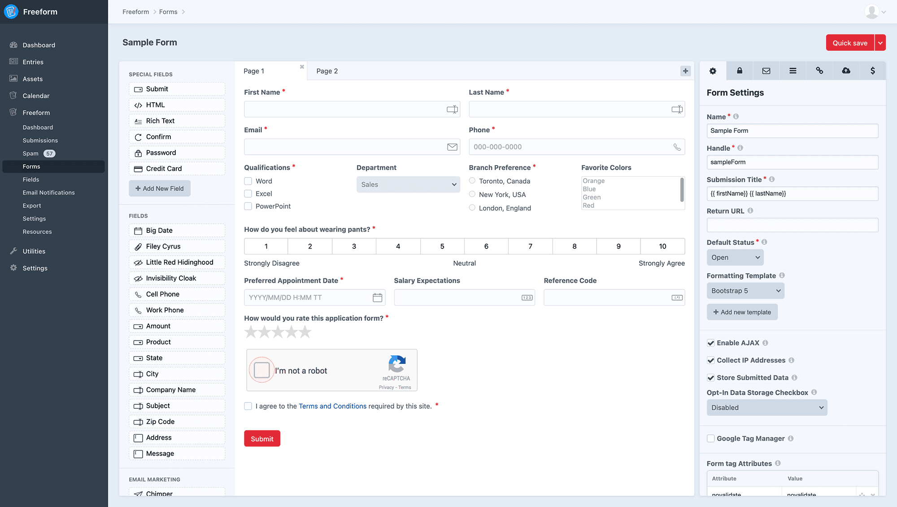


[[toc]]


</div>
<div class="content-block">

## Overview

### Important Notes
- Only Freeform's field types may be used in forms. Craft fields or custom field types are not supported at this time.
- Fields can be created and managed in the main field creation area (**Freeform > Fields > New Field**) and can also be created directly within the Form Builder interface as well. Fields created here are available globally as well (they do not just exist for that form).
- When the fields are edited at global level (in main Fields area of Freeform control panel), your customizations per form will NOT be lost.
- Once a field is created, you cannot change the field type after.
- All field properties can be overwritten at form level inside the Form Builder, including the field Handle.
- All fieldtypes conveniently include the ability to set attributes for their **labels**, **inputs**, **errors** and **instructions** directly inside the Form Builder property editor. 	- This allows you to keep your hands clean of being inside formatting templates and specify one-off exceptions for fields such as `readonly` and `autocomplete="off"`, etc.
	- To use single attributes like `novalidate`, just enter the attribute in the **Attribute** column and leave the **Value** column empty.
	- You can use anything inside the [Form](../template-objects/form.md) and [Field](../template-objects/field.md) objects as well, e.g.:
		- `field.id` to access Field ID.
		- `form.handle` to access form handle.

### Standard Settings
There is a standard number of settings available to all forms (with some exceptions). Every form field has the ability for you to do the following:

Setting | Description
--- | ---
**Reset** (button) | Pressing this will reset the field settings and values back to what is set in the defaults (**Freeform > Fields > New Field**).
**Handle** | How the field may be called in templates, if necessary. You may also override this value per form if you wish. Non-fields like HTML blocks will have a hash value that behaves the same as field handles.
**Label** | The label for the field. This can be changed per form if you wish.
**Required** | Mark if the field requires a value to submit the form successfully.
**Instructions** | Specify intructions for the field if you wish.
**Default Value** | For applicable fields, you can set a default value or selected option for the field.
**Placeholder** | Specify placeholder text for the field, if applicable.
**Maximum Length** | The maximum number of characters for the field's value.
**Attribute Editor** | Apply any kind of attribute on the input, label, error, instruction in Freeform's automated rendering of the form.

### Populating Field Options
All multi-option field types (such as Select, Checkboxes, etc) can have their option labels and values automatically populated with [Craft Elements or Pre-defined list options](#populating-fields-with-elements-predefined-options).

- [Applicable Field Types](#applicable-field-types)
- [Available Craft Elements](#available-craft-elements)
- [Available Predefined Options](#available-predefined-options)

### Field Types
Freeform contains a rich set of field types to handle just about every possible scenario you might get yourself into.

Field Type | Description | Lite | Pro
--- | --- | --- | ---
[Checkbox](#checkbox) | A single checkbox field | ✓ | <span class="orange">✓</span>
[Checkbox Group](#checkbox-group) | A group of checkboxes | ✓ | <span class="orange">✓</span>
[Date & Time](#date-time) | A complex date and/or time field | | <span class="orange">✓</span>
[Dynamic Recipients](#dynamic-recipients) | A select/radio/checkbox field that allows the form submitter to choose from a list of available protected email addresses | ✓ | <span class="orange">✓</span>
[Email](#email) | A text input field that includes additional email validation and possibility for attaching an email notification to it. | ✓ | <span class="orange">✓</span>
[File Upload](#file-upload) | A regular file upload field | ✓ | <span class="orange">✓</span>
[File Upload Drag & Drop](#file-upload-drag-drop) | An advanced premium javascript-based file uploading field | | <span class="orange">✓</span>
[Hidden](#hidden) | A single-line hidden input field | ✓ | <span class="orange">✓</span>
[Invisible](#invisible) | A field that allows you to collect hidden data in form submissions without a hidden field being present in the template source code | | <span class="orange">✓</span>
[Multiple Select](#multiple-select) | A multiple-select field | ✓ | <span class="orange">✓</span>
[Number](#number) | A single-line `number` type input field that is validated to contain certain numbers only | ✓ | <span class="orange">✓</span>
[Opinion Scale](#opinion-scale) | A special field that allows for flexible opinion scoring | | <span class="orange">✓</span>
[Phone](#phone) | A `tel` type input field that is validated to contain phone numbers only, based on a configured pattern | | <span class="orange">✓</span>
[Radio Group](#radio-group) | A group of radio options | ✓ | <span class="orange">✓</span>
[Rating](#rating) | A special field that allows for star ratings | | <span class="orange">✓</span>
[Regex](#regex) | An input field that is validated based on the specified regex pattern (e.g. `/^[a-zA-Z0-9]*$/`) | | <span class="orange">✓</span>
[Select](#select) | A select dropdown menu field | ✓ | <span class="orange">✓</span>
[Signature](#signature) | A field that allows users to handwrite signatures inside your form | | <span class="orange">✓</span>
[Table](#table) | A field that allows you to collect and handle repeating data | | <span class="orange">✓</span>
[Text](#text) | A single-line text input field | ✓ | <span class="orange">✓</span>
[Textarea](#textarea) | A multi-line text input field | ✓ | <span class="orange">✓</span>
[Website](#website) | A `url` type input field that checks to see if the URL specified has valid syntax | | <span class="orange">✓</span>

### Special Field Types
Special fields are ones that are not created, but serve a special purpose for your forms. Some of them may be reused as many times in the same form as you like.

Field Type | Description | Usage | Lite | Pro
--- | --- | --- | --- | ---
[Confirm](#confirm) | A text input field that targets another similar field and ensures the values match | Unlimited | | <span class="orange">✓</span>
[Credit Card](#credit-card) | A set of input fields to allow the validation of credit cards for Stripe Payment implementations | 1 per form | | <span class="orange">✓</span>
[HTML](#html) | A block that allows you to insert HTML into areas of your form | Unlimited | ✓ | <span class="orange">✓</span>
[Mailing List Checkbox](#mailing-list-checkbox) | A special checkbox to handle subcription to mailing lists when using Email Marketing integrations | Unlimited | | <span class="orange">✓</span>
[Password](#password) | A text input field that collects sensitive passwords but does not store them | Unlimited | | <span class="orange">✓</span>
[Captcha](#captcha) | A special field to handle spam verification when using the **reCAPTCHA** v2 Checkbox or **hCaptcha** Checkbox implementation | 1 per form | ✓ | <span class="orange">✓</span>
[Rich Text](#rich-text) | A block that allows you to insert rich text into areas of your form (headings, descriptions, etc) | Unlimited | | <span class="orange">✓</span>
[Save & Continue Later](#save-continue-later) | A special button that allows the user to save form progress and return later | 1 per page | | <span class="orange">✓</span>
[Submit](#submit) | A regular submit button for the form | 1 per page | ✓ | <span class="orange">✓</span>

</div>
<div class="content-block">

## Checkbox
A single checkbox field. The `field.type` property value is `checkbox` (for conditionals).


#### Form Builder Settings
- Specify a value (e.g. `y` or `yes`, etc).
	- Has a default value of **Yes**, which can be overwritten with any value you want. The front end however, will always display the value as `1`, but upon submission, the value will be switched to the one you have set.
- May be checked by default.

#### Templating Properties
- `options` (an array of option objects with `label` and `value` properties)

</div>
<div class="content-block">

## Checkbox Group
A group of checkboxes. The `field.type` property value is `checkbox_group` (for conditionals).


#### Form Builder Settings
- Can specify labels (with values assumed) or labels and values (that differ).
- Can be automatically populated with select [Craft Elements or Pre-defined list options](#populating-fields-with-elements-predefined-options).
- Can be rendered vertically or horizontally.

#### Templating Properties
- `options` (an array of option objects with `label` and `value` properties)

</div>
<div class="content-block">

## Date & Time <Badge type="pro" text="Pro" />
A complex date and/or time field. Can be used as Date only, Time only, or both. Many configuration and validation options available as well. The `field.type` property value is `datetime` (for conditionals).


#### Form Builder Settings
- May contain a default value.
	- You may use `now`, `today`, `5 days ago`, `2017-01-01 20:00:00`, etc, which will format the default value according to the chosen format as a localized value.
- The default Freeform datepicker can be disabled and you can load your own manually in the template if you wish.
	- Freeform will automatically insert javascript in the footer/inside form (depending on settings) of the page for this fieldtype.
- Choose to have your own placeholder or have Freeform generate a placeholder based on the settings below.
- Set the date order formatting you'd like:
	- year month day
	- month day year
	- day month year
- Select if the year should be displayed/validated as 4 digits.
- Select if the day and month numbers should have a leading `0` for single digit values (e.g. August will display as `08` instead of `8`).
- Choose the date separator character used between each year, month, day value:
	- None
	- Space (` `)
	- `/`
	- `-`
	- `.`
- Select if time and datepicker should use 24 hour clock.
- Choose the clock separator character used to separate hours and minutes:
	- None
	- Space (` `)
	- `:`
	- `-`
	- `.`
- Choose if placeholder should separate AM/PM with a space (for 12hr clock).
- Select the Min and Max dates for the date picker and validation (optional). Use static dates (e.g. `2018-11-01`, `2018-11-30`) or relative date strings (e.g. `-10 days`, `+3 months`).

#### Special Notes
- For **localization** reference:
	- The *Flatpickr* date picker will automatically localize according to the locale set for your site. Locales available are only 2-letter codes like `fr`, `de`, etc. In the event you're using a locale like `fr-CA` or `es-US`, etc, Freeform will just look at the first 2 letters and use that as the locale.
	- To translate the formatting syntax error message, be sure to translate the following strings:
		- `"{value}" does not conform to "{format}" format.`
		- To translate the `{format}` rendered value to match the current locale, be sure to also translate whatever the rendered string is in the error message. For example, if you're using `fr` locale, and wish to have the default English `DD/MM/YYYY` show up as `JJ/MM/AAAA`, create a static translation for this manually.
- To customize the date picker appearance and behavior, please see [Date Picker Events](../developer/datepicker.md) documentation.


#### Templating Properties
- `initialValue`
- `dateTimeType` (e.g. `both`)
- `generatePlaceholder` (e.g. `true`)
- `dateOrder` (e.g. `ymd`)
- `date4DigitYear` (e.g. `true`)
- `dateLeadingZero` (e.g. `true`)
- `dateSeparator` (e.g. `/`)
- `clock24h` (e.g. `false`)
- `clockSeparator` (e.g. `:`)
- `clockAMPMSeparate` (e.g. `true`)
- `useDatepicker` (e.g. `true`)
- `minDate` (e.g. `five weeks ago`)
- `maxDate` (e.g. `2024-12-31`)

</div>
<div class="content-block">

## Dynamic Recipients
A special field, displayable as a Select, Radio or Checkbox Group that contains protected email addresses and labels for each. The `field.type` property value is `dynamic_recipients` (for conditionals).


#### Form Builder Settings
- Can specify labels and email address values.
	- Multiple email addresses can be specified for each option, separated by commas.
	- Emails are never parsed in source code (they're replaced with **0**, **1**, **2**, etc).
		- When parsing this field semi-manually, be sure to use `loop.index0` to generate numeric values of options instead of `fieldName.value`.
	- To make the first option empty (when displaying as Select), set the first option having something like **Please select...** for the label, and leave option blank.
- Can be automatically populated with select [Craft Elements or Pre-defined list options](#populating-fields-with-elements-predefined-options). <Badge type="feature" text="3.2.3+" />
- Can be switched to display as Radio or Checkbox options at form level inside the Form Builder.
	- Can be rendered vertically or horizontally.
- Choose an email notification template to be used to send to the option(s) chosen.
	- Users can specify 1 or more recipient options at a time (when using as Checkboxes).
	- Users/groups need to have permissions access for **Email Notifications** to create new formatting templates inside the form builder.

#### Special Notes

- Can include more than 1 of this field type in your forms, allowing for multiple sets of recipients to be notified.
- When parsing this field semi-manually, be sure to use `loop.index0` to generate numeric values of options instead of `fieldName.value`.

::: tip
**Make sure that each option value is unique.**

If you're receiving duplicate or multiple email notifications from the Dynamic Recipients field, it's likely because you've specified more than one option with the same email address. This is a current limitation of Freeform, as it will perceive the user submitting all of the matching options at once, sending off emails as many times as there are duplicate options.

The only workarounds for this would be to either:
- Create an email address alias for each option so that each option in the Dynamic Recipients field type settings will be unique.
- Add sub-address tags to the affected email addresses so their values are unique. For example: `joe+whatever@example.com`, `joe+somethingelse@example.com`.
:::

#### Templating Properties
- `showAsRadio`
	- A boolean value. If `true` the dynamic recipients field should be rendered as radio buttons instead of a select field.
- `showAsCheckboxes`
	- A boolean value. If `true` the dynamic recipients field should be rendered as checkboxes instead of a select field.
- `notificationId`
	- The database ID of the assigned Email Notification Template.

</div>
<div class="content-block">

## Email
A single-line text input field that includes additional validation to expect a valid email address as well as the possibility for attaching an email notification to it. Pair this with the [Confirm](#confirm) special field type if you wish to have the user enter their email address twice. The `field.type` property value is `email` (for conditionals).


::: tip
It is required to use the **Email** field type if you wish for your users to receive an email notification when submitting the form and/or you're using an Email Marketing API integration.
:::

#### Form Builder Settings
- Optionally choose an email notification template to be used to send to the submitter of the form (or the email address entered in this field).
	- Users/groups need to have permissions access for **Email Notifications** to create new formatting templates inside the form builder.

#### Templating Properties
- `placeholder`
- `notificationId` (the ID of the assigned email notification template)

</div>
<div class="content-block">

## File Upload
A regular file upload field, using [Craft Assets](https://craftcms.com/docs/3.x/assets.html). The `field.type` property value is `file` (for conditionals).


#### Form Builder Settings
- Must have a [Craft Asset](https://craftcms.com/docs/3.x/assets.html) Source location where the file will be uploaded to.
	- Does NOT work with [Image Transforms](https://craftcms.com/docs/3.x/assets.html#image-transforms).
	- **Upload Location Subfolder** (optional) - the subfolder path that files should be uploaded to. May contain `form.handle` or `form.id` variables or something like `currentUser.id` for folders based on user ID's or `"now"|date("Y/m")` to dynamically generate folders based on dates as well.
- Define maximum file size (in KB). Default is 2048 KB (2MB). Is subject to:
	- Craft's [maxUploadFileSize](https://docs.craftcms.com/api/v3/craft-config-generalconfig.html#$maxUploadFileSize-detail) setting
	- PHP [memory_limit](http://us3.php.net/manual/en/ini.core.php#ini.memory-limit)
	- PHP [post_max_size](http://us3.php.net/manual/en/ini.core.php#ini.post-max-size)
	- PHP [upload_max_filesize](http://us3.php.net/manual/en/ini.core.php#ini.upload-max-filesize)
- Can allow a single file or multiple files to be uploaded.
	- Specify a number larger than `1` in the **File Count** setting to allow multiple files to be uploaded at the same time.
	- When collecting multiple files, a single input is still displayed, but allows multiple files to be uploaded  (applies `multiple` attribute to the single file upload input).
- Select which file types can be uploaded.
	- Leaving all options unchecked will allow ALL file types.

#### Special Notes

- In [multi-page forms](../overview/multi-page-forms.md), if an earlier page contains file upload field(s), files will actually be uploaded before the form is officially submitted.
	- If the form is never completed, incomplete submissions are stored for 3hrs, and then are removed (along with the files) after that.
- If you wish to allow more file extensions, you will need to add the [extraAllowedFileExtensions](https://craftcms.com/docs/3.x/config/config-settings.html#extraallowedfileextensions) (and possibly [extraFileKinds](https://craftcms.com/docs/3.x/config/config-settings.html#extrafilekinds)) config items to your Craft config file (`config/general.php`).
	- E.g. To add support for `.heic` image files, you can add the following to your `config/general.php` file:
		``` php
	    'extraAllowedFileExtensions' => 'heic',

        'extraFileKinds' => [
            'image' => [
                'extensions' => ['heic'],
            ],
        ],
		```
		- The `extraFileKinds` part will merge `heic` into the list of valid **Image** file types and treat it as such when you check off _Image_ in the **Allowed File Kinds** setting for the field inside the Freeform form builder. If you do not do this, be sure to uncheck all file types in the **Allowed File Kinds** settings.
	- E.g. To add an assortment of extra file extensions, you add the following to your `config/general.php` file:
		``` php
		'extraAllowedFileExtensions' => 'bim, dwg, rvt'`
		```
		- Then be sure to uncheck all file types in the **Allowed File Kinds** settings, unless you group these into a file kind group using the `extraFileKinds` setting shown above.
	::: warning
	If you're still getting a `Unknown file type` error, this is likely because Freeform also includes its own layer of file security checks (`/vendor/solspace/craft-freeform/packages/plugin/src/Library/Helpers/FileHelper.php`). You can modify this core file to get it working for you, but please contact us if there's a missing file extension/mime type that needs to be added to Freeform and we'll likely add support for it.
	:::
- If you're handling sensitive files, you may wish to choose an Asset volume without public URL's (**Assets in this volume have public URLs** toggle is off).

#### Templating Properties
- `fileKinds`
	- An array of allowed file kinds, e.g. `image`, `document`, `audio`, etc.
- `maxFileSizeKB`
	- The numeric representation of the upload limit in kilobytes.
- `fileCount`
	- The maximum number of allowed files to be uploaded.
	- A number larger than `1` will allow multiple files to be uploaded at the same time.

</div>
<div class="content-block">

## File Upload Drag & Drop <Badge type="pro" text="Pro" /> <Badge type="feature" text="3.12+" />
An advanced premium javascript-based file uploading field, using [Craft Assets](https://craftcms.com/docs/3.x/assets.html). The `field.type` property value is `file_drag_and_drop` (for conditionals).

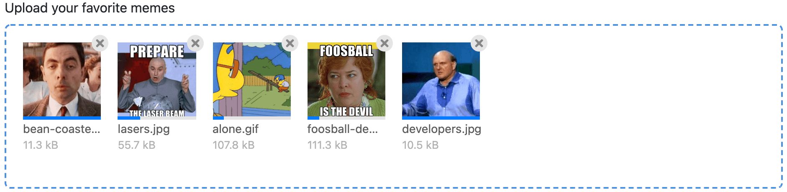

#### Form Builder Settings
- Can control the placeholder wording, e.g. `Drag and drop files here, or click to upload`.
- Choose a default style/theme, e.g. `Light` or `Dark`.
- Choose an accent color (this affects the default color for the field border and delete button).
- Must have a [Craft Asset](https://craftcms.com/docs/3.x/assets.html) Source location where the file will be uploaded to.
	- Does NOT work with [Image Transforms](https://craftcms.com/docs/3.x/assets.html#image-transforms).
	- **Upload Location Subfolder** (optional) - the subfolder path that files should be uploaded to. May contain `form.handle` or `form.id` variables or something like `currentUser.id` for folders based on user ID's or `"now"|date("Y/m")` to dynamically generate folders based on dates as well.
- Specify the number of files allowed to upload.
- Define maximum file size **per file** (in KB). Default is 2048 KB (2MB). Is subject to:
	- Craft's [maxUploadFileSize](https://docs.craftcms.com/api/v3/craft-config-generalconfig.html#$maxUploadFileSize-detail) setting
	- PHP [memory_limit](http://us3.php.net/manual/en/ini.core.php#ini.memory-limit)
	- PHP [post_max_size](http://us3.php.net/manual/en/ini.core.php#ini.post-max-size)
	- PHP [upload_max_filesize](http://us3.php.net/manual/en/ini.core.php#ini.upload-max-filesize)
- Select which file types can be uploaded.
	- Leaving all options unchecked will allow ALL file types.

#### Special Notes

- Unlike the regular [File Upload](#file-upload) field, the **File Upload Drag & Drop** field will remember files that have been uploaded to it regardless of the context: errors upon submission, [multi-page forms](../overview/multi-page-forms.md), returning to edit the submission later.
	- If the form is never completed, incomplete submissions are stored for 3hrs, and then are removed (along with the files) after that.
- While files are uploading, Freeform will disable the **Submit** button so that the form has time to finish uploading the files. If the form is submitted while files are still uploading, any that are incomplete will not be saved.
- If you wish to allow more file extensions, you will need to add the [extraAllowedFileExtensions](https://craftcms.com/docs/3.x/config/config-settings.html#extraallowedfileextensions) (and possibly [extraFileKinds](https://craftcms.com/docs/3.x/config/config-settings.html#extrafilekinds)) config items to your Craft config file (`config/general.php`).
	- E.g. To add support for `.heic` image files, you can add the following to your `config/general.php` file:
		``` php
	    'extraAllowedFileExtensions' => 'heic',

        'extraFileKinds' => [
            'image' => [
                'extensions' => ['heic'],
            ],
        ],
		```
		- The `extraFileKinds` part will merge `heic` into the list of valid **Image** file types and treat it as such when you check off _Image_ in the **Allowed File Kinds** setting for the field inside the Freeform form builder. If you do not do this, be sure to uncheck all file types in the **Allowed File Kinds** settings.
	- E.g. To add an assortment of extra file extensions, you add the following to your `config/general.php` file:
		``` php
		'extraAllowedFileExtensions' => 'bim, dwg, rvt'`
		```
		- Then be sure to uncheck all file types in the **Allowed File Kinds** settings, unless you group these into a file kind group using the `extraFileKinds` setting shown above.
	::: warning
	If you're still getting a `Unknown file type` error, this is likely because Freeform also includes its own layer of file security checks (`/vendor/solspace/craft-freeform/packages/plugin/src/Library/Helpers/FileHelper.php`). You can modify this core file to get it working for you, but please contact us if there's a missing file extension/mime type that needs to be added to Freeform and we'll likely add support for it.
	:::
- If you're handling sensitive files, you may wish to choose an Asset volume without public URL's (**Assets in this volume have public URLs** toggle is off). However, please note that image file thumbnails will only be present directly after initial upload. Afterward (error when submitting, multi-page forms, returning to edit) the image thumbnails will no longer be accessible to Freeform.

#### Templating Properties
- `fileKinds`
	- An array of allowed file kinds, e.g. `image`, `document`, `audio`, etc.
- `maxFileSizeKB`
	- The numeric representation of the upload limit in kilobytes.
- `fileCount`
	- The maximum number of allowed files to be uploaded.
	- A number larger than `1` will allow multiple files to be uploaded at the same time.

#### Customizing the Appearance
The form builder includes some options for controlling basic styling, but you can also customize the appearance of the Drag and Drop File Upload field by using your own CSS. To avoid name collision and have maximum flexibility, the CSS class names use [BEM](http://getbem.com/introduction/) methodology. You will also likely need to specify `!important` for each override to ensure it takes effect.

##### CLASS NAMES
Below is a list of all class names listed in SCSS:

```scss
.freeform-field-drag-and-drop {
  &__placeholder {}
  &__messages {}
  &__preview-zone {
    &__file-preview {
      &__filename {}
      &__filesize {}
      &__thumbnail {
        &__extension-label {}
        &__remove-button {}
        &__errors {}
        &__progress {}
      }
    }
  }
}
```

##### SCSS EXAMPLE
Below is an example with SCSS:

```scss
.freeform-field-drag-and-drop {
  background: blue;
  
  &__preview-zone {
    &__file-preview {
      border: 3px solid grey;
      
      &__thumbnail {
        border: 1px solid black;
        padding: 5px;
        
        &__remove-button {
          border-radius: 0;
        }
      }
    }
  }
}
```

##### CSS EXAMPLE
Below is an example with regular CSS:

``` css
.freeform-file-drag-and-drop {
	background: blue !important;
	border: 1px solid red !important;
}
.freeform-file-drag-and-drop__placeholder {
	font-size: 12px !important;
}
.freeform-file-drag-and-drop__preview-zone__file-preview__thumbnail {
	border: 3px solid yellow !important;
	}
.freeform-file-drag-and-drop__preview-zone__file-preview__thumbnail__remove-button {
	border-radius: 0 !important;
}
```

</div>
<div class="content-block">

## Hidden
A single-line hidden input field.

::: tip
Freeform will load fields of this type at the beginning of the form, regardless of where they are placed in the Form Builder layout.
:::

#### Form Builder Settings
- Can only include text strings at this time (no variables allowed).
	- If you need you pass a value to your hidden field dynamically, you can do so with the `overrideValues` parameter. Ex: `overrideValues: { myFieldName: myvalue }`

#### Templating Properties
- `placeholder`

</div>
<div class="content-block">

## Invisible <Badge type="pro" text="Pro" /> <Badge type="feature" text="3.5.0+" />
A field that allows you to collect hidden data in form submissions without a hidden field being present in the template source code. You might typically use this in conjunction with the `overrideValues` parameter to set a dynamic value into the field. It can also be given a hard coded value inside the Property Editor in the CP Form Builder interface while building your form.

</div>
<div class="content-block">

## Multiple Select
A multiple-select field. The `field.type` property value is `multiple_select` (for conditionals).

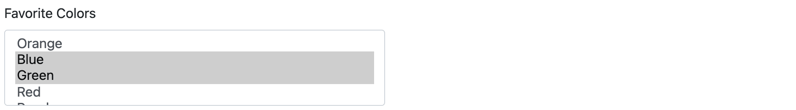

#### Form Builder Settings
- Can specify labels (with values assumed) or labels and values (that differ).
- Can be automatically populated with select [Craft Elements or Pre-defined list options](#populating-fields-with-elements-predefined-options).

#### Templating Properties
- `options` (an array of option objects with `label` and `value` properties)

</div>
<div class="content-block">

## Number
A single-line `number` type input field that is validated to contain certain numbers only. The `field.type` property value is `number` (for conditionals).


#### Form Builder Settings
- Choose if validation should allow negative numbers.
- Optionally set Min/Max values.
	- Both are optional, you can have both, just one or neither.
- Optionally set Min/Max character length.
	- Both are optional, you can have both, just one or neither.
- Optionally set the number of decimals allowed.
- Set the `step` number to set default increments when a user uses the browser up/down arrows to increase/decrease the value.

#### Templating Properties
- `placeholder`
- `minLength`
- `maxLength`
- `minValue`
- `maxValue`
- `decimalCount`
- `allowNegative` (e.g. `false`)
- `step`

</div>
<div class="content-block">

## Opinion Scale <Badge type="pro" text="Pro" /><Badge text="Surveys & Polls" type="addon" />
A special field that allows for flexible opinion scoring using Freeform's built in CSS. The `field.type` property value is `opinion_scale` (for conditionals). This field type is included automatically with the _Pro_ edition of Freeform or for _Lite_ users with the **Surveys & Polls** form type add-on.

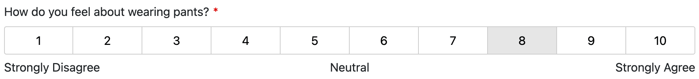

#### Form Builder Settings
- Set the field's option values and optional corresponding labels.
- Optionally add legends to correspond to with choice options (e.g. _Less Satisfied_, _More Satisfied_).

#### Templating Properties
- `scales`
- `legends`

To manually render an Opinion Scale field to use your own styles, your code might look something like this:

``` twig


<div style="border: 1px dashed gray; padding: 5px;">
	
		<ul>
			
				<li>
					<input type="radio" name="{{ field.handle }}"
							value="{{ scale.value }}"
							id="{{ field.idAttribute }}-{{ index }}"
							{{ field.value == scale.value ? "checked" }}
					/>
					<label for="{{ field.idAttribute }}-{{ index }}">
						{{ scale.label }}
					</label>
				</li>
			
		</ul>
	
	
		<ul>
			
				<li>{{ legend.legend }}</li>
			
		</ul>
	
</div>
```

</div>
<div class="content-block">

## Phone <Badge type="pro" text="Pro" />
A `tel` type input field that is validated to contain phone numbers only, based on a configured pattern. The `field.type` property value is `phone` (for conditionals).

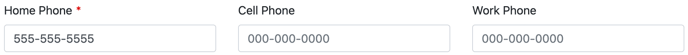

#### Form Builder Settings
- Set pattern to desired format, where `0` is a digit between `0` and `9`, e.g:
	- `(000) 000-0000`
	- `+0 0000 000000`
	- Check off *Use JS validation* checkbox to have Freeform include JS in the form that validates the format and auto-inserts the extra characters like `(`, `-`, `+` etc).

#### Templating Properties
- `placeholder`
- `pattern`

</div>
<div class="content-block">

## Radio Group
A group of radio options. The `field.type` property value is `radio_group` (for conditionals).


#### Form Builder Settings
- Can specify labels (with values assumed) or labels and values (that differ).
- Can be automatically populated with select [Craft Elements or Pre-defined list options](#populating-fields-with-elements-predefined-options).
- Can be rendered vertically or horizontally.

#### Templating Properties
- `options` (an array of option objects with `label` and `value` properties)

</div>
<div class="content-block">

## Rating <Badge type="pro" text="Pro" /><Badge text="Surveys & Polls" type="addon" />
A special field that allows for star ratings using Freeform's built-in CSS. The `field.type` property value is `rating` (for conditionals).
This field type is included automatically with the _Pro_ edition of Freeform or for _Lite_ users with the **Surveys & Polls** form type add-on.


#### Form Builder Settings
- Set the field's number of stars (`3`-`10`).
- Style the color of the stars for the _unselected_, _hover_ and _selected_ states.

#### Templating Properties
- `colorIdle` (e.g. `#ddd`)
- `colorHover` (e.g. `gold`)
- `colorSelected` (e.g. `#f70`)
- `maxValue` (e.g. `5`)

To manually render a Rating field using your own styles, your code might look something like this:

``` twig

	<label for="rating-{{ i }}">whatever {{ i }}</label>
	<input type="radio" id="rating-{{ i }}" value="{{ i }}" name="{{ field.handle }}">

```

</div>
<div class="content-block">

## Regex <Badge type="pro" text="Pro" />
An input field that is validated based on the specified regex pattern (e.g. `/^[a-zA-Z0-9]*$/`). The `field.type` property value is `regex` (for conditionals).

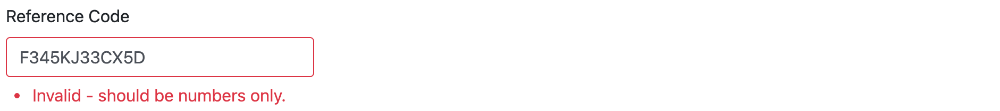

#### Form Builder Settings
- Specify a required pattern for values to match, e.g. `/^[a-zA-Z0-9]*$/`.
- Set the error message a user will see if an incorrect value is supplied.
	- Any occurrences of `{pattern}` will be replaced with specified regex pattern inside the error message, if any are found.

#### Special Notes
- When needing to use `{}` for attributes in **Regex** fields (such as `pattern`), you will need to specify them differently, as Freeform is built to allow Twig rendering and it'll choke. So for example, if you need to use `[0-9]{4,5}`, change it to:
``` twig
[0-9]{{ '{' }}4,5{{ '}' }}
```

#### Templating Properties
- `placeholder`
- `pattern`
- `message`

</div>
<div class="content-block">

## Select
A select dropdown menu field. The `field.type` property value is `select` (for conditionals).


#### Form Builder Settings
- Can specify labels (with values assumed) or labels and values (that differ).
	- To make the first option empty, use **labels and values** approach with the first option having something like **Please select...** for the label, and leave option blank.
- Can be automatically populated with select [Craft Elements or Pre-defined list options](#populating-fields-with-elements-predefined-options).

#### Templating Properties
- `options` (an array of option objects with `label` and `value` properties)

</div>
<div class="content-block">

## Signature <Badge type="pro" text="Pro" />  <Badge type="feature" text="3.4.0+" />
A field that allows users to handwrite signatures with their mouse inside your form. The `field.type` property value is `signature` (for conditionals).


#### Form Builder Settings
- Set the dimensions of the field writing/drawing area.
- Set the border and background colors.
- Set the pen dot size (in pixels) and the color.
- To include ability for a user to click a button to erase their signature and start over, check off the **Show 'Clear' button?** checkbox.

#### Special Notes
- Signatures are stored as an image datapoint value.
- Signatures can be downloaded as JPG or PNG files (from control panel).
- Signatures are excluded from regular exports and the `allFields` loop in email notification templates (since it would just hold an image datapoint value string).
- Signatures can be edited when the form is in edit mode.
- The _Clear_ button can be styled inside the Form Builder with **Input attributes** area inside the property editor.
- The Signature field, due to it's complexness, cannot easily be manually generated in a form, and is best done with render helpers, e.g. `field.render`.
- There's currently no way to make the signature pad area "responsive" (like setting it to 100% width), as this would be quite difficult to account for with the need to display the signature image in various places, etc.

</div>
<div class="content-block">

## Table <Badge type="pro" text="Pro" /> <Badge type="feature" text="3.5.0+" />
A field that allows you to collect and handle repeating data. The `field.type` property value is `table` (for conditionals).

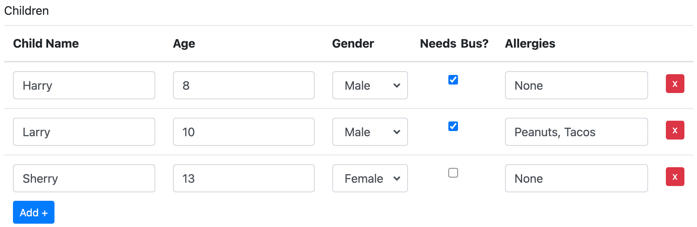

#### Form Builder Settings
- Use the Table Layout area to create columns for the table. Options are:
	- Text
	- Checkbox
		- When using _Checkbox_, specify a value you'd like to represent that checkbox when checked.
	- Select
		- When using _Select_, specify multiples separated by the `;` character, e.g. `apples;oranges:cherries`.
- Check off *Use built-in Table JS?* checkbox to have Freeform include JS in the form that validates the format and auto-inserts the extra characters like `(`, `-`, `+` etc).

#### Form Rendering

Here's how you can use `field.render` for an automated approach to render your Table field inside your formatting templates:

``` twig
{{ field.render({
   class: "table",
   addButtonLabel: "Add +",
   addButtonClass: "btn btn-sm btn-primary",
   removeButtonLabel: "x",
   removeButtonClass: "btn btn-sm btn-danger",
   tableTextInputClass: "form-control",
   tableSelectInputClass: "form-control",
   tableCheckboxInputClass: "form-check-input"
}) }}
```

For **manual** rendering of the Table field inside your form for full customizability, your code might look something like this:

``` twig
<table class="table">
    <thead>
    <tr>
    
        <th>{{ column.label }}</th>
    
    </tr>
    </thead>
    <tbody>
    
        <tr>
		
			
			<td>
			
				
					<select name="{{ colName }}">
					
						<option value="{{ option }}">{{ option }}</option>
					
					</select>
				
					<input type="checkbox" name="{{ colName }}" value="{{ column.value|default("Yes") }}" />
				
					<input type="text" name="{{ colName }}" value="{{ column.value|default("") }}" />
			
			</td>
		
        </tr>
    
        
            <tr>
			
				
				
				<td>
					
					
						<select name="{{ colName }}">
						
							<option value="{{ option }}"{{ option == colValue ? " selected" }}>{{ option }}</option>
						
						</select>
					
						<input type="checkbox" name="{{ colName }}" value="{{ column.value|default("Yes") }}" {{ colValue ? "checked" }} />
					
						<input type="text" name="{{ colName }}" value="{{ colValue }}" />
					
				</td>
			
            </tr>
        
    
    </tbody>
</table>
```

#### Submission Data

Here's how to render a Table field's data inside the [Submission object](../template-objects/submission.md):

``` twig
<table class="table">
    <thead>
        <tr>
        
            <th>{{ column.label|default("-") }}</th>
        
        </tr>
    </thead>
    <tbody>
    
        <tr>
        
            <td>{{ row[index] }}</td>
        
        </tr>
    
    </tbody>
</table>
```

A complete example might look like:

``` twig

    <td>
	
		<table class="table">
			<thead>
				<tr>
				
					<th>{{ column.label|default("-") }}</th>
				
				</tr>
			</thead>
			<tbody>
			
				<tr>
				
					<td>{{ row[index] }}</td>
				
				</tr>
			
			</tbody>
		</table>
	
		{{ submission[field.handle] }}
	
    </td>

```

</div>
<div class="content-block">

## Text
A single-line text input field. The `field.type` property value is `text` (for conditionals).

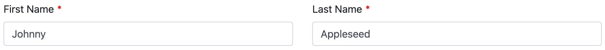

#### Templating Properties
- `placeholder`

</div>
<div class="content-block">

## Textarea
A multi-line text input field. The `field.type` property value is `textarea` (for conditionals).

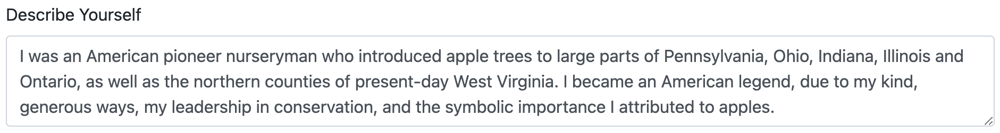

#### Form Builder Settings
- Can specify the number of rows the textarea should have.

#### Templating Properties
- `placeholder`

</div>
<div class="content-block">

## Website <Badge type="pro" text="Pro" />
A `url` type input field that checks to see if the URL specified has valid syntax (`http://`, `https://`, `ftp://`, etc). The `field.type` property value is `website` (for conditionals).


#### Templating Properties
- `placeholder`

</div>
<div class="content-block">

## Special Fields

Special fields are ones that either every form needs (such as Submit button), ones that assist in setting up form behaviors (such as Confirm and Password), and ones that aid in the layout and content of forms (such as the HTML block). None of these fields store any submission data in the database. The following special fields are available to use:


### Confirm <Badge type="pro" text="Pro" />
A special field type that allows you to force a user to enter a matching value for another text input field, including the [Password](#password) special fields (e.g. "Confirm Email Address", "Confirm Password"). This field does not store any data. It simply runs through Freeform's extra validation. The `field.type` property value is `confirmation` (for conditionals).

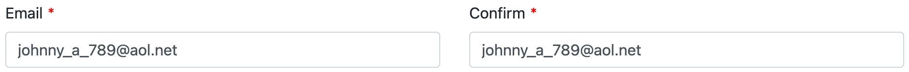

#### Form Builder Settings
- Choose a target field to validate against, e.g. **Email** field.
	- Available fields must be of text input type, but don't necessarily need to be of the [Text](#text) field type - you can use with [Email](#email) fields, [Password](#password) special fields, [Phone](#phone) fields, etc.

#### Templating Properties
- `placeholder`


### Credit Card <Badge type="pro" text="Pro" />
When a [Stripe Payments](../integrations/payments/README.md) integration is configured, a credit card special field type will become available. This is required for _Payments_-enabled forms to collect (but not store) credit card information. The `field.type` property value is `cc_details` (for conditionals).

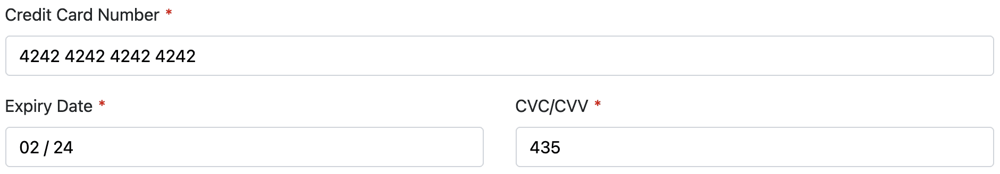

#### Form Builder Settings
- Choose a target field to validate against, e.g. **Email** field.
	- Available fields must be of text input type, but don't necessarily need to be of the [Text](#text) field type - you can use with [Email](#email) fields, [Password](#password) special fields, [Phone](#phone) fields, etc.

#### Templating Properties
- `placeholder`


### HTML
A special field type that allows you include HTML and Twig inside your form layout in the form builder. The `field.type` property value is `html` (for conditionals).

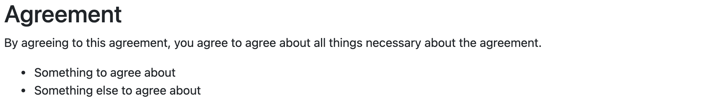

#### Special Notes
- The Property Editor will load an HTML area for you to type or paste your code into. You can also expand the editor into full mode.
- The Layout column in the form builder will live parse your HTML (Twig will not be parse inside the form builder).
- All HTML is allowed here.
- To enable Twig inside this field, turn on the [Allow Twig to be Enabled for each HTML block?](../setup/settings.md#allow-twig-to-be-enabled-for-each-html-block) setting (and decide if you need to enable to the **Render HTML block Twig in isolated mode?** setting as well). Then, you will see an **Allow Twig** checkbox in the property editor column. Check that to allow this HTML block to parse Twig code. <Badge type="feature" text="3.10+" />
- You can include as many of these in your form as you wish.


#### Displaying Submission Data from Previous Pages <Badge type="feature" text="3.10+" />
If you'd like to display submission data from previous pages, you can do this by using an HTML block field with Twig code that might look something like this:

``` twig
<ul>
    <li>Name: {{ form.get('firstName').value }} {{ form.get('lastName').value }}</li>
    <li>Email: {{ form.get('email').valueAsString }}</li>
    <li>Home Phone: {{ form.get('homePhone').value }}</li>
    <li>My Radio Field: {{ form.get('myRadioField').value }}</li>
</ul>
```


### Mailing List Checkbox <Badge type="pro" text="Pro" />
A special field type (located at the bottom left corner in the form builder) that allows you include a checkbox or hidden field inside your form layout in the form builder to connect your form to an [Email Marketing integration](../integrations/email-marketing/README.md). The `field.type` property value is `mailing_list` (for conditionals).


#### Form Builder Settings
- Email Marketing / Mailing list integrations appear as a checkbox that can be drag and dropped into the form builder interface (from the bottom left corner):
	- Can be displayed as a single checkbox, or set to be a hidden field (as an automatic opt-in when using specifically for mailing list signups).
	- If you want more than 1 mailing list, you can drag and drop another Mailing List field into your layout (but the checkboxes cannot be displayed as a group, unless you made some manual adjustments to the formatting template to simulate it).
- Label of the checkbox is customizable per form.
- Checkbox can be checked by default.
- You can specify the mailing list to be used for the mailing list integration.
- Your form must include an [Email](#email) field type, which must then be assigned to the **Target Email Field** setting.
- When available, the **Field Mapping** setting allows you to map Freeform fields to available mailing list integration fields.

#### Special Notes
- Email Marketing / Mailing list integrations are globally available to all forms, but are configured per form inside the Form Builder interface.
- Most - if not all - integrations attempt to map all available fields and custom fields, but some may have limitations if the API is too complex or doesn't allow it.

::: tip
While data is passed along to the Email Marketing provider, Freeform does not store whether or not Email Marketing fields were opted in, so CP submission views will not display whether or not the user subscribed.
:::


### Password <Badge type="pro" text="Pro" />
A special field type that allows you to securely collect a password from a submitter **but NOT store the value in the Freeform database** (typically used for [User Registration forms](../guides/user-registration-forms.md) via [Element Connections](../integrations/elements/README.md) feature). Pair this with the [Confirm](#confirm) special field type if you wish to have the user enter their password twice. The `field.type` property value is `password` (for conditionals).


#### Special Notes
- Collected data is not stored in Freeform anywhere, nor is it included in the Submission object or `allFields` variable in [email notifications](../overview/email-notifications.md#all-fields).
- When using with Users [Element Connections](../integrations/elements/) feature, the password will be passed off to Craft's [Users](https://craftcms.com/docs/3.x/users.html) member account feature.


### Captcha
A special field type that displays and handles the [reCAPTCHA](https://www.google.com/recaptcha) or [hCaptcha](https://www.hcaptcha.com) <Badge type="feature" text="3.12.9+" /> interaction with the user when the [Checkbox](../overview/spam-protection.md) option is enabled and configured for the website. Please note that reCAPTCHA v2 Invisible, reCAPTCHA v3 and hCaptcha Invisble do not require any addition of a special field to the form layout. Freeform will automatically apply that validation and take care of it. The `field.type` property value is `recaptcha` (for conditionals).


#### Special Notes
- See [Captchas documentation](../overview/spam-protection.md#captchas) for more information.

#### Templating
- When a _reCAPTCHA v2 Checkbox_ or _hCaptcha Checkbox_ field is placed into a form layout in the Freeform form builder, it will render automatically like the rest of your fields. However, if you're building a form manually, you'd call it like this: <Badge type="feature" text="3.10.4+" />
	``` twig
	
	{{ captcha.renderInput }}
	```
	- If using an earlier version of Freeform (**pre 3.10.4**), you'll need to use the Hash value for the _Captcha_ field in the Property Editor of the Form Builder, like this:
		``` twig
		
		{{ captcha.renderInput }}
		```
- If you're loading an entire form into a remote website page via AJAX, you'll need to load the reCAPTCHA JS yourself, since it's considered insecure otherwise and the browser blocks it. You should add this script tag anywhere on your page, preferably the footer:
	``` twig
	<script type="text/javascript" src="https://www.google.com/recaptcha/api.js?render=explicit"></script>
	```


### Rich Text <Badge type="pro" text="Pro" />
A special field type that allows you include rich text inside your form layout in the form builder. The `field.type` property value is `rich_text` (for conditionals).


#### Special Notes
- The Property Editor will load a Rich Text area for you to type into and style as necessary. You can also expand the editor into full mode.
- The Layout column in the form builder will live parse your content.
- You can include as many of these in your form as you wish.


### Save & Continue Later <Badge type="pro" text="Pro" /> <Badge type="feature" text="3.12+" />
A special field type that lets you place "save" button(s) inside your form layout in the form builder, allowing users to save their form progress and continue/complete the form later. For more information about this feature, please see the [Save & Continue Later documentation](./save-continue-later.md). The `field.type` property value is `save` (for conditionals).

#### Form Builder Settings
- Settings allow you to edit the button label.
- You may adjust the positioning of the submit button:
	- Aligned to Left
	- Aligned to Center
	- Aligned to Right
- A return URL must be configured. This is where the user should be returned to if they click the button.
    - Special `token` and `key` variables are available to include in the return path.
    - The return URL would be wherever you like, and fully customizable. This is where you'd include instructions to the user including a URL for where to return to complete the form later.
- You may optionally specify that an email notification be sent to the user if they click the **Save** button.
    - Choose a special Freeform email notification template.
    - The message of this email notification is completely customizable, but be sure to include instructions to the user including a URL for where to return to complete the form later.
    - Requires targeting of a [Email](./fields.md#email) field that will contain the user's email address in order to send the email notification.
        - If the user hasn't yet filled out an email address, the email notification attempt will be suppressed (as there is no field validation to ensure the Email field is fillout out). A good way around this would be to have the first page include basic info like _name_ and _email_ but no option to save the form until the second page.
- You may include 1 per page in your form.

#### Templating Properties
- `labelNext`
	- A label for the **Next** button. `Submit` by default.
- `labelPrev`
	- A label for the **Previous** button. `Previous` by default.
- `disablePrev`
	- A boolean value. If `true` the **Previous** button should not be rendered.


### Submit
A special field type that lets you place submit button(s) inside your form layout in the form builder. The `field.type` property value is `submit` (for conditionals).


#### Form Builder Settings
- Settings allow you to edit the button label(s).
- You may adjust the positioning of the submit button:
	- Aligned to Left
	- Aligned to Center
	- Aligned to Right
- When using with multi-page forms, Freeform will detect when you're on a page after first page, and provide you with additional options:
	- It will include a **Previous** button by default, allowing the user to go back to previous pages in the form.
		- The **Previous** button can be disabled.
	- Positioning options now include:
		- Apart at Left and Right
		- Together at Left
		- Together at Center
		- Together at Right
- You may include 1 per page in your form.

#### Special Notes
When manually building submit buttons in forms, be sure to include a `data-freeform-action` attribute to it. <Badge type="feature" text="3.12+" />

The attribute value differs between various types of submit buttons:
- For the regular submit button which advances forms forward, it's value has to be `submit`
- For the back buttons in multi-page forms, the value has to be `back`
- For the [Save & Continue Later](../overview/save-continue-later.md) buttons, the value has to be `save`

```html
  <button type="submit" data-freeform-action="submit">Submit</button>
  <button type="submit" data-freeform-action="back">Go Back</button>
  <button type="submit" data-freeform-action="save">Save & Continue Later</button>
```

#### Templating Properties
- `labelNext`
	- A label for the **Next** button. `Submit` by default.
- `labelPrev`
	- A label for the **Previous** button. `Previous` by default.
- `disablePrev`
	- A boolean value. If `true` the **Previous** button should not be rendered.

</div>
<div class="content-block">

## Populating Fields with Elements & Predefined Options
Inside the Form Builder (only), field types with options (such as _Select_, _Radio Group_, etc) have the ability to be automatically fed options from Craft Elements or Freeform's own predefined options. This allows you to quickly build forms by having fields auto-generated.

::: tip
For cases where you need more control over populating field options dynamically at template level, such as from a Craft Entry or some other Twig code in your template), please see this guide:
- **GUIDE:** [Populate Field Options at Template Level](../guides/populate-field-options-at-template-level.md)
:::

### Applicable Field Types
The following field types can be auto-populated:

* [Select](#select)
	* Optional **Empty Option Label** to have first option be something like `Please select...`
* [Multiple Select](#multiple-select)
* [Checkbox Group](#checkbox-group)
* [Radio Group](#radio-group)
* [Dynamic Recipients](#dynamic-recipients) (Elements only) <Badge type="feature" text="3.2.3+" />

### Available Craft Elements
The following Craft Elements can be fed to the above field types:

* **[Craft Entries](https://craftcms.com/docs/3.x/entries.html)**
	* **Target** sections or all sections.
	* **Option Label** and **Option Value** choices:
		* ID
		* Title
		* Slug
		* URI
		* Fields (simple values)
* **[Craft Users](https://craftcms.com/docs/3.x/users.html)**
	* **Target** user groups or all groups.
	* **Option Label** and **Option Value** choices:
		* ID
		* Username
		* Email
		* First Name
		* Last Name
		* Full Name
		* Fields (simple values)
* **[Craft Categories](https://craftcms.com/docs/3.x/categories.html)**
	* **Target** category groups or all groups.
	* **Option Label** and **Option Value** choices:
		* ID
		* Title
		* Slug
		* URI
		* Fields (simple values)
* **[Craft Tags](https://craftcms.com/docs/3.x/tags.html)**
	* **Target** tag groups or all groups.
	* **Option Label** and **Option Value** choices:
		* ID
		* Title
		* Slug
		* URI
		* Fields (simple values)
* **[Craft Assets](https://craftcms.com/docs/3.x/assets.html)**
	* **Target** product type or all product types.
	* **Option Label** and **Option Value** choices:
		* Filename
		* ID
		* Fields (simple values)
* **[Craft Commerce Products](https://craftcms.com/docs/commerce/3.x/products.html)** <Badge type="feature" text="3.9.0+" />
	* **Target** asset groups or all groups.
	* **Option Label** and **Option Value** choices:
		* ID
		* Title
		* Slug
		* URI
		* SKU
		* Price
		* Fields (simple values)

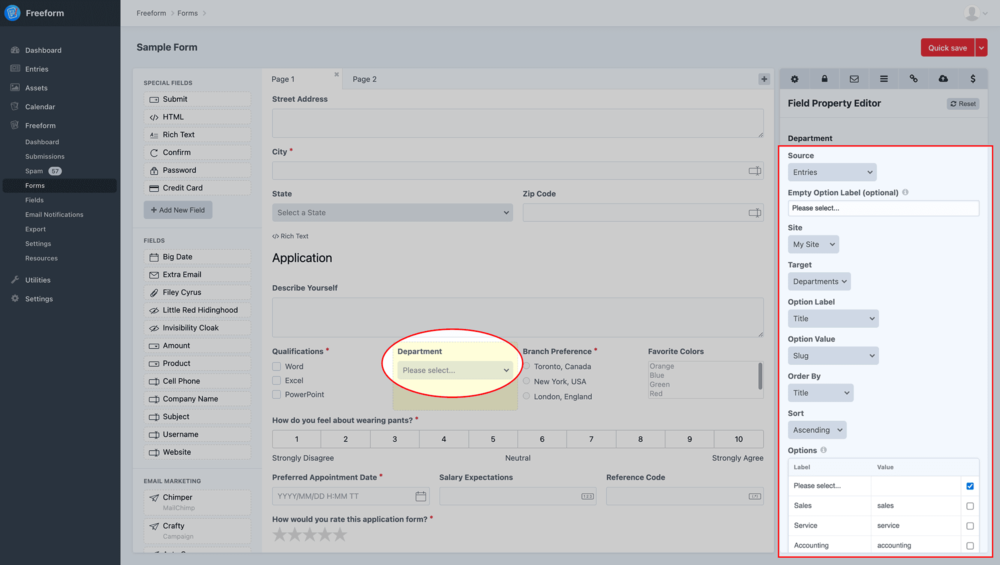

### Available Predefined Options
The following Freeform predefined options can be fed to the above field types:

* **States**
	* Official USA States
	* **Option Label** and **Option Value** choices:
		* Full
		* Abbreviated (upper case 2 letters)
* **States & Territories**
	* Official USA States and territories
	* **Option Label** and **Option Value** choices:
		* Full
		* Abbreviated (upper case 2 letters)
* **Canadian Provinces**
	* **Provinces - English**
		* Canadian Provinces and territories in English
	* **Provinces - French**
		* Canadian Provinces and territories in French
	* **Provinces - Bilingual**
		* Bilingual list of Canadian Provinces and territories
		* **Option Label** and **Option Value** choices:
			* Full
			* Abbreviated (upper case 2 letters)
* **Countries**
	* All world countries
	* **Option Label** and **Option Value** choices:
		* Full
		* Abbreviated (upper case 2 letters)
* **Languages**
	* All world languages
	* **Option Label** and **Option Value** choices:
		* Full
		* Abbreviated (lower case 2 letters)
* **Numbers** (range)
	* A custom range of numbers
	* **Range Start** and **Range End**
		* E.g. `60` - `65` would return list: `60, 61, 62, 63, 64, 65`
* **Years** (range)
	* A custom range of years
	* **Range Start** - number of years in PAST from current year
	* **Range End** - number of years in FUTURE from current year
		* E.g. `5` (start) - `0` (end) would return list: `2018, 2017, 2016, 2015, 2014, 2013`
	* **Sort Direction**:
		* Ascending
		* Descending
* **Months**
	* All 12 months of the year.
	* **Option Label** and **Option Value** choices:
		* Full, e.g. `September`
		* Abbreviated (Capitalized 3 letters), e.g. `Sep`
		* Single Number, e.g. `9`
		* 2-digit Number, e.g. `09`
* **Days**
	* List of days `1` to `31`.
	* **Option Label** and **Option Value** choices:
		* Single Number, e.g. `3`
		* 2-digit Number, e.g. `03`
* **Days of Week**
	* List of all days of week.
	* **Option Label** and **Option Value** choices:
		* Full, e.g. `Thursday`
		* Abbreviated (Capitalized 3 letters), e.g. `Thu`
		* Single Number, e.g. `4`

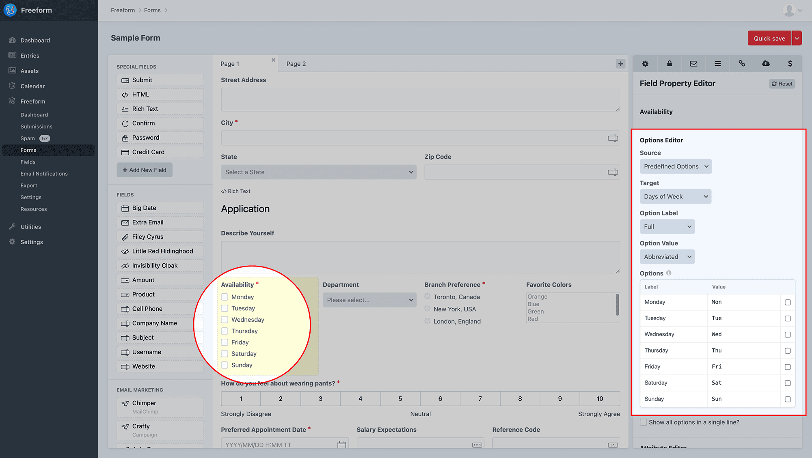

</div>