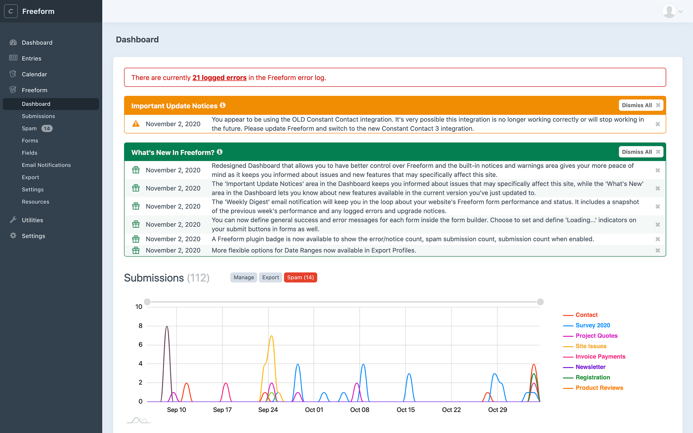

<meta property="og:image" content="https://docs.solspace.com/extras/social/craft/freeform/freeform.png" />

::: version /craft/freeform/v5/configuration/notices-alerts/
Freeform
:::

    
    Freeform
    for Craft
    

        

            3.x
            Retired
            
        

        <ul class="pr-v-list">
            <li><a href="/craft/freeform/v5/">5.x✓ Latest</a></li>
            <li><a href="/craft/freeform/v4/">4.x</a></li>
            <li><a href="/craft/freeform/v3/">3.xRetired</a></li>
            <li><a href="/craft/freeform/v2/">2.xRetired</a></li>
            <li><a href="/craft/freeform/v1/">1.xRetired</a></li>
        </ul>
    

    

        <a href="https://plugins.craftcms.com/freeform" class="button button-blue">Plugin Store</a>
    

Reliability

# Update Notices / What's New <Badge type="feature" text="3.9.0+" />

The _Important Update Notices_ area in the Dashboard keeps you informed about issues that may specifically affect your site, while the _What's New_ area in the Dashboard lets you know about new features available in the current version you've just updated to.

Paired with [Weekly Digest](./digest.md) email notifications, this is a powerful feature that allows you to run your site on auto-pilot. Every few hours, Freeform will check and see if there are any new updates available, pull the feed and then compare it against your current site environment and setup and only show you notices and warnings that apply specifically to that site. This will ensure you catch issues much sooner and minimize form issues.

[[toc]]

## Setup

To enable this feature, go to the **Freeform CP -> Settings -> Notices & Alerts** settings page. Toggle on the **Display Update Warnings & Notices** setting. This valuable feature is on by default.

To be provided with more tailored warnings and notices, please manually select any of the additional options in the **Additional Optional Checks** setting that may affect your site. Freeform's update notices check cannot detect template-level things or flows, so by selecting any of these options, Freeform will know to check against these as well and provide you with more robust warnings and alerts.

## How It Works

Every 3 hours, Freeform will check a simple JSON feed on the `api.solspace.com` server to see if there are any new items. If any updates are available, it will pull the feed, compare it against your current site environment and setup, and only show you notices and warnings that apply specifically to your site. As you review and address each issue, you can dismiss them and Freeform will not bother you about them again.

::: tip
We respect your privacy, so this feature only pulls update notices from the Solspace.com site and **does not and cannot send any information back**. Solspace collects **no** information at all. The comparison check happens on your Freeform site environment, not on the Solspace site. This feature can also be disabled in the plugin settings.
:::

Common types of notices you'll receive are:

- Warnings about recently fixed bugs that likely affect your install.
- Warnings about changes or improvements to features your site is likely using.
- Warnings about critical API integration changes and upgrades (e.g. Mailchimp discontinuing v2 of their API and requiring all users to switch to v3, which would be available in a newer release of Freeform).
- Critical security vulnerability bugs.
- Notices about significant new features that have been released in a newer version.

Included in this feature is the **What's New** area. This feature lets you know about new features available in the current version you've just updated to.

::: tip
Please note that this feature requires any site visitor visit your site in order for the cache (3hrs) and trigger to be refreshed. If for any reason your site receives no traffic at all for an extended period of time, this feature will not update as quickly as it could.
:::

