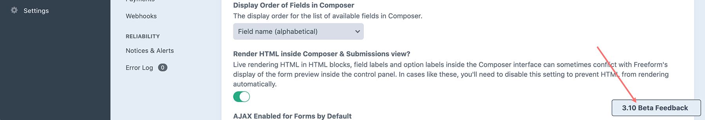

<meta property="og:image" content="https://docs.solspace.com/extras/social/craft/freeform/freeform.png" />

::: version /craft/freeform/v5/setup/betas/
Freeform
:::

<div id="pr-heading">
    
    <span class="pr-name">Freeform</span>
    <span class="pr-category">for Craft</span>
    <div class="pr-v-wrapper">
        <div class="pr-v">
            <span class="pr-v-v">3.x</span>
            <span class="pr-v-type pr-retired">Retired</span>
            <span class="pr-v-arrow arrow down"></span>
        </div>
        <ul class="pr-v-list">
            <li><a href="/craft/freeform/v5/">5.x<span class="pr-v-type pr-latest">✓ Latest</span></a></li>
            <li><a href="/craft/freeform/v4/">4.x</a></li>
            <li><a href="/craft/freeform/v3/">3.x<span class="pr-v-type pr-retired">Retired</span></a></li>
            <li><a href="/craft/freeform/v2/">2.x<span class="pr-v-type pr-retired">Retired</span></a></li>
            <li><a href="/craft/freeform/v1/">1.x<span class="pr-v-type pr-retired">Retired</span></a></li>
        </ul>
    </div>
    <div class="pr-buy">
        <a href="https://plugins.craftcms.com/freeform" class="button button-blue"><span class="external-url">Plugin Store</span></a>
    </div>
</div>

<span class="page-section">Setup</span>

# Beta Testing

As part of our commitment to developing and releasing reliable, stable software, we now put all minor feature releases through thorough beta testing.


[[toc]]


<div class="content-block">

## Current Beta

<h3 class="green">The Freeform 3.13 beta has finished and been released publicly.</h3>

<!--
**Stay tuned for the Freeform 3.13 beta...**

<h3>Current active beta: <i style="color:green;">Freeform 3.12</i></h3>
-->

If you wish to join future betas, please check out the instructions and guide below.

::: danger
While we carefully develop new features and put all of it through rigorous alpha and beta testing, we cannot guarantee that there will be no major issues in beta software. It's also possible that specific edge case scenarios may have been missed, etc. For this reason, we strongly advise you **not** to use beta versions in production environments.

**Before you proceed, please ensure the following:**

1. Make a copy of your site for local development testing.
2. Backup the database and database.
3. If this is an upgrade, carefully examine all aspects of your site and features after upgrading to ensure they're working correctly.
:::

</div>
<div class="content-block">

## Overview of Changes
The primary focus of Freeform 3.12 is to improve self-diagnostics, add support for a robust drag and drop file upload field as well as refine form processing to be even more robust, thus eventually allowing for the addition of more features and improvements (e.g. save and continue later, etc). A wide variety of other refinements have been or will be made to other areas of Freeform.

Here's an overview of the **key changes** in Freeform 3.12:

- Added new [_Drag & Drop File Upload_](../overview/fields.md#file-upload-drag-drop) field type.
- Added new [_Save & Continue Later_](../overview/save-continue-later.md) feature which allows your users to securely save their form progress and come back later to complete it.
- Overhauled form processing to allow for alternative session storage options including the new **Encrypted Payload** default as well as a database table approach.
- Added new self-diagnostics page to help troubleshoot issues and identify potential issues.
- Updated newly created Text, Hidden, Invisible, Phone, Regex, and Website field types from `VARCHAR` to `TEXT` in database. Changed all other newly created field types to be `VARCHAR(255)` instead of `VARCHAR(100)`. This is not a retroactive change - it will affect the creation of new fields only.
- Various minor additions and improvements.

</div>
<div class="content-block">

## Requirements
There are **no new** minimum server requirements for Freeform 3.12. It has the [same requirements as Freeform 3.11](./installing-updating.md#requirements).

</div>
<div class="content-block">

## Installation
Betas cannot be installed from the Craft control panel. They must be installed manually through Composer:

1. Open your terminal and go to your Craft project: `cd /path/to/project`
2. Then tell Composer to require v3.11 beta of the plugin: `composer require solspace/craft-freeform:^3.12.0-beta.4`
3. In the Craft control panel, go to *Settings → Plugins* and click the **Install** button for Freeform.
    * If you'd like to try out Freeform Pro, click on the *Lite / Trial* button beside the Freeform plugin name and inside the Plugin Store product page for Freeform, you can click on **Try** button for the *Pro* edition.

</div>
<div class="content-block">

## Updating
Betas cannot be updated from the Craft control panel. They must be updated manually through Composer:

1. Open your Craft site's main `composer.json` file.
2. Adjust the version number for `solspace/craft-freeform` to `^3.12.0-beta.4`
    - Your final `composer.json` file might have something like this:
    ```json{4}
    "require": {
      "craftcms/cms": "^3.7.0",
      "vlucas/phpdotenv": "v2.4.0",
      "solspace/craft-freeform": "^3.12.0-beta.4",
    },
    ```
3. Open your terminal and go to your Craft project: `cd /path/to/project`
4. To run any available updates for your site, run `composer update`
5. Proceed to Craft control panel and click the **Finish Updates** button if it shows.

::: tip
By specifying `^` before the version number (`^3.12.0-beta.4`), for future updates you can just run `composer update` and it'll grab the latest available version.
:::

</div>
<div class="content-block">

## Providing Feedback
We would greatly appreciate it if you are able to provide us with routine feedback throughout your testing and usage of the beta. Even if you aren't using any of the new features or changes, providing feedback allows us to get a better idea of how things are going for all kinds of websites.

To make this even easier, we've included a Beta Feedback widget that displays in the Freeform control panel. Just click a star rating (_5/5_ to indicate if everything is going well, or less if you are experiencing any issues) and if you have anything to clarify, fill in a quick note in the textarea and click submit. You can optionally include your email address, which will also help us get in touch with you to get more information about any issues and/or assist you as necessary.

Feel free to also just use a [Private Support Ticket](../support.html) or report an issue via [GitHub Issues](https://github.com/solspace/craft-freeform/issues).

::: tip
**This widget will only display during betas.** If you wish to disable it from displaying, add `FREEFORM_DISABLE_BETA_FEEDBACK_WIDGET=1` to your .ENV file.
:::




</div>
<div class="content-block">

## Reporting Issues

If you're experiencing any issues with this beta, please let us know ASAP and we'll be happy to assist you with the issue. If everything is working very well for you, we would appreciate you taking the time to let us know that too! :-)

- [Report an Issue](https://github.com/solspace/craft-freeform/issues)
- [Feature Requests](https://github.com/solspace/craft-freeform/discussions)
- [Ask a Question](https://github.com/solspace/craft-freeform/discussions)
- [Private Support Ticket](../support.html)

</div>