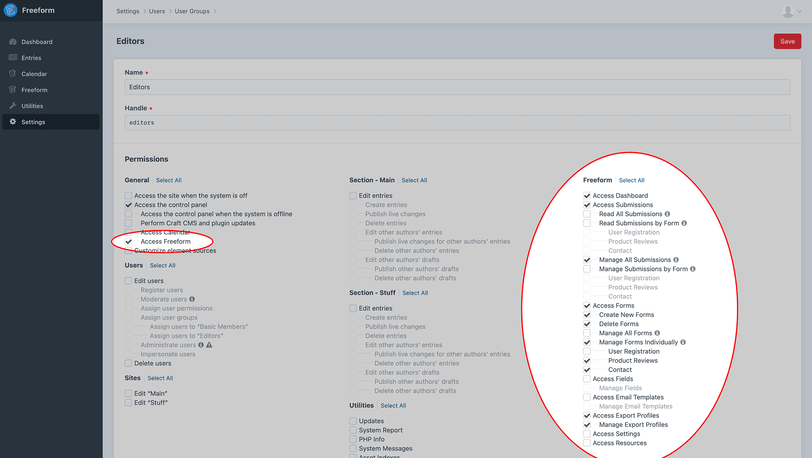

<meta property="og:image" content="https://docs.solspace.com/extras/social/craft/freeform/freeform.png" />

::: version /craft/freeform/v5/configuration/permissions/
Freeform
:::

    
    Freeform
    for Craft
    

        

            3.x
            Retired
            
        

        <ul class="pr-v-list">
            <li><a href="/craft/freeform/v5/">5.x✓ Latest</a></li>
            <li><a href="/craft/freeform/v4/">4.x</a></li>
            <li><a href="/craft/freeform/v3/">3.xRetired</a></li>
            <li><a href="/craft/freeform/v2/">2.xRetired</a></li>
            <li><a href="/craft/freeform/v1/">1.xRetired</a></li>
        </ul>
    

    

        <a href="https://plugins.craftcms.com/freeform" class="button button-blue">Plugin Store</a>
    

Setup

# Permissions

Freeform ties into regular Craft User Group Permissions. Simply visit the permissions page for the applicable user group(s) (**Settings > Users > User Groups**) to grant/edit/remove permissions to Freeform.

[[toc]]

## General

### Access Freeform

Required for users to access Freeform at all.

## Freeform

### Access Dashboard
Access to the Freeform Dashboard page.

### Access Submissions
Access to the Submissions list page.

- **Read All Submissions** - can view all submissions.
    ::: warning
    Checking this option supercedes all *Read Submissions by Form* options.
    :::
- **Read Submissions by Form** - individually set permissions by form.
    - *"MY FORM NAME"* - can view submissions for this form.
    ::: tip
    If you'd like to give users access to read only some forms' submissions, check off the ones here. These selections will be overridden by the 'Read All Submissions' checkbox. 'Manage' permissions will also override any 'Read' permissions.
    :::
- **Manage All Submissions** - can view, edit or delete any submission.
    ::: warning
    Checking this option supercedes all *Manage Submissions by Form* options and supercedes any *Read* permissions (above).
    :::
- **Manage Submissions by Form** - individually set permissions by form.
    - *"MY FORM NAME"* - can view, edit or delete submissions for this form. Checking a form supercedes all individal *Read* permissions (above).
    ::: tip
    If you'd like to give users access to manage only some forms' submissions, check off the ones here. These selections will be overridden by the 'Manage All Submissions' checkbox. 'Manage' permissions will also override any 'Read' permissions.
    :::

### Access Forms
Access to the Forms list page.

- **Create New Forms** - can create new forms.
    ::: tip
    Any forms created by a user will automatically be given access to manage that particular form if they don't already have *Manage All Forms* enabled.
    :::
- **Delete Forms** - can delete forms.
- **Manage All Forms** - can edit any and all forms.
    ::: warning
    Checking this option supercedes all form checkboxes below.
    :::
- **Manage Forms Individually** - individually set permissions by form.
    - *"MY FORM NAME"* - can edit this particular form.
    ::: tip
    If you'd like to give users access to only some forms, check off the ones here. These selections will be overridden by the 'Manage All Forms' checkbox.
    :::

### Access Fields
Access to the Fields list page.

- **Manage Fields** - can create, edit or delete fields.

### Access Email Templates
Access to the Email Templates list page.

- **Manage Email Templates** - can create, edit or delete email notification templates.

### Access Quick Exporting <Badge type="feature" text="3.13+" />
Access to the _Quick Export_ tool and _Export as CSV_ option in the CP Submissions index page.

::: warning
Users will need to have access to _read_ or _manage_ any of the forms they wish to export data for.
:::

### Access Export Profiles
Access to the Export Profiles list page and running of exports.

- **Manage Export Profiles** - can create, edit or delete export profiles.

### Access Settings
Can access and update settings area for Freeform as well as access [Error Log](./settings.md#error-log) page.

### Access Resources
Can access the Resources area for Freeform.

