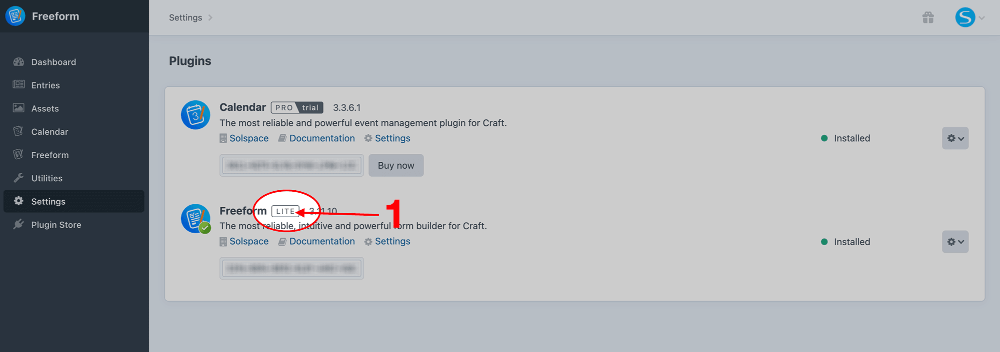
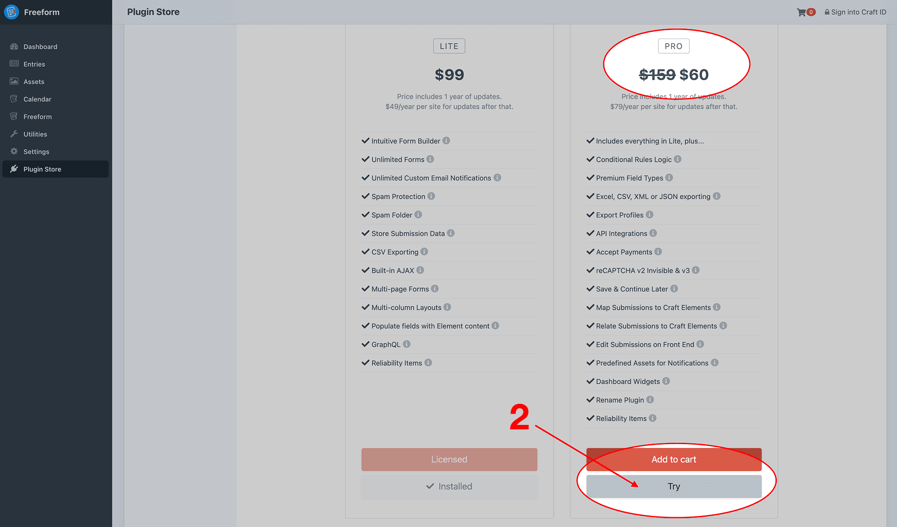

<meta property="og:image" content="https://docs.solspace.com/extras/social/craft/freeform/freeform.png" />

::: version /craft/freeform/v5/
Freeform
:::

    
    Freeform
    for Craft
    

        

            3.x
            Retired
            
        

        <ul class="pr-v-list">
            <li><a href="/craft/freeform/v5/">5.x✓ Latest</a></li>
            <li><a href="/craft/freeform/v4/">4.x</a></li>
            <li><a href="/craft/freeform/v3/">3.xRetired</a></li>
            <li><a href="/craft/freeform/v2/">2.xRetired</a></li>
            <li><a href="/craft/freeform/v1/">1.xRetired</a></li>
        </ul>
    

    

        <a href="https://plugins.craftcms.com/freeform" class="button button-blue">Plugin Store</a>
    

Setup

# Updating from Freeform 1.x

Updating from Craft 2.x to Craft 3.x is a much bigger task than typical minor updates of course. Not to mention, things have changed greatly in how plugins are installed and updated due to the new Plugin Store, etc. Because of this, we've prepared a special documentation guide to help you upgrade from Freeform 1.x to Freeform 3.x.

    <a href="#key-changes" class="menu-box">
        
        

            <h3>Key Changes</h3>
            
Review the list of key changes made to Freeform 3.

        

    </a>
    <a href="#updating-from-1-x" class="menu-box">
        
        

            <h3>Updating from 1.x</h3>
            
Instructions for updating from Freeform 1.x to Freeform 3.x.

        

    </a>
    <a href="./changelog.html" class="menu-box">
        
        

            <h3>Changelog</h3>
            
Review the list of releases and changes for Freeform.

        

    </a>

[[toc]]

## Key Changes
Freeform 3 brings some exciting new features to Freeform, but there have also been a few changes to what's offered between the _Lite_ and _Pro_ editions. The chart below will explain those changes so you know how to account for them in the future.

::: tip
For a full list and comparison of all features available to Freeform 3 Lite and Pro, please check out the [Compare Chart documentation](../compare.md).
:::

↻ Improved &nbsp;|&nbsp; × Removed &nbsp;|&nbsp; ✓/× No Change

| <h3 class="no-margin">Pricing & Support</h3> | <h3 class="no-margin">Lite 3</h3> | <h3 class="no-margin">Pro 3</h3> |
| :--- | :---: | :---: |
| Confirm field type | × | ✓ |
| Number, Phone, Website field types | Uses designated input types now | Uses designated input types now |
| Ability to rename the plugin | × | ✓ |

## Updating from 1.x

#### To transition from Freeform 1.x to Freeform 3.x, please follow the instructions below very carefully.

First things first, for Craft 3, you cannot use your old Solspace-generated license for Freeform. You'll need to [contact us](../support.md) to have a new Craft Plugin Store specific license generated for you. Please [let us know](../support.md) the following info:

- Your Solspace.com account email address
- Plugin name & Solspace license key (listed together if you have more than 1 to transfer)
- Your [Craft ID account](https://id.craftcms.com/) email address

::: warning
Please note that all existing Freeform 1.x licenses have **passed their 1 year expiry date by now**. Any requests for transferring a Freeform 1.x license to a Craft Plugin Store license for Freeform 3.x will be **provided as an expired license**. This means that **you will need to purchase a discounted renewal fee of $49/$79 (depending on edition) to proceed with this update**.
:::

::: tip
If you have a **Freeform Lite + Mailchimp** license for Craft 2.x, you are entitled access to a **Freeform Pro 3.x** license. If you'd like to have the _Pro_ license, please let us know when requesting transfer of license to the Plugin Store. Please note that the _Pro_ license renewal is a higher price than _Lite_, if you wish to make this switch.
:::

Once you have your new license, follow the steps below:

1. BACKUP YOUR SITE FILES AND DATABASE.
2. Follow the [Craft Documentation for Upgrading from Craft 2](https://craftcms.com/docs/3.x/upgrade.html).
3. Carefully review the [changelog](./changelog.md) for Freeform 3.x as well as the new [key features/changes table](#key-changes) above.
4. Follow the regular [installation instructions for Freeform 3.x](./installing-updating.md#installing-instructions). You essentially have to "install" Freeform again as if it's a fresh install, but Freeform/Craft will detect that you have old Freeform data in the database and perform a migration instead of a fresh install. You have the following options for installing Freeform 3 on Craft 3:
    * [Install from the Control Panel](./installing-updating.md#install-from-the-control-panel)
    * [Installing from the Terminal](./installing-updating.md#installing-from-the-terminal)
5. Once installed, you can paste in your new Freeform 3 license into the license key area beside the plugin name (**Craft CP** -> **Settings** -> **Plugins**). By default, you'll be given access to the _Lite_ edition. If you have a _Pro_ license, or wish to trial it or upgrade to it eventually, follow the steps below:
    * Click on the **Lite** flag/button beside the plugin name, which will take you to the Freeform product page inside the Craft Plugin Store.
        
    * Click on the **Reactivate** (or **Try**) button to activate the _Pro_ edition for your site.
        
    * Alternatively, you could edit the `edition` setting inside Craft's [Project Config](https://craftcms.com/docs/3.x/project-config.html) file to have a value of `pro`.
6. If your Freeform license is currently expired (purchased more than 1 year ago), you will need to renew the new Freeform 3 license. Your license can either be renewed directly inside your control panel, or through the [Craft ID](https://id.craftcms.com) site.
7. Carefully review Freeform inside the control panel and in your templates and ensure that everything works correctly and/or necessary updates to forms/templates/settings are made. If you ever use the demo templates to review/test/experiment, please note that we've made large updates to the demo templates for Freeform 3.x, so you may wish to reinstall them.

