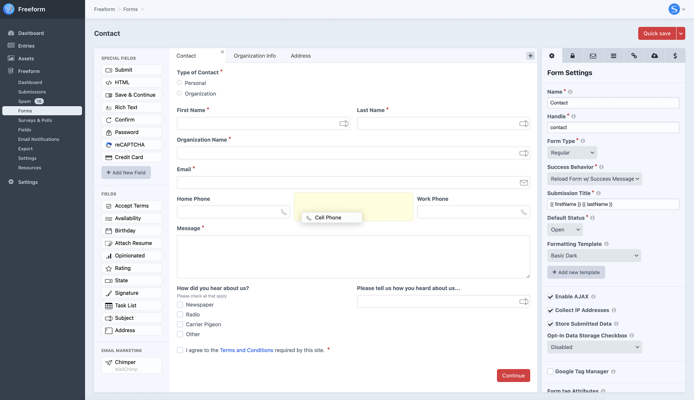
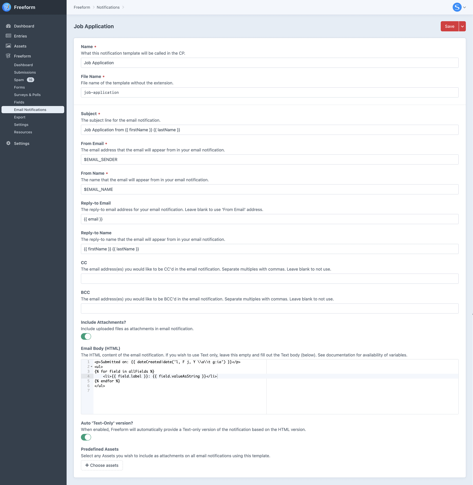
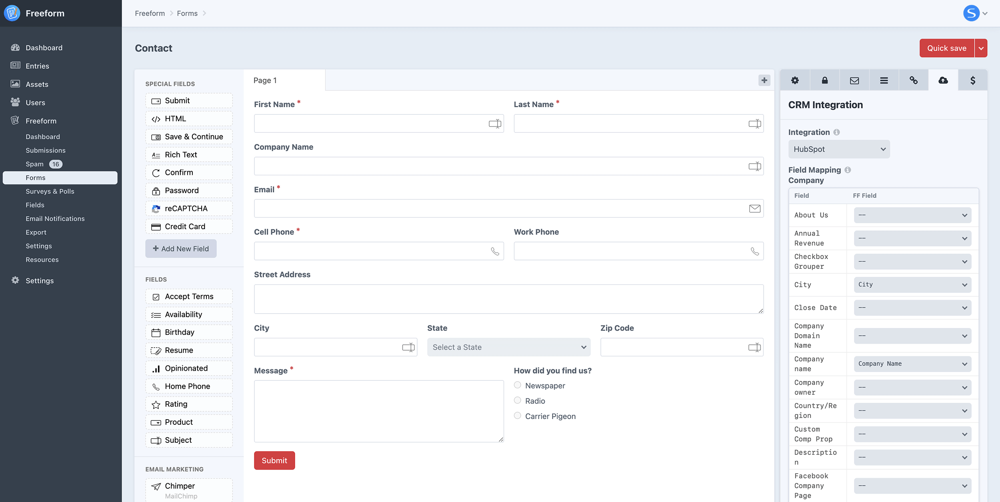

<meta property="og:image" content="https://docs.solspace.com/extras/social/craft/freeform/freeform.png" />

::: new /craft/freeform/v5/getting-started/
Freeform
:::

<div id="pr-heading">
    
    <span class="pr-name">Freeform</span>
    <span class="pr-category">for Craft</span>
    <div class="pr-v-wrapper">
        <div class="pr-v">
            <span class="pr-v-v">4.x</span>
            <span class="pr-v-arrow arrow down"></span>
        </div>
        <ul class="pr-v-list">
            <li><a href="/craft/freeform/v5/">5.x<span class="pr-v-type pr-latest">✓ Latest</span></a></li>
            <li><a href="/craft/freeform/v4/">4.x</a></li>
            <li><a href="/craft/freeform/v3/">3.x<span class="pr-v-type pr-retired">Retired</span></a></li>
            <li><a href="/craft/freeform/v2/">2.x<span class="pr-v-type pr-retired">Retired</span></a></li>
            <li><a href="/craft/freeform/v1/">1.x<span class="pr-v-type pr-retired">Retired</span></a></li>
        </ul>
    </div>
    <div class="pr-buy">
        <a href="https://plugins.craftcms.com/freeform" class="button button-blue"><span class="external-url">Plugin Store</span></a>
    </div>
</div>

<span class="page-section"><a href="/craft/freeform/v4/overview/">Overview</a></span>

# Getting Started

This guide provides an overview of how Freeform works without going into too much detail about each feature, so it's easier to digest. Links to more information will be sprinkled throughout.


[[toc]]


## Introduction
Freeform centers itself around letting admins and clients enjoy the experience of building and managing simple or complex forms in an intuitive interface that lets you see a live preview of the forms you're building. We refer to this as the [form builder](./overview/form-builder/), where almost everything is at your fingertips as it aims to stay out of your way and let you do as much as possible without moving around to other areas in the control panel. At the same time, Freeform is very powerful and flexible, so there is also a wide variety of other features, settings and options.


## Forms
Each form is built inside the intuitive [form builder](./overview/form-builder/). This is where you can design the form layout, configure which fields are required, set up integrations, validation and more. Freeform also allows for [multi-page forms](./overview/multi-page-forms/) and has built-in [spam protection](./overview/spam-protection/) options.

The form builder is a workspace divided into three columns:

- **Fields**: the left column, where you can see the fields available (and create new ones).
- **Layout**: the middle column, where you can drag and drop fields (from the left column) into and can rearrange each field however you please.
- **Settings/Property Editor**: the right column, which is where you can configure the form settings, email notifications, integrations, and properties for each field and page, etc.



::: video 94H5c9T4EHE
Video: Overview of the Form Builder
:::


## Fields
Freeform uses its own set of [fields and field types](./overview/fields/). Fields are global and available in all forms but can also be overwritten per form. This allows you to save time reusing existing fields when making other forms and will enable you to adjust them when needed. So to clarify, you can create fields with labels and options common to all forms but also override those on each form.

Freeform includes several standard fields preinstalled for you, which should get you started. Fields can be created and managed in the main field creation area (**Freeform > Fields > New Field**) and can also be made directly within the [form builder](./overview/form-builder/) interface. The field manager area (**Freeform > Fields > New Field**) essentially stores the default labels, options, etc, for each field (which can be adjusted for each form inside the form builder).


## Email Notifications
[Email notification templates](./overview/email-notifications/) are global and can be reused for multiple forms, saving you time when managing many forms. Email templates can be managed within the control panel (saved to the database) or as template files. All notification templates can be created and customized at **Freeform > Email Notifications** (of if using files, you can edit them in your favorite editor, etc).

Freeform allows you to send email notifications upon submittal of a form 5 different ways, each with its own content/template:

- [Admin Notifications](./overview/email-notifications/#admin-notifications)
    - Specify the email address(es) you'd like to be notified upon successful submission of form.
- [Dynamic Recipients](./overview/email-notifications/#dynamic-recipients)
    - Allow the user to choose from a predefined list of options to be emailed via select dropdown/radio group/checkbox group field.
- [Dynamic Template Notifications](./overview/email-notifications/#dynamic-template-notifications)
    - At the template level with the `dynamicNotification` parameter in the [Form query](./templates/queries/form/).
- [User/Submitter Notifications](./overview/email-notifications/#user-submitter-notifications)
    - To the user submitting the form, with the email addresses specified/selected in the [Email](./overview/fields/#email) field type.
- [User Defined](./overview/email-notifications/#user-defined)
    - To a user-defined email address (e.g. Tell-a-Friend form), with the email addresses specified/selected in the [Email](./overview/fields/#email) field type.




::: video M_VRSj1wR7M
Video: Overview of Email Notifications
:::


## Formatting Templates
Freeform attempts to do all the heavy lifting when it comes to templating. Our looping templating approach allows you to automate all or almost all of your form formatting. This can be achieved by using [ready-made options](./templates/formatting/) or custom-building your own [formatting templates](./overview/formatting-templates/).

Forms can be generated on the front-end templates two different ways:

1. By assigning one of the predefined formatting templates (stored as a standard Twig template in the **craft/templates** directory) inside the form builder and using the [Form query render()](./templates/queries/form/#usage-in-templates) method. This approach is very portable / DRY and works similarly to an include. Then simply insert 1 line of code in the template you want your form to load in:
    ``` twig
    {{ craft.freeform.form("yourFormHandle").render() }}
    ```
2. By coding the formatting directly within the template you want the form to appear in, using the [Form query](./templates/queries/form/). We recommend the first approach, but this option is technically available if your project requires it.


## Integrations
Freeform supports various popular [integrations](./integrations/) so you can do more with your forms, such as accepting payments, subscribing users to email marketing lists, and capturing data in CRMs, etc.

- [CRMs](./integrations/crm/)
- [Email Marketing](./integrations/email-marketing/)
- [Stripe Payments](./integrations/payments/)
- [Webhooks](./integrations/webhooks/)
- [POST Forwarding](./integrations/post-forwarding/)
- [Craft Elements](./integrations/elements/)





## Templating
We strived to make things as flexible as possible while also coming up with templating that can automate much of the handling of parsing your forms. Freeform figures out as much of this as possible for you. This can be achieved by building [formatting templates](./overview/formatting-templates/) for your forms.

::: guide ../guides/troubleshooting-form-issues/
Quick troubleshooting the most commonly reported issues with your form's appearance, behavior, or submission of the form on the front end.
:::


### Form Query
To display a form inside a page, add a [Form template query](./templates/queries/form/) to the template. This will automatically use the [formatting template](./overview/formatting-templates/) assigned to the form inside the [form builder](./overview/form-builder/).

``` twig
{{ craft.freeform.form("yourFormHandle").render() }}
```

To add some overrides to the form, such as setting some classes or even [inserting values dynamically](./guides/passing-dynamic-data-to-forms/) from the page, your code might look something like this:

``` twig
{{ craft.freeform.form("yourFormHandle", {
	labelClass: "form-label",
	inputClass: "form-control",
	instructionsBelowField: true,
	overrideValues: {
		hiddenFieldHandle: entry.id,
	}
}).render() }}
```

### Formatting Templates
Freeform includes a large number of example [formatting templates](./templates/formatting/) to choose from. You can use these as a starting point and adjust them to suit your needs or create your own from scratch.

A couple of good starting points would be these plug-and-play examples that are neatly styled basic templates that don't require any frameworks or toolkits, etc:

- [Basic Light](./templates/formatting/basic-light/)
- [Basic Dark](./templates/formatting/basic-dark/)

::: tip
When experiencing issues with custom formatting templates, always consider switching to one of the sample ones (such as [Basic Light](./templates/formatting/basic-light/)) and see if your form works correctly. Often the issue can be detected and resolved by comparing your template/approach with what is used in a sample template.
:::

### Demo Templates
Freeform includes a complete set of [demo templates](./setup/demo-templates/). These demo templates give you a fully functioning area on your website with just a few clicks! Furthermore, it allows you to see real-world examples of the template code in action, which will help you get acquainted with Freeform more quickly.

::: tip
When experiencing issues with your regular templates, always consider returning to the demo templates and see if your form works correctly there. Often the problem can be detected and resolved by comparing your template/approach with what is used in the demo templates.
:::


## Submissions
Similar to Craft Entries, every time a user submits a form, we refer to those as [submissions](./overview/submissions/). Freeform submissions can be viewed and edited in the control panel and the front end in templates as a list and individually. Within the control panel, you can filter the view by form (or show across all forms), search into submissions, adjust which field columns are shown, and click into any of the submissions to edit them.

### Submissions Query
To display submissions inside a page, add a [Submissions template query](./templates/queries/submissions/) to the template.

Display a simple list of submissions:

``` twig


<ul>

    <li>{{ submission.title }} - {{ submission.firstName }}</li>

</ul>
```

To display a single submission, your template code might look something like this (see [Submission object](./templates/objects/submission/) for more info):

``` twig





    

    <h3>{{ form.name }} - {{ submission.title }}</h3>

    <table class="table">
        
        <tr>
            <th style="width: 20%">{{ field.label ? field.label : "no-label" }}</th>
            <td>
            
            
                <ul>
                
                    <li>{{ value }}</li>
                
                </ul>
            
                {{ fieldValue }}
            
            </td>
        </tr>
        
    </table>



    <div class="alert">
        <p>Sorry, no submission was found.</p>
    </div>


```


