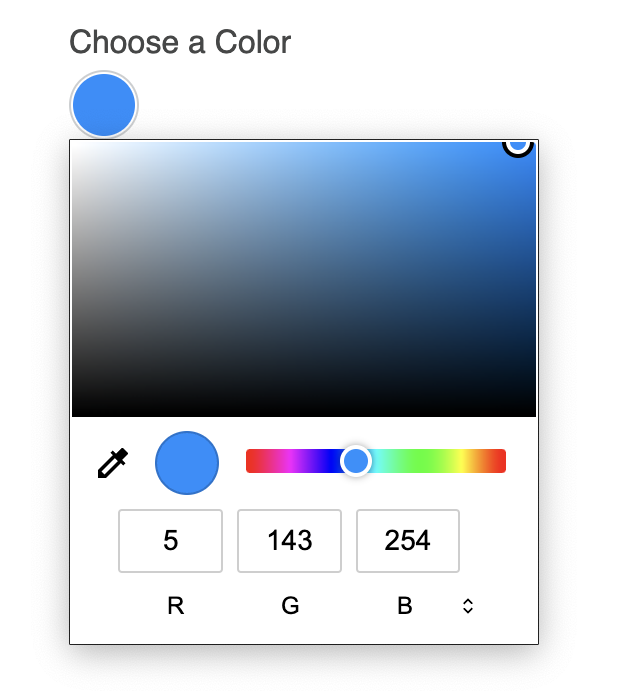
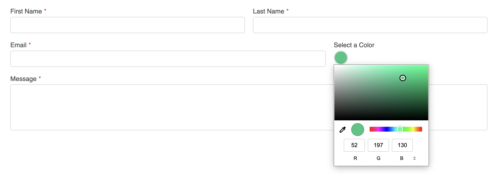

<meta property="og:image" content="https://docs.solspace.com/extras/social/craft/freeform/freeform.png" />

::: new /craft/freeform/v5/guides/
Freeform
:::

<div id="pr-heading">
    
    <span class="pr-name">Freeform</span>
    <span class="pr-category">for Craft</span>
    <div class="pr-v-wrapper">
        <div class="pr-v">
            <span class="pr-v-v">4.x</span>
            <span class="pr-v-arrow arrow down"></span>
        </div>
        <ul class="pr-v-list">
            <li><a href="/craft/freeform/v5/">5.x<span class="pr-v-type pr-latest">✓ Latest</span></a></li>
            <li><a href="/craft/freeform/v4/">4.x</a></li>
            <li><a href="/craft/freeform/v3/">3.x<span class="pr-v-type pr-retired">Retired</span></a></li>
            <li><a href="/craft/freeform/v2/">2.x<span class="pr-v-type pr-retired">Retired</span></a></li>
            <li><a href="/craft/freeform/v1/">1.x<span class="pr-v-type pr-retired">Retired</span></a></li>
        </ul>
    </div>
    <div class="pr-buy">
        <a href="https://plugins.craftcms.com/freeform" class="button button-blue"><span class="external-url">Plugin Store</span></a>
    </div>
</div>

<span class="page-section">User Guides</span>

# Color Picker on Text field

It's possible to easily implement `color` field type styling/handling on a regular [Text](../overview/fields/#text) field.


[[toc]]


## Instructions

<div class="step">
<label for="step1"><input type="checkbox" class="step-check" id="step1">

### Step 1

</label>

To familiarize yourself with the Color field type, a basic code example looks something like this:

``` html
<label for="myFieldHandle">Choose a Color</label>
<input type="color" name="myFieldHandle" id="myFieldHandle" value="#058ffe">
```

This will output the following (go ahead and play with it!):

><p for="myFieldHandle">Choose a Color</p>
><input type="color" name="myFieldHandle" id="myFieldHandle" value="#058ffe" style="margin-bottom: 10px;">

</div>

<div class="step">
<label for="step2"><input type="checkbox" class="step-check" id="step2">

### Step 2

</label>

What you might like to do is replace a [Text](../overview/fields/#text) field with a color picker. That could look something like this:

``` twig
{{ field.renderLabel({ labelClass: "freeform-label" ~ (field.inputOnly ? " freeform-input-only-label" : "") ~ (field.required ? " freeform-required" : "") }) }}
<input type="color" id="form-input-{{ field.handle }}" name="{{ field.handle }}" value="#058ffe">
```

</div>

<div class="step">
<label for="step3"><input type="checkbox" class="step-check" id="step3">

### Step 3

</label>

To add a bit of your own styling to the Color field, you can begin with the following CSS:

``` css
input[type="color"] {
    -webkit-appearance: none;
    border: 1px solid #cbced0 !important;
    border-radius: 50% !important;
    width: 35px !important;
    height: 35px !important;
    padding: 1px !important;
    cursor: pointer;
}
input[type="color"]::-webkit-color-swatch-wrapper {
    padding: 0;
}
input[type="color"]::-webkit-color-swatch {
    border: none;
    border-radius: 50%;
}
input[type="color"]::-moz-color-swatch {
    border: none;
    border-radius: 50%;
}
```

There is no javascript necessary for this to work.

The result should look something like this:



</div>

<div class="step">
<label for="step4"><input type="checkbox" class="step-check" id="step4">

### Step 4

</label>

In order for this to automatically happen inside a [formatting template](../overview/formatting-templates/), you'll want to create a new one if you haven't already. If you using the [Basic Light](../templates/formatting/basic-light/) formatting template as a starting point, your code might look something like this:

``` twig {13-17}
{# Shortened for Example #}
...

<div class="freeform-row {{ form.customAttributes.rowClass }}">
    
    
    
    
    
        
    
    <div class="{{ columnClass }} freeform-fieldtype-{{ field.type }}"{{ field.rulesHtmlData }}>
        
            {{ field.renderLabel({ labelClass: "freeform-label" ~ (field.inputOnly ? " freeform-input-only-label" : "") ~ (field.required ? " freeform-required" : "") }) }}
            <input type="color" id="form-input-{{ field.handle }}" name="{{ field.handle }}" value="#058ffe">
            {{ field.renderInstructions({ instructionsClass: "freeform-instructions" }) }}
            {{ field.renderErrors({ errorClass: "freeform-errors" }) }}
        
            {{ field.renderInput({ class: "freeform-input" ~ (field.hasErrors ? " is-invalid") }) -}}
            {{- field.renderLabel({ labelClass: "freeform-label" ~ (field.inputOnly ? " freeform-input-only-label" : "") ~ (field.required ? " freeform-required" : "") }) }}
            {{ field.renderInstructions({ instructionsClass: "freeform-instructions" }) }}
            {{ field.renderErrors({ errorClass: "freeform-errors" }) }}
        
            {{ field.render({
                class: field.type not in ["submit", "save", "signature"] ? "freeform-input" : "",
                labelClass: "freeform-label" ~ (field.inputOnly ? " freeform-input-only-label" : "") ~ (field.required ? " freeform-required" : ""),
                errorClass: "freeform-errors",
                instructionsClass: "freeform-instructions",
            }) }}
...
{# Shortened for Example #}
```

::: tip
Don't forget to include the custom CSS mentioned in [Step 3](#step3).
:::

The result might look something like this:



</div>

<div class="step-finished">Finished!</div>

::: tip
Please see [MDN Web Docs](https://developer.mozilla.org/en-US/docs/Web/HTML/Element/input/color) for more information about **Color** input elements.
:::