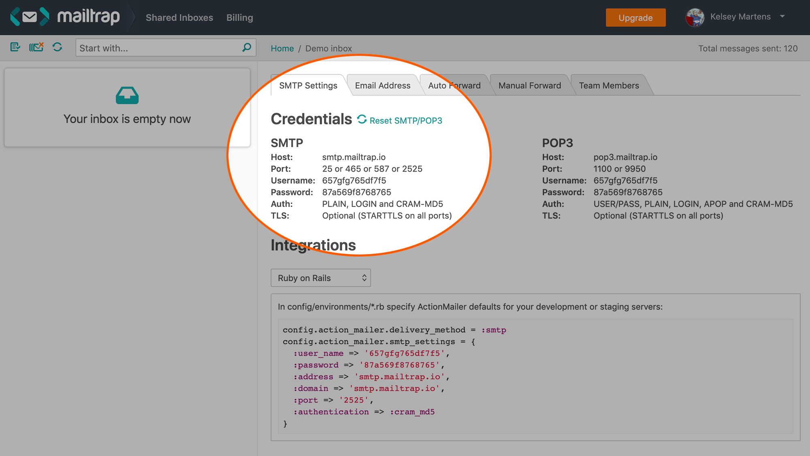
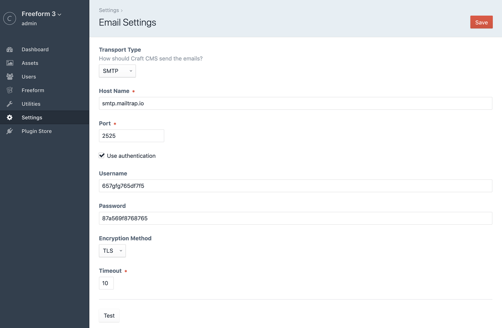
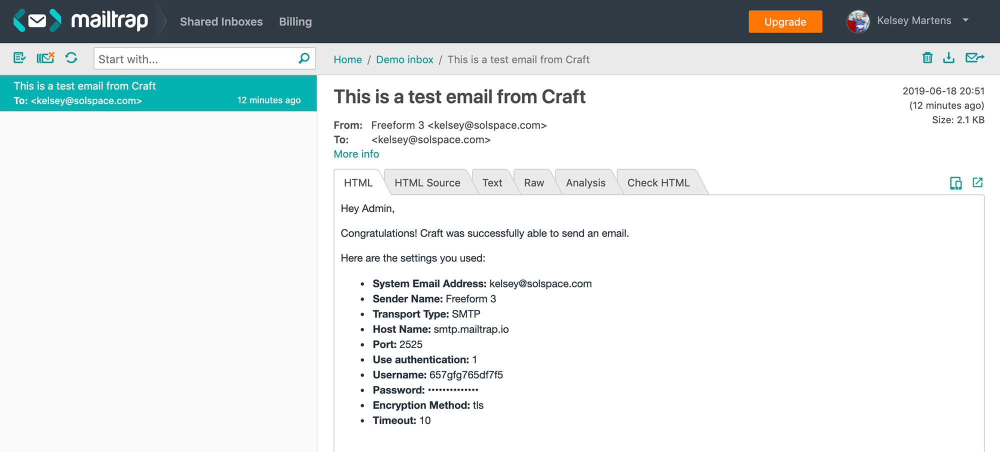

<meta property="og:image" content="https://docs.solspace.com/extras/social/craft/freeform/freeform.png" />

::: new /craft/freeform/v5/guides/
Freeform
:::

    
    Freeform
    for Craft
    

        

            4.x
            
        

        <ul class="pr-v-list">
            <li><a href="/craft/freeform/v5/">5.x✓ Latest</a></li>
            <li><a href="/craft/freeform/v4/">4.x</a></li>
            <li><a href="/craft/freeform/v3/">3.xRetired</a></li>
            <li><a href="/craft/freeform/v2/">2.xRetired</a></li>
            <li><a href="/craft/freeform/v1/">1.xRetired</a></li>
        </ul>
    

    

        <a href="https://plugins.craftcms.com/freeform" class="button button-blue">Plugin Store</a>
    

User Guides

# Email Testing with Mailtrap

When building and setting up your site locally, you might wish to test and debug email notifications from Freeform without bothering your client and/or setting up an email server on your development environment. In cases like this, we highly recommend trying out an email testing service such as [Mailtrap](https://mailtrap.io/).

Mailtrap simulates a real SMTP server and allows you to see that each email notification was sent, as well as view all of the recipients' email messages in a single unified inbox, complete with tools to analyze and troubleshoot. This speeds up the testing process and lets you verify how each notification is rendered, etc. For more information, [click here to see how it works](https://mailtrap.io/how-it-works).

Follow the instructions below to set up Mailtrap for Craft (which then hijacks/controls all email notifications from Craft and Freeform, etc):

[[toc]]

## Instructions

<label for="step1"><input type="checkbox" class="step-check" id="step1">

### Step 1

</label>

- [Sign up for a Mailtrap account](https://mailtrap.io/register/signup).
- Select the *Free* account to start (or a paid account if you think you need it).
    - Please note that the *Free* account does have some limitations:
        - Maximum 500 emails per month
        - Maximum 5 emails every 10 seconds
            ::: warning
            This is important to note, as some Freeform forms may be generating more than 5 email notifications. If so, Mailtrap will only collect/display 5 of the X number of notifications from Freeform.
            :::

<label for="step2"><input type="checkbox" class="step-check" id="step2">

### Step 2

</label>

Once your account has been created, click into your new inbox (probably named *Demo inbox*). The inbox page will default to having an *SMTP Settings* tab open with credentials.

<label for="step3"><input type="checkbox" class="step-check" id="step3">

### Step 3

</label>

- Open a new browser tab and go to the Email settings area in your Craft control panel (**CP** -> **Settings** -> **Email**), and then set up Mailtrap for Craft:
    - *Transport Type* - select **SMTP**
    - *hostname* - use `smtp.mailtrap.io`
    - *Port* - use `2525`
    - Check off the *Use authentication* checkbox
    - *Username* - copy and paste the username in Mailtrap, e.g. `657gfg765df7f5`
    - *Password* - copy and paste the username in Mailtrap, e.g. `87a569f8768765`
    - *Encryption Method* - select **TLS**
    - *Timeout* - `10`
    
- Click the **Test** button to verify it's working correctly. If it worked, you'll see an email message inside your Mailtrap inbox.
    

Finished!

::: tip
Now any email notification generated by Craft, Freeform or other third party plugins will use Mailtrap.
:::