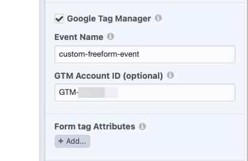

<meta property="og:image" content="https://docs.solspace.com/extras/social/craft/freeform/freeform.png" />

::: new /craft/freeform/v5/guides/
Freeform
:::

<div id="pr-heading">
    
    <span class="pr-name">Freeform</span>
    <span class="pr-category">for Craft</span>
    <div class="pr-v-wrapper">
        <div class="pr-v">
            <span class="pr-v-v">4.x</span>
            <span class="pr-v-arrow arrow down"></span>
        </div>
        <ul class="pr-v-list">
            <li><a href="/craft/freeform/v5/">5.x<span class="pr-v-type pr-latest">✓ Latest</span></a></li>
            <li><a href="/craft/freeform/v4/">4.x</a></li>
            <li><a href="/craft/freeform/v3/">3.x<span class="pr-v-type pr-retired">Retired</span></a></li>
            <li><a href="/craft/freeform/v2/">2.x<span class="pr-v-type pr-retired">Retired</span></a></li>
            <li><a href="/craft/freeform/v1/">1.x<span class="pr-v-type pr-retired">Retired</span></a></li>
        </ul>
    </div>
    <div class="pr-buy">
        <a href="https://plugins.craftcms.com/freeform" class="button button-blue"><span class="external-url">Plugin Store</span></a>
    </div>
</div>

<span class="page-section">User Guides</span>

# Setting up Google Tag Manager

If you wish to use [Google Tag Manager](https://tagmanager.google.com/) with Freeform forms, follow the guide below.


[[toc]]


## Instructions

<div class="step">
<label for="step1"><input type="checkbox" class="step-check" id="step1">

### Enable Google Tag Manager inside Freeform

</label>

- Enable the Google Tag Manager inside a form. This is done by checking the **Google Tag Manager** checkbox in the Form Settings tab in the form builder for each form.
- Specify the `GTM-XXXXXX` GTM ID that you have in your Google Tag Manager site for your project.
- Save the form.



</div>

<div class="step">
<label for="step2"><input type="checkbox" class="step-check" id="step2">

### Submit a Test Submission

</label>

- Visit your form on your site.
- Fill out the form and click _submit_.
- The data should have been pushed to GTM using the specified event name.

::: tip
The success of this is not observable on your site, as this event goes to GTM via some sockets, so there's nothing in the network tab.
:::

</div>

<div class="step">
<label for="step3"><input type="checkbox" class="step-check" id="step3">

### Check Google Tag Manager

</label>

To see if your test worked correctly, visit the [Google Tag Manager](https://tagmanager.google.com/) website and open your project workspace. Then click on the **PREVIEW** button near the top right side of the page.


</div>

<div class="step">
<label for="step4"><input type="checkbox" class="step-check" id="step4">

### Troubleshooting

</label>

Google offers a [Tag Assistant](https://tagassistant.google.com/) tool along with a [Tag Assistant Companion](https://chrome.google.com/webstore/detail/tag-assistant-companion/jmekfmbnaedfebfnmakmokmlfpblbfdm) Chrome extension. These help troubleshoot installation of `gtag.js` and **Google Tag Manager**. When the Chrome extension is present, it enables additional features for Tag Assistant including debugging iframes and debugging multiple windows from the same debug session.

</div>

<div class="step">
<label for="step5"><input type="checkbox" class="step-check" id="step5">

### Customizing

</label>

To customise what gets sent to the events, you can write your own JS and add an event listener, like this:

``` js
window.addEventListener('freeform-gtm-data-layer-push', function (event) {
    event.payload.myCustomValue = 'something_here';
    event.payload.otherCustomValue = 'other_value';
});
```

This would then attach whatever you add to the payload to the event that is being pushed to GTM.

</div>

<div class="step-finished">Finished!</div>