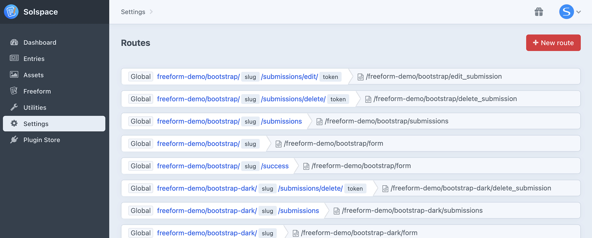

<meta property="og:image" content="https://docs.solspace.com/extras/social/craft/freeform/freeform.png" />

::: new /craft/freeform/v5/guides/
Freeform
:::

    
    Freeform
    for Craft
    

        

            4.x
            
        

        <ul class="pr-v-list">
            <li><a href="/craft/freeform/v5/">5.x✓ Latest</a></li>
            <li><a href="/craft/freeform/v4/">4.x</a></li>
            <li><a href="/craft/freeform/v3/">3.xRetired</a></li>
            <li><a href="/craft/freeform/v2/">2.xRetired</a></li>
            <li><a href="/craft/freeform/v1/">1.xRetired</a></li>
        </ul>
    

    

        <a href="https://plugins.craftcms.com/freeform" class="button button-blue">Plugin Store</a>
    

User Guides

# How to Remove Demo Templates

The [Demo Templates](../setup/demo-templates/) are handy when starting out with Freeform or trying to troubleshoot issues, but how do you uninstall them when you're done with them? Just follow the steps below:

[[toc]]

## Instructions

<label for="step1"><input type="checkbox" class="step-check" id="step1">

### Step 1

</label>

Go to the Craft **templates** directory and look for the demo templates folder you had it install (e.g. `freeform-demo`). Delete that folder and its contents inside.

<label for="step2"><input type="checkbox" class="step-check" id="step2">

### Step 2

</label>

Go to the **assets** directory inside your public web directory and look for a folder with the same name as the templates folder (e.g. `freeform-demo`).

<label for="step3"><input type="checkbox" class="step-check" id="step3">

### Step 3

</label>

Go to the **Routes** area is the Craft control panel (_CP -> Settings -> Routes_) and remove any routes that Freeform installed. They will all have the same path name as the folders you just removed.

Finished!

::: tip
The demo templates should be fully removed now.
:::