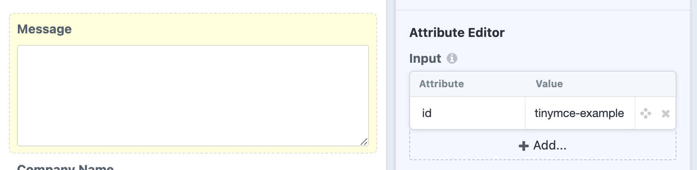
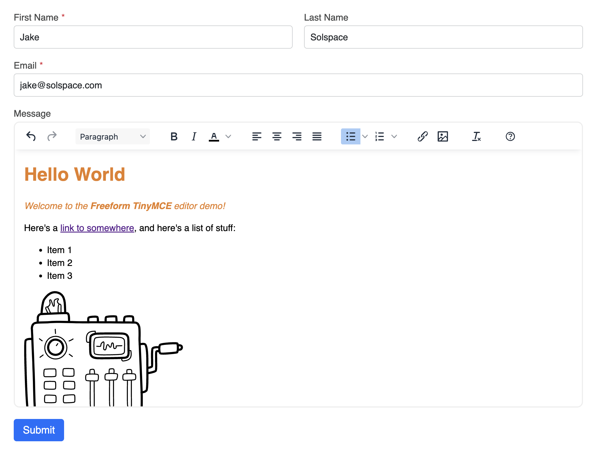

<meta property="og:image" content="https://docs.solspace.com/extras/social/craft/freeform/freeform.png" />

::: new /craft/freeform/v5/guides/
Freeform
:::

<div id="pr-heading">
    
    <span class="pr-name">Freeform</span>
    <span class="pr-category">for Craft</span>
    <div class="pr-v-wrapper">
        <div class="pr-v">
            <span class="pr-v-v">4.x</span>
            <span class="pr-v-arrow arrow down"></span>
        </div>
        <ul class="pr-v-list">
            <li><a href="/craft/freeform/v5/">5.x<span class="pr-v-type pr-latest">✓ Latest</span></a></li>
            <li><a href="/craft/freeform/v4/">4.x</a></li>
            <li><a href="/craft/freeform/v3/">3.x<span class="pr-v-type pr-retired">Retired</span></a></li>
            <li><a href="/craft/freeform/v2/">2.x<span class="pr-v-type pr-retired">Retired</span></a></li>
            <li><a href="/craft/freeform/v1/">1.x<span class="pr-v-type pr-retired">Retired</span></a></li>
        </ul>
    </div>
    <div class="pr-buy">
        <a href="https://plugins.craftcms.com/freeform" class="button button-blue"><span class="external-url">Plugin Store</span></a>
    </div>
</div>

<span class="page-section">User Guides</span>

# TinyMCE Rich Text Editor on Textarea field

A rich text editor such as [TinyMCE](https://www.tiny.cloud/tinymce/) can easily be added to your form. You simply target a specific [Textarea](../overview/fields/#textarea) field and the editor's JS will take over that field and handle the rest.


[[toc]]


## Instructions

Here's a list of the steps needed to do this:

<div class="step">
<label for="step1"><input type="checkbox" class="step-check" id="step1">

### Step 1

</label>

- [Create or log into an account](https://www.tiny.cloud/auth/signup/) on the TinyMCE website.
- Add any domains (including test ones) you plan on using to the [Approved Domains](https://www.tiny.cloud/my-account/domains/) area.

</div>

<div class="step">
<label for="step2"><input type="checkbox" class="step-check" id="step2">

### Step 2

</label>

- Download a copy of the [TinyMCE SDK](https://www.tiny.cloud/get-tiny/).
- Click on the **Download TinyMCE SDK Now** button specifically.
- Unzip the package and upload the contents to a publicly accessible folder on your site, e.g. `/assets/js/tinymce/`.

</div>

<div class="step">
<label for="step3"><input type="checkbox" class="step-check" id="step3">

### Step 3

</label>

- In the form builder for your form, select the *textarea* field you'd like this editor to apply to.
- In the *Input* area of the **Attribute Editor** section for the field's settings, add a new row and give the field an ID, e.g. `id` and `tinymce-example`.
    
- Save the form.

</div>

<div class="step">
<label for="step4"><input type="checkbox" class="step-check" id="step4">

### Step 4

</label>

- Open up the template you wish to load this form and TinyMCE.
- [Include the TinyMCE script in the page](https://www.tiny.cloud/docs/tinymce/6/zip-install/), e.g. `<script src="/assets/js/tinymce/tinymce.min.js"></script>`
- [Initialize TinyMCE](https://www.tiny.cloud/docs/tinymce/6/zip-install/) for the textarea in your form. For the `selector` parameter, be sure to target the ID we assigned the textarea in the form builder. The absolute bare minimum would be:
    ``` js
    <script>
        tinymce.init({
            selector: 'textarea#tinymce-example'
        });
    </script>
    ```

</div>

<div class="step">
<label for="step5"><input type="checkbox" class="step-check" id="step5">

### Step 5

</label>

- Load the template with the form and TinyMCE scripts, and it should have applied itself. Your complete [basic template](https://www.tiny.cloud/docs/tinymce/6/basic-example/) should look something like this:
    ``` twig
    <html>
    <head></head>
    <body>
        {{ craft.freeform.form("yourFormHandle").render() }}

        <script src="/assets/js/tinymce/tinymce.min.js"></script>
        <script>
            tinymce.init({
                selector: 'textarea#tinymce-example'
            });
        </script>
    </body>
    </html>
    ```

</div>

<div class="step">
<label for="step6"><input type="checkbox" class="step-check" id="step6">

### Step 6

</label>

- TinyMCE offers a wide range of settings to [customize the editor options and layout](https://www.tiny.cloud/docs/tinymce/6/customize-ui/). The below example offers a good selection of editing options and controls:
    ``` js
    <script>
        tinymce.init({
            toolbar_location: 'top',
            menubar: false,
            statusbar: false,
            selector: 'textarea#tinymce-example',
            height: 500,
            plugins: [
                'advlist', 'autolink', 'lists', 'link', 'image', 'charmap', 'preview',
                'anchor', 'searchreplace', 'visualblocks', 'code', 'fullscreen',
                'insertdatetime', 'media', 'table', 'help', 'wordcount'
            ],
            toolbar: 'undo redo | blocks | ' +
                'bold italic forecolor | alignleft aligncenter ' +
                'alignright alignjustify | bullist numlist | ' +
                'link image | ' +
                'removeformat code | help',
            content_style: 'body { font-family:Helvetica,Arial,sans-serif; font-size:16px }'
        });
    </script>
    ```
- The above code will render in your form like this:
    

</div>

<div class="step">
<label for="step7"><input type="checkbox" class="step-check" id="step7">

### Step 7

</label>

- Anything submitted through the editor will store the data as HTML. By default, Freeform will not parse the HTML in [Submissions queries](../templates/queries/submissions/) or [Email Notification](../overview/email-notifications/) templates. To parse the HTML, be sure to apply the `|raw` filter to the textarea.
- In the Submissions query in front end, this could be done by applying `|raw` to `submission[field.handle]`, like this:
    ``` twig {11-12}
    

    <h3>{{ submission.title }}</h3>
    <p>{{ submission.dateCreated|date('F j, Y \\a\\t g:ia') }}</p>

    <div class="field-data">
    
        
            {{ submission[field.handle]|raw }}
        
            {{ submission[field.handle] }}
        
    
    </div>
    ```
- In an email notification template, it might look like this:
    ``` twig {5-6}
    <h2>New submission on your {{ form.name }} form</h2>
    <p>Submitted on: {{ dateCreated|date('l, F j, Y \\a\\t g:ia') }}</p>
    <ul>
        
            
                <li>{{ field.label }}:<br />{{ field.value|raw }}</li>
            
                <li>{{ field.label }}: {{ field.valueAsString }}</li>
            
        
    </ul>
    ```

</div>

<div class="step-finished">Finished!</div>

::: tip
The process is likely similar if there's a different editor you'd like to add support for.
:::