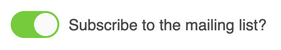
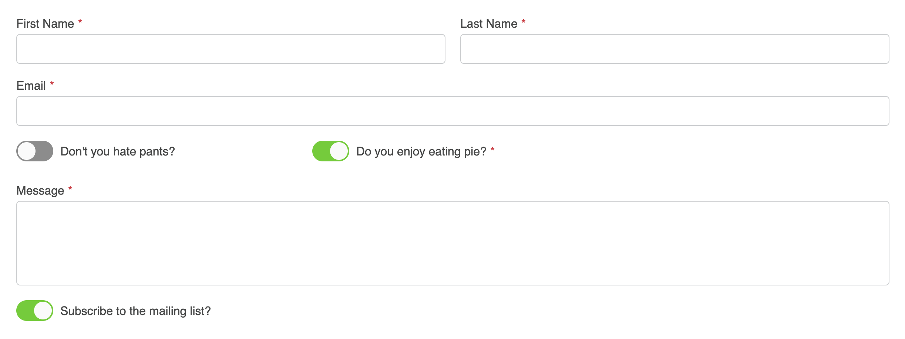

<meta property="og:image" content="https://docs.solspace.com/extras/social/craft/freeform/freeform.png" />

::: new /craft/freeform/v5/guides/
Freeform
:::

<div id="pr-heading">
    
    <span class="pr-name">Freeform</span>
    <span class="pr-category">for Craft</span>
    <div class="pr-v-wrapper">
        <div class="pr-v">
            <span class="pr-v-v">4.x</span>
            <span class="pr-v-arrow arrow down"></span>
        </div>
        <ul class="pr-v-list">
            <li><a href="/craft/freeform/v5/">5.x<span class="pr-v-type pr-latest">✓ Latest</span></a></li>
            <li><a href="/craft/freeform/v4/">4.x</a></li>
            <li><a href="/craft/freeform/v3/">3.x<span class="pr-v-type pr-retired">Retired</span></a></li>
            <li><a href="/craft/freeform/v2/">2.x<span class="pr-v-type pr-retired">Retired</span></a></li>
            <li><a href="/craft/freeform/v1/">1.x<span class="pr-v-type pr-retired">Retired</span></a></li>
        </ul>
    </div>
    <div class="pr-buy">
        <a href="https://plugins.craftcms.com/freeform" class="button button-blue"><span class="external-url">Plugin Store</span></a>
    </div>
</div>

<span class="page-section">User Guides</span>

# Toggle Switch on Checkbox field

If you'd like to display a lightswitch/toggle field instead of a regular checkbox for your [Checkbox](../overview/fields/#checkbox) fields, this can be done with a bit of manipulating a formatting template.


[[toc]]


## Instructions

<div class="step">
<label for="step1"><input type="checkbox" class="step-check" id="step1">

### Step 1

</label>

A basic code example to display a checkbox as a lightswitch relies heavily on CSS and looks something like this:

``` html
<style>
.freeform-checkbox {
    cursor: pointer;
    display: inline-block;
}
.freeform-checkbox .switch {
    display: inline-block;
    background: #8c8c8c;
    border-radius: 16px;
    width: 50px;
    height: 28px;
    position: relative;
    vertical-align: middle;
    transition: all 0.25s;
}
.freeform-checkbox .switch:before, .switch:after {
    content: "";
}
.freeform-checkbox .switch:before {
    display: block;
    background: #fafafa;
    border-radius: 50%;
    width: 24px;
    height: 24px;
    position: absolute;
    top: 2px;
    left: 2px;
    transition: left 0.25s;
}
.freeform-checkbox:hover .switch:before {
    background: #ffffff;
}
.freeform-checkbox input[type=checkbox]:checked + .switch {
    background: #52cd00;
}
.freeform-checkbox input[type=checkbox]:checked + .switch:before {
    left: 24px;
}
.freeform-checkbox input[type=checkbox] {
    position: absolute;
    visibility: hidden;
}
.freeform-checkbox span {
    margin-left: 5px;
    position: relative;
    top: 2px;
}
</style>

<label class="freeform-checkbox">
    <input type="checkbox">
    <div class="switch"></div>
    <span>This is a Checkbox Label</span>
</label>
```

This will output the following (go ahead and play with it!):

<style>
label.docs-demo-freeform-checkbox {
    cursor: pointer;
    display: inline-block;
    background: none !important;
    border: none !important;
    padding: 0 !important;
    margin: 10px 0 !important;
}
.docs-demo-freeform-checkbox .docs-demo-switch {
    display: inline-block;
    background: #8c8c8c;
    border-radius: 16px;
    width: 50px;
    height: 28px;
    position: relative;
    vertical-align: middle;
    transition: all 0.25s;
}
.docs-demo-freeform-checkbox .docs-demo-switch:before, .docs-demo-switch:after {
    content: "";
}
.docs-demo-freeform-checkbox .docs-demo-switch:before {
    display: block;
    background: #fafafa;
    border-radius: 50%;
    width: 24px;
    height: 24px;
    position: absolute;
    top: 2px;
    left: 2px;
    transition: left 0.25s;
}
.docs-demo-freeform-checkbox:hover .docs-demo-switch:before {
    background: #ffffff;
}
.docs-demo-freeform-checkbox input[type=checkbox]:checked + .docs-demo-switch {
    background: #52cd00;
}
.docs-demo-freeform-checkbox input[type=checkbox]:checked + .docs-demo-switch:before {
    left: 24px;
}
.docs-demo-freeform-checkbox input[type=checkbox] {
    position: absolute;
    visibility: hidden;
}
.docs-demo-freeform-checkbox span {
    margin-left: 5px;
    position: relative;
    top: 2px;
}
</style>

><label class="docs-demo-freeform-checkbox">
>    <input type="checkbox" value="">
>    <div class="docs-demo-switch"></div>
>    <span>This is a Checkbox Label</span>
></label>

</div>

<div class="step">
<label for="step2"><input type="checkbox" class="step-check" id="step2">

### Step 2

</label>

To replace any checkbox fields with the new lightswitch toggle styles, your basic formatting template code would look something like this:

``` twig
<label for="form-input-{{ field.handle }}" class="freeform-checkbox">
    {{ field.renderInput({ class: (field.hasErrors ? "is-invalid") }) }}
    <div class="switch"></div>
    <span class="freeform-label freeform-required">{{ field.label }}</span>
</label>
```

</div>

<div class="step">
<label for="step3"><input type="checkbox" class="step-check" id="step3">

### Step 3

</label>

Then add the following CSS:

``` css
.freeform-checkbox {
    cursor: pointer;
    display: inline-block;
}
.freeform-checkbox .switch {
    display: inline-block;
    background: #8c8c8c;
    border-radius: 16px;
    width: 50px;
    height: 28px;
    position: relative;
    vertical-align: middle;
    transition: all 0.25s;
}
.freeform-checkbox .switch:before, .switch:after {
    content: "";
}
.freeform-checkbox .switch:before {
    display: block;
    background: #fafafa;
    border-radius: 50%;
    width: 24px;
    height: 24px;
    position: absolute;
    top: 2px;
    left: 2px;
    transition: left 0.25s;
}
.freeform-checkbox:hover .switch:before {
    background: #ffffff;
}
.freeform-checkbox input[type=checkbox]:checked + .switch {
    background: #52cd00;
}
.freeform-checkbox input[type=checkbox]:checked + .switch:before {
    left: 24px;
}
.freeform-checkbox input[type=checkbox] {
    position: absolute;
    visibility: hidden;
}
.freeform-checkbox span {
    margin-left: 5px;
    position: relative;
    top: 2px;
}
```

There is no javascript necessary for this to work.

The result should look something like this:



</div>

<div class="step">
<label for="step4"><input type="checkbox" class="step-check" id="step4">

### Step 4

</label>

In order for this to automatically happen inside a [formatting template](../overview/formatting-templates/) for all [single Checkboxes](../overview/fields/#checkbox) (and [Email Marketing Checkboxes](../overview/fields/#email-marketing)), you'll want to create a new one if you haven't already. If you using the [Basic Light](../templates/formatting/basic-light/) formatting template as a starting point, your code might look something like this:

``` twig {13-20}
{# Shortened for Example #}
...

<div class="freeform-row {{ form.customAttributes.rowClass }}">
    
    
    
    
    
        
    
    <div class="{{ columnClass }} freeform-fieldtype-{{ field.type }}"{{ field.rulesHtmlData }}>
        
            <label for="form-input-{{ field.handle }}" class="freeform-checkbox">
                {{ field.renderInput({ class: (field.hasErrors ? "is-invalid") }) -}}
                <div class="switch"></div>
                <span class="freeform-label freeform-required">{{ field.label }}</span>
            </label>
            {{ field.renderInstructions({ instructionsClass: "freeform-instructions" }) }}
            {{ field.renderErrors({ errorClass: "freeform-errors" }) }}
        
            {{ field.render({
                class: field.type not in ["submit", "save", "signature"] ? "freeform-input" : "",
                labelClass: "freeform-label" ~ (field.inputOnly ? " freeform-input-only-label" : "") ~ (field.required ? " freeform-required" : ""),
                errorClass: "freeform-errors",
                instructionsClass: "freeform-instructions",
            }) }}
...
{# Shortened for Example #}
```

::: tip
Don't forget to include the custom CSS mentioned in [Step 3](#step3).
:::

The result might look something like this:



</div>

<div class="step-finished">Finished!</div>