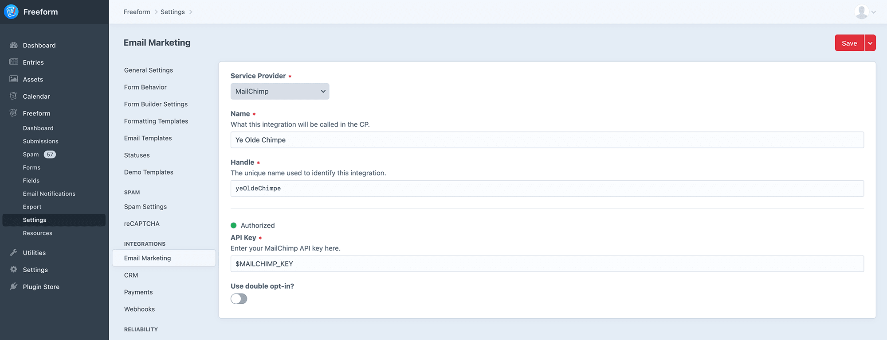

<meta property="og:image" content="https://docs.solspace.com/extras/social/craft/freeform/freeform.png" />

::: new /craft/freeform/v5/integrations/
Freeform
:::

    
    Freeform
    for Craft
    

        

            4.x
            
        

        <ul class="pr-v-list">
            <li><a href="/craft/freeform/v5/">5.x✓ Latest</a></li>
            <li><a href="/craft/freeform/v4/">4.x</a></li>
            <li><a href="/craft/freeform/v3/">3.xRetired</a></li>
            <li><a href="/craft/freeform/v2/">2.xRetired</a></li>
            <li><a href="/craft/freeform/v1/">1.xRetired</a></li>
        </ul>
    

    

        <a href="https://plugins.craftcms.com/freeform" class="button button-blue">Plugin Store</a>
    

<a href="/craft/freeform/v4/integrations/">Integrations</a>

# Email Marketing Integrations <Badge type="pro" text="Pro" />

Freeform supports some popular email marketing / mailing list integrations. Inside the [Settings](../../setup/settings/#integrations) area of Freeform, there is an Email Marketing Integration Manager, which allows you to manage your mailing list API integrations. Every integration is a little bit different, so we have detailed instructions for setting up each integration on their own page.

The following Email Marketing integrations are currently available for **Freeform Pro** only (click each one for individual setup instructions):

    
    
    
    
    
    
    <a href="../../guides/custom-integrations/" class="feature-api-grid-muted">
        
        <h5>Make Your Own</h5>
    </a>
    <a href="/support/premium/" class="feature-api-grid-muted">
        
        <h5>Hire Us</h5>
    </a>

::: guide ../../guides/custom-integrations/
Can I make my own CRM or Email Marketing API integration?
:::

Some important things to know about Email Marketing integrations are:

* Mailing list integrations are globally available to all forms, but are configured per form inside the form builder interface.
* Most - if not all - integrations attempt to map all available fields and custom fields, but some may have limitations if the API is too complex or doesn't allow it.
* Mailing list integrations appear as a checkbox that can be drag and dropped into the form builder interface:
	* Can only be displayed as a single checkbox, or as hidden field (as an automatic opt-in when using specifically for mailing list signups). If you want more than 1 mailing list, you can drag and drop another field into your layout (but the checkboxes cannot be displayed as a group, unless of course you made some manual adjustments to the formatting template).
		* Label of the checkbox is customizable per form.
		* Checkbox can be checked by default.
	* You can specify the mailing list to be used for the mailing list integration.
	* Your form must include an [Email](../../overview/fields.md#email) field type, which must then be assigned to the **Target Email Field** setting.
	* When available, **Field Mapping** setting allows you to map Freeform fields to available mailing list integration fields.
* To get access to all integrations, purchase (or purchase an upgrade to) *Freeform Pro*.

::: warning
While data is passed along to the Email Marketing provider, Freeform does not store whether or not Email Marketing fields were opted in, so CP submission views will not display whether or not the user subscribed.
:::