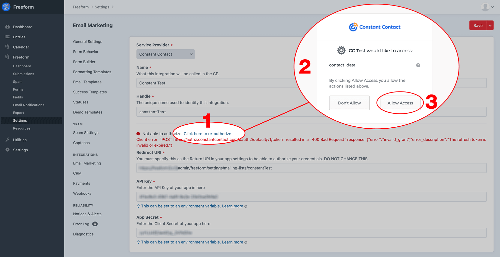

<meta property="og:image" content="https://docs.solspace.com/extras/social/craft/freeform/freeform.png" />

::: new /craft/freeform/v5/integrations/constant-contact/
Freeform
:::

    
    Freeform
    for Craft
    

        

            4.x
            
        

        <ul class="pr-v-list">
            <li><a href="/craft/freeform/v5/">5.x✓ Latest</a></li>
            <li><a href="/craft/freeform/v4/">4.x</a></li>
            <li><a href="/craft/freeform/v3/">3.xRetired</a></li>
            <li><a href="/craft/freeform/v2/">2.xRetired</a></li>
            <li><a href="/craft/freeform/v1/">1.xRetired</a></li>
        </ul>
    

    

        <a href="https://plugins.craftcms.com/freeform" class="button button-blue">Plugin Store</a>
    

<a href="/craft/freeform/v4/integrations/">Integrations</a>

# Constant Contact Integration <Badge type="pro" text="Pro" />

This documentation page assumes you have read over the [Email Marketing Integration Overview page](README.md). If you have not yet read it, please do so now. We assume that you have a [Constant Contact ](http://constantcontact.com) account already, along with mailing list(s) already created. This integration requires that you have *Freeform Pro*. If you currently have Freeform Lite, you can purchase an upgrade to Freeform Pro.

::: tip
In early 2022, [Constant Contact announced changes to their API service](https://v3.developer.constantcontact.com/api_guide/auth_update_apps.html). This is a change that breaks existing integrations, and requires an update to Freeform in order to fix the connection. For existing Constant Contact users (set up before 3.13.4), please see the [special update instructions](#_2022-update-instructions).
:::

[[toc]]

## Compatibility

The Constant Contact integration includes support for mapping to most standard fields and custom fields.

## Duplicate Check & Update

If a duplicate email address is found in Constant Contact, the profile data will be updated with the latest information submitted.

## Setup Instructions

<label for="step1"><input type="checkbox" class="step-check" id="step1">

### Prepare your site's end for Integration

</label>

- Go to the [Email Marketing section in Freeform Settings](../../setup/settings.md#email-marketing) (**Freeform > Settings > Email Marketing**).
- Click the **New Email Marketing Integration** at the top right.
- Select *Constant Contact* from the **Service Provider** select dropdown.
- Enter a name and handle for the integration.
    - In the **Redirect URI** field, a URL will be automatically populated for you. Do not change or adjust this.
- Copy the URL in the **Redirect URI** field to your clipboard.
- Leave this page open.

<label for="step2"><input type="checkbox" class="step-check" id="step2">

### Prepare Constant Contact's end for Integration

</label>

- Open up a new browser tab and go to Constant Contact's API [*My Applications* website](https://app.constantcontact.com/pages/dma/portal/).
- Log into your Constant Contact account there.
- Go to the **My Applications** page (click at top nav menu).
- Click on the **New Application** button at top right.
- Enter a name for the application in the modal window that pops up, and click **Save**. Leave the other 2 settings as they are defaulted.
- On the next page, paste the value you copied from Freeform's **Redirect URI** field into the Constant Contact **Redirect URI** field.
- Fill out the rest of the form if you like, and then click the **Save** button at the top right.
- On the **My Applications** list page, click on your newly created application.
- Copy the `API Key` value from Constant Contact.
- Click the **Generate Secret** button beside the API Key field, and then copy the `App Secret` value from Constant Contact.

<label for="step3"><input type="checkbox" class="step-check" id="step3">

### Prepare the Connection

</label>

- Go back to your Craft/Freeform browser tab.
- Paste the `API Key` value from Constant Contact into the the **API Key** field in Freeform.
- Paste the `App Secret` value from Constant Contact into the the **App Secret** field in Freeform.
- At the top right corner of Freeform page, click **Save** button.

<label for="step4"><input type="checkbox" class="step-check" id="step4">

### Finish the Connection

</label>

- You will then be presented a Constant Contact OAuth confirmation page.
- If not already logged in, enter in your Constant Contact login details and click **Log In** button.
- Once logged in, you'll be presented an OAuth form, asking if you want to allow access. Click **Allow** button.
- You should now be returned to the Freeform Email Marketing setting page.
- Confirm that there is a green circle with **Authorized** in the middle of the page.

Finished!

## 2022 Update Instructions

In early 2022, [Constant Contact announced changes to their API service](https://v3.developer.constantcontact.com/api_guide/auth_update_apps.html). This is a change that breaks existing integrations, and requires an update to Freeform in order to fix the connection. On March 4, 2022, we released Freeform 3.13.4 to address this. For any existing users of this integration (set up before 3.13.4), please follow the below instructions to upgrade your connection:

1. Update to Freeform 3.13.4 or greater.
2. Go to the [Email Marketing section in Freeform Settings](../../setup/settings.md#email-marketing) (**Freeform > Settings > Email Marketing**) and click on the existing _Constant Contact_ integration you have configured.
3. Open up a new browser tab and go to Constant Contact's API [*My Applications* website](https://app.constantcontact.com/pages/dma/portal/).
    - Log into your Constant Contact account there.
    - Go to the **My Applications** page (click at top nav menu).
    - In the list of your application(s), it likely will appear under an **Outdated Applications** list.
    - Click on the **Copy** button for that application, and a copy of the integration application will be created.
    - Open up that application and ensure that Constant Contact's **Redirect URI** field contains the valid URL from Freeform's **Redirect URI** field.
        - If not, you can copy and paste that in here now and click the **Save** button at the top right.
4. Go back to your your Craft/Freeform browser tab.
5. Inside that settings page, click on the **Click here to re-authorize** link.
6. You will then be presented a Constant Contact OAuth confirmation page. Click on the **Allow Access** button.
7. You should then be returned to the Freeform Email Marketing setting page.
8. Confirm that there is a green circle with **Authorized** in the middle of the page.
9. We recommend you test out your form to ensure things are still working smoothly.

