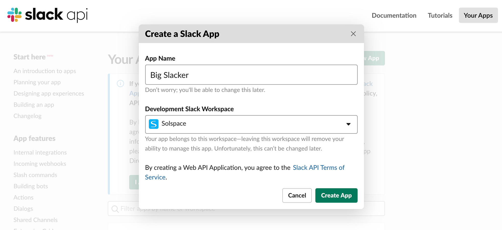
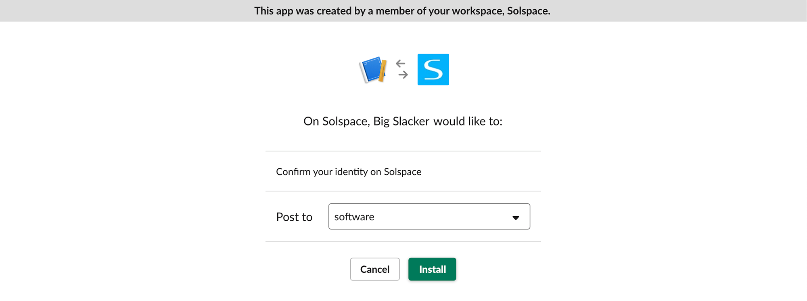
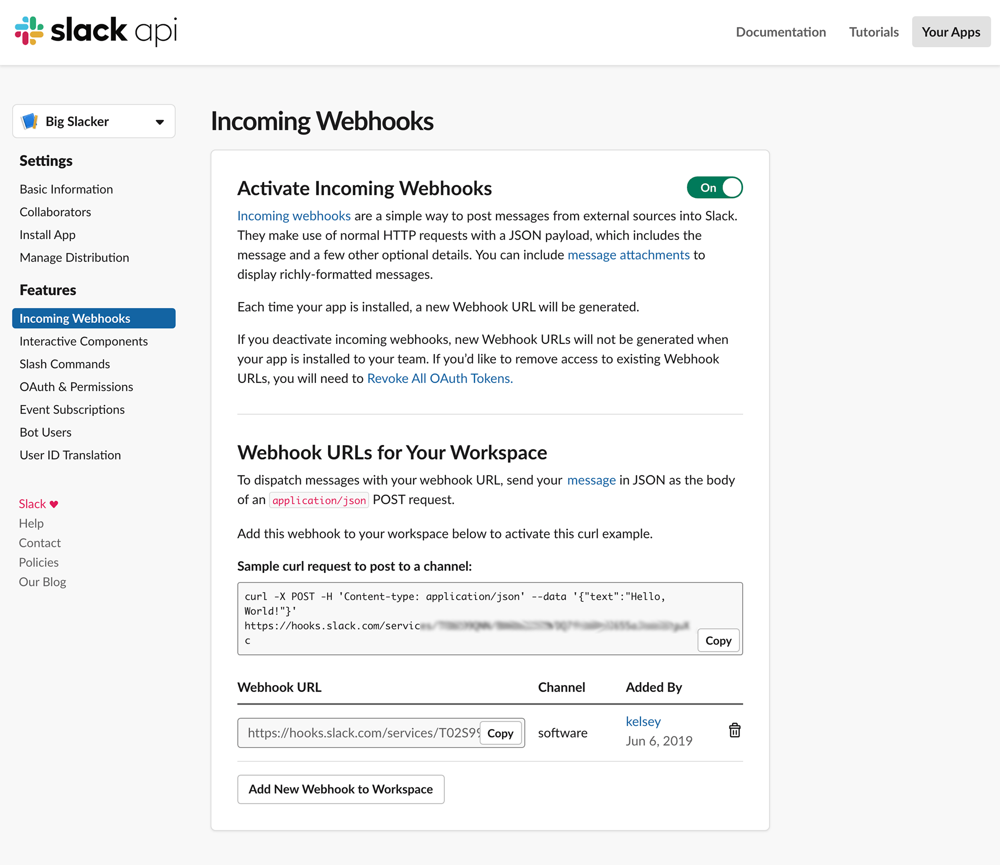
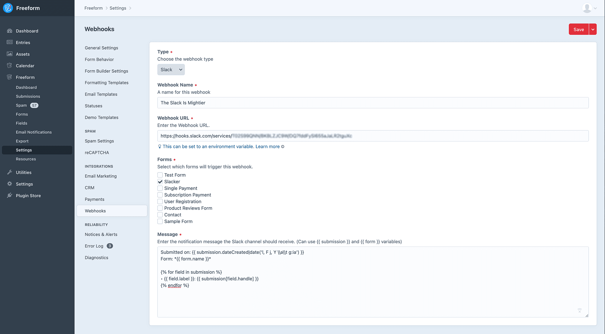

<meta property="og:image" content="https://docs.solspace.com/extras/social/craft/freeform/freeform.png" />

::: new /craft/freeform/v5/integrations/slack/
Freeform
:::

<div id="pr-heading">
    
    <span class="pr-name">Freeform</span>
    <span class="pr-category">for Craft</span>
    <div class="pr-v-wrapper">
        <div class="pr-v">
            <span class="pr-v-v">4.x</span>
            <span class="pr-v-arrow arrow down"></span>
        </div>
        <ul class="pr-v-list">
            <li><a href="/craft/freeform/v5/">5.x<span class="pr-v-type pr-latest">✓ Latest</span></a></li>
            <li><a href="/craft/freeform/v4/">4.x</a></li>
            <li><a href="/craft/freeform/v3/">3.x<span class="pr-v-type pr-retired">Retired</span></a></li>
            <li><a href="/craft/freeform/v2/">2.x<span class="pr-v-type pr-retired">Retired</span></a></li>
            <li><a href="/craft/freeform/v1/">1.x<span class="pr-v-type pr-retired">Retired</span></a></li>
        </ul>
    </div>
    <div class="pr-buy">
        <a href="https://plugins.craftcms.com/freeform" class="button button-blue"><span class="external-url">Plugin Store</span></a>
    </div>
</div>

<span class="page-section"><a href="/craft/freeform/v4/integrations/">Integrations</a></span>

# Slack Integration <Badge type="pro" text="Pro" />
The Slack Webhooks integration allows you to map Freeform submission data off to Slack and post that data into a conversation or channel, etc. These are created using Slack Webhooks and Apps, and you can setup as many as you like.


[[toc]]


## Setup Instructions

<div class="step">
<label for="step1"><input type="checkbox" class="step-check" id="step1">

### Create a new Slack app

</label>

- Go to the [Slack App website](https://api.slack.com/apps/new) and create a new app.
- Click the **Create New App** button and fill out the _App Name_ and choose your _Slack Workspace_ and click the **Create App** button.
    
- Then click on the **Incoming Webhooks** area of the page.
- On the next page, enable the toggle near the top beside _Activate Incoming Webhooks_ title. You'll then see a new section appear below titled _Webhook URLs for Your Workspace_.
- Click on the **Add New Webhook to Workspace** button near the bottom.
- On the next page, choose which channel or conversation the submissions should be posted to, and then click **Install**.
    
- Finally, you'll be taken to a new page (under _Incoming Webhooks_) where you can copy the Webhook URL.
- Copy that Webhook URL and save it to your clipboard (e.g. `https://hooks.slack.com/services/GDF765GF7/56DG98GDF/GFSAD675F8DFG7854D4FDF6F`).
    

</div>

<div class="step">
<label for="step2"><input type="checkbox" class="step-check" id="step2">

### Set up Integration on your site

</label>

- Go to the [Webhooks section in Freeform Settings](../../setup/settings.md#integrations) (**Freeform > Settings > Webhooks**)
- Click the **New Webhook** button at the top right.
- For *Type*, select **Slack**.
- Enter a name for the **Webhook Name** field.
- Paste the Slack Webhook URL you copied earlier into the **Webhook URL** field.
- For the **Message** field, enter what you want your content to look like for Slack. You can use Slack markdown here. See example code below...
- Select the form(s) you want this Webhook to apply to in the **Forms** field.
- At the top right corner of Freeform page, click **Save** button.
    

</div>

<div class="step">
<label for="step3"><input type="checkbox" class="step-check" id="step3">

### Verify the Webhook

</label>

- Try submitting one of your forms that use this webhook, and check if Freeform posts successfully to it!

</div>

<div class="step-finished">Finished!</div>


## Example Slack Message

``` twig
Submitted on: _{{ submission.dateCreated|date('l, F j, Y \\a\\t g:ia') }}_
Form: *{{ form.name }}*


• {{ field.label }}: {{ submission[field.handle] }}

```