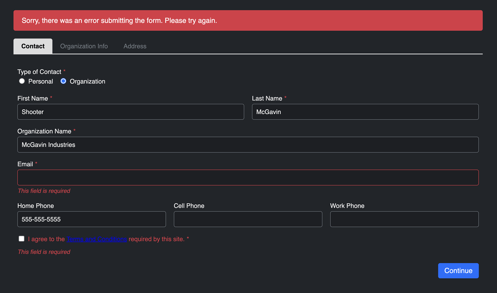

<meta property="og:image" content="https://docs.solspace.com/extras/social/craft/freeform/freeform.png" />

::: new /craft/freeform/v5/news/
Freeform
:::

    
    Freeform
    for Craft
    

        

            4.x
            
        

        <ul class="pr-v-list">
            <li><a href="/craft/freeform/v5/">5.x✓ Latest</a></li>
            <li><a href="/craft/freeform/v4/">4.x</a></li>
            <li><a href="/craft/freeform/v3/">3.xRetired</a></li>
            <li><a href="/craft/freeform/v2/">2.xRetired</a></li>
            <li><a href="/craft/freeform/v1/">1.xRetired</a></li>
        </ul>
    

    

        <a href="https://plugins.craftcms.com/freeform" class="button button-blue">Plugin Store</a>
    

<a href="/craft/freeform/v4/overview/">Overview</a>

# News & Roadmap

Many of our best ideas come from listening carefully to our customers! Check out below to tell us about features you'd like to see added in Freeform. You can also get a taste of what's on our roadmap and what we're currently working on below.

    <a href="#what-s-new" class="menu-box">
        
        

            <h3>What's New!</h3>
            
Check out what's new with Freeform!

        

    </a>
    <a href="#roadmap" class="menu-box">
        
        

            <h3>Roadmap</h3>
            
Check out what we have planned for the future for Freeform.

        

    </a>
    <a href="#feature-requests" class="menu-box">
        
        

            <h3>Feature Requests</h3>
            
We appreciate hearing what our customers have to say!

        

    </a>

[[toc]]

## What's New!

### Improved Headless Support in Freeform 4.1

In Freeform 4.1, we went the extra mile to ensure robust support for [headless](./headless/) website architecture. We improved querying form layouts and added support for using [mutations](./headless/graphql/#mutations) to create submissions via [GraphQL](./headless/graphql/). We built complete and interactive demos for JavaScript-based front-end frameworks such as [Vue.js](./headless/vuejs/), [Next.js](./headless/nextjs/), [React JS](./headless/reactjs/) and more!

### Additional Sample Formatting Templates

We've rolled out a variety of new "basic" formatting templates. They are included in Freeform as a starting point, but they are beautiful and clean enough to be used as is if you wish! They are not dependent on any external libraries or frameworks either.

Check out the new plug-and-play formatting templates here:

- [Basic Light](./templates/formatting/basic-light/)
- [Basic Dark](./templates/formatting/basic-dark/)
- [Basic Floating Labels](./templates/formatting/basic-floating-labels/)
    - Displays labels in the center of the inputs and shrinks them to the top-right when clicked and/or contains a value.
- [Conversational](./templates/formatting/conversational/)
    - Displays 1 field at a time, and smoothly scroll down to the next question until complete. It behaves similarly to how _Typeform_ displays forms, and is also a great choice for survey forms.

## Roadmap
We have packed our schedule with many exciting updates and additions for Freeform!

### Freeform 5 Beta

We have been working on extensively redesigning and improving the Freeform form builder to be even more intuitive! In addition to that are a variety of other improvements and new features! A beta will be available to try out in July 2023.

### Simple User Mode
We've heard your feedback, and we're now working on an update that will allow very granular control over the form-building experience for client users. With these controls, you'll be able to set defaults for most settings and options and choose if the setting should be limited or completely hidden. This will dramatically clean up and improve the client user experience, and prevent them from accessing settings that could easily break forms, etc.

Stay tuned for more updates!

## Feature Requests

Many of our best ideas come from listening carefully to our customers! If you have any ideas or feedback to provide us about Freeform (or what you're seeing in the upcoming Freeform roadmap), please visit the ["Feature Requests" area in the GitHub Discussions](https://github.com/solspace/craft-freeform/discussions/categories/feature-requests) area of the Freeform repository, where you can see all other requests made and vote up ideas you love!