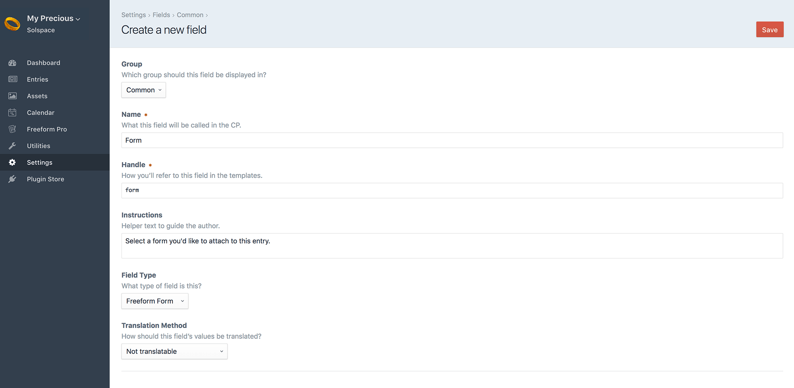
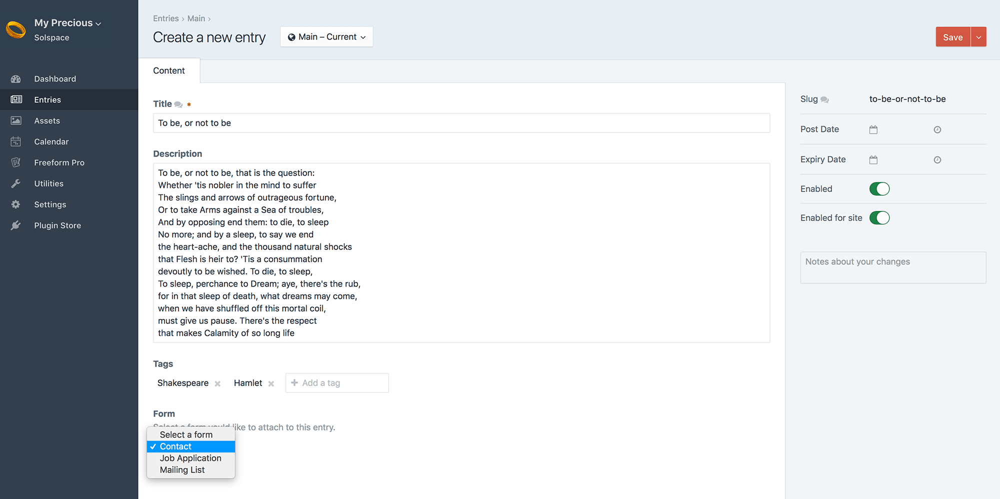

<meta property="og:image" content="https://docs.solspace.com/extras/social/craft/freeform/freeform.png" />

::: new /craft/freeform/v5/forms/fieldtype/
Freeform
:::

<div id="pr-heading">
    
    <span class="pr-name">Freeform</span>
    <span class="pr-category">for Craft</span>
    <div class="pr-v-wrapper">
        <div class="pr-v">
            <span class="pr-v-v">4.x</span>
            <span class="pr-v-arrow arrow down"></span>
        </div>
        <ul class="pr-v-list">
            <li><a href="/craft/freeform/v5/">5.x<span class="pr-v-type pr-latest">✓ Latest</span></a></li>
            <li><a href="/craft/freeform/v4/">4.x</a></li>
            <li><a href="/craft/freeform/v3/">3.x<span class="pr-v-type pr-retired">Retired</span></a></li>
            <li><a href="/craft/freeform/v2/">2.x<span class="pr-v-type pr-retired">Retired</span></a></li>
            <li><a href="/craft/freeform/v1/">1.x<span class="pr-v-type pr-retired">Retired</span></a></li>
        </ul>
    </div>
    <div class="pr-buy">
        <a href="https://plugins.craftcms.com/freeform" class="button button-blue"><span class="external-url">Plugin Store</span></a>
    </div>
</div>

<span class="page-section"><a href="/craft/freeform/v4/overview/">Overview</a></span>

# Element Field Types

Freeform includes a *Freeform Forms* and *Freeform Submissions* fieldtype, which allows you to assign/relate forms and submissions to other element types such as Craft Entries.

Here's an overview on how to use these fieldtypes:


[[toc]]


## Freeform Forms

The Freeform Forms field type allows you to assign/relate forms to other element types such as Craft Entries. A common use-case here would be if you wanted to allow admins to attach a specific Freeform form to a Craft Entry that corresponds to the entry, and then automate loading the form along with the entry in the front end templates.

Follow the instructions below on how to set up and use Freeform field types:

### Creating the Field
Creating a Freeform Form field is done just like any other fieldtype, here's an overview of the process:

<div class="step">
<label for="step1a"><input type="checkbox" class="step-check" id="step1a">

Go to the **Settings** area in Craft control panel. Click on **Fields**.

</label>

Click the **New field** button in the top right corner.

</div>

<div class="step">
<label for="step2a"><input type="checkbox" class="step-check" id="step2a">

Name the field as you wish. For example: *Related Form* with a handle of `relatedForm`.

</label>
</div>

<div class="step">
<label for="step3a"><input type="checkbox" class="step-check" id="step3a">

For the **Field Type** option, select *Freeform Form* from the list.

</label>

**Selection Label** is the text that will appear on the button which opens the Freeform Form selection pop-up dialog.

</div>

<div class="step">
<label for="step4a"><input type="checkbox" class="step-check" id="step4a">

Click the **Save** button in the top right corner to save the new field.

</label>
</div>

<div class="step-finished">Finished!</div>
<div class="counter-reset"></div>

Your Freeform Form field is now available to be assigned to other sections.



### How it Works
The Freeform *Form* fieldtype lets the user assign any Freeform form to any element: a section Entry, Categories, Assets, etc.



### Template Properties

The following are template properties are available for the *Form* fieldtype:

* `name` <a href="#param-name" id="param-name" class="docs-anchor">#</a>
	* Outputs the name of the form
* `handle` <a href="#param-handle" id="param-handle" class="docs-anchor">#</a>
	* Outputs the handle of the form
* `id` <a href="#param-id" id="param-id" class="docs-anchor">#</a>
	* Outputs the unique ID of the form
* `description` <a href="#param-description" id="param-description" class="docs-anchor">#</a>
	* Outputs the description of the form
* `render()` <a href="#param-render" id="param-render" class="docs-anchor">#</a>
	* Outputs the full form, rendering it with the [Formatting Template](./formatting-templates.md) specified in the form builder for the form.

### Examples
An example of template code you would use to display a Freeform form (with field handle of *myFreeformfieldname*) that is attached to a Craft Entry would look something like this:

``` twig

  <div class="entry">
    <h2><a href="{{ entry.url }}">{{ entry.title }}</a></h2>
    {{ entry.summary }}
    
      <h3>{{ entry.myFreeformfieldname.name }}</h3>
      {{ entry.myFreeformfieldname.render() }}
    
  </div>

```

If you'd like to automatically pass content from another element (such as a Craft Entry) into Freeform field(s), you'd have to use the [overrideValues](../templates/objects/form.md#prop-custattr-overridevalues) property inside your formatting template.

For example, if you want to pass a title of an entry to a Freeform field, and the entry slug was in the second segment of your URL, you should set that in your formatting template. Also be sure to include a hidden Freeform field in your form (in this case called `entryTitle`). Your formatting template code might look something like this:

``` twig


{{ form.renderTag({
  overrideValues: { entryTitle: entry.title }
}) }}
```


## Freeform Submissions

The Freeform Submissions field type by itself is not the most usable feature, but when paired with the [Relations](./relations.md) feature it allows Freeform to do extraordinary things like become a tool that let's your users comment on entries, submit ratings and reviews for Commerce (and regular) products and more! The [Relations](./relations.md) feature essentially allows you to feed another Craft Element ID to the form that is attached to the submission(s), and the Freeform submission then becomes attached to the other element the same way an Asset does, etc.

### Creating the Field
Creating a Freeform Submissions field is done just like any other fieldtype, here's an overview of the process:

<div class="step">
<label for="step1b"><input type="checkbox" class="step-check" id="step1b">

Go to the **Settings** area in Craft control panel. Click on **Fields**.

</label>

Click the **New field** button in the top right corner.

</div>

<div class="step">
<label for="step2b"><input type="checkbox" class="step-check" id="step2b">

Name the field as you wish. For example: *Related Submissions* with a handle of `relatedSubmissions`.

</label>
</div>

<div class="step">
<label for="step3b"><input type="checkbox" class="step-check" id="step3b">

For the **Field Type** option, select *Freeform Submissions* from the list.

</label>

**Selection Label** is the text that will appear on the button which opens the Freeform Submissions selection pop-up dialog.

</div>

<div class="step">
<label for="step4b"><input type="checkbox" class="step-check" id="step4b">

Click the **Save** button in the top right corner to save the new field.

</label>
</div>

<div class="step-finished">Finished!</div>

Your Freeform Submissions field is now available to be assigned to other sections.

### How it Works

Please see the [Relating Submissions to Elements](./relations.md) documentation for a complete guide on setting this up.