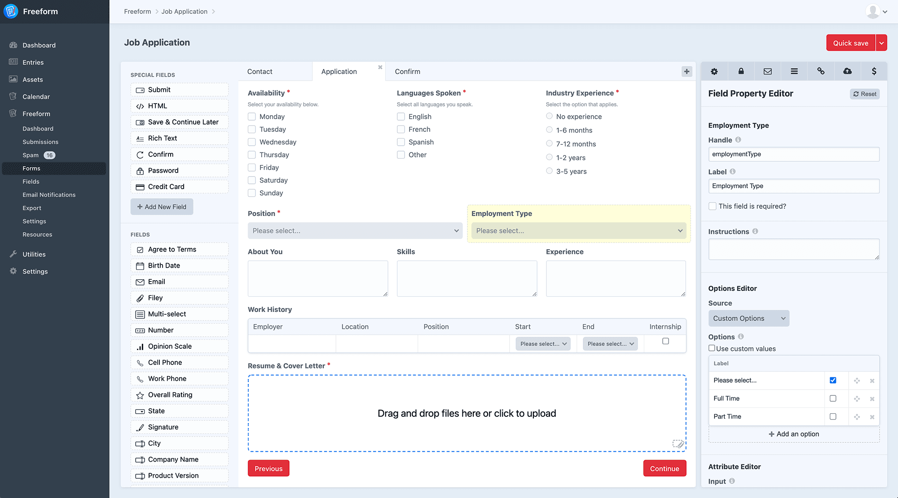
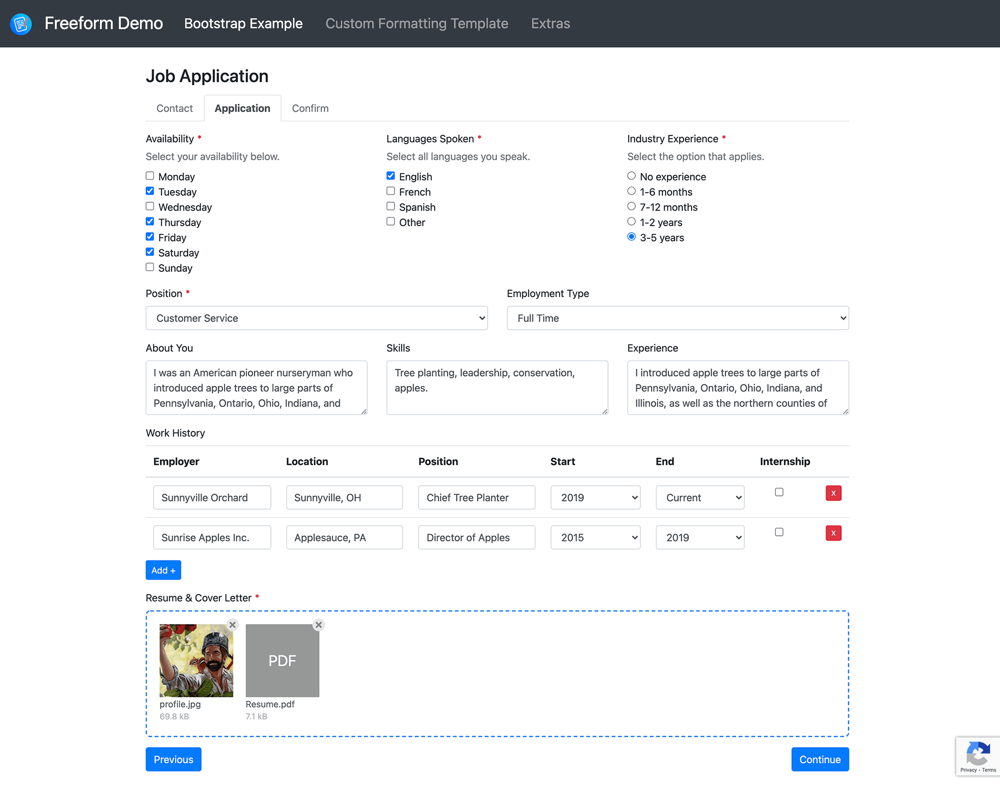

<meta property="og:image" content="https://docs.solspace.com/extras/social/craft/freeform/freeform.png" />

::: new /craft/freeform/v5/forms/builder/#multi-page-forms
Freeform
:::

<div id="pr-heading">
    
    <span class="pr-name">Freeform</span>
    <span class="pr-category">for Craft</span>
    <div class="pr-v-wrapper">
        <div class="pr-v">
            <span class="pr-v-v">4.x</span>
            <span class="pr-v-arrow arrow down"></span>
        </div>
        <ul class="pr-v-list">
            <li><a href="/craft/freeform/v5/">5.x<span class="pr-v-type pr-latest">✓ Latest</span></a></li>
            <li><a href="/craft/freeform/v4/">4.x</a></li>
            <li><a href="/craft/freeform/v3/">3.x<span class="pr-v-type pr-retired">Retired</span></a></li>
            <li><a href="/craft/freeform/v2/">2.x<span class="pr-v-type pr-retired">Retired</span></a></li>
            <li><a href="/craft/freeform/v1/">1.x<span class="pr-v-type pr-retired">Retired</span></a></li>
        </ul>
    </div>
    <div class="pr-buy">
        <a href="https://plugins.craftcms.com/freeform" class="button button-blue"><span class="external-url">Plugin Store</span></a>
    </div>
</div>

<span class="page-section"><a href="/craft/freeform/v4/overview/">Overview</a></span>

# Multi-Page Forms

Freeform allows for *multi-page* forms (a POST submit per page). When editing forms in the form builder, if you wish to rearrange pages, simply drag and drop the tabs. If you need to move a field from one page to another, drag and drop the field onto the page tab you'd like it to be moved to. It will then appear at the top of that page, and you can finish placing it where it should be on that page.

::: guide ../../guides/displaying-submission-data-from-previous-pages/
Need to display submission data from previous pages as a confirmation screen, etc?
:::

::: guide ../../guides/troubleshooting-form-issues/
Quick troubleshooting the most commonly reported issues with your form's appearance, behavior, or submission of the form on the front end.
:::


[[toc]]


## Overview

### Important Notes

- Each page is submitted through `POST`.
- There is no unique URI segment per page at this time.
- Users cannot jump ahead to different pages, only forward and backward (if enabled) 1 page.
- Multi-page forms work with the [built-in AJAX](../templates/ajax-forms.md) feature.
	- **Editing** existing submissions via the front end in multi-page AJAX forms will currently not work correctly.
- To allow users to stop and return at a later time to complete the form, it will require use of the [Save & Continue Later](../overview/save-continue-later.md) feature. Otherwise, the process has to be a continuous one, but the user has 3 hours before the form will timeout the submission.
- If an earlier page contains file upload field(s), files will actually be uploaded before the form is officially submitted.
	- After 3 hours (by default), Freeform will automatically remove any uploaded files if the form isn't finished being submitted.
	- If you require a longer period of time, we recommend using the [File Upload Drag & Drop](./fields.md#file-upload-drag--drop) field and the [Save & Continue Later](../overview/save-continue-later.md) feature.

### Manual Submit Buttons in Multi-page Forms
When manually building submit buttons in multi-page forms, be sure to include a `data-freeform-action` attribute to it.

The attribute value differs between various types of submit buttons:
- For the regular submit button that advances forms forward, its value must be `submit`.
- For the _back_ buttons (if applicable) in multi-page forms, the value must be `back`.
- For the [Save & Continue Later](../overview/save-continue-later.md) buttons (if applicable), the value must be `save`.

```html
<button type="submit" data-freeform-action="submit">Submit</button>
<button type="submit" data-freeform-action="back">Go Back</button>
<button type="submit" data-freeform-action="save">Save & Continue Later</button>
```

### Screenshots



