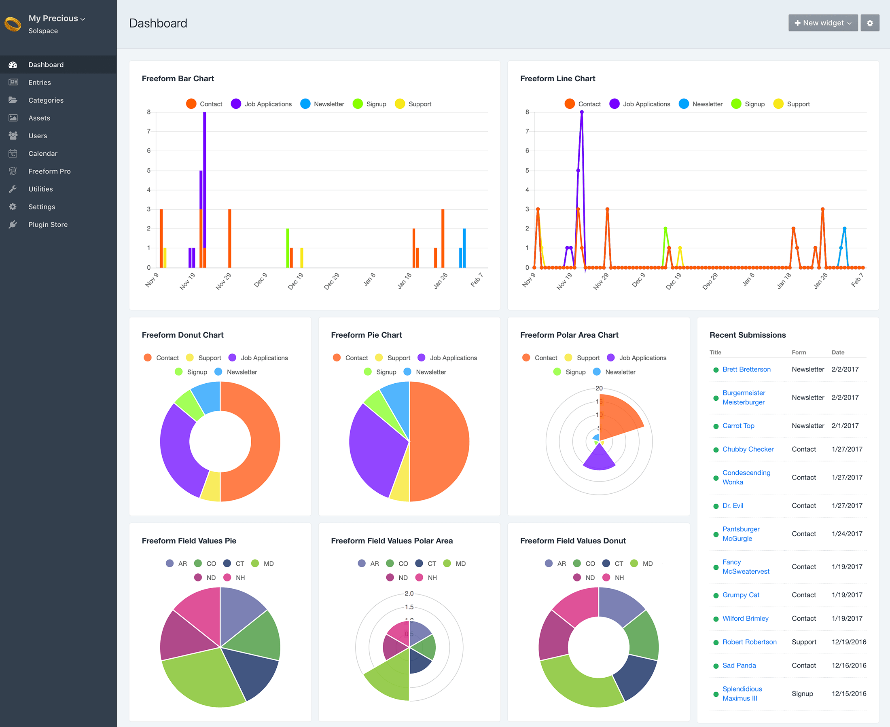
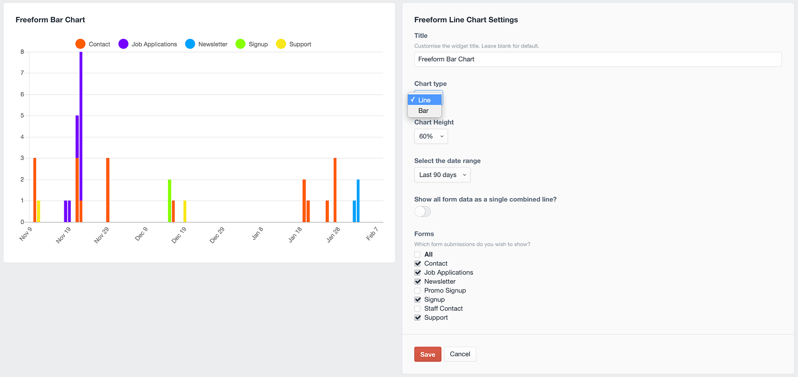
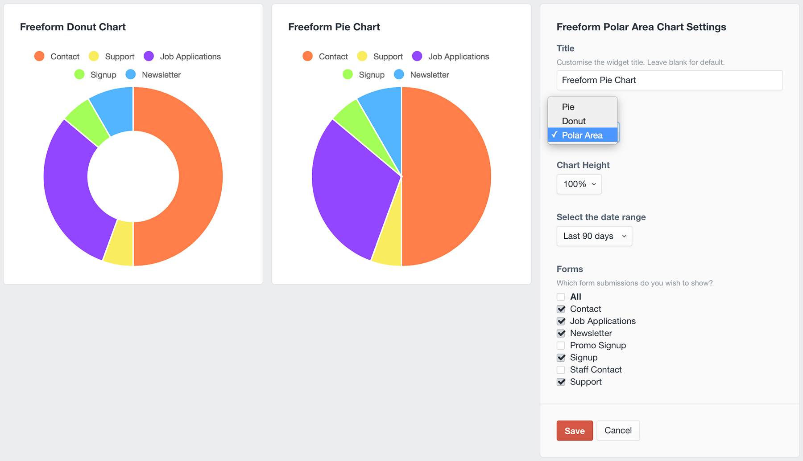
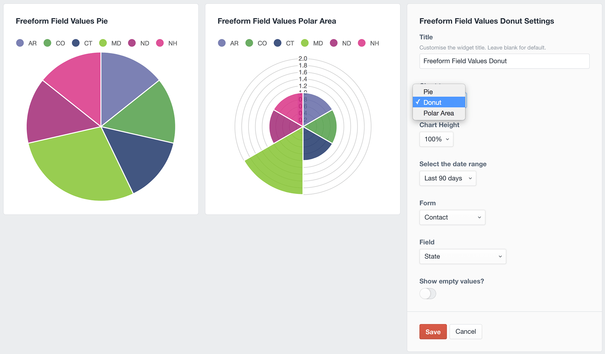
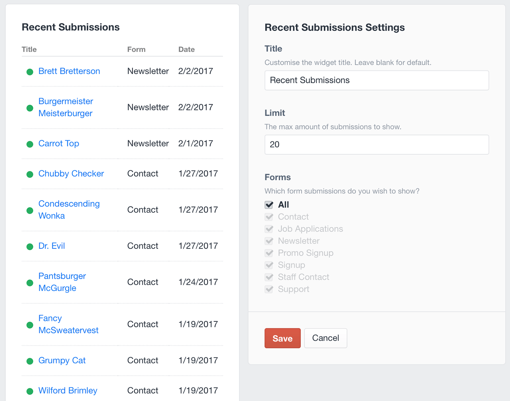
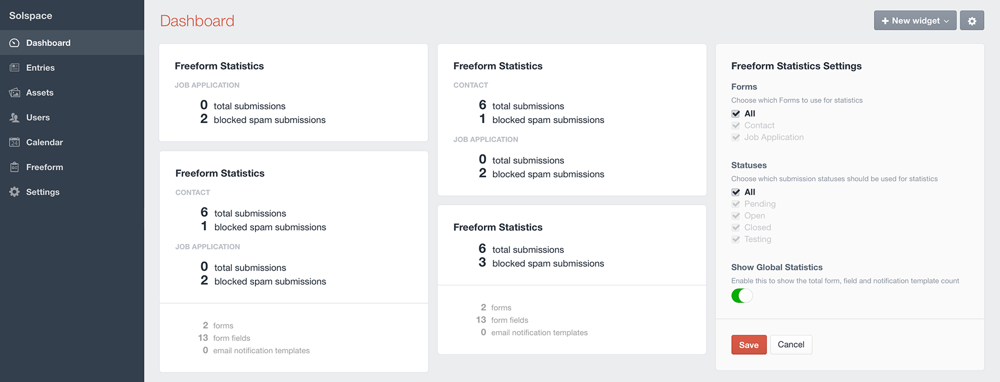

<meta property="og:image" content="https://docs.solspace.com/extras/social/craft/freeform/freeform.png" />

::: new /craft/freeform/v5/submissions/widgets/
Freeform
:::

    
    Freeform
    for Craft
    

        

            4.x
            
        

        <ul class="pr-v-list">
            <li><a href="/craft/freeform/v5/">5.x✓ Latest</a></li>
            <li><a href="/craft/freeform/v4/">4.x</a></li>
            <li><a href="/craft/freeform/v3/">3.xRetired</a></li>
            <li><a href="/craft/freeform/v2/">2.xRetired</a></li>
            <li><a href="/craft/freeform/v1/">1.xRetired</a></li>
        </ul>
    

    

        <a href="https://plugins.craftcms.com/freeform" class="button button-blue">Plugin Store</a>
    

<a href="/craft/freeform/v4/overview/">Overview</a>

# Dashboard Widgets

There are 6 dashboard widgets available for Freeform. Two widgets are included with Freeform and the other four are available only in Freeform Pro. To get access the advanced widgets, purchase (or purchase an upgrade to) *Freeform Pro*.

[[toc]]

## Linear Chart widget <Badge type="pro" text="Pro" />

This widget allows you to display a **line** or **bar** chart form your submissions. Colors of forms for charts are automatically generated by Freeform, but you can customize each form's color in the Form Settings property editor column in the form builder.

Configuration options are as follows:

* **Title** - customize the title of widget
* **Chart type** - choose from **Line** or **Bar**
* **Chart Height** - customize the height display of widget
* **Select the date range**:
	* Last 24 hours
	* Last 7 days
	* Last 30 days
	* Last 60 days
	* Last 90 days
* **Show all form data as a single combined line?**
	* If enabled, it combines all selected forms into a single value to be displayed as a line/bars.
* **Forms** - choose from **All** forms or select which ones you want to show data for

## Radial Chart widget <Badge type="pro" text="Pro" />

This widget allows you to display a **pie**, **donut** or **polar area** chart form your submissions. Colors of forms for charts are automatically generated by Freeform, but you can customize each form's color in the Form Settings property editor column in the form builder.

Configuration options are as follows:

* **Title** - customize the title of widget
* **Chart type** - choose from **Pie**, **Donut** or **Polar Area**
* **Chart Height** - customize the height display of widget
* **Select the date range**:
	* Last 24 hours
	* Last 7 days
	* Last 30 days
	* Last 60 days
	* Last 90 days
* **Forms** - choose from **All** forms or select which ones you want to show data for

## Field Values Chart widget <Badge type="pro" text="Pro" />

This widget allows you to display a **pie**, **donut** or **polar area** chart based on options selected from submissions for a specific form. Colors of field values for charts are automatically generated by Freeform and cannot be adjusted.

Configuration options are as follows:

* **Title** - customize the title of widget
* **Chart type** - choose from **Pie**, **Donut** or **Polar Area**
* **Chart Height** - customize the height display of widget
* **Select the date range**:
	* Last 24 hours
	* Last 7 days
	* Last 30 days
	* Last 60 days
	* Last 90 days
* **Form** - choose a form you want to show data for
* **Field** - choose a field you want to show data for
* **Show empty values?**
	* Disable this if you don't want empty values to be factored into the results

## Recent Submissions widget <Badge type="pro" text="Pro" />

This widget allows you to display a list of the most recent submissions from your form(s).

Configuration options are as follows:

* **Title** - customize the title of widget
* **Limit** - select the total number of submissions you'd like to be displayed
* **Forms** - choose from **All** forms or select which ones you want to show submissions from.

## Quick Form widget <Badge type="pro" text="Pro" />

This widget allows you to display regular Freeform forms inside the Craft Dashboard. The most common use-case would be for setting up a support form for your clients to contact you from if they have any questions or issues.

Configuration options are as follows:

* **Title** - customize the title of widget.
* **Success Message** - set the message to be displayed to the user when the form has been successfully submitted.
* **Forms** - choose which form to use.

::: warning
This currently will not work with multi-page forms, and there might be some limitations with complex forms.
:::

## Stats widget

This is a simple widget (included with all editions of Freeform) that allows you to display some basic information about your Freeform submissions and setup. You can display stats for all forms or for individual form(s), as well as filter the stats by statuses.

When running into issues with Freeform, it can particularly be helpful when contacting Solspace Support (by just taking a screenshot of it), as it provides a glimpse of your setup and amount of data.

* Total submissions
* Blocked spam submissions
	* Counts can be reset per form in **Freeform > Forms** page.
* Total number of forms
* Total number of form fields
* Total number of email notification templates