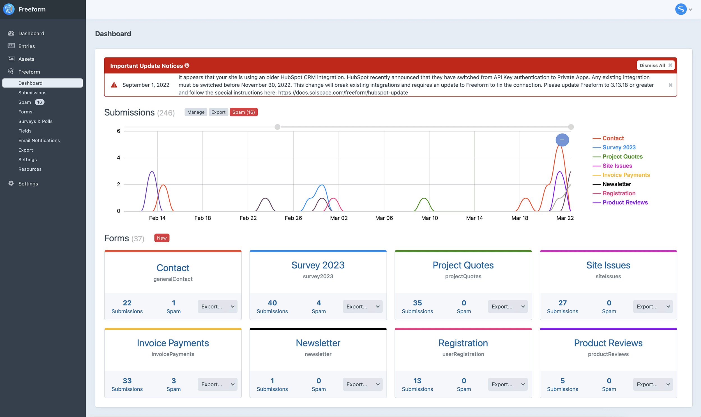

<meta property="og:image" content="https://docs.solspace.com/extras/social/craft/freeform/freeform.png" />

::: new /craft/freeform/v5/configuration/notices-alerts/
Freeform
:::

    
    Freeform
    for Craft
    

        

            4.x
            
        

        <ul class="pr-v-list">
            <li><a href="/craft/freeform/v5/">5.x✓ Latest</a></li>
            <li><a href="/craft/freeform/v4/">4.x</a></li>
            <li><a href="/craft/freeform/v3/">3.xRetired</a></li>
            <li><a href="/craft/freeform/v2/">2.xRetired</a></li>
            <li><a href="/craft/freeform/v1/">1.xRetired</a></li>
        </ul>
    

    

        <a href="https://plugins.craftcms.com/freeform" class="button button-blue">Plugin Store</a>
    

<a href="/craft/freeform/v4/reliability/">Reliability</a>

# Reliability for Freeform

Freeform is committed to being the most robust and reliable form plugin for Craft CMS. Freeform has been carefully and meticulously developed and tested over many years and is in use across tens of thousands of websites. However, one other crutial piece of the puzzle in reliability is how your specific site and environment are performing. Because of this, Freeform includes an extensive error logging feature, email issue alerts, an Update Notices feature to alert you of important fixes and changes, and a weekly/daily digest email to keep your finger on the pulse of your website.

    <a href="./digest/" class="menu-box">
        
        

            <h3>Weekly/Daily Digest</h3>
            
Helps keep your finger on the pulse of your site.

        

    </a>
    <a href="./update-notices/" class="menu-box">
        
        

            <h3>Update Notices</h3>
            
Alerts you of potential issues that specifically may affect your site.

        

    </a>
    <a href="./email-alerts/" class="menu-box">
        
        

            <h3>Email Failure Alerts</h3>
            
Send notifications when an email fails to send due to an error on your site.

        

    </a>
    <a href="./diagnostics/" class="menu-box">
        
        

            <h3>Diagnostics</h3>
            
A self-diagnostics page that may help you track down potential issues.

        

    </a>

::: video DoB0OXSzyu0
Video: Overview of Reliability Features
:::

