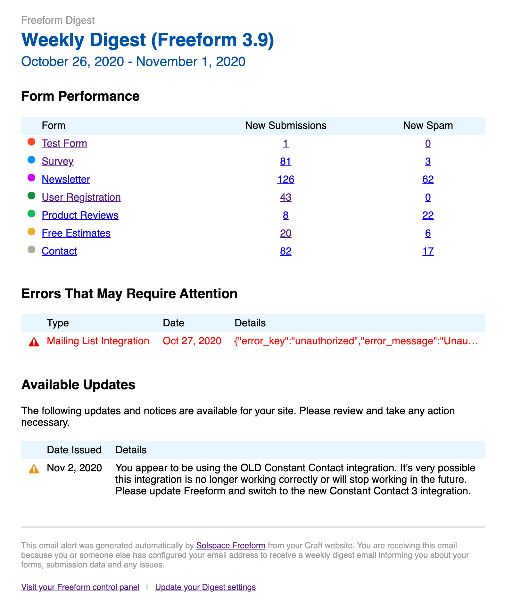

<meta property="og:image" content="https://docs.solspace.com/extras/social/craft/freeform/freeform.png" />

::: new /craft/freeform/v5/configuration/notices-alerts/
Freeform
:::

    
    Freeform
    for Craft
    

        

            4.x
            
        

        <ul class="pr-v-list">
            <li><a href="/craft/freeform/v5/">5.x✓ Latest</a></li>
            <li><a href="/craft/freeform/v4/">4.x</a></li>
            <li><a href="/craft/freeform/v3/">3.xRetired</a></li>
            <li><a href="/craft/freeform/v2/">2.xRetired</a></li>
            <li><a href="/craft/freeform/v1/">1.xRetired</a></li>
        </ul>
    

    

        <a href="https://plugins.craftcms.com/freeform" class="button button-blue">Plugin Store</a>
    

<a href="/craft/freeform/v4/reliability/">Reliability</a>

# Weekly & Daily Digests

The Freeform _Weekly or Daily Digest_ email notifications will keep you in the loop about your website's Freeform form performance and status. It includes a snapshot of the previous week's performance and any logged errors and upgrade notices (if enabled).

Paired with the [Update Notices](./update-notices.md) system, this is a powerful feature that allows you to keep your finger on the pulse of your website without logging in and checking every once in a while. It allows you to routinely catch issues sooner and minimize site issues and lost valuable form submission data, etc.

[[toc]]

## Setup

To enable this feature, go to the **Freeform CP -> Settings -> Notices & Alerts** settings page. Add email address(es) you'd like to receive alerts in the **Weekly Digest Email** setting.

## How It Works

Each week on Monday morning, Freeform will schedule an email notification to be delivered to the specified email address(es). This email notification will include such information as new submission and new spam counts for the previous week, currently logged errors, and important [Update Notices](./update-notices.md) (if enabled) that may require you attention.

::: tip
Please note that this feature requires any site visitor visit your site in order for the cache and trigger to be checked and sent. If for any reason your site receives no traffic at all on a given Monday morning, the email notification will be sent the next time someone does visit the site. If your email server configuration is not working correctly, this feature will not work.
:::

::: video DoB0OXSzyu0
Video: Overview of Reliability Features
:::