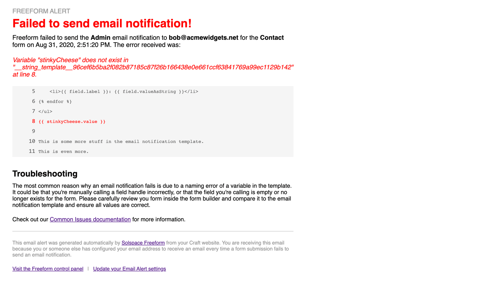

<meta property="og:image" content="https://docs.solspace.com/extras/social/craft/freeform/freeform.png" />

::: new /craft/freeform/v5/configuration/notices-alerts/
Freeform
:::

    
    Freeform
    for Craft
    

        

            4.x
            
        

        <ul class="pr-v-list">
            <li><a href="/craft/freeform/v5/">5.x✓ Latest</a></li>
            <li><a href="/craft/freeform/v4/">4.x</a></li>
            <li><a href="/craft/freeform/v3/">3.xRetired</a></li>
            <li><a href="/craft/freeform/v2/">2.xRetired</a></li>
            <li><a href="/craft/freeform/v1/">1.xRetired</a></li>
        </ul>
    

    

        <a href="https://plugins.craftcms.com/freeform" class="button button-blue">Plugin Store</a>
    

<a href="/craft/freeform/v4/reliability/">Reliability</a>

# Email Failure Alerts

Freeform offers the ability to automatically send an email notification alerting the email address(es) specified when an email notification cannot be delivered.

[[toc]]

## Setup

To enable this feature, go to the **Freeform CP -> Settings -> Notices & Alerts** settings page. Add email address(es) you'd like to receive alerts in the **Send Email Alerts for Failed Notifications** setting.

## How It Works

Every time Freeform fails sending an email notification due to common issues like typos in variable names or syntax errors, etc in email notification templates, Freeform will then attempt to notify the email address(es) specified in this setting.

::: tip
Please note that this feature is not guaranteed to catch every possible email failure. It's possible there might be other pieces at play here, and if your email server configuration itself is not correct, this feature will not work.
:::

::: video DoB0OXSzyu0
Video: Overview of Reliability Features
:::