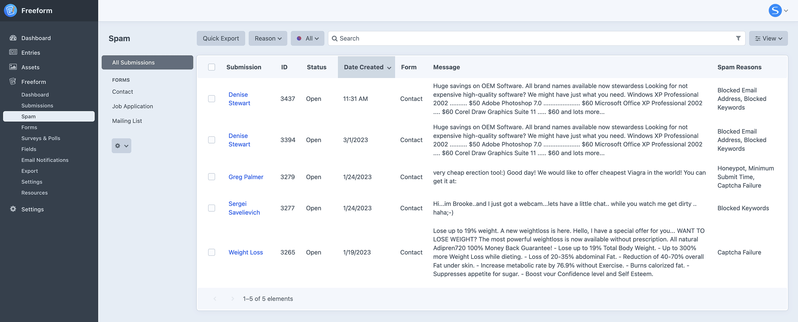
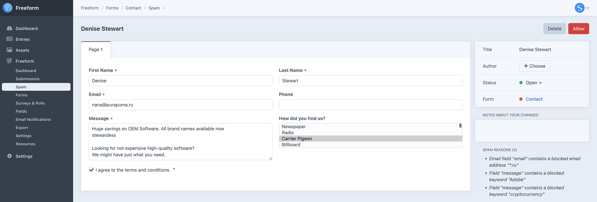
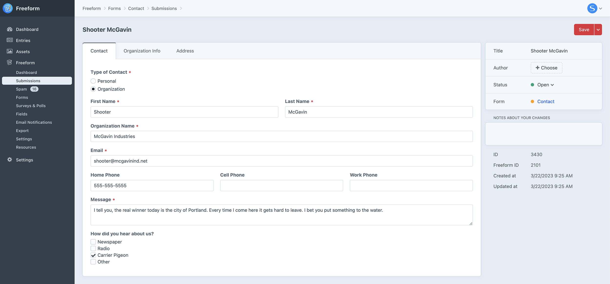
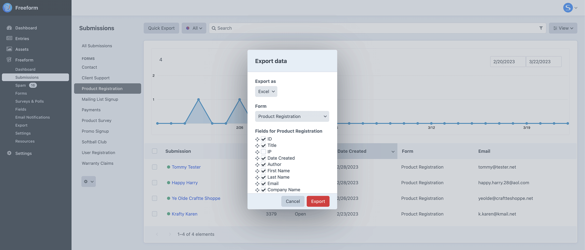

<meta property="og:image" content="https://docs.solspace.com/extras/social/craft/freeform/freeform.png" />

    
    Freeform
    for Craft
    

        

            5.x
            ✓ Latest
            
        

        <ul class="pr-v-list">
            <li><a href="/craft/freeform/v5/">5.x✓ Latest</a></li>
            <li><a href="/craft/freeform/v4/">4.x</a></li>
            <li><a href="/craft/freeform/v3/">3.xRetired</a></li>
            <li><a href="/craft/freeform/v2/">2.xRetired</a></li>
            <li><a href="/craft/freeform/v1/">1.xRetired</a></li>
        </ul>
    

    

        <a href="https://plugins.craftcms.com/freeform" class="button button-blue">Plugin Store</a>
    

<h2>Ready for wherever your project takes you.</h2>

Freeform is a versatile form-building tool that can adjust to the evolving needs of your project, whether it's a simple or complex form. It offers effective spam protection and an easy-to-use form builder with powerful field types and built-in convenience features that your users will love. Freeform integrates seamlessly with popular CRMs, email marketing services, Craft elements, and more. It includes fully customizable ready-to-go templates and also offers headless support.

    <a href="#feature-tour" class="button button-lg">
        Feature Tour
    </a>
    <a href="#compare" class="button button-lg">
        Pricing
    </a>
    <a href="./getting-started/" class="button button-lg">
        Getting Started
    </a>
    <small>
        <a href="https://plugins.craftcms.com/freeform">INSTALL A FREE, UNLIMITED TRIAL TODAY!</a>
    </small>

[[toc]]

<video autoplay loop muted>
    <source src="./videos/builder-feature.mp4" type="video/mp4">
    This browser does not display the video tag.
</video>

    <a href="./getting-started/" class="menu-box">
        
        

            <h3>Getting Started</h3>
            
Learn the basics about Freeform and setting up forms.

        

    </a>
    <a href="./guides/" class="menu-box">
        
        

            <h3>User Guides</h3>
            
See solutions to common problems and questions.

        

    </a>
    <a href="/support/" class="menu-box">
        
        

            <h3>Support</h3>
            
Questions or issues? We want to help your project go smoothly!

        

    </a>

## Reliability

<h3>Functional forms are crucial. Impressive features are useless if they don't work.</h3>

Losing customer leads can result in significant revenue loss and a negative impression on potential clients. We prioritize reliability above all else in Freeform to address this issue.

    

        
        

            <h3>Email Failure Alerts</h3>
            
Freeform will email you if there is a template or setup issue with your site. <a href="./configuration/notices-alerts/">Learn&nbsp;more&nbsp;→</a>

        

    

    

        
        

            <h3>Automatic Update Notices</h3>
            
Freeform alerts you to potential website issues, catching errors before you notice. <a href="./configuration/notices-alerts/">Learn&nbsp;more&nbsp;→</a>

        

    

    

        
        

            <h3>Weekly / Daily Digest Email</h3>
            
Get email updates about what's happening on your site with weekly or daily digests. <a href="./configuration/notices-alerts/">Learn&nbsp;more&nbsp;→</a>

        

    

    

        
        

            <h3>Error Logging</h3>
            
The error logging system tells you quickly about any problems on your website.

        

    

    

        
        

            <h3>Satisfaction Guaranteed</h3>
            
Try Freeform risk-free with our 90-day full refund guarantee.

        

    

    

        
        

            <h3>Private Support Tickets</h3>
            
If you need help with Freeform, send us a <a href="/support/">private support ticket</a> and we'll be happy to assist you.

        

    

    <a href="./configuration/notices-alerts/" class="button button-lg">Reliability options</a>
    <a href="/support/" class="button button-lg">Support options</a>

## Form Builder

<h3>Everything is at your fingertips in our elegant and intuitive form builder.</h3>

The Freeform form builder is an all-in-one interface that lets you take control of almost every aspect of your forms.

<video autoplay loop muted class="neg20-margin-top">
    <source src="./videos/builder-sections.mp4" type="video/mp4">
    This browser does not display the video tag.
</video>

    <a href="./forms/builder/" class="button button-lg">Form Builder Overview</a>

## Convenience

<h3>So many plug-and-play features that make form building and templating a breeze!</h3>

    

        
        

            <h3>Forms Dashboard</h3>
            
The Forms Dashboard provides a clear overview of your forms, submissions, and updates in one convenient location. <a href="./forms/builder/">Learn&nbsp;more&nbsp;→</a>

        

    

    

        
        

            <h3>Multi-Page Forms</h3>
            
Do you have a lengthy form? With Freeform, you can divide your form into several pages. <a href="./forms/builder/#multi-page-forms">Learn&nbsp;more&nbsp;→</a>

        

    

    

        
        

            <h3>Complete Validation</h3>
            
Freeform has validation features for fields, including making them required and ensuring specific data.

        

    

    

        
        

            <h3>Built-in AJAX</h3>
            
By simply checking a checkbox, Freeform will handle the AJAX processing for your form effortlessly.

        

    

    

        
        

            <h3>Drag & Drop File Upload</h3>
            
The premium JS-based file uploading field shows progress and thumbnails and remembers existing files when editing. <a href="./forms/fields/#file-upload-drag-drop">Learn&nbsp;more&nbsp;→</a>

        

    

    

        
        

            <h3>Limited Users <Badge type="feature" text="New!" /></h3>
            
Customize the form builder experience for specific users or groups.
            <a href="./configuration/limited-users/">Learn&nbsp;more&nbsp;→</a>

        

    

    

        
        

            <h3>Google Tag Manager</h3>
            
Built-in flexible Google Tag Manager support with AJAX implementations.

        

    

    

        
        

            <h3>Sample Templates</h3>
            
Offers a variety of popular framework formatting templates that you can use as a starting point to develop your own project. <a href="./templates/formatting/">Learn&nbsp;more&nbsp;→</a>

        

    

    

        
        

            <h3>Widgets</h3>
            
Enhance your Craft Dashboard with stunning widgets like linear charts, radial charts, and recent submissions widgets. <a href="./forms/widgets/">Learn&nbsp;more&nbsp;→</a>

        

    

## Spam Protection

<h3>Fight spam effectively.</h3>

    

    

    

        
        

            <h3>Freeform Honeypot</h3>
            
The Honeypot feature included in the system effectively deals with simple bot spam. <a href="./forms/spam-protection/#freeform-honeypot">Learn&nbsp;more&nbsp;→</a>

        

    

    

        
        

            <h3>Built-in Spam Folder</h3>
            
Use the Spam Folder to catch any potential spam without risking missing legitimate submissions. <a href="./forms/spam-protection/#spam-folder">Learn&nbsp;more&nbsp;→</a>

        

    

    

        
        

            <h3>reCAPTCHA & hCaptcha</h3>
            
To enhance your spam-fighting capabilities, you can choose to enable either <b>reCAPTCHA</b> or <b>hCaptcha</b>. <a href="./forms/spam-protection/#recaptcha">Learn&nbsp;more&nbsp;→</a>

        

    

    

        
        

            <h3>Keyword Blocking</h3>
            
With Freeform, you have the power to target and block specific email addresses, keywords, and IP addresses. <a href="./forms/spam-protection/#spam-blocking">Learn&nbsp;more&nbsp;→</a>

        

    

    

        
        

            <h3>Throttling / Submit Time</h3>
            
Limit form submissions by setting restrictions such as submission frequency, waiting period, or time limit for completion. <a href="./configuration/settings/#form-submission-throttling">Learn&nbsp;more&nbsp;→</a>

        

    

    

        
        

            <h3>Automatic Purging</h3>
            
Freeform can automatically delete submissions marked as spam after a set number of days. <a href="./configuration/settings/#automatically-purge-spam-submissions">Learn&nbsp;more&nbsp;→</a>

        

    

## Powerful Fields

<h3>Freeform offers a diverse range of fieldtypes and advanced features to populate and control them.</h3>

<video autoplay loop muted class="neg20-margin-top">
    <source src="./videos/builder-rules.mp4" type="video/mp4">
    This browser does not display the video tag.
</video>

    

        
        

            <h3>Conditional Rules</h3>
            
Customize your form by setting pages to skip and fields to appear/disappear based on other field contents or selections. <a href="./forms/conditional-rules/">Learn&nbsp;more&nbsp;→</a>

        

    

    

        
        

            <h3>Populate Field Options</h3>
            
Use Craft Element data or predefined Freeform options such as countries or months to populate dropdowns, checkboxes, and radios. <a href="./forms/fields/#populating-fields-with-elements-predefined-options">Learn&nbsp;more&nbsp;→</a>

        

    

    

        
        

            <h3>Reuse Fields <Badge type="feature" text="New!" /></h3>
            
Save common fields as favorites, or quickly search across all forms to reuse an existing field.
            <a href="./forms/builder/">Learn&nbsp;more&nbsp;→</a>

        

    

    

        
        

            <h3>Field Encryption <Badge type="feature" text="New!" /></h3>
            
Each field includes the ability to optionally encrypt its submission data. Simply toggle the setting and Freeform will take care of the rest.
            <a href="./forms/fields/#field-encryption">Learn&nbsp;more&nbsp;→</a>

        

    

    

        
        

            <h3>Custom Field Types <Badge type="feature" text="New!" /></h3>
            
Easily create your own custom field types!
            <a href="./developer/field-types/">Learn&nbsp;more&nbsp;→</a>

        

    

    

        
        

            <h3>Include a Review Page</h3>
            
Use Twig code in an HTML block to create a custom review page for users to double-check form data from previous pages before submission.

        

    

    <a href="./forms/fields/" class="button button-lg">Fields Overview</a>

    <a href="./forms/fields/#text">
        
        <h3>Text</h3>
        
Regular text inputs

    </a>
    <a href="./forms/fields/#textarea">
        
        <h3>Textarea</h3>
        
Multi-line text inputs

    </a>
    <a href="./forms/fields/#email">
        
        <h3>Email</h3>
        
Email validation and notifications

    </a>
    <a href="./forms/fields/#number">
        
        <h3>Number</h3>
        
Numeric validation and options

    </a>
    <a href="./forms/fields/#hidden">
        
        <h3>Hidden</h3>
        
Hide field data

    </a>
    <a href="./forms/fields/#dropdown">
        
        <h3>Dropdown</h3>
        
Dropdown field with powerful options to populate data

    </a>
    <a href="./forms/fields/#multiple-select">
        
        <h3>Multiple Select</h3>
        
Multi-select field with powerful options to populate data

    </a>
    <a href="./forms/fields/#checkbox">
        
        <h3>Checkbox</h3>
        
Single checkbox, e.g. 'Accept Terms'

    </a>
    <a href="./forms/fields/#checkboxes">
        
        <h3>Checkboxes</h3>
        
Multi-checkboxes field with powerful options to populate data

    </a>
    <a href="./forms/fields/#radios">
        
        <h3>Radios</h3>
        
Radio options field with powerful options to populate data

    </a>
    <a href="./forms/fields/#file-upload">
        
        <h3>File Upload</h3>
        
Upload and validate one or multiple files to be attached to the submission

    </a>
    <a href="./forms/fields/#file-upload-drag-drop">
        
        <h3>File Drag & Drop</h3>
        
Smart file uploader shows progress, thumbnails and memory when editing

    </a>
    <a href="./forms/fields/#date-time">
        
        <h3>Date & Time</h3>
        
Date and time picker with JS validation

    </a>
    <a href="./forms/fields/#phone">
        
        <h3>Phone</h3>
        
Set a phone pattern with JS validation

    </a>
    <a href="./forms/fields/#table">
        
        <h3>Table</h3>
        
Collect tabular or repeating data, allow users to add/remove rows

    </a>
    <a href="./forms/fields/#group">
        
        <h3>Group <Badge type="feature" text="New!" /></h3>
        
Contains other fields within it

    </a>
    <a href="./forms/fields/#rating">
        
        <h3>Rating</h3>
        
Plug and play rating stars

    </a>
    <a href="./forms/fields/#opinion-scale">
        
        <h3>Opinion Scale</h3>
        
Users can select ranges for surveys

    </a>
    <a href="./forms/fields/#calculation">
        
        <h3>Calculation <Badge type="feature" text="New!" /></h3>
        
Perform dynamic calculations based on user-input values within forms

    </a>
    <a href="./forms/fields/#signature">
        
        <h3>Signature</h3>
        
Users can digitally sign submissions

    </a>
    <a href="./forms/fields/#invisible">
        
        <h3>Invisible</h3>
        
Include hidden data that is not visible in rendered source code

    </a>
    <a href="./forms/fields/#regex">
        
        <h3>Regex</h3>
        
Come up with your own validation for data syntax

    </a>
    <a href="./forms/fields/#website">
        
        <h3>Website</h3>
        
Validate inputted data includes 'http://', etc

    </a>
    <a href="./forms/fields/#html">
        
        <h3>HTML Block</h3>
        
Include HTML/Twig inside form layouts

    </a>
    <a href="./forms/fields/#rich-text">
        
        <h3>Rich Text Block</h3>
        
Include Rich Text inside form layouts

    </a>
    <a href="./forms/fields/#confirm">
        
        <h3>Confirm</h3>
        
Target another field that should be retyped (e.g. email)

    </a>
    <a href="./forms/fields/#password">
        
        <h3>Password</h3>
        
Process a password value but do not store it (for user registation forms)

    </a>
    <a href="./forms/fields/#stripe-payments">
        
        <h3>Stripe Payments</h3>
        
Allow users to securely enter payment data for Payment-enabled forms

    </a>

## Email Notifications

<h3>Every conceivable option for sending fully customizable email notifications.</h3>

Have as many templates as you like, and use different ones for every type.

<video autoplay loop muted class="neg20-margin-top">
    <source src="./videos/builder-notifications.mp4" type="video/mp4">
    This browser does not display the video tag.
</video>

<video autoplay loop muted>
    <source src="./videos/email-notifications.mp4" type="video/mp4">
    This browser does not display the video tag.
</video>

    

        
        

            <h3>Notify Admins</h3>
            
Send email notifications for successful form submissions. <a href="./forms/email-notifications/#admin-notifications">Learn&nbsp;more&nbsp;→</a>

        

    

    

        
        

            <h3>Notify Submitter</h3>
            
Upon success, send an email notification to the submitter of the form. <a href="./forms/email-notifications/#email-fields">Learn&nbsp;more&nbsp;→</a>

        

    

    

        
        

            <h3>User Select's Recipient</h3>
            
Let users select the email recipient of the form submission from a list of predefined options. <a href="./forms/email-notifications/#user-select">Learn&nbsp;more&nbsp;→</a>

        

    

    

        
        

            <h3>Conditional Notifications <Badge type="feature" text="New!" /></h3>
            
Conditionally send notifications based on the contents and/or option selection of any field(s). <a href="./forms/email-notifications/#conditional">Learn&nbsp;more&nbsp;→</a>

        

    

    

        
        

            <h3>Template-level Recipients</h3>
            
Set email address(es) at template-level to be notified, allowing you to pass a value from another element dynamically. <a href="./forms/email-notifications/#dynamic-template-notifications">Learn&nbsp;more&nbsp;→</a>

        

    

    

        
        

            <h3>Tell-a-Friend</h3>
            
Include additional Email fields inside your form to allow users to type out a friend's email address to receive a separate notification. <a href="./forms/email-notifications/#user-defined">Learn&nbsp;more&nbsp;→</a>

        

    

    

        
        

            <h3>Multiple Notifications</h3>
            
There's no limit to the number of email notifications you can send, each with different templates/messages, etc. <a href="./forms/email-notifications">Learn&nbsp;more&nbsp;→</a>

        

    

    

        
        

            <h3>Export Notifications</h3>
            
You can set up customized export reports and receive them via email on a daily or weekly basis automatically. <a href="./forms/exporting/#export-email-notifications">Learn&nbsp;more&nbsp;→</a>

        

    

    

        
        

            <h3>Auto Plain Text</h3>
            
Personalize the plain text version of email notifications or let Freeform convert it automatically.

        

    

    

        
        

            <h3>Attach Files</h3>
            
Select asset file(s) to pre-attach to your email notification templates, allowing for the inclusion of 'welcome' documents, a PDF ticket, etc.

        

    

    

        
        

            <h3>Resend Email Notifications</h3>
            
Freeform allows you to resend an email notification (or set of them) for one or more submissions at a time.

        

    

    

        
        

            <h3>Unlimited Templates</h3>
            
Create as many notification templates as needed, with the option to use the same one for all forms or tailor them to each use case.

        

    

    

        
        

            <h3>Fully Customizable</h3>
            
You can customize your email notifications with your own design using HTML and Twig. <a href="./forms/email-notifications/#examples">Learn&nbsp;more&nbsp;→</a>

        

    

    <a href="./forms/email-notifications/" class="button button-lg">Email Notifications Overview</a>

## Flexible Templating

<h3>Fast and easy, yet highly customizable.</h3>

Templates are highly customizable for even the most complex forms. With our ready-to-use demo templates and features, you can be up and running in just a few minutes!

    

    

        
        

            <h3>Sample Templates</h3>
            
Includes a diverse selection of examples that can be used as a starting poinnt for building your own. <a href="./templates/formatting/">Learn&nbsp;more&nbsp;→</a>

        

    

    

        
        

            <h3>Demo Templates</h3>
            
By simply clicking a few buttons, the demo templates offer a complete and operational section for your website. <a href="./configuration/demo-templates/">Learn&nbsp;more&nbsp;→</a>

        

    

    

        
        

            <h3>Template Overrides</h3>
            
Configure template overrides on attributes and field values, labels and more. <a href="./templates/formatting/#template-overrides">Learn&nbsp;more&nbsp;→</a>

        

    

## Integrations

<h3>Integrate your forms with anything.</h3>

    
    
    
    
    
    
    
    
    
    
    
    
    
    
    
    
    
    
    
    
    
    
    
    
    
    
    
    
    
    
    
    
    
    
    
    
    
    
    
    
    
    
    
    
    
    
    
    
    
    
    
    
    
    
    
    
    
    
    
    

<video autoplay loop muted>
    <source src="./videos/builder-integrations.mp4" type="video/mp4">
    This browser does not display the video tag.
</video>

<video autoplay loop muted>
    <source src="./videos/builder-user-register.mp4" type="video/mp4">
    This browser does not display the video tag.
</video>

    

        
         

            <h3>CRMs</h3>
            
Easily integrate your forms with popular CRMs like Salesforce and HubSpot. <a href="./integrations/">Learn&nbsp;more&nbsp;→</a>

        

    

    

        
         

            <h3>Email Marketing</h3>
            
Connect your forms to Email Marketing services like Mailchimp and Constant Contact to streamline mailing list sign-ups. <a href="./integrations/">Learn&nbsp;more&nbsp;→</a>

        

    

    

        
         

            <h3>Webhooks</h3>
            
Connect submissions to Slack, create workflows with Zapier, or use the generic webhook for custom endpoints. <a href="./integrations/">Learn&nbsp;more&nbsp;→</a>

        

    

    

        
         

            <h3>Craft Elements</h3>
            
Create stunning forms that create or modify entries, users, Calendar events and complex user registration forms. <a href="./integrations/elements/">Learn&nbsp;more&nbsp;→</a>

        

    

    

        
         

            <h3>Accept Payments</h3>
            
You can start accepting payments and subscriptions for your forms through Stripe in just a few minutes. <a href="./integrations/payments/">Learn&nbsp;more&nbsp;→</a>

        

    

    

        
         

            <h3>POST Forwarding</h3>
            
Automatically submit form data to an external API URL after successful submission of the form. <a href="./integrations/post-forwarding/">Learn&nbsp;more&nbsp;→</a>

        

    

    

        
         

            <h3>Custom</h3>
            
Create your own integration by developing a custom module that utilizes any of the numerous developer events available. <a href="./developer/events/">Learn&nbsp;more&nbsp;→</a>

        

    

## Submission Data

<h3>Capture and do what you please with submission data.</h3>

    

    

    

    

        
        

            <h3>Store Submission Data</h3>
            
Save submission data or don't store it at all, but only send it through email notifications or an API integration, etc.

        

    

    

        
        

            <h3>GDPR Compliant</h3>
            
Freeform simplifies GDPR compliance for your forms with thorough documentation and many configuration options. <a href="./configuration/gdpr-compliance/">Learn&nbsp;more&nbsp;→</a>

        

    

    

        
        

            <h3>Manage Submissions</h3>
            
View, manage, edit and delete submission data inside the control panel as well as front end templates! <a href="./submissions/overview/">Learn&nbsp;more&nbsp;→</a>

        

    

    

        
        

            <h3>Exporting</h3>
            
Quickly export submission data or generate Export Profile reports in Excel, CSV, Text, XML, or JSON formats. <a href="./forms/exporting/">Learn&nbsp;more&nbsp;→</a>

        

    

    

        
        

            <h3>Reviews & Comments</h3>
            
Freeform can be customized to effectively manage discussion comments, product reviews, and more.

        

    

    

        
        

            <h3>Surveys</h3>
            
Freeform offers a vast selection of field types to effortlessly create visually appealing survey forms. <a href="./forms/types/surveys-polls/">Learn&nbsp;more&nbsp;→</a>

        

    

    

        
        

            <h3>Front End Editing</h3>
            
Enable front-end editing of form submissions for both admins and users to handle a wide variety of use cases. <a href="./submissions/overview/#editing-submissions">Learn&nbsp;more&nbsp;→</a>

        

    

    

        
        

            <h3>Save & Continue Later</h3>
            
Users can save their form progress securely and come back later to complete it. <a href="./forms/save-continue-later/">Learn&nbsp;more&nbsp;→</a>

        

    

    

        
        

            <h3>Limit Submissions</h3>
            
Limit submissions per user, allow only one submission, require login, or set a close date for the form submission period. <a href="./submissions/overview/#submission-limits">Learn&nbsp;more&nbsp;→</a>

        

    

    

        
        

            <h3>Relate to other Elements</h3>
            
Easily relate Freeform submissions with other element types, such as Craft Entries, allowing endless use cases. <a href="./forms/relations/">Learn&nbsp;more&nbsp;→</a>

        

    

    

        
        

            <h3>Custom Statuses</h3>
            
Create unlimited statuses that can be applied to form submissions, allowing you to sort and filter submissions. <a href="./configuration/settings/#statuses">Learn&nbsp;more&nbsp;→</a>

        

    

## Headless

<h3>Full support for your headless implementation.</h3>

Freeform supports headless website architecture making it easy to use JavaScript-based front-end frameworks such as Vue.js, Next.js, React JS and more! Freeform also supports querying form layouts and using mutations to create submissions via GraphQL.

    

        
        

            <h3>Vue.js</h3>
            
Full support for implementation Freeform with Vue.js.

            
<a href="./headless/vuejs/" class="menu-box">Learn&nbsp;more&nbsp;→</a>

        

    

    

        
        

            <h3>React JS</h3>
            
Full support for implementation Freeform with React JS.

            
<a href="./headless/reactjs/" class="menu-box">Learn&nbsp;more&nbsp;→</a>

        

    

    

        
        

            <h3>Next.js</h3>
            
Full support for implementation Freeform with Next.js.

            
<a href="./headless/nextjs/" class="menu-box">Learn&nbsp;more&nbsp;→</a>

        

    

    

        
        

            <h3>GraphQL</h3>
            
With Freeform, you can easily query form layouts and submit form mutations using GraphQL.

            
<a href="./headless/graphql/" class="menu-box">Learn&nbsp;more&nbsp;→</a>

        

    

## And more...

<h3>The possibilities are endless.</h3>

    

        
        

            <h3>User Group Permissions</h3>
            
Finely control user groups and permissions to restrict access to certain forms, sections, and submissions. <a href="./configuration/permissions/">Learn&nbsp;more&nbsp;→</a>

        

    

    

        
        

            <h3>Attach Forms to Elements</h3>
            
Easily relate Freeform forms with other element types, such as Craft Entries, allowing endless use cases. <a href="./forms/relations/">Learn&nbsp;more&nbsp;→</a>

        

    

    

        
        

            <h3>Loads of Settings</h3>
            
Access to an extensive range of settings to tailor the management, behavior, and overall user experience of your forms. <a href="./configuration/settings/">Learn&nbsp;more&nbsp;→</a>

        

    

    

        
        

            <h3>Site Filtering</h3>
            
Optionally enable Site filtering for forms and submissions to show/hide them for specific Sites. <a href="./configuration/sites/">Learn&nbsp;more&nbsp;→</a>

        

    

    

        
        

            <h3>Javascript Plugin</h3>
            
Freeform's Javascript plugin simplifies form customization for developers, regardless of website setup. <a href="./developer/js-plugin/">Learn&nbsp;more&nbsp;→</a>

        

    

    

        
        

            <h3>GraphQL</h3>
            
With Freeform, you can easily query form layouts and submit form mutations using GraphQL. <a href="./headless/graphql/">Learn&nbsp;more&nbsp;→</a>

        

    

    

        
        

            <h3>Accessibility tested</h3>
            
We have tested our sample templates to ensure that they are accessible to everyone, using best-practice accessibility implementations.

        

    

    

        
        

            <h3>Translatable</h3>
            
Ability to translate the Freeform control panel, form messages, and field options using static translation files. <a href="./configuration/translating/">Learn&nbsp;more&nbsp;→</a>

        

    

    

        
        

            <h3>Developer-friendly</h3>
            
Freeform is highly customizable and provides a wide range of developer events to easily extend it for your needs. <a href="./developer/events/">Learn&nbsp;more&nbsp;→</a>

        

    

## Compare

<h3>Which edition is right for your needs.</h3>

| <h3 class="no-margin"></h3> | <h2 class="edition-express no-margin">Express</h2><Badge type="feature" text="New!" /> | <h2 class="edition-lite no-margin">Lite</h2> | <h2 class="edition-pro no-margin">Pro</h2> |
| :--- | :---: | :---: | :---: |
| Price | **FREE!** | **$99** | **$149** |
| Number of Sites Allowed per License <small>_Dev/staging environments don't count toward total._</small> | 1 site | 1 site | 1 site |
| Support Options | Helpdesk, GitHub | Helpdesk, GitHub | Helpdesk, GitHub |
| Support Level <small>_† Typical support ticket first response time within this timeframe or sooner, based on business days._</small> | 2-4 days† | 1-2 days† | 1-2 days† |
| Support Term | N/A | 1 year | 1 year |
| Updates Available | Unlimited | 1 year | 1 year |
| Renewal (optional) | N/A | $49/yr | $79/yr |
| Compatibility <small>_The same 5.x version works on both Craft 5.x and 4.x._</small> | Craft&nbsp;5+, Craft&nbsp;4+ | Craft&nbsp;5+, Craft&nbsp;4+ | Craft&nbsp;5+, Craft&nbsp;4+ |
| Works on [Craft Cloud](https://craftcms.com/cloud) | ✓ | ✓ | ✓ |
| Refund Policy | N/A | 30 days | 30 days |
| Popular Framework Examples | ✓ | ✓ | ✓ |
| Automated Templating | ✓ | ✓ | ✓ |
| Intuitive Drag & Drop Form Builder | ✓ | ✓ | ✓ |
| Customize the display of Field types | ✕ | ✕ | ✓ |
| Multi-page Forms | ✕ | ✓ | ✓ |
| Save & Continue Form Later | ✕ | ✕ | ✓ |
| Conditional Rules Logic | ✕ | ✕ | ✓ |
| Built-in AJAX | ✓ | ✓ | ✓ |
| Store, View and Edit Submissions | ✓ | ✓ | ✓ |
| Field Encryption | ✕ | ✕ | ✓ |
| Edit Submissions on Front End | ✕ | ✕ | ✓ |
| GDPR Compliant | ✓ | ✓ | ✓ |
| Site Filtering for Forms and Submissions | ✕ | ✕ | ✓ |
| Automatically Purge Submission Data | ✕ | ✕ | ✓ |
| Automatically Purge Spam Submission Data | ✕ | ✓ | ✓ |
| Email Notifications | Admin, Email Field, User-Defined, Template-based | Admin, User Select, Email Field, User-Defined, Template-based | Admin, Conditional, User Select, Email Field, User-Defined, Template-based |
| Email Alert of Failed Email Notifications | ✕ | ✓ | ✓ |
| Weekly/Daily Digest Emails | ✕ | ✓ | ✓ |
| Exporting of Data | Basic CSV | Basic CSV | Excel, CSV, XML, JSON, Text |
| Export Profiles (pre-configured) | ✕ | ✕ | ✓ |
| Export Email Notifications | ✕ | ✕ | ✓ |
| Attach Forms to Entries | ✕ | ✕ | ✓ |
| Attach Submissions to Entries | ✕ | ✕ | ✓ |
| Number of Forms | 1 | Unlimited | Unlimited |
| Number of Fields | Up to 20 | Unlimited | Unlimited |
| Custom Statuses | ✓ | ✓ | ✓ |
| Basic Field Types | ✓ | ✓ | ✓ |
| Premium Field Types | ✕ | ✕ | ✓ |
| Build Custom Field Types | ✓ | ✓ | ✓ |
| Populate Fields with Element Data or Predefined Options | ✕ | ✓ | ✓ |
| Surveys & Polls Reporting | ✕ | ✕ | ✓ |
| Limited Users (form builder permissions) | ✕ | ✕ | ✓ |
| Set Defaults and/or Lock Form Builder Settings | ✓ | ✓ | ✓ |
| Limit Form to 1 Submission per User | ✕ | ✕ | ✓ |
| Limit Number of Submissions per Form | ✕ | ✕ | ✓ |
| Set a Close Date per Form | ✕ | ✓ | ✓ |
| Automatically Store Logged In User ID on Submissions | ✓ | ✓ | ✓ |
| Map Submission Data to Craft Elements | ✕ | ✕ | ✓ |
| Edit Other Craft Elements | ✕ | ✕ | ✓ |
| Relate Submissions to Craft Elements | ✕ | ✕ | ✓ |
| Honeypot Test (Spam) | ✓ | ✓ | ✓ |
| Javascript Test (Spam) | ✕ | ✓ | ✓ |
| Spam Folder | ✓ | ✓ | ✓ |
| Spam Blocking | ✓ | ✓ | ✓ |
| Captchas | reCAPTCHA v2&nbsp;Checkbox | reCAPTCHA v2 Checkbox or Invisible, reCAPTCHA v3, hCaptcha Checkbox or Invisible | reCAPTCHA v2 Checkbox or Invisible, reCAPTCHA v3, hCaptcha Checkbox or Invisible |
| Email Marketing Integrations | ✕ | ✕ | Mailchimp, Campaign Monitor, Constant Contact, ActiveCampaign, Dotdigital, Campaign plugin |
| CRM Integrations | ✕ | ✕ | Salesforce, Pardot, HubSpot, ActiveCampaign, Pipedrive, Zoho CRM, Infusionsoft, Insightly, SharpSpring, Freshdesk |
| Webhooks Integrations | ✕ | ✕ | Slack, Zapier, generic |
| Other Integrations | ✕ | ✕ | Google Sheets |
| POST Forwarding | ✕ | ✕ | ✓ |
| GraphQL Support | ✕ | ✓ | ✓ |
| Stripe Payments | ✕ | ✕ | ✓ |
| Dashboard Widgets | ✕ | ✕ | ✓ |
| Important Update Warnings & Notices | ✓ | ✓ | ✓ |
| Translatable | ✓ | ✓ | ✓ |
| Rename Plugin | ✕ | ✕ | ✓ |
| <small><a href="https://plugins.craftcms.com/freeform">INSTALL A FREE, UNLIMITED TRIAL TODAY!</a></small> | <a href="https://plugins.craftcms.com/freeform" class="button">Get it!</a> <b class="edition-express">FREE!</b> <Badge type="feature" text="New!" /> | <a href="https://plugins.craftcms.com/freeform" class="button">Get it!</a> <b class="edition-lite">$99</b> | <a href="https://plugins.craftcms.com/freeform" class="button">Get it!</a> <b class="edition-pro">$149</b> |

## Testimonials

> "Freeform Pro is really head and shoulders above any other form builder I've used."

> "Having reliable form processing is critical to making my clients' websites work. Using Freeform gives me the power to create flexible forms with less hassle than creating them manually."

> "It's a fantastic plugin for Craft which we use on nearly all of our project websites."

> "Freeform tends to add features before I realize I need them!"

> "I love Freeform! Been using it on sites for a long time and I like how full-featured it is."

> "Love this product... one of the best things built for Craft in my opinion."

> "Awesome plugin! Saved a ton of time for me. Worth the money spent."

> "Freeform has allowed me to do things that were once impossible for a project I was working on. It's easy to use and incredibly powerful!"

_*(Testimonials collected from an anonymous Freeform product feedback survey and through private support tickets)_

## Why Freeform?
Rest assured that Freeform and the team behind it are committed to providing you with the level of quality and support that you expect and deserve.

    

        
        

            <h3>Top Notch Support</h3>
            
Our commitment to providing top-notch customer support is well-known in the Craft CMS community. We always aim to deliver the best and most dependable assistance to our valued customers.

            
<a href="/support/" class="button button-blue">See support options</a>

        

    

    

        
        

            <h3>20+ Years Experience</h3>
            
For over 20 years, Solspace has been creating, maintaining, and providing support for software to more than 20,000 customers. In total, over 400,000 plugins have been sold or downloaded for free.

            
<a href="https://solspace.com" class="button button-blue">About Solspace</a>

        

    

    

        
        

            <h3>Active Development</h3>
            
Craft CMS users widely prefer Freeform, a plugin that boasts an impressive track record of continuous development, including numerous feature upgrades, enhancements, and bug fixes.

            
<a href="./setup/changelog/" class="button button-blue">View the changelog</a>

        

    

## FAQ
Frequently asked questions about buying Freeform.

<h3>How many sites can I use my license on?</h3>

Each purchase of Freeform allows usage for 1 website, with the exception of development and staging versions of that site.

<h3>If I buy Lite now, can I switch to Pro later?</h3>

Yes! Just visit Freeform inside the Craft Plugin Store inside your control panel and click on the **Try** or **Buy Now** buttons, and Craft will switch the edition license for the difference in price.

<h3>Do you offer discounts to non-profits?</h3>

Yes, we offer a discount to non-profits for 20% off the regular price upon proof of non-profit status. Please contact us for more information about this.

<h3>Can I try before I buy?</h3>

In the Craft Plugin Store you can install a trial of Freeform to try it out!

<h3>Does the Trial version limit features?</h3>

The trial versions of Solspace software are not limited in any way. However, if you attempt to use a trial version on a production site, Craft will display a red banner at the top of your control panel alerting you to purchase a license.
