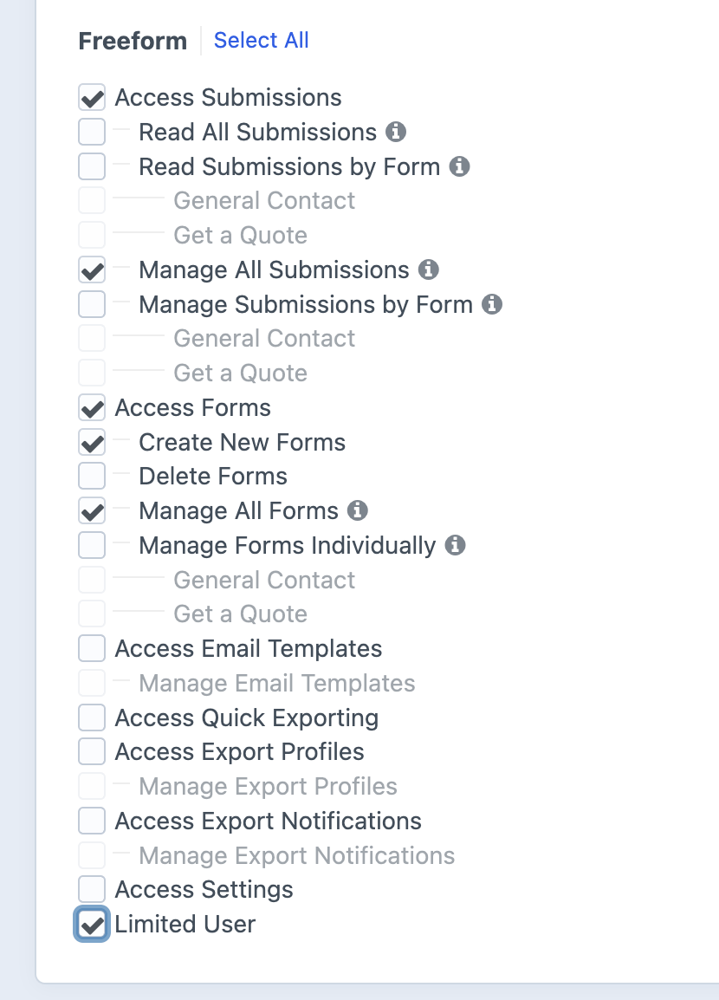

<meta property="og:image" content="https://docs.solspace.com/extras/social/craft/freeform/freeform.png" />

    
    Freeform
    for Craft
    

        

            5.x
            ✓ Latest
            
        

        <ul class="pr-v-list">
            <li><a href="/craft/freeform/v5/">5.x✓ Latest</a></li>
            <li><a href="/craft/freeform/v4/">4.x</a></li>
            <li><a href="/craft/freeform/v3/">3.xRetired</a></li>
            <li><a href="/craft/freeform/v2/">2.xRetired</a></li>
            <li><a href="/craft/freeform/v1/">1.xRetired</a></li>
        </ul>
    

    

        <a href="https://plugins.craftcms.com/freeform" class="button button-blue">Plugin Store</a>
    

<a href="/craft/freeform/v5/configuration/">Configuration</a>

# Limited Users <Badge type="feature" text="Coming Soon!" />

With the _Limited Users_ feature, you can easily customize the form builder experience for specific users or groups. You have the ability to choose which [field types](../forms/fields/) are available and which settings and page tabs are visible. This ensures that these users are not overwhelmed by advanced settings and prevents them from accidentally breaking your forms or site.

Although Freeform offers permissions through regular [Craft User Group Permissions](./permissions/) to limit access to the Freeform control panel, the _Limited Users_ feature allows for more precise control within the [form builder](../forms/builder/) itself.

[[toc]]

## Quick Setup Guide

<label for="step1"><input type="checkbox" class="step-check" id="step1">

Open up the **Limited Users** settings page _(Freeform → Settings → Limited Users)_. Freeform includes a **Suggested Setup** for each area of the builder and will be configured to that by default.

</label>

<label for="step2"><input type="checkbox" class="step-check" id="step2">

Carefully review and adjust the settings as necessary.

::: tip
Users without the _Limited Users_ restriction can still add any field type to the form, regardless of what is set for the **Allowed Field Types** setting. If the form already contains a restricted field type in the layout, _Limited Users_ can still adjust those exist fields, but they cannot add _new_ ones to the form.
:::

::: warning
Any settings that are critical to the form working **must have a default value** configured in the [Form Builder settings](./settings/#form-builder) area, e.g. _Submission Title_. Some other settings will continue to be automatically set or automatically populated, even when not visible, e.g. _Field Handles_.
:::

</label>

<label for="step3"><input type="checkbox" class="step-check" id="step3">

Save the _Limited Users_ permission changes by clicking the **Save** button.

</label>

<label for="step4"><input type="checkbox" class="step-check" id="step4">

Go to the [Form Builder settings](./settings/#form-builder) area _(Freeform → Settings → Form Builder)_ and set default values for any critical settings you have hidden from _Limited Users_. This will ensure that the form will configure itself correctly when a _Limited User_ with no access to those settings is building the form.

</label>

<label for="step5"><input type="checkbox" class="step-check" id="step5">

Apply Freeform's _Limited User_ permission to any users or user groups that require it. 

</label>

Finished!
