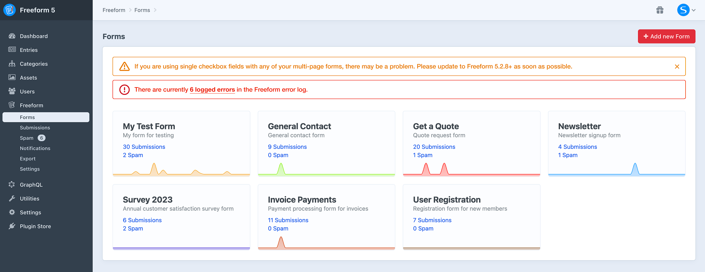
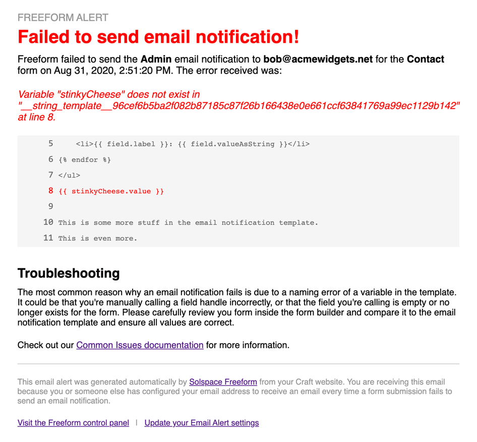
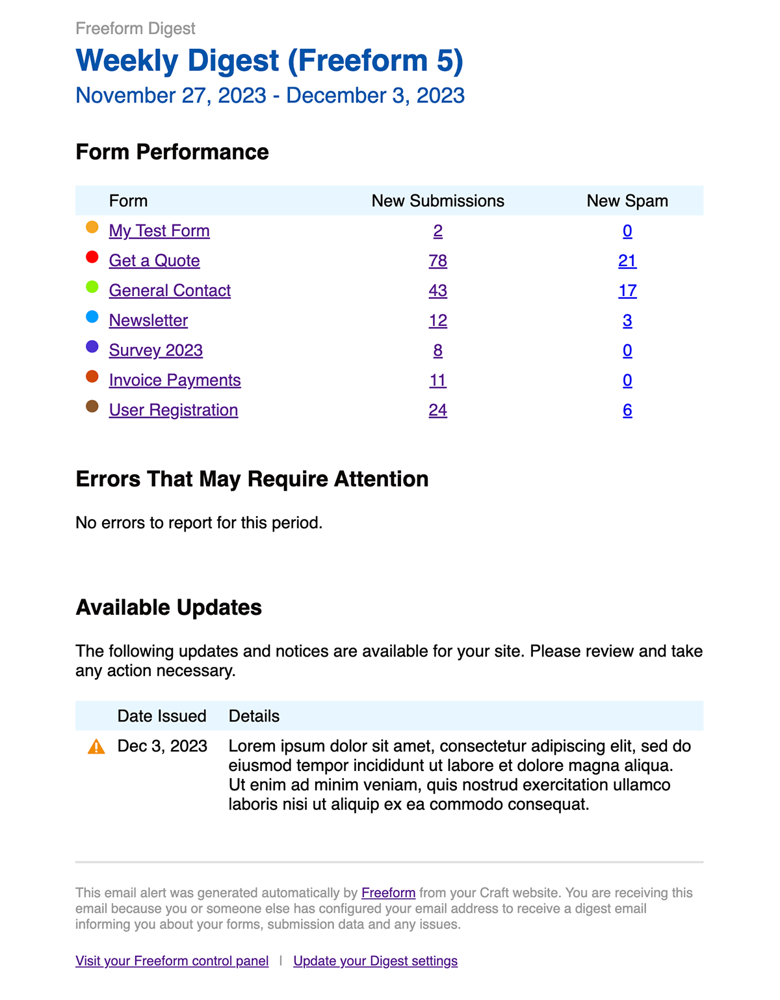

<meta property="og:image" content="https://docs.solspace.com/extras/social/craft/freeform/freeform.png" />

    
    Freeform
    for Craft
    

        

            5.x
            ✓ Latest
            
        

        <ul class="pr-v-list">
            <li><a href="/craft/freeform/v5/">5.x✓ Latest</a></li>
            <li><a href="/craft/freeform/v4/">4.x</a></li>
            <li><a href="/craft/freeform/v3/">3.xRetired</a></li>
            <li><a href="/craft/freeform/v2/">2.xRetired</a></li>
            <li><a href="/craft/freeform/v1/">1.xRetired</a></li>
        </ul>
    

    

        <a href="https://plugins.craftcms.com/freeform" class="button button-blue">Plugin Store</a>
    

<a href="/craft/freeform/v5/configuration/">Configuration</a>

# Notices & Alerts

Solspace is dedicated to providing the best form plugin for Craft CMS. Our team has spent years perfecting and testing our product, which is trusted by thousands of websites. However, we understand that each site is unique and may encounter issues. That's why we offer a comprehensive error logging feature, email alerts for issues, and an _update notices_ feature to keep you informed about important updates. Additionally, we provide a weekly or daily digest email to help you stay in the loop with your form's performance and potential issues.

<video autoplay loop muted>
    <source src="../videos/notices-alerts.mp4" type="video/mp4">
    This browser does not display the video tag.
</video>

[[toc]]

    <a href="#update-notices-announcements" class="menu-box">
        
        

            <h3>Update Notices</h3>
            
Alerts you of potential issues that specifically may affect your site.

        

    </a>
    <a href="#email-failure-alerts" class="menu-box">
        
        

            <h3>Email Failure Alerts</h3>
            
Send notifications when an email fails to send due to an error on your site.

        

    </a>
    <a href="#weekly-daily-digests" class="menu-box">
        
        

            <h3>Weekly/Daily Digest</h3>
            
Helps keep your finger on the pulse of your site.

        

    </a>

## Update Notices & Announcements

The _Update Notices_ area in the Dashboard keeps you informed about issues that may specifically affect your site. Paired with [Weekly Digest](#weekly-daily-digests) email notifications, _Update Notices_ is a powerful feature that allows you to run your site on auto-pilot. Every few hours, Freeform will check and see if there are any new updates available, pull the feed and then compare it against your current site environment and setup and only show you notices and warnings that apply specifically to that site. This will ensure you catch issues much sooner and minimize form issues.

Freeform also uses Craft's [Announcements](https://craftcms.com/docs/5.x/system/control-panel.html#announcements) feature to let you know about new features available in the version you've just updated to. This works automatically and is displayed by clicking the "gift" icon at the top of the page anywhere in the control panel.

To enable this feature, go to the **Freeform CP → Settings → Notices & Alerts** settings page. Toggle on the **Display Update Warnings & Notices** setting. This valuable feature is on by default.

### How It Works

Every 3 hours, Freeform will check a simple JSON feed on the `api.solspace.com` server to see if there are any new items. If any updates are available, it will pull the feed, compare it against your current site environment and setup, and only show you notices and warnings that apply specifically to your site. As you review and address each issue, you can dismiss them and Freeform will not bother you about them again.

::: tip
We respect your privacy, so this feature only pulls update notices from the Solspace.com site and **does not and cannot send any information back**. Solspace collects **no** information at all. The comparison check happens on your Freeform site environment, not on the Solspace site. This feature can also be disabled in the plugin settings.
:::

Common types of notices you'll receive are:

- Warnings about recently fixed bugs that likely affect your install.
- Warnings about changes or improvements to features your site is likely using.
- Warnings about critical API integration changes and upgrades (e.g. Mailchimp discontinuing v2 of their API and requiring all users to switch to v3, which would be available in a newer release of Freeform).
- Critical security vulnerability bugs.
- Notices about significant new features that have been released in a newer version.

::: warning
This feature requires any activity to happen on your site (e.g. someone visiting your site, an admin viewing CP, or a cron job to refresh cache) for Craft's cache (usually 3hrs) to be refreshed. If for any reason your site doesn't receive any activity for an extended period of time, this feature may not be triggered on time.
:::

## Email Failure Alerts 
<Badge type="lite" text="Lite" /><Badge type="pro" text="Pro" />

Freeform offers the ability to automatically send an email notification alerting the email address(es) specified when an email notification cannot be delivered.

To enable this feature, go to the **Freeform CP → Settings → Notices & Alerts** settings page. Add the email address(es) you'd like to receive alerts in the **Send Email Alerts for Failed Notifications** setting.

### How It Works

Every time Freeform fails to send an email notification due to common issues like typos in variable names or syntax errors, etc in email notification templates, Freeform will then attempt to notify the email address(es) specified in this setting.

::: warning
This feature is not guaranteed to catch every possible email failure. There might be other pieces at play here, and if your email server configuration itself is not correct, this feature will not work.
:::

## Weekly & Daily Digests 
<Badge type="lite" text="Lite" /><Badge type="pro" text="Pro" />

The Freeform _Weekly or Daily Digest_ email notifications will keep you in the loop about your website's Freeform form performance and status. It includes a snapshot of the previous week's performance and any logged errors and upgrade notices (if enabled).

Paired with the [Update Notices](#update-notices-announcements) system, this is a powerful feature that allows you to keep your finger on the pulse of your website without logging in and checking every once in a while. It allows you to routinely catch issues sooner and minimize site issues and lost valuable form submission data, etc.

To enable this feature, go to the **Freeform CP → Settings → Notices & Alerts** settings page. Add the email address(es) you'd like to receive alerts in the **Weekly Digest Email** setting.

### How It Works

Each week on the chosen weekday (or every day if _Daily_ chosen), Freeform will schedule an email notification to be delivered to the specified email address(es). This email notification will include such information as new submissions and spam counts for the previous period, currently logged errors, and important [Update Notices](#update-notices-announcements) (if enabled) that may require your attention.

::: warning
This feature requires any activity to happen on your site (e.g. someone visiting your site, an admin viewing CP, or a cron job to refresh cache) for Craft's cache (usually 3hrs) to be refreshed. If for any reason your site doesn't receive any activity for an extended period of time, this feature may not be triggered on time.
:::

