<meta property="og:image" content="https://docs.solspace.com/extras/social/craft/freeform/freeform.png" />

<div id="pr-heading">
    
    <span class="pr-name">Freeform</span>
    <span class="pr-category">for Craft</span>
    <div class="pr-v-wrapper">
        <div class="pr-v">
            <span class="pr-v-v">5.x</span>
            <span class="pr-v-type pr-latest">✓ Latest</span>
            <span class="pr-v-arrow arrow down"></span>
        </div>
        <ul class="pr-v-list">
            <li><a href="/craft/freeform/v5/">5.x<span class="pr-v-type pr-latest">✓ Latest</span></a></li>
            <li><a href="/craft/freeform/v4/">4.x</a></li>
            <li><a href="/craft/freeform/v3/">3.x<span class="pr-v-type pr-retired">Retired</span></a></li>
            <li><a href="/craft/freeform/v2/">2.x<span class="pr-v-type pr-retired">Retired</span></a></li>
            <li><a href="/craft/freeform/v1/">1.x<span class="pr-v-type pr-retired">Retired</span></a></li>
        </ul>
    </div>
    <div class="pr-buy">
        <a href="https://plugins.craftcms.com/freeform" class="button button-blue"><span class="external-url">Plugin Store</span></a>
    </div>
</div>

<span class="page-section"><a href="/craft/freeform/v5/configuration/">Configuration</a></span>

# Plugin Settings

<div class="hero-lead">

Freeform includes a wide variety of settings that allow you to customize your form management experience. To adjust your settings, click the **Settings** menu item while in the Freeform plugin, or go to **Settings → Plugins → Freeform** and click the settings link. These can also be configured within your Craft [Project Config](./project-config.md) file.

</div>


[[toc]]


<div class="menu-grid">
    <a href="#general-settings" class="menu-box">
        
        <div class="menu-grid-text">
            <h3>General Settings</h3>
            <p>Configure Freeform's overall behavior.</p>
        </div>
    </a>
    <a href="#form-behavior" class="menu-box">
        
        <div class="menu-grid-text">
            <h3>Form Behavior</h3>
            <p>Configure how forms behave in front end templates.</p>
        </div>
    </a>
    <a href="#form-builder" class="menu-box">
        
        <div class="menu-grid-text">
            <h3>Form Builder</h3>
            <p>Configure Freeform's form builder experience.</p>
        </div>
    </a>
    <a href="#template-manager" class="menu-box">
        
        <div class="menu-grid-text">
            <h3>Template Manager</h3>
            <p>Configure directory paths for Formatting, Email, and Success templates.</p>
        </div>
    </a>
    <a href="#spam-protection" class="menu-box">
        
        <div class="menu-grid-text">
            <h3>Spam Protection</h3>
            <p>Configure Freeform's built-in spam controls.</p>
        </div>
    </a>
    <a href="#captchas" class="menu-box">
        
        <div class="menu-grid-text">
            <h3>Captchas</h3>
            <p>Enable and setup reCAPTCHA or hCaptcha for your site.</p>
        </div>
    </a>
    <a href="#integrations" class="menu-box">
        
        <div class="menu-grid-text">
            <h3>Integrations</h3>
            <p>All integrations available to Freeform.</p>
        </div>
    </a>
    <a href="#statuses" class="menu-box">
        
        <div class="menu-grid-text">
            <h3>Statuses</h3>
            <p>Manage statuses for your Freeform submissions.</p>
        </div>
    </a>
    <a href="#demo-templates" class="menu-box">
        
        <div class="menu-grid-text">
            <h3>Demo Templates</h3>
            <p>Install the demo templates to get up and running in seconds.</p>
        </div>
    </a>
    <a href="#notices-alerts" class="menu-box">
        
        <div class="menu-grid-text">
            <h3>Notices & Alerts</h3>
            <p>Email Alerts, Update Notices, and Weekly Digest.</p>
        </div>
    </a>
    <a href="#error-log" class="menu-box">
        
        <div class="menu-grid-text">
            <h3>Error Log</h3>
            <p>Check out any potential problems Freeform has logged.</p>
        </div>
    </a>
</div>


## General Settings
Configure general settings for Freeform.

::: warning
This page and its settings all become inaccessible when the Craft `allowAdminChanges` config setting is set to `false`.
:::

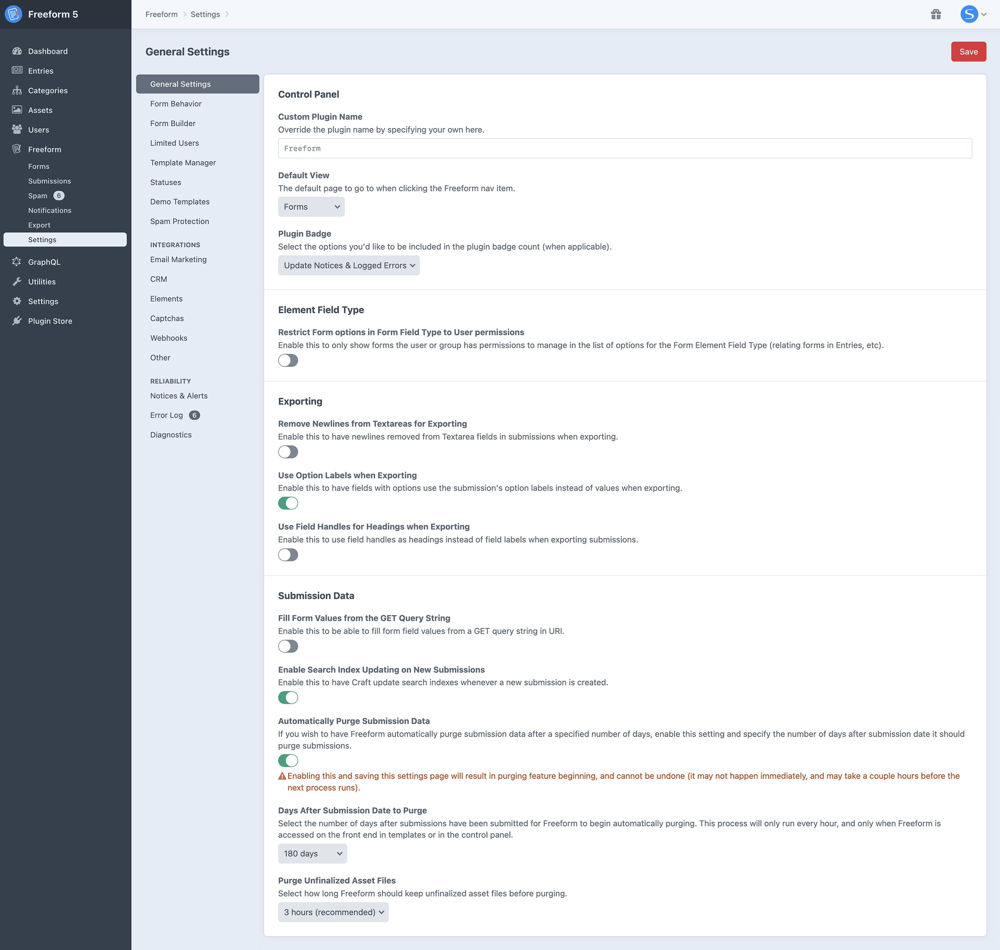

Setting | Project Config | Description | <span class="edition-express">Express</span> | <span class="edition-lite">Lite</span> | <span class="edition-pro">Pro</span>
--- | --- | --- | :---: | :---: | :---:
**Custom Plugin Name** | `pluginName: 'Forms'` | Override the plugin name by specifying your own here. | <span class="compare-none">✕</span> | <span class="compare-none">✕</span> | <span class="edition-pro">✓</span>
**Default view** | `defaultView: forms` | Allows you to specify which Freeform page should be loaded by default when clicking the Freeform navigation link. Options are: _Forms_ (default) and _Submissions_ | <span class="edition-express">✓</span> | <span class="edition-lite">✓</span> | <span class="edition-pro">✓</span>
**Plugin Badge** | `badgeType: all` | Select the options you'd like to be included in the plugin badge count (when applicable). Options are: _Don't Show_, _Update Notices & Logged Errors_ (default), _Update Notices only_, _Logged Errors only_, _Submission Count_, _Spam Folder Count_ | <span class="edition-express">✓</span> | <span class="edition-lite">✓</span> | <span class="edition-pro">✓</span>
**Site Filtering for Forms and Submissions** <Badge type="feature" text="New in 5.2+" /> | `sitesEnabled: true` | Allows you to filter form lists by Sites and prevents other admins from accessing forms that belong to Sites they don't have access to. By default, any new forms created will be visible for the Site they were created on (with the ability to enable additional sites). | <span class="compare-none">✕</span> | <span class="compare-none">✕</span> | <span class="edition-pro">✓</span>
**Restrict Form options in Form Field Type to User permissions** | `formFieldShowOnlyAllowedForms: false` | Enable this to only show forms the user or group has permissions to manage in the list of options for the Form Element Field Type (relating forms in Entries, etc). | <span class="edition-express">✓</span> | <span class="edition-lite">✓</span> | <span class="edition-pro">✓</span>
**Remove Newlines from Textareas for Exporting** | `removeNewlines: true` | Enable this to have newlines removed from Textarea fields in submissions when exporting. | <span class="edition-express">✓</span> | <span class="edition-lite">✓</span> | <span class="edition-pro">✓</span>
**Use Option Labels when Exporting** | `exportLabels: true` | Enable this to have fields with options use the submission's option labels instead of values when exporting. | <span class="edition-express">✓</span> | <span class="edition-lite">✓</span> | <span class="edition-pro">✓</span>
**Use Field Handles for Headings when Exporting** | `exportHandlesAsNames: false` | Enable this to use field handles as headings instead of field labels when exporting submissions. | <span class="edition-express">✓</span> | <span class="edition-lite">✓</span> | <span class="edition-pro">✓</span>
**Fill Form Values from the GET Query String** | `fillWithGet: true` | Enable this to be able to fill form field values from a GET query string in URI. To use this feature, make sure that the query in the URI matches the handle of the field(s) in the form, e.g. `?firstName=Bob&myRatingField=3`. | <span class="edition-express">✓</span> | <span class="edition-lite">✓</span> | <span class="edition-pro">✓</span>
**Enable Search Index Updating on New Submissions** | `updateSearchIndexes: true` | Enable this to have Craft update search indexes whenever a new submission is created. | <span class="edition-express">✓</span> | <span class="edition-lite">✓</span> | <span class="edition-pro">✓</span>
**Automatically Purge Submission Data** | `purgableSubmissionAgeInDays: '365'` | Enable and specify the number of days after submissions have been submitted for Freeform to begin automatically purging. | <span class="compare-none">✕</span> | <span class="compare-none">✕</span> | <span class="edition-pro">✓</span>

::: warning
Enabling the **Purge Submissions** feature and saving this settings page will result in purging feature beginning, and cannot be undone (it may not happen immediately, and may take a couple hours before the next process runs). This process will only run every hour, and only when Freeform is accessed on the front end in templates or in the control panel.
:::


## Form Behavior
Configure the front end form behavior.

::: warning
This page and its settings all become inaccessible when the Craft `allowAdminChanges` config setting is set to `false`.
:::

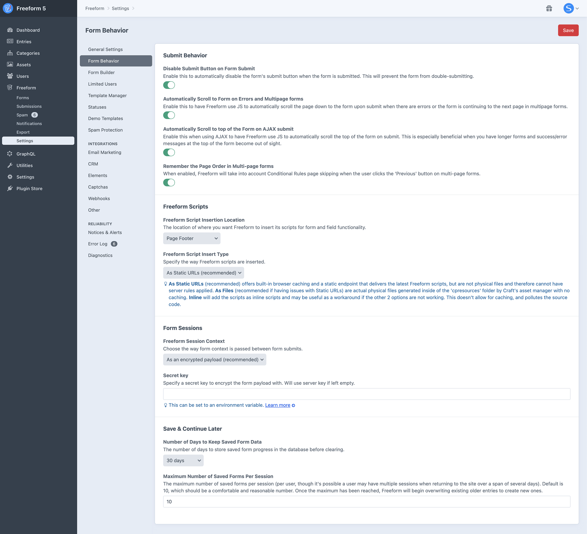

Setting | Project Config | Description | <span class="edition-express">Express</span> | <span class="edition-lite">Lite</span> | <span class="edition-pro">Pro</span>
--- | --- | --- | :---: | :---: | :---:
**Disable Submit Button on Form Submit** | `formSubmitDisable: true` | Enable this to automatically disable the form's submit button when the user submits the form. This will prevent the form from double-submitting. | <span class="edition-express">✓</span> | <span class="edition-lite">✓</span> | <span class="edition-pro">✓</span>
**Automatically Scroll to Form on Errors and Multipage forms** | `autoScrollToErrors: true` | Enable this to have Freeform use JS to automatically scroll the page down to the form upon submit when there are errors or the form is continuing to the next page in multipage forms. | <span class="edition-express">✓</span> | <span class="edition-lite">✓</span> | <span class="edition-pro">✓</span>
**Automatically Scroll to top of the Form on AJAX submit** | `autoScroll: true` | Enable this when using AJAX to have Freeform use JS to automatically scroll the top of the form on submit. This is especially beneficial when you have longer forms and success/error messages at the top of the form become out of sight. | <span class="edition-express">✓</span> | <span class="edition-lite">✓</span> | <span class="edition-pro">✓</span>
**Remember the Page Order in Multi-page forms** | `rememberPageSubmitOrder: true` | When enabled, Freeform will take into account Conditional Rules page skipping when the user clicks the 'Previous' button on multi-page forms. | <span class="compare-none">N/A</span> | <span class="edition-lite">✓</span> | <span class="edition-pro">✓</span>
**Freeform Javascript Insertion Location** | `scriptInsertLocation: footer` | The location of where you want Freeform to insert it's scripts for form and field functionality (such as spam protection and advanced field types). Options are: _Page Footer_, _Page Header_, _Inside Form_, _None_ (manually load the JS instead). [More info](#freeform-javascript-insertion-location) | <span class="edition-express">✓</span> | <span class="edition-lite">✓</span> | <span class="edition-pro">✓</span>
**Freeform Script Insert Type** | `scriptInsertType: pointers` | Specify the way Freeform scripts are inserted. Options are: _As Static URLs (recommended)_, _As Files_, _Inline_. [More info](#freeform-script-insert-type) | <span class="edition-express">✓</span> | <span class="edition-lite">✓</span> | <span class="edition-pro">✓</span>
**Number of Days to Keep Saved Form Data** (Save & Continue Later) | `saveFormTtl: '14'` | The number of days to store saved form progress in the database before clearing for Save & Continue Later feature. | <span class="compare-none">N/A</span> | <span class="edition-lite">✓</span> | <span class="edition-pro">✓</span>
**Maximum Number of Saved Forms Per Session** | `saveFormSessionLimit: '5'` | The maximum number of saved forms per session for Save & Continue Later feature. | <span class="compare-none">N/A</span> | <span class="edition-lite">✓</span> | <span class="edition-pro">✓</span>

::: tip
The **Automatically Scroll to Form on Errors and Multipage forms** feature can have its behavior can been manipulated with the [Autoscroll Events](../developer/js-plugin.md#autoscroll-events).
:::

### Freeform Javascript Insertion Location
The location of where you want Freeform to insert it's scripts for form and field functionality (such as spam protection and advanced field types).

- **Page Footer** <Badge type="recommended" text="Recommended" />
- **Page Header** <Badge type="feature" text="New in 5.0+" />
- **Inside Form**
- **None** (manually load the JS instead)
	* If you choose this option, please be sure to manually load Freeform's JS with `/freeform/plugin.js` and CSS with `/freeform/plugin.css` (optional, as it's currently just for the Opinion field type handling) in your template(s). See [Freeform JS plugin](../developer/js-plugin.md#loading-freeform-js-manually) documentation for more information.

### Freeform Script Insert Type
Specify the way Freeform scripts are inserted.

- **As Static URLs** <Badge type="recommended" text="Recommended" /> - offers built-in browser caching and a static endpoint that delivers the latest Freeform scripts, but are not physical files and therefore cannot have server rules applied.
- **As Files** - (recommended if having issues with Static URLs) are actual physical files generated inside of the 'cpresources' folder by Craft's asset manager with no caching.
- **Inline** - will add the scripts as inline scripts and may be useful as a workaround if the other 2 options are not working. This doesn't allow for caching, and pollutes the source code.

### Freeform Session Context <Badge type="feature" text="Deprecated in 5.0+" />
Choose the way form context is passed between form submits.

::: warning
The _PHP Sessions_ and _Database Table_ options for the Freeform Session Context setting are deprecated and are planned to be removed in Freeform 6. Encrypted Payload continues to be the assumed and recommended approach, but can still be overrided to PHP Sessions or Database Table in project config.

Options are:
`sessionContext: payload` (default) | `sessionContext: session` | `sessionContext: database`
:::

- **As an encrypted payload** <Badge type="recommended" text="Default/Recommended" />
  - The key benefits are that it never stores anything anywhere, has no impact on the server, and can be cached out-of-the-box.
- **Using PHP's sessions**
  - The key benefits are that it stores the context in memory and everything per session ID.
  - The problems with this approach are that it expires eventually with no way to persist this for longer periods of time. It's also unreliable due to _garbage collection_ on most servers which typically runs every 24 min­utes by default.
- **Using a database table**
  - The key benefits are that the context is stored in the database reliably for as long as you wish, offering more control if you have large forms that take a very long time to complete.
  - The problems with this approach is that high traffic sites may run into performance issues as the database table fills up and attempts to clear regularly, etc.


## Form Builder <Badge type="feature" text="Improved in 5.0+" />
Control Freeform's form builder experience.

::: warning
This page and its settings all become inaccessible when the Craft `allowAdminChanges` config setting is set to `false`.
:::

<video autoplay loop muted>
    <source src="../videos/builder-defaults.mp4" type="video/mp4">
    This browser does not display the video tag.
</video>

Setting | Project Config | Description | <span class="edition-express">Express</span> | <span class="edition-lite">Lite</span> | <span class="edition-pro">Pro</span>
--- | --- | --- | :---: | :---: | :---:
<span class="nowrap">**Live Render HTML Markup**</span> | <span class="nowrap">`defaults: previewHtml: true`</span> | Live rendering HTML markup in field labels, option labels and HTML blocks inside the Form Builder interface can sometimes conflict with Freeform's display of the form preview inside the control panel. In cases like these, you'll need to disable this setting to prevent HTML from rendering automatically. | <span class="edition-express">✓</span> | <span class="edition-lite">✓</span> | <span class="edition-pro">✓</span>
**Allow Twig to be enabled in HTML blocks** | `defaults: twigInHtml: true` | A toggle will appear for each HTML block field inside the form builder, allowing the use of Twig code. | <span class="edition-express">✓</span> | <span class="edition-lite">✓</span> | <span class="edition-pro">✓</span>
**Render HTML block Twig in Isolated Mode** | `defaults: twigIsolation: true` | When enabled, only the Freeform 'form' and 'fields' variables will be available. If disabled, Craft's variables will be included as well. | <span class="edition-express">✓</span> | <span class="edition-lite">✓</span> | <span class="edition-pro">✓</span>
**Include Freeform's Sample Formatting Templates** | `defaults: includeSampleTemplates: true` | Allow users to select a sample formatting template included with Freeform for the form's Formatting Template setting. | <span class="edition-express">✓</span> | <span class="edition-lite">✓</span> | <span class="edition-pro">✓</span>
**Form Builder Notifications tab** <Badge type="feature" text="New in 5.0+" /> | `defaults: notifications: ...` | Set the default templates for each email notification type. Optionally lock values as well. | <span class="edition-express">✓</span> | <span class="edition-lite">✓</span> | <span class="edition-pro">✓</span>
**Form Builder Settings tab** <Badge type="feature" text="New in 5.0+" /> | `defaults: settings: ...` | Set the default values for settings. Optionally lock values as well. | <span class="edition-express">✓</span> | <span class="edition-lite">✓</span> | <span class="edition-pro">✓</span>


## Limited Users <Badge type="feature" text="Coming Soon!" />

With the _Limited Users_ feature, you can easily customize the form builder experience for specific users or groups. You have the ability to choose which [field types](../forms/fields/) are available and which settings and page tabs are visible. This ensures that these users are not overwhelmed by advanced settings and prevents them from accidentally breaking your forms or site.

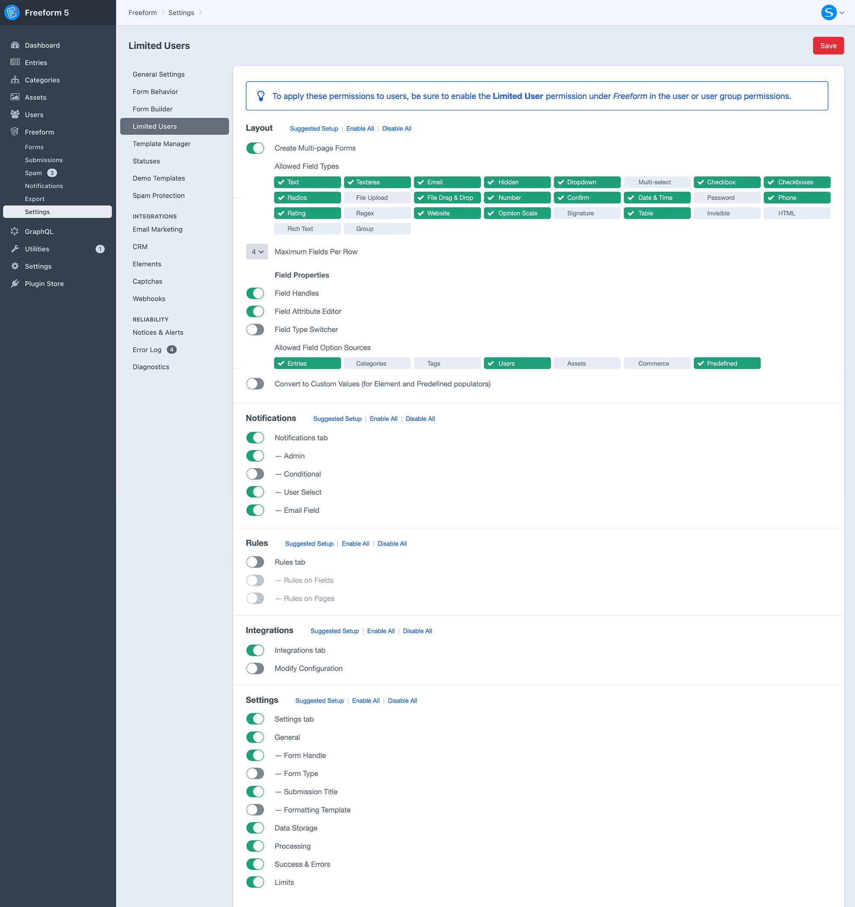


## Template Manager <Badge type="feature" text="Improved in 5.0+" />

The Template Manager settings page allows you to configure template directory paths and other settings for Formatting Templates, Email Notification Templates, and Success Templates.

::: warning
This page and its settings all become inaccessible when the Craft `allowAdminChanges` config setting is set to `false`.
:::

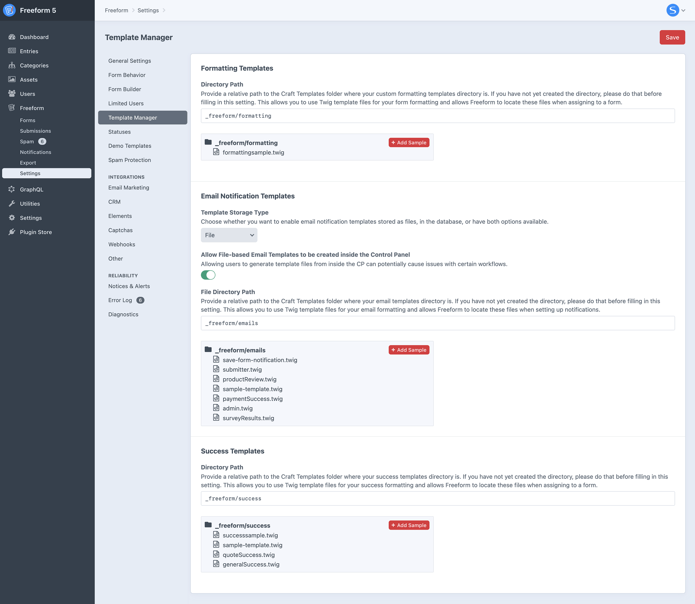

### Formatting Templates
[Formatting Templates](../forms/formatting-templates/) are predefined templates that you can specify for forms to handle simplified rendering of the form on the front end. You can have as many as you wish, and customize them however you like.

Setting | Project Config | Description | <span class="edition-express">Express</span> | <span class="edition-lite">Lite</span> | <span class="edition-pro">Pro</span>
--- | --- | --- | :---: | :---: | :---:
<span class="nowrap">**Directory Path**</span> | `formTemplateDirectory: _freeform/formatting/` | When using custom formatting templates for your forms, you'll need to specify where your Twig-based templates are stored. Provide a relative path to craft root to your custom form templates directory, e.g. `freeform_formatting_templates`. To add a starter example template, click the "Add a sample template" button, and then edit the template after. | <span class="edition-express">✓</span> | <span class="edition-lite">✓</span> | <span class="edition-pro">✓</span>

### Email Templates
Email Notification templates are available to be stored as files, in the database, or both. You can choose which one is best for your site. In order to send file-based email notifications, a directory path must be set for Freeform to manage these templates, as they are stored as Twig-based files. See [Email Notifications](../forms/email-notifications.md) documentation for more information about implementation.

Setting | Project Config | Description | <span class="edition-express">Express</span> | <span class="edition-lite">Lite</span> | <span class="edition-pro">Pro</span>
--- | --- | --- | :---: | :---: | :---:
<span class="nowrap">**Template Storage Type**</span> | `emailTemplateStorageType: files_database` | Choose whether you want to enable email notification templates stored as files, in the database, or have both options available. | <span class="edition-express">✓</span> | <span class="edition-lite">✓</span> | <span class="edition-pro">✓</span>
**Default Email Template Creation Method** | <span class="nowrap">`emailTemplateDefault: files`</span> | Select which storage method to use when creating new email notifications with 'Add New Template' option in the form builder. | <span class="edition-express">✓</span> | <span class="edition-lite">✓</span> | <span class="edition-pro">✓</span>
**Allow File-based Email Templates to be created inside the CP** | `allowFileTemplateEdit: true` | Allowing users to generate template files from inside the CP can potentially cause issues with certain workflows. | <span class="edition-express">✓</span> | <span class="edition-lite">✓</span> | <span class="edition-pro">✓</span>
**File Directory Path** | `emailTemplateDirectory: _freeform/emails/` | Provide a relative path to the Craft Templates folder where your email templates directory is. If you have not yet created the directory, please do that before filling in this setting. This allows you to use Twig template files for your email formatting and allows Freeform to locate these files when setting up notifications, e.g. `_freeform_notifications`. To add a starter example template, click the "Add a sample template" button, and then edit the template after. | <span class="edition-express">✓</span> | <span class="edition-lite">✓</span> | <span class="edition-pro">✓</span>

::: tip
If you wish to create advanced notification templates, please note that any additional template files (e.g. `_layout.twig`, `_footer.html`, etc) must NOT be stored inside of this directory, as Freeform expects that every file in here is a complete email notification template and will choke on any additional files.
:::

#### Convert Database email templates to File email templates
This is a utility that allows you to migrate your existing database email templates over to file-based email templates (you can continue to edit these from the CP). The utility will also update all existing forms to use the new file version of the email template. If you wish to have Freeform clean up and remove the old database email templates after, check the checkbox as well.

### Success Templates
Success templates are predefined templates that you can specify for your forms to display when a form has been successfully submitted. Instead of redirecting to a return URL or reloading the form, it'll display the contents of this template. You can have as many as you wish, and customize them however you like. To use these, be sure to select the **Load Success Template** option for the **Success Behavior** setting in the form builder for each form.

Setting | Project Config | Description | <span class="edition-express">Express</span> | <span class="edition-lite">Lite</span> | <span class="edition-pro">Pro</span>
--- | --- | --- | :---: | :---: | :---:
<span class="nowrap">**Directory Path**</span> | `successTemplateDirectory: _freeform/success/` | When using custom formatting templates for your forms, you'll need to specify where your Twig-based templates are stored. Provide a relative path to craft root to your custom form templates directory, e.g. `freeform_success`. To add a starter example template, click the "Add a sample template" button, and then edit the template after. | <span class="edition-express">✓</span> | <span class="edition-lite">✓</span> | <span class="edition-pro">✓</span>

Your success template might look something like this:

``` twig
<div id="freeform-success">
    <h3>Thank you!</h3>
    <p>We have successfully received your submission.</p>
</div>
```

Things like `form.id`, `form.handle` and `form.name` are available for use here as well.


## Statuses
This area allows you to manage and create new statuses for your forms. To set the default status, you can do so in the [Form Builder](#form-builder) defaults settings area.

::: tip
This page and its settings all remain accessible when the Craft `allowAdminChanges` config setting is set to `false`.
:::

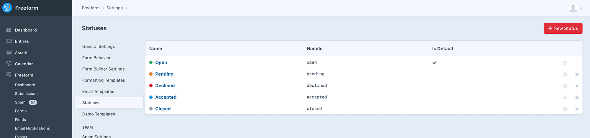

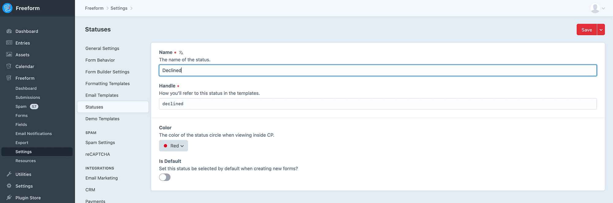


## Demo Templates
Allows you to install the [Demo Templates](./demo-templates.md) to get Freeform up and running on the front end with just a couple clicks!

::: warning
This page and its settings all become inaccessible when the Craft `allowAdminChanges` config setting is set to `false`.
:::

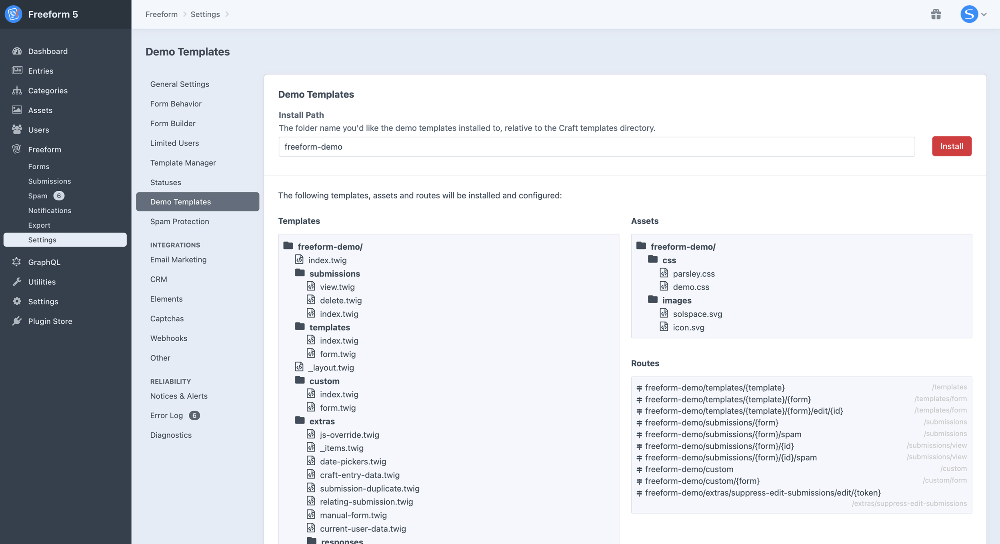


## Spam Protection
For more information about Freeform's spam protection features, visit the [Spam Protection documentation](../forms/spam-protection.md).

::: warning
This page and its settings all become inaccessible when the Craft `allowAdminChanges` config setting is set to `false`.
:::


Setting | Project Config | Description | <span class="edition-express">Express</span> | <span class="edition-lite">Lite</span> | <span class="edition-pro">Pro</span>
--- | --- | --- | :---: | :---: | :---:
<span class="nowrap">**Spam Protection Behavior**</span> | `spamProtectionBehavior: simulate_success` <Badge type="feature" text="Renamed in 5.0+" /> | Select the behavior you'd like Freeform to take when it detects a submission as being spam: _Simulate Success_ (recommended), _Display Errors_ (for debugging). | <span class="edition-express">✓</span> | <span class="edition-lite">✓</span> | <span class="edition-pro">✓</span>
**Bypass All Spam Checks for Logged in Users** | `bypassSpamCheckOnLoggedInUsers: false` | When enabled, Freeform will not run any spam protection measures for logged in users. | <span class="edition-express">✓</span> | <span class="edition-lite">✓</span> | <span class="edition-pro">✓</span>
**Use Spam Folder** | `spamFolderEnabled: true` | When enabled, all submissions caught by the honeypot or blocked email addresses, keywords and IP addresses will be flagged as spam and stored in the database, but available to manage in a separate menu inside Freeform. When paired with a Captcha service and its _Failure Behavior_ setting set to **Send to Freeform Spam Folder**, failed submissions will also end up in the Spam Folder. | <span class="edition-express">✓</span> | <span class="edition-lite">✓</span> | <span class="edition-pro">✓</span>
**Automatically Purge Spam Submissions** | `purgableSpamAgeInDays: '14'` | Enable and specify the number days that should pass after a spammy submission is received before Freeform automatically purges it. Enabling this and saving this settings page will begin the purging of submissions flagged as spam, and cannot be undone. | <span class="compare-none">✕</span> | <span class="edition-lite">✓</span> | <span class="edition-pro">✓</span>
**Block Email addresses** | `blockedEmails: "*.ru\r\n*@hotmail.com"` | Enter email addresses you would like blocked from being used in Email fields. Use `*` for wildcard, and separate multiples on new lines. | <span class="edition-express">✓</span> | <span class="edition-lite">✓</span> | <span class="edition-pro">✓</span>
**Display errors about blocked email(s) under each email field** | `showErrorsForBlockedEmails: false` | Enable this if you'd like field-based errors to display under the email field(s) that the user has entered blocked emails for. Not recommended for regular use, but helpful if trying to troubleshoot submission issues. | <span class="edition-express">✓</span> | <span class="edition-lite">✓</span> | <span class="edition-pro">✓</span>
**Blocked Emails Error Message** | `blockedEmailsError: 'Invalid Email Address'` | Error message to be shown when a blocked email address is used. | <span class="edition-express">✓</span> | <span class="edition-lite">✓</span> | <span class="edition-pro">✓</span>
**Block Keywords** | `blockedKeywords: "cryptocurrency\r\n*Д*\r\n*cialis*"` | Enter keywords you would like blocked from being used in all text and textarea fields. Use `*` for wildcard, and separate multiples on new lines. | <span class="edition-express">✓</span> | <span class="edition-lite">✓</span> | <span class="edition-pro">✓</span>
**Display errors about blocked keyword(s) under each text/textarea field** | `showErrorsForBlockedKeywords: false` | Enable this if you'd like field-based errors to display under the field(s) that the user has entered blocked keywords for. Not recommended for regular use, but helpful if trying to troubleshoot submission issues. | <span class="edition-express">✓</span> | <span class="edition-lite">✓</span> | <span class="edition-pro">✓</span>
**Blocked Keywords Error Message** | `blockedKeywordsError: 'Invalid Entry Data'` | Error message to be shown when a blocked keyword is used. | <span class="edition-express">✓</span> | <span class="edition-lite">✓</span> | <span class="edition-pro">✓</span>
**Block IP addresses** | `blockedIpAddresses: ''` | Enter IP addresses you would like blocked. Separate multiples on new lines. | <span class="edition-express">✓</span> | <span class="edition-lite">✓</span> | <span class="edition-pro">✓</span>
**Form Submission Throttling** | `submissionThrottlingCount: ''`<br />`submissionThrottlingTimeFrame: m` | Globally (affecting all users) prevent spam or attacks by limiting the number of times all forms can be submitted within a given timeframe. | <span class="edition-express">✓</span> | <span class="edition-lite">✓</span> | <span class="edition-pro">✓</span>
**Minimum Submit Time** | `minimumSubmitTime: ''` | The minimum amount of time (in seconds) that has to go by since loading the form for the user to be able to submit the form successfully. Otherwise the submission will be flagged as spam and the Spam Protection Behavior setting will take effect. | <span class="edition-express">✓</span> | <span class="edition-lite">✓</span> | <span class="edition-pro">✓</span>
**Form Submit Expiration** | `formSubmitExpiration: ''` | The maximum amount of time (in minutes) a user has to submit the form before the form expires and the Spam Protection Behavior setting will take effect. This still has to be less than the Craft CSRF token expiry and PHP Session limit set for your server. | <span class="edition-express">✓</span> | <span class="edition-lite">✓</span> | <span class="edition-pro">✓</span>

::: tip
Enabling the **Spam Folder** feature will not retroactively bring back any previously blocked spam submissions. Any submissions that have been blocked in the past (without Spam Folder setting on) are never recorded in the database.
:::

::: warning
Enabling the **Purge Submissions** feature and saving this settings page will result in purging feature beginning, and cannot be undone (it may not happen immediately, and may take a couple hours before the next process runs). This process will only run every hour, and only when Freeform is accessed on the front end in templates or in the control panel.
:::

::: tip
When attempting to block individual characters (e.g. Russian letters) or partial words or strings with the **Block Keywords** setting, be sure to make good use of the wildcard `*` character! E.g.: `*й*`, `*Д*`, `*url=http*`, etc.
:::


## Integrations <Badge type="feature" text="Improved in 5.0+" />

::: tip
All integration pages and their settings remain accessible when the Craft `allowAdminChanges` config setting is set to `false`.
:::

### Email Marketing <Badge type="pro" text="Pro" />
The Email Marketing area allows you to manage your mailing list API integrations. Email Marketing integrations are set up here and are globally available to all forms, but are configured per form inside the form builder interface. To connect to an Email Marketing API, click the **New Integration** at the top right.

* View the [Email Marketing Integration](../integrations/) documentation for more information about setting up and configuring.


### CRM <Badge type="pro" text="Pro" />
The CRM area allows you to manage your CRM (Customer Relationship Management) API integrations. CRM integrations are set up here and are globally available to all forms, but are configured per form inside the form builder interface. To connect to a CRM API, click the **New Integration** at the top right.

* View the [CRM Integration](../integrations/) documentation for more information about setting up and configuring.

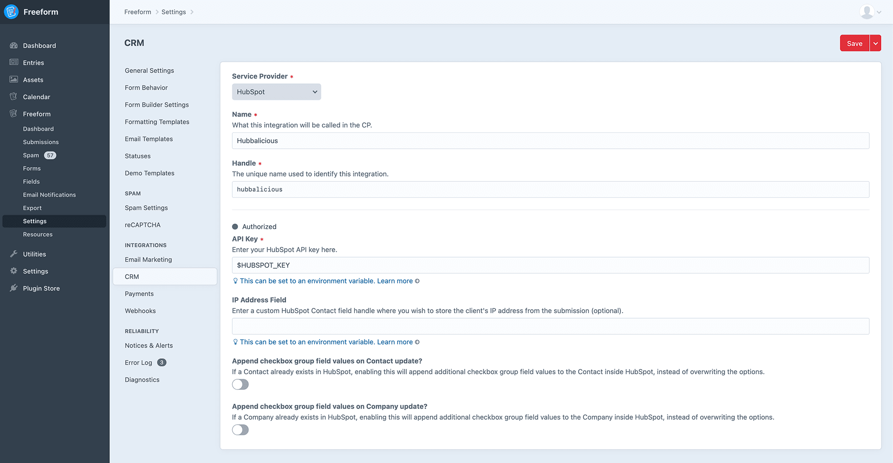

### Payments <Badge type="pro" text="Pro" />
This area allows you to configure and manage Stripe Payments for your forms. The Stripe Payments integration is set up here and are globally available to all forms, but are configured per form inside the form builder interface. To create a new Stripe payment setup, click the **New Payment Integration** at the top right.

* View the [Payments API Integration](../integrations/payments/) documentation for more information about setting up and configuring.

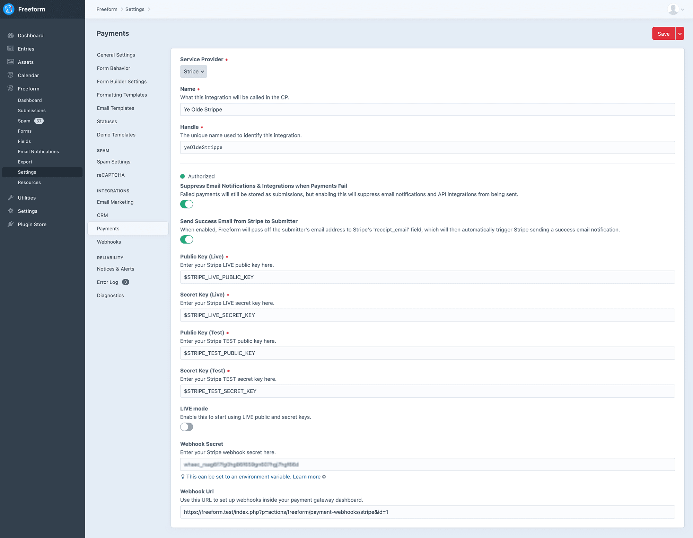

### Captchas <Badge type="feature" text="Improved in 5.0+" />
This area allows you to configure and manage Captcha integrations. Freeform currently supports several options of _reCAPTCHA_ and _hCaptcha_.

* View the [reCAPTCHA](../integrations/recaptcha/) or [hCaptcha](../integrations/hcaptcha/) integration documentation for more information about setting up and configuring.

### Webhooks <Badge type="pro" text="Pro" />
This area allows you to configure and manage **Slack**, **Zapier** and **generic** Webhooks for your forms. The Webhooks integrations are set up and completely managed here. You specify which form(s) each Webhook applies to, etc. To create a new Webhook, click the **New Webhook** at the top right.

* View the [Slack API Integration](../integrations/slack/) documentation for more information about setting up and configuring.
* View the [Zapier API Integration](../integrations/zapier/) documentation for more information about setting up and configuring.


### Other <Badge type="feature" text="New in 5.0+" />
This area allows you to configure and manage singleton integrations for your forms. Currently the following are available:

- [Google Tag Manager](../integrations/google-tag-manager/)
- [Freeform Honeypot](../forms/spam-protection/#freeform-honeypot)
- [Freeform Javascript Test](../forms/spam-protection/#freeform-javascript-test)
- [POST Forwarding](../integrations/post-forwarding/) <Badge type="pro" text="Pro" />
- [Google Sheets](../integrations/google-sheets/) <Badge type="pro" text="Pro" /><Badge type="feature" text="New in 5.2+" />

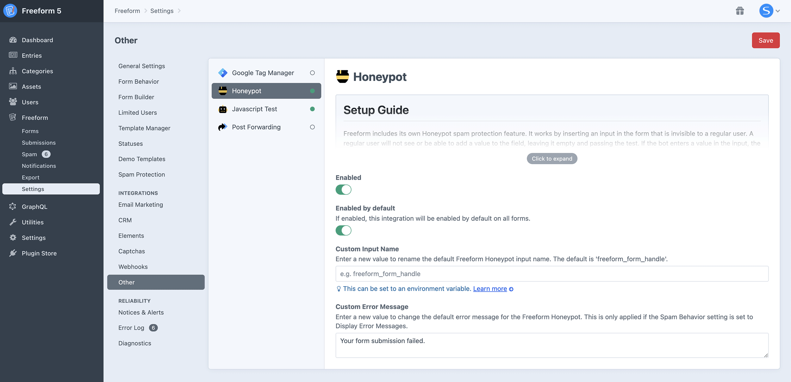


## Notices & Alerts
Freeform is committed to being the most robust and reliable form plugin for Craft CMS. Freeform has been carefully and meticulously developed and tested over many years and is in use across tens of thousands of websites. However, one other crutial piece of the puzzle in reliability is how your specific site and environment are performing. Because of this, Freeform includes an extensive error logging feature, email issue alerts, an Update Notices feature to alert you of important fixes and changes, and a weekly digest email to keep your finger on the pulse of your website.

::: warning
This page and its settings all become inaccessible when the Craft `allowAdminChanges` config setting is set to `false`.
:::

Check out the options below to learn more about each:

- [Update Notices](../configuration/notices-alerts/)
- [Email Alerts](../configuration/notices-alerts/) <div class="badge-group"><Badge type="lite" text="Lite" /><Badge type="pro" text="Pro" /></div>
- [Weekly Digest](../configuration/notices-alerts/) <div class="badge-group"><Badge type="lite" text="Lite" /><Badge type="pro" text="Pro" /></div>

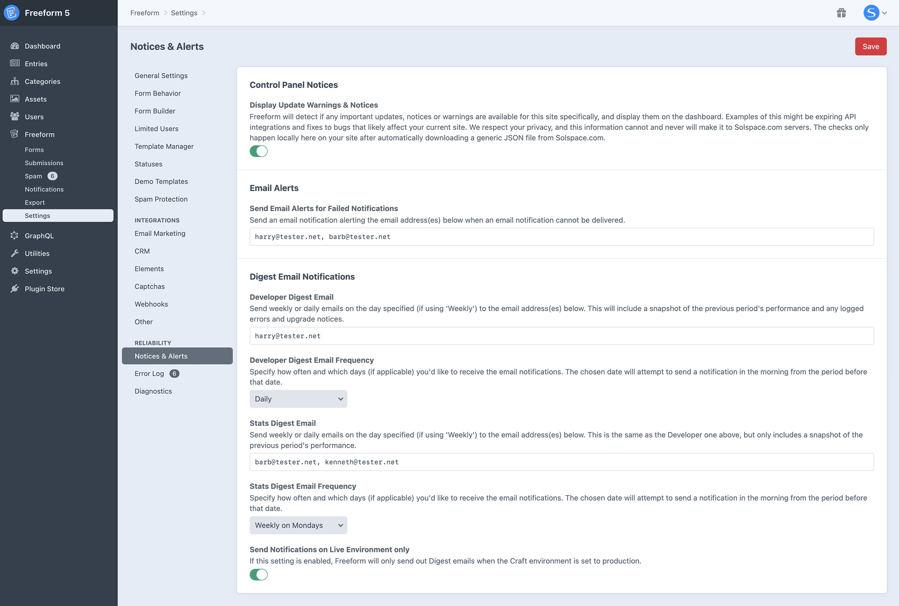


## Error Log
In as many cases as possible, Freeform attempts to write errors and issues to its own error log. The file is physically located in the same place as the Craft logs (`/storage/logs/freeform.log`), but can be conveniently viewed inside the *Error Log* page inside Freeform Settings area (**Freeform** → **Settings** → **Error Log**). If there are no logged errors, the Error Log page will not show any errors, and you will likely not see the Freeform error log file.

::: tip
This page remains accessible when the Craft `allowAdminChanges` config setting is set to `false`.
:::

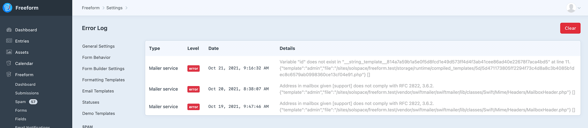