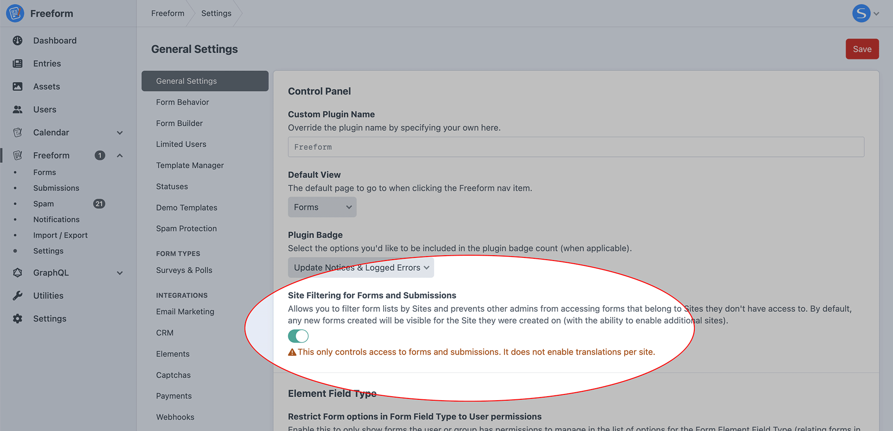
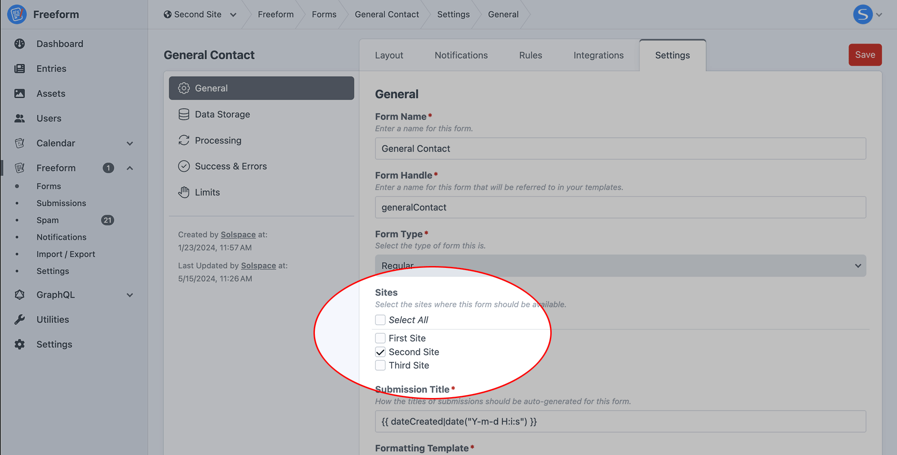
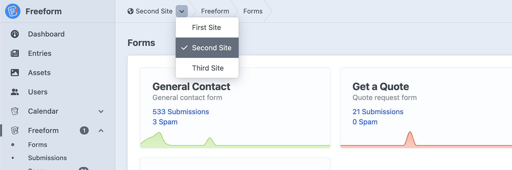
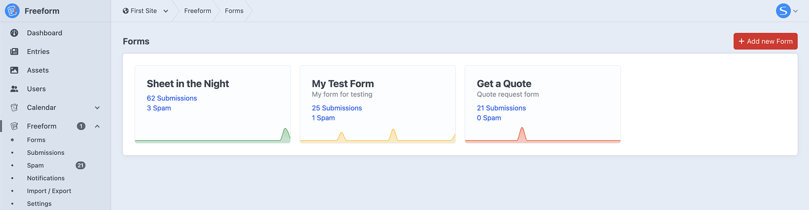
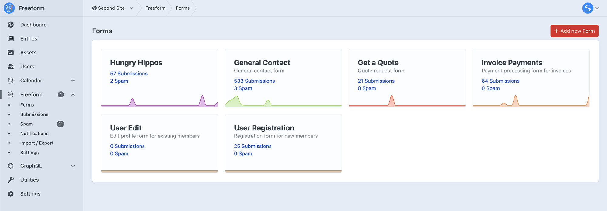
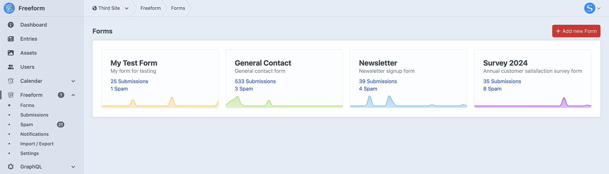
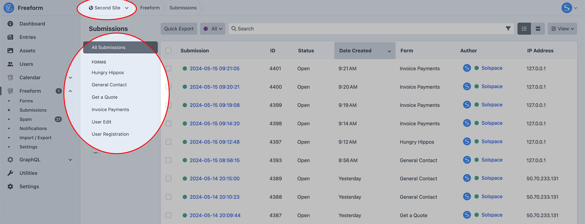

<meta property="og:image" content="https://docs.solspace.com/extras/social/craft/freeform/freeform.png" />

<div id="pr-heading">
    
    <span class="pr-name">Freeform</span>
    <span class="pr-category">for Craft</span>
    <div class="pr-v-wrapper">
        <div class="pr-v">
            <span class="pr-v-v">5.x</span>
            <span class="pr-v-type pr-latest">✓ Latest</span>
            <span class="pr-v-arrow arrow down"></span>
        </div>
        <ul class="pr-v-list">
            <li><a href="/craft/freeform/v5/">5.x<span class="pr-v-type pr-latest">✓ Latest</span></a></li>
            <li><a href="/craft/freeform/v4/">4.x</a></li>
            <li><a href="/craft/freeform/v3/">3.x<span class="pr-v-type pr-retired">Retired</span></a></li>
            <li><a href="/craft/freeform/v2/">2.x<span class="pr-v-type pr-retired">Retired</span></a></li>
            <li><a href="/craft/freeform/v1/">1.x<span class="pr-v-type pr-retired">Retired</span></a></li>
        </ul>
    </div>
    <div class="pr-buy">
        <a href="https://plugins.craftcms.com/freeform" class="button button-blue"><span class="external-url">Plugin Store</span></a>
    </div>
</div>

<span class="page-section"><a href="/craft/freeform/v5/configuration/">Configuration</a></span>

# Site Filtering for Forms and Submissions <Badge type="pro" text="Pro" /><Badge type="feature" text="New in 5.2+" />

Optionally enable Site filtering for forms and submissions to show/hide them for specific Sites.


[[toc]]


## Overview
This feature allows you to filter form lists by [Sites](https://craftcms.com/docs/5.x/system/sites.html) and prevents other admins from accessing forms that belong to Sites they don't have access to. By default, any new forms created will be visible for the Site they were created on (with the ability to enable additional sites).

This can help clean up the Freeform control panel when you have many forms specific to certain Sites.

::: warning
This only controls access to forms and submissions. It does not enable translations per site.
::::

### Setting
Inside the **General Settings** page, you can enable this feature by toggling ON the **Site Filtering for Forms and Submissions** setting (or `sitesEnabled: true` in Project Config).



### Form Builder
Once enabled, an additional **Sites** setting will appear for forms inside the _Settings_ tab of the form builder.



### Site Switcher
The **Site** switcher will be present in several areas of the Freeform control panel.



### Forms
Forms can be filtered by Site(s) they are assigned to. If a user only has access to one or some of the Sites, the Site switcher will automatically limit what is visible to them.







### Submissions
The Submissions index will filter its form source filters by forms that are available for the active Site, and the **All Submissions** source filter will only display submissions for forms that are available for the active Site.



### Export Profiles
Export profiles will become filtered by forms that are assigned to the active Site.

### Templates
It's important to note that if a form is only enabled for _Site A_ and _Site B_, it will show when viewing _Site C_ in the front end.


## Retroactively Apply to Existing Installs
If you wish to enable this feature retroactively to an existing Craft install, please follow the steps below:

1. Enable the **Site Filtering for Forms and Submissions** setting in Freeform.
2. Open up each form and update the **Sites** setting inside the _Settings_ tab and save the form.
    - Repeat for every form on your site.
    - By default, every form will have NO Sites checked off, but Freeform assumes the form should be active for ALL Sites if that is the case.
3. Run the following CLI command (otherwise only your primary site will be able to see submissions in the control panel):
    ``` sh command-line
    php craft freeform/submissions/resave
    ```


## What It Doesn't Do
While this feature relies on the Craft [Sites](https://craftcms.com/docs/5.x/system/sites.html) feature to work, the primary intention at this point is to allow filtering of forms and submissions per Site.

Here are some things it cannot do (yet?):

- CP-based translations of Freeform forms. The only option for translating forms per site remains via [Static Text Translations](../configuration/translating/).
- Translations of Freeform submissions per site.
- Unique settings per site.
- Unique integrations per site.