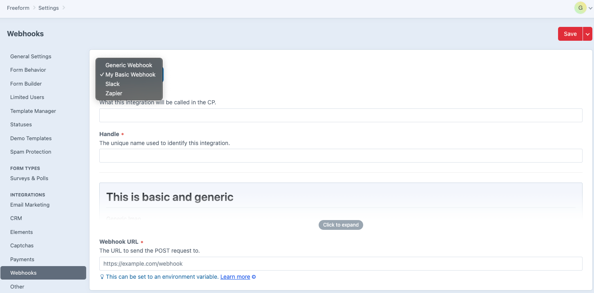

<meta property="og:image" content="https://docs.solspace.com/extras/social/craft/freeform/freeform.png" />

<div id="pr-heading">
    
    <span class="pr-name">Freeform</span>
    <span class="pr-category">for Craft</span>
    <div class="pr-v-wrapper">
        <div class="pr-v">
            <span class="pr-v-v">5.x</span>
            <span class="pr-v-type pr-latest">✓ Latest</span>
            <span class="pr-v-arrow arrow down"></span>
        </div>
        <ul class="pr-v-list">
            <li><a href="/craft/freeform/v5/">5.x<span class="pr-v-type pr-latest">✓ Latest</span></a></li>
            <li><a href="/craft/freeform/v4/">4.x</a></li>
            <li><a href="/craft/freeform/v3/">3.x<span class="pr-v-type pr-retired">Retired</span></a></li>
            <li><a href="/craft/freeform/v2/">2.x<span class="pr-v-type pr-retired">Retired</span></a></li>
            <li><a href="/craft/freeform/v1/">1.x<span class="pr-v-type pr-retired">Retired</span></a></li>
        </ul>
    </div>
    <div class="pr-buy">
        <a href="https://plugins.craftcms.com/freeform" class="button button-blue"><span class="external-url">Plugin Store</span></a>
    </div>
</div>

<span class="page-section"><a href="/craft/freeform/v5/developer/">Developer</a></span>

# Custom Webhook Types <Badge type="pro" text="Pro" />

You can create your own [Webhook](../integrations/generic-webhook/) types and add them to Freeform.

[[toc]]

## Setup Guide <Badge type="feature" text="Revised in 5.0+" />

The creation of a custom Webhook integration in Freeform will require using a custom [Craft module](https://craftcms.com/docs/5.x/extend/module-guide.html). This guide assumes you already have that knowledge. If not, please [check out the guide](../guides/building-a-custom-module/) we have.

::: guide ../../guides/building-a-custom-module/
View the guide on how to build a custom module.
:::

To add a custom webhook integration, you will need to create a new class which must implement the `\Solspace\Freeform\Library\Integrations\Types\Webhooks\WebhookIntegrationInterface` interface.

To make things easier for you, you can extend the `\Solspace\Freeform\Library\Integrations\Types\Webhooks\WebhookIntegration` class, which already has a URL property as well as being capable of storing and exposing various other base properties, such as `id`, `enabled`, `handle`, `name`, etc.

Then you would implement the `::trigger(Form $form)` method to handle posting your webhooks.

For the sake of this example let's assume you just want your webhook to post the form ID, name and submission ID to an endpoint at `https://my.test.com`. Here is what that class would look like.

<div class="step">
<label for="step1"><input type="checkbox" class="step-check" id="step1">

### Create the Webhook Integration

</label>

``` php
<?php

namespace Modules\Webhooks;

use GuzzleHttp\Client;
use Solspace\Freeform\Attributes\Integration\Type;
use Solspace\Freeform\Form\Form;
use Solspace\Freeform\Library\Integrations\Types\Webhooks\WebhookIntegration;

// To be able to register this integration type, you must define 
// some metadata about it. Like specifying the readme and icon paths.
// Readme uses Markdown markup.

#[Type(
    name: 'My Basic Webhook',
    type: Type::TYPE_WEBHOOKS,
    readme: __DIR__.'/README.md',
    iconPath: __DIR__.'/icon.svg',
)]
class BasicWebhook extends WebhookIntegration
{
    public function trigger(Form $form): void
    {
        $submission = $form->getSubmission();
        
        // Create the payload that we will send
        $json = [
            'form' => [
                'id' => $form->getId(),
                'name' => $form->getName(),
            ],
            'submission' => [
                'id' => $submission->id,
            ],
        ];

        // Create a new Guzzle Client instance
        $client = new Client();

        // Get the URL the user has configured in their settings
        $url = $this->getUrl();
        
        try {
            // Post payload to the endpoint
            $client->post($url, ['json' => $json]);
        } catch (\Exception $e) {
            $this->processException($e, self::LOG_CATEGORY);
        }
    }
}
```

</div>

<div class="step">
<label for="step2"><input type="checkbox" class="step-check" id="step2">

### Register the Webhook Integration

</label>

Now that the integration type has been created, we need to register it with Freeform to make it available when creating new integrations. We do this by listening to the `\Solspace\Freeform\Services\Integrations\IntegrationsService::EVENT_REGISTER_INTEGRATION_TYPES` event.

``` php
<?php

namespace Modules;

use yii\base\Module;
use yii\base\Event;
use Modules\Webhooks\BasicWebhook;
use Solspace\Freeform\Services\Integrations\IntegrationsService;
use Solspace\Freeform\Events\Integrations\RegisterIntegrationTypesEvent;

class MyModule extends Module
{
    public function init(): void
    {
        parent::init();
        
        Event::on(
            IntegrationsService::class,
            IntegrationsService::EVENT_REGISTER_INTEGRATION_TYPES,
            function (RegisterIntegrationTypesEvent $event) {
                $event->addType(BasicWebhook::class);
            }
        )
    }
}
```

</div>

<div class="step">
<label for="step3"><input type="checkbox" class="step-check" id="step3">

### Set up the Webhook Integration

</label>

Once this is done, you should be able to see your webhook type as an option when creating a new Freeform Webhook integration.



</div>

<div class="step-finished">Finished!</div>