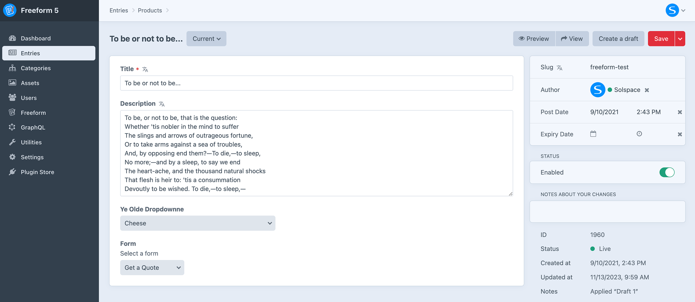

<meta property="og:image" content="https://docs.solspace.com/extras/social/craft/freeform/freeform.png" />

<div id="pr-heading">
    
    <span class="pr-name">Freeform</span>
    <span class="pr-category">for Craft</span>
    <div class="pr-v-wrapper">
        <div class="pr-v">
            <span class="pr-v-v">5.x</span>
            <span class="pr-v-type pr-latest">✓ Latest</span>
            <span class="pr-v-arrow arrow down"></span>
        </div>
        <ul class="pr-v-list">
            <li><a href="/craft/freeform/v5/">5.x<span class="pr-v-type pr-latest">✓ Latest</span></a></li>
            <li><a href="/craft/freeform/v4/">4.x</a></li>
            <li><a href="/craft/freeform/v3/">3.x<span class="pr-v-type pr-retired">Retired</span></a></li>
            <li><a href="/craft/freeform/v2/">2.x<span class="pr-v-type pr-retired">Retired</span></a></li>
            <li><a href="/craft/freeform/v1/">1.x<span class="pr-v-type pr-retired">Retired</span></a></li>
        </ul>
    </div>
    <div class="pr-buy">
        <a href="https://plugins.craftcms.com/freeform" class="button button-blue"><span class="external-url">Plugin Store</span></a>
    </div>
</div>

<span class="page-section"><a href="/craft/freeform/v5/forms/">Forms & Fields</a></span>

# _Form_ Element Field Type <div class="badge-group"><Badge type="lite" text="Lite" /><Badge type="pro" text="Pro" /></div>

Freeform includes a *Freeform Form* field type (and [Freeform Submissions](../submissions/fieldtype/)), which allows you to assign/relate forms to other element types such as Craft Entries.




[[toc]]


## Overview

The Freeform Form field type allows you to assign/relate forms to other element types such as Craft Entries. A common use case here would be if you wanted to allow admins to attach a specific Freeform form to a Craft Entry that corresponds to the entry, and then automate loading the form along with the entry in the front end templates.

<video autoplay loop muted>
    <source src="../videos/fieldtype-form.mp4" type="video/mp4">
    This browser does not display the video tag.
</video>

### Creating the Field
Creating a Freeform Form field is done just like any other fieldtype, here's an overview of the process:

<div class="step">
<label for="step1a"><input type="checkbox" class="step-check" id="step1a">

Go to the **Settings** area in Craft control panel. Click on **Fields**.

</label>

Click the **New field** button in the top right corner.

</div>

<div class="step">
<label for="step2a"><input type="checkbox" class="step-check" id="step2a">

Name the field as you wish. For example: *Related Form* with a handle of `relatedForm`.

</label>
</div>

<div class="step">
<label for="step3a"><input type="checkbox" class="step-check" id="step3a">

For the **Field Type** option, select *Freeform Form* from the list.

</label>

**Selection Label** is the text that will appear on the button which opens the Freeform Form selection pop-up dialog.

</div>

<div class="step">
<label for="step4a"><input type="checkbox" class="step-check" id="step4a">

Click the **Save** button in the top right corner to save the new field.

</label>
</div>

<div class="step-finished">Finished!</div>
<div class="counter-reset"></div>

Your Freeform Form field is now available to be assigned to other sections.


### Template Properties

The following template properties are available for the *Form* field type:

- `name` - outputs the name of the form
- `handle` - outputs the handle of the form
- `id` - outputs the unique ID of the form
- `description` - outputs the description of the form
- `render()` - outputs the full form, rendering it with the [Formatting Template](../templates/formatting/) specified in the form builder for the form.


## Examples

### Freeform Form Field in Entries
An example of template code you would use to display a Freeform form (with field handle of *myFreeformFieldName*) that is attached to a Craft Entry would look something like this:

``` twig{5-8}

    <div class="entry">
        <h2><a href="{{ entry.url }}">{{ entry.title }}</a></h2>
        {{ entry.summary }}
        
            <h3>{{ entry.myFreeformFieldName.name }}</h3>
            {{ entry.myFreeformFieldName.render() }}
        
    </div>

```

### Freeform Form Field in Matrix field
If you're using the _Freeform Form_ field inside a Matrix field, your code might look something like this:

``` twig {6-7}
<div class="entry">
    <h1>{{ entry.title }}</h1>
    {{ entry.body }}
    
        
            <h3>{{ block.myFreeformFieldName.name }}</h3>
            {{ block.myFreeformFieldName.render }}
            <p>{{ block.someOtherField }}</p>
        
            <p>Whatever</p>
        
    
</div>
```

### Passing Entry Data into Freeform Fields
If you'd like to automatically pass content from another element (such as a Craft Entry) into Freeform field(s), you'd have to use the `value` parameter as part of the [Template Overrides](../templates/formatting/#template-overrides) feature inside your formatting template.

For example, if you want to pass the title of an entry to a Freeform field, and the entry slug is in the second segment of your URL, you should set that in your formatting template. Also, be sure to include a hidden Freeform field in your form (in this case called `entryTitle`). Your template code might look something like this:

``` twig


{{ form.renderTag({
    fields: {
        "entryTitle": {
            value: entry.title
        },
    }
}) }}
```