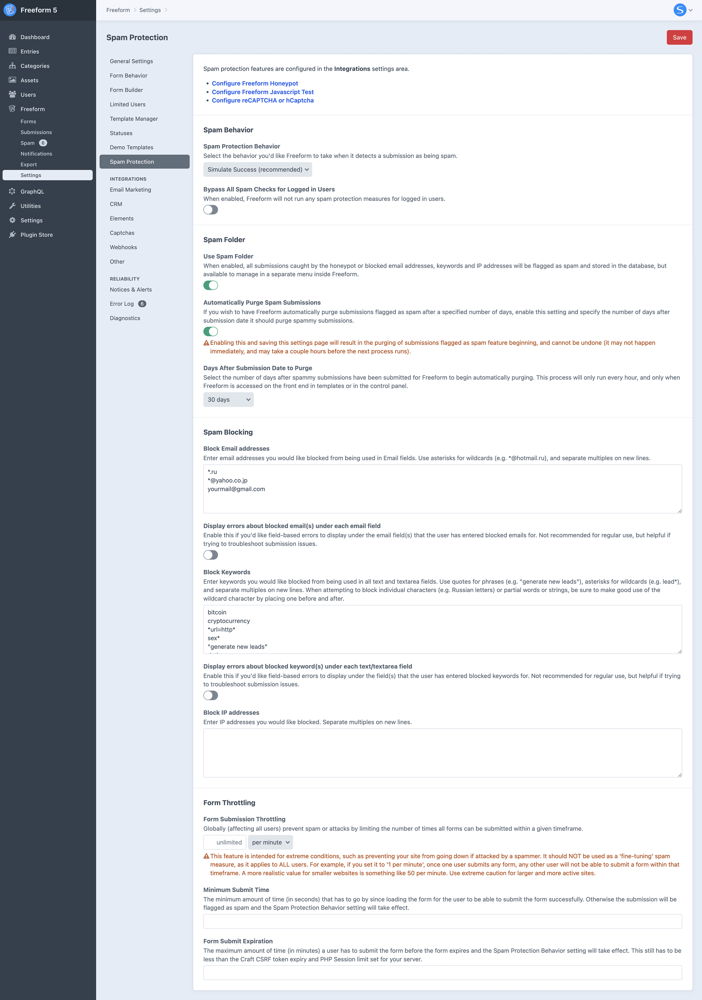

<meta property="og:image" content="https://docs.solspace.com/extras/social/craft/freeform/freeform.png" />

    
    Freeform
    for Craft
    

        

            5.x
            ✓ Latest
            
        

        <ul class="pr-v-list">
            <li><a href="/craft/freeform/v5/">5.x✓ Latest</a></li>
            <li><a href="/craft/freeform/v4/">4.x</a></li>
            <li><a href="/craft/freeform/v3/">3.xRetired</a></li>
            <li><a href="/craft/freeform/v2/">2.xRetired</a></li>
            <li><a href="/craft/freeform/v1/">1.xRetired</a></li>
        </ul>
    

    

        <a href="https://plugins.craftcms.com/freeform" class="button button-blue">Plugin Store</a>
    

<a href="/craft/freeform/v5/forms/">Forms & Fields</a>

# Spam Protection

Freeform includes a variety of robust spam control features to make managing forms easier.

    
    
    
    

::: guide ../../guides/spam-protection-best-practices/
Check out the guide on Spam Protection best practices.
:::

::: guide ../guides/troubleshooting-form-issues/
Quick troubleshooting the most commonly reported issues with your form's appearance, behavior, or submission of the form on the front end.
:::

[[toc]]

## Freeform Honeypot <Badge type="feature" text="Improved in 5.0+" />
Freeform includes its own Honeypot spam protection feature. This is enabled by default, but can be disabled in the **Other** area of the _Integrations_ settings. You can then enable/disable per form.

It works by inserting an input in the form that is invisible to a regular user. A regular user will not see or be able to add a value to the field, leaving it empty and passing the test. If the bot enters a value in the input, the test will fail.

### Settings
You can specify the behavior Freeform takes when the test fails with the [Spam Protection Behavior](../configuration/settings/#spam-protection-behavior) setting:

- **Custom Input Name**
    - Enter a new value to rename the default Freeform Honeypot input name. Default is `freeform_form_handle`.
- **Custom Error Message**
    - Enter a new value to change the default error message for the Freeform Honeypot.
    - This is only applied if the **Spam Behavior** setting is set to _Display Error Messages_.

::: tip
If using the **Custom Input Name** setting, be careful when choosing a custom name, as it's possible the user's browser auto-fill settings may accidentally fill out the field unbeknownst to them (e.g. `email_address2`).
:::

### Templating
The Freeform Honeypot will automatically be inserted in the form by Freeform when rendering the form.

## Freeform Javascript Test <Badge type="feature" text="Improved in 5.0+" />
Freeform includes its own Javascript Test spam protection feature. When enabled, it will help fight spambots more aggressively by requiring that users have javascript enabled for their browser to submit the form. This is disabled by default, but can be enabled in the **Other** area of the _Integrations_ settings. You can then enable/disable per form.

It works by inserting an input in the form that is invisible to a regular user with a random value. The javascript loaded into the page then automatically removes the value from the input, allowing the test to pass. If the user or bot doesn't have javascript enabled, the value will not be removed from the input and will fail the test.

### Settings
You can specify the behavior Freeform takes when the test fails with the [Spam Protection Behavior](../configuration/settings/#spam-protection-behavior) setting:

- **Custom Input Name**
    - Enter a new value to rename the default Freeform Javascript Test input name. Default is `freeform_check`.
- **Custom Error Message**
    - Enter a new value to change the default error message for the Freeform Javascript Test.
    - This is only applied if the **Spam Behavior** setting is set to _Display Error Messages_.

::: tip
If using the **Custom Input Name** setting, be careful when choosing a custom name, as it's possible the user's browser auto-fill settings may accidentally fill out the field unbeknownst to them (e.g. `email_address2`).
:::

### Templating
The Freeform Javascript Test will automatically be inserted in the form by Freeform when rendering the form.

## Spam Behavior
The following spam protection behavior settings are available and apply to all spam settings and integrations.

### Spam Protection Behavior
Select the behavior you'd like Freeform to take when it detects a submission as being spam.

- **Simulate Success** <Badge type="recommended" text="Recommended" />
    - If you have the [Spam Folder](#spam-folder) feature enabled, spammy submissions will go through to the Spam Folder in the Freeform control panel.
    - An error is not displayed so as not to give away the spam controls.
- **Display Errors** (for debugging)
    - Useful for troubleshooting if you're experiencing some issues with submissions being flagged as spam.

### Bypass All Spam Checks for Logged in Users
When enabled, Freeform will not run any spam protection measures for logged in users.

## Spam Folder

When the [Spam Folder](../configuration/settings/#spam-folder) setting is enabled, all submissions caught by any spam measure (including Honeypot, reCAPTCHA, keyword blocking, etc) will be stored in the database but marked as spam. They will then be available to manage in a separate menu inside Freeform.

::: tip
Enabling the **Spam Folder** feature will not retroactively bring back any previously blocked spam submissions. Any submissions that have been blocked in the past (without Spam Folder setting on) are never recorded in the database.
:::

### How it Works

- Email notifications and API integrations will all be suppressed and queued.
- When viewing the *Spam Folder* in the Freeform control panel, you have the ability to delete or approve/allow each submission.
    - Allowing spammy submissions will retroactively fire off email notifications and any API integration data as well.
- The Spam Folder can be set to have older spammy submissions automatically purged after a period of time. To enable this, enable the [Automatically Purge Spam Submissions](../configuration/settings/#auto-purge-spam) setting and specify the number of days after submission date it should purge them.
    ::: warning
    Enabling this and saving this settings page will begin the purging of submissions flagged as spam, and cannot be undone.
    :::

### Spam Reasons

If Freeform flags a submission as spam, it will provide specific reasons for the flagging. These reasons can help you determine why the submission failed and assist you in resolving any configuration errors or issues. You can find the detailed spam reasons in the right column of the submission detail page. Additionally, a summary of the reasons is displayed as a column in the index listing view of the Freeform Spam Folder. You also have the option to filter submissions based on the reason for the spam flag.

## Spam Blocking
If Freeform detects any blocked keywords/values in the form submission, it will flag it as spam. It will then go into the spam folder (if configured) or show an error at the top of the form (not recommended).

### Available Options

- [Email Addresses](../configuration/settings/#spam-protection)
- [Keywords](../configuration/settings/#spam-protection)
- [IP addresses](../configuration/settings/#spam-protection)

### Syntax

- Add each rule on a new line.
- Use `*` for wildcard matches (except on IP addresses), e.g. `cat*` will flag `cat`, `cats`, `category`, etc.
    - When blocking individual characters (e.g. Russian letters) or partial words or strings, be sure to put the wildcard at the start and end of the value, e.g.: `*й*`, `*Д*`, `*url=http*`, etc.
- To block phrases, wrap quotes around the keywords (e.g. `"generate new leads"`).

### How it Works

* If the submission fails, it will then match the behavior of the [Spam Protection Behavior](../configuration/settings/#spam-behavior) setting.
* If you have the [Spam Folder](#spam-folder) feature enabled, spammy submissions will go through to the Spam Folder in the Freeform control panel.
* You have the option to display errors for fields using a blocked email address or keyword, but we recommend only using this for troubleshooting purposes.

## Throttling

If your site is being attacked by spammers or you're concerned about it, you can enable the [Form Submission Throttling](../configuration/settings/#throttling) setting. This will globally (affecting all users) prevent spam or attacks by limiting the number of times all forms can be submitted within a given timeframe.

::: warning
This feature is intended for extreme conditions, such as preventing your site from going down if attacked by a spammer. It should NOT be used as a 'fine-tuning' spam measure, as it applies to ALL users. For example, if you set it to '1 per minute', once one user submits any form, any other user will not be able to submit a form within that timeframe. A more realistic value for smaller websites is something like 50 per minute. Use extreme caution for larger and more active sites.
:::

## Captchas
Freeform currently supports the following **Captcha** services:

- [reCAPTCHA v2 Checkbox](../integrations/recaptcha/)
- [reCAPTCHA v2 Invisible](../integrations/recaptcha/) 
<Badge type="lite" text="Lite" /><Badge type="pro" text="Pro" />

- [reCAPTCHA v3](../integrations/recaptcha/) 
<Badge type="lite" text="Lite" /><Badge type="pro" text="Pro" />

- [hCaptcha Checkbox](../integrations/hcaptcha/) 
<Badge type="lite" text="Lite" /><Badge type="pro" text="Pro" />

- [hCaptcha Invisible](../integrations/hcaptcha/) 
<Badge type="lite" text="Lite" /><Badge type="pro" text="Pro" />

### Setup Guides
If you're interested in using reCAPTCHA or hCaptcha, please click on the applicable button below.

    
    

