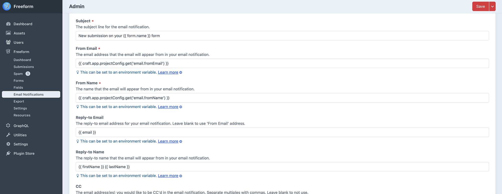

<meta property="og:image" content="https://docs.solspace.com/extras/social/craft/freeform/freeform.png" />

<div id="pr-heading">
    
    <span class="pr-name">Freeform</span>
    <span class="pr-category">for Craft</span>
    <div class="pr-v-wrapper">
        <div class="pr-v">
            <span class="pr-v-v">5.x</span>
            <span class="pr-v-type pr-latest">✓ Latest</span>
            <span class="pr-v-arrow arrow down"></span>
        </div>
        <ul class="pr-v-list">
            <li><a href="/craft/freeform/v5/">5.x<span class="pr-v-type pr-latest">✓ Latest</span></a></li>
            <li><a href="/craft/freeform/v4/">4.x</a></li>
            <li><a href="/craft/freeform/v3/">3.x<span class="pr-v-type pr-retired">Retired</span></a></li>
            <li><a href="/craft/freeform/v2/">2.x<span class="pr-v-type pr-retired">Retired</span></a></li>
            <li><a href="/craft/freeform/v1/">1.x<span class="pr-v-type pr-retired">Retired</span></a></li>
        </ul>
    </div>
    <div class="pr-buy">
        <a href="https://plugins.craftcms.com/freeform" class="button button-blue"><span class="external-url">Plugin Store</span></a>
    </div>
</div>

<span class="page-section"><a href="/craft/freeform/v5/guides/">User Guides</a></span>

# Form Submitter's Email Address as the Reply-to Email

It's common to have email notifications for admins appear as if they are from the person who submitted the form. This allows for easy reply via email. However, this can result in the email being marked as spam or other issues, especially if SMTP is being used and the _From_ email address needs to be set to a mailbox on the email server. The best practice is to use the **Reply-to Email** and **Reply-to Name** settings for the [email notification template](../forms/email-notifications/).


[[toc]]


## Instructions

<div class="step">
<label for="step1"><input type="checkbox" class="step-check" id="step1">

### Set up 'From Email' and 'From Name'

</label>

In your [email notification template](../forms/email-notifications/), add your site name and email address to the **From Name** and **From Email** settings, respectively. If you're using SMTP and/or a mail service, you'll need to ensure that the email address used exactly matches the email address configured for the[Craft Email Settings](https://craftcms.com/docs/5.x/system/mail.html). This might be something like `noreply@mysite.com`.

To ensure this email address is always correct, you can also specify [Environmental Settings](https://craftcms.com/docs/5.x/extend/environmental-settings.html) or access it via `craft.app.projectConfig`.

You might have something like this:

---

**From Email**
``` twig
{{ craft.app.projectConfig.get('email.fromEmail') }}
```

**From Name**
``` twig
{{ craft.app.projectConfig.get('email.fromName') }}
```

</div>

<div class="step">
<label for="step2"><input type="checkbox" class="step-check" id="step2">

### Set up 'Reply-to Email' and 'Reply-to Name' to match the Form Submitter

</label>

You can then put the form submitter's name and email address in the **Reply-to Name** and **Reply-to Email** settings. This means that when a site admin receives an email notification of a successful form submission, it'll appear to come from something like `noreply@yoursite.com`, but when they click the _Reply_ button in their email client, it'll automatically reply to the form submitter's email address instead.

To grab the form submitter's name and email address, simply specify the field handles.

You might have something like this:

---

**Reply-to Email**
``` twig
{{ email }}
```

**Reply-to Name**
``` twig
{{ firstName }} {{ lastName }}
```

</div>

<div class="step">
<label for="step3"><input type="checkbox" class="step-check" id="step3">

### Save the Notification Template

</label>

Simply save the email notification template and you should be good.

Your template look something like this:


OR



</div>

<div class="step-finished">Finished!</div>

::: warning
Please make sure your email and name field handles are correctly referenced. If not (or if it varies across forms), your email notifications may fail.
:::